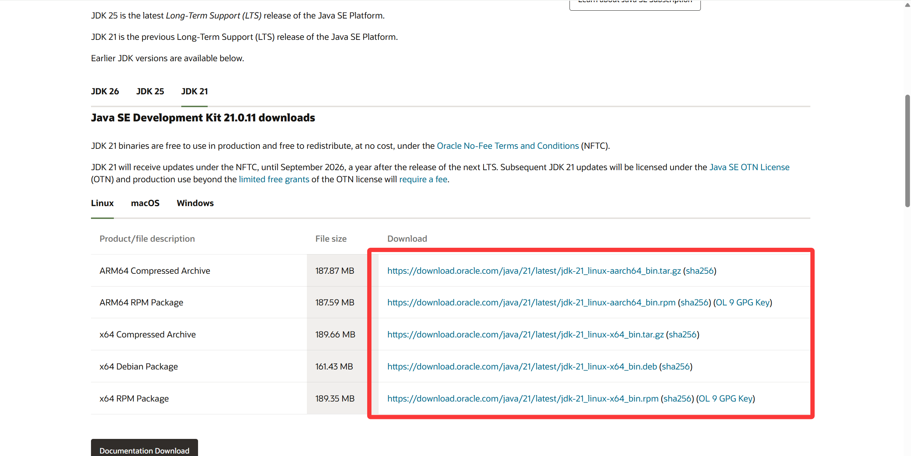
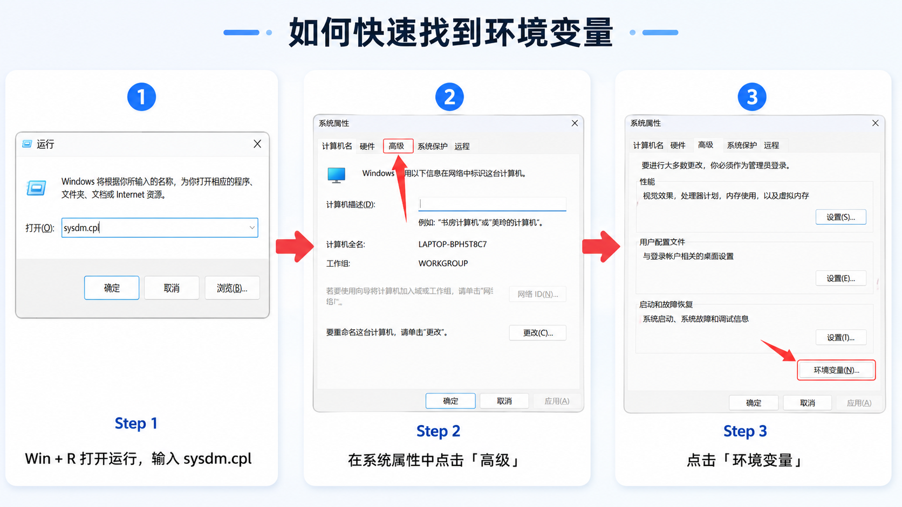
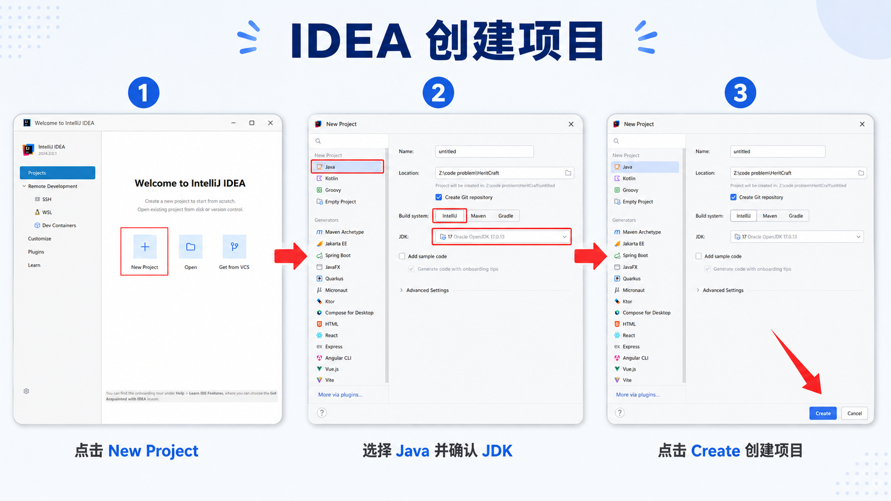
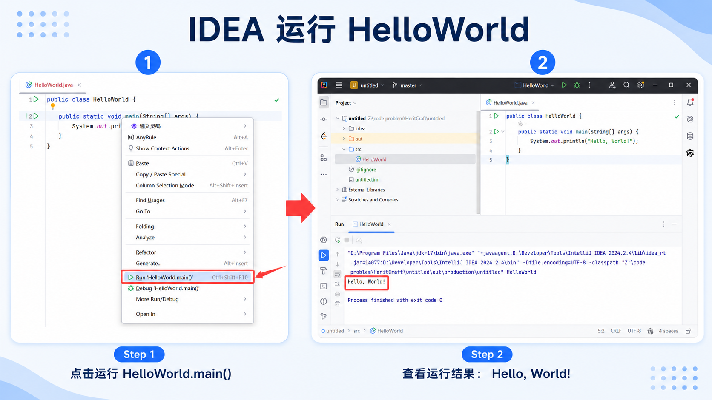

> [!info] 知识摘要
> **总结**
> - 学 Java 的第一步是先搭好开发环境，核心是准备 JDK 和 IntelliJ IDEA。
> - 本篇完成 JDK 下载、环境变量配置、IDEA 安装和第一个 `HelloWorld` 程序运行。
>
> **文章元信息**
> - 更新时间：2026-05-13
> - 系列定位：Java 基础语言第 0 篇
> - 适合读者：准备入门 Java、需要配置 JDK 和 IDEA 的初学者
> - 前置知识：无
>
> **相关知识点**
> - JDK、IDEA、环境变量、`JAVA_HOME`、`Path`、`HelloWorld`

---

## 一、先认识一下开发环境

学习 Java 至少需要两类工具：**JDK** 和 **IDE**。

JDK 是 Java 开发工具包，里面包含编译和运行 Java 程序需要的工具。没有 JDK，电脑就不知道怎么把 `.java` 代码变成可以运行的程序。

IDE 是集成开发环境，比如 IntelliJ IDEA。它可以把写代码、运行程序、查看报错、管理项目等功能放在一起，让初学者不用一开始就被复杂命令劝退。

**💡 核心结论：** JDK 负责提供 Java 开发能力，IDEA 负责提供更舒服的写代码环境。初学 Java，先装好 JDK，再装 IDEA。

---

## 二、JDK 版本怎么选

JDK 版本很多，初学者最容易卡在“我到底该下载哪个版本”。这里直接给一个学习建议。

| 版本     | 推荐场景                         | 简单说明                   |
| ------ | ---------------------------- | ---------------------- |
| JDK 8  | 国内老项目、学校或公司指定环境              | 很多旧系统仍在使用，资料多，但版本偏老    |
| JDK 17 | 主流后端学习、Spring Boot 3.x 相关技术栈 | 稳定、生态成熟，适合长期学习         |
| JDK 21 | 新技术栈、新项目、希望跟进新特性             | 较新的 LTS 版本，适合学习现代 Java |

如果老师、公司或课程明确要求 `JDK 8`，那就按要求安装 `JDK 8`。

如果没有特殊要求，建议优先选择 `JDK 17` 或 `JDK 21`。其中，`JDK 17` 更稳妥，适合后续学习 Spring Boot 等主流后端内容；`JDK 21` 更适合想跟进新版本特性的同学。

> ⚠️ **误区：版本越新越适合所有场景**
>
> **正确理解：** 新版本功能更多，但公司项目、课程环境、框架版本可能有自己的要求。学习阶段可以选 `JDK 17` 或 `JDK 21`，遇到指定环境时再切换。

---

## 三、下载 JDK

JDK 建议优先从官方入口下载。

Oracle 官方下载地址：

[Oracle Java Downloads](https://www.oracle.com/java/technologies/downloads/)

为了方便下载，也可以选择网盘入口：

[百度网盘快速下载 JDK8 / JDK17 / JDK21](https://pan.baidu.com/s/18GU61NnNk3_R1OPTFn7I8Q?pwd=hthk)

本文主要以 Windows 为例。进入下载页面后，选择对应版本的 JDK，再选择 Windows 系统的安装包。一般 Windows 电脑选择 `x64 Installer` 即可。
>**作者有话说**：在这一步，可以通过右键"此电脑"→"属性"，查看系统类型是否为64位。


下载时注意三点：

| 注意点 | 说明 |
|--------|------|
| 系统类型 | Windows 用户通常选择 Windows 版本 |
| 位数 | 现在大多数电脑是 64 位系统，优先选择 x64 |
| 版本 | 按学习目标选择 JDK 8、JDK 17 或 JDK 21 |

如果你的电脑还是 32 位 Windows，建议优先升级到 64 位系统。新版开发工具对 64 位系统支持更完整，后续学习也会少很多兼容问题。

---

## 四、安装 JDK

下载完成后，双击安装包，按照安装向导一路安装即可。

安装路径建议自己单独建一个开发工具目录，例如：

```text
D:\Develop\Java\jdk-21
```

不建议把路径写得太复杂，也不建议出现中文、空格或特殊符号。

例如下面这些路径不太推荐：

```text
D:\开发工具\Java JDK\
D:\Program Files\Java\jdk-21
D:\Java&Tools\jdk-21
```

推荐理由很简单：路径越干净，后续配置环境变量、IDEA 识别 JDK、命令行运行程序时越不容易出问题。

**💡 核心结论：** JDK 安装路径尽量使用纯英文、无空格、无特殊符号的目录。

---

## 五、配置环境变量

JDK 安装好之后，还需要让 Windows 知道 `java` 和 `javac` 这些工具在哪里。

这里会用到两个环境变量：`JAVA_HOME` 和 `Path`。

| 环境变量 | 作用 |
|----------|------|
| `JAVA_HOME` | 记录 JDK 的安装目录 |
| `Path` | 告诉系统去哪些目录寻找可执行程序 |

可以这样理解：当你在命令行输入 `java` 时，系统不会自动扫描整个电脑。它会先看当前目录有没有这个程序，如果没有，再去 `Path` 记录的路径里找。

所以我们要把 JDK 的 `bin` 目录加入 `Path`。

### 5.1 打开环境变量窗口

可以用快捷方式打开：

1. 按下 `Win + R`
2. 输入 `sysdm.cpl`
3. 回车
4. 进入“高级”
5. 点击“环境变量”

也可以手动打开：

1. 右键“此电脑”
2. 点击“属性”
3. 找到“高级系统设置”
4. 点击“环境变量”

### 5.2 新建 JAVA_HOME

在系统变量中点击“新建”，变量名填写：

```text
JAVA_HOME
```

变量值填写你的 JDK 安装目录，例如：

```text
D:\Develop\Java\jdk-21
```

![[001_新增 JAVA_HOME 截图占位.png]]

注意：这里填写的是 JDK 根目录，不是 `bin` 目录。

### 5.3 配置 Path

找到系统变量中的 `Path`，点击“编辑”，再点击“新建”，添加：

```text
%JAVA_HOME%\bin
```

![[blog-notes/Java 基础/imgs/001_编辑 Path 截图占位.png]]
配置完成后一路点击“确定”保存。

为了让新配置生效，建议关闭当前命令行窗口，重新打开一个新的命令行窗口。

---

## 六、检查 JDK 是否配置成功

打开命令行：

1. 按下 `Win + R`
2. 输入 `cmd`
3. 回车

先检查 Java 运行工具：

**✅ 检查 java 命令**

```bash
java -version
```

再检查 Java 编译器：

**✅ 检查 javac 命令**

```bash
javac -version
```

如果两个命令都能输出版本号，说明 JDK 基本配置成功。

例如你安装的是 JDK 21，可能会看到类似输出：

```text
java version "21.0.x"
Java(TM) SE Runtime Environment
Java HotSpot(TM) 64-Bit Server VM
```

不同版本输出内容会略有差异，只要能正常显示版本号即可。

> ⚠️ **误区：只检查 `java -version` 就够了**
>
> **正确理解：** 学 Java 不只要运行程序，还要编译程序。所以 `java -version` 和 `javac -version` 都建议检查。

---

## 七、常见配置问题

如果你输入 `java -version` 或 `javac -version` 后提示找不到命令，可以按下面方向排查。

| 问题现象 | 可能原因 | 解决方向 |
|----------|----------|----------|
| `java` 找不到 | `Path` 没有配置成功 | 检查是否添加了 `%JAVA_HOME%\bin` |
| `java` 能用，`javac` 不能用 | 可能配置到了 JRE 或旧路径 | 确认 `JAVA_HOME` 指向 JDK 根目录 |
| 版本不是自己安装的版本 | 电脑里有多个 JDK | 调整 `Path` 中 JDK 路径顺序 |
| 配置后仍无效 | 命令行窗口没刷新 | 关闭 CMD 后重新打开 |
| IDEA 找不到 JDK | IDEA 没有配置 SDK | 在项目设置中手动选择 JDK 路径 |

如果电脑里装过多个 JDK，建议把当前想使用的 JDK 路径放在 `Path` 中更靠前的位置。

---

## 八、安装 IntelliJ IDEA

JDK 装好后，就可以安装 IDEA 了。

IDEA 官方下载地址：

[IntelliJ IDEA 官方下载](https://www.jetbrains.com/idea/download/)

IntelliJ IDEA 是 Java 开发中非常常用的集成开发环境。它能帮助我们完成代码编写、运行、调试、项目管理等工作。

JetBrains 近年对 IntelliJ IDEA 的版本入口做过调整。如果下载页显示统一安装器，直接下载 IntelliJ IDEA 即可；如果页面显示 Community / Ultimate，初学 Java 选择 Community 就够用。

**💡 核心结论：** 初学 Java 不需要一上来购买高级版本。基础 Java 学习、运行 `HelloWorld`、练习语法，免费基础功能已经够用，也可以三连加关注，私信我，告诉你更好的方法。

![[001_IDEA 下载页面截图占位.png]]


安装过程保持默认即可，建议勾选创建桌面快捷方式。安装目录同样建议使用纯英文路径。
![[001_IDEA 安装选项截图占位.png]]

---

## 九、IDEA 项目层级结构

第一次打开 IDEA 时，很多同学会被 Project、Module、Package、Class 这些词绕晕。

先不用怕，简单理解如下：

| 层级 | 中文含义 | 可以怎么理解 |
|------|----------|--------------|
| Project | 项目 / 工程 | 一个完整应用或学习工程 |
| Module | 模块 | 项目中的一个功能模块 |
| Package | 包 | 用来分类管理类 |
| Class | 类 | Java 代码的基本单位 |

可以把它们想象成文件夹层级：

```text
Project（项目）
└── Module（模块）
    └── Package（包）
        └── Class（类）
```

初学阶段，最常接触的是 `src` 目录、包和类。先能创建类并运行程序即可，不必一开始就纠结复杂项目结构。

---

## 十、用 IDEA 运行第一个 HelloWorld

接下来用 IDEA 运行第一个 Java 程序。

### 10.1 创建 Java 项目

打开 IDEA 后，选择创建新项目。

常见配置如下：

| 配置项 | 建议 |
|--------|------|
| 项目类型 | Java |
| JDK | 选择刚安装的 JDK |
| 项目名称 | 例如 `JavaStudy` |
| 项目路径 | 放在自己的学习目录中 |

![[blog-notes/Java 基础/imgs/001_编辑 Path 截图占位.png]]


如果 IDEA 没有自动识别 JDK，可以手动选择 JDK 安装目录。

### 10.2 创建 Java 类

在 `src` 目录上右键，选择：

```text
New -> Java Class
```

类名填写：

```text
HelloWorld
```

![[001_IDEA 新建类截图占位.png]]

### 10.3 编写 HelloWorld

**✅ HelloWorld 示例代码**

```java
public class HelloWorld {
    public static void main(String[] args) {
        System.out.println("Hello, World!");
    }
}
```

这里先不用急着完全理解每个关键字，先知道几件事：

| 代码 | 暂时理解 |
|------|----------|
| `class` | 定义一个类 |
| `HelloWorld` | 类名，通常与文件名一致 |
| `main` | 程序入口 |
| `System.out.println` | 向控制台输出内容 |

### 10.4 运行程序

在 IDEA 中，可以点击 `main` 方法左侧的运行按钮，也可以右键当前文件，选择运行。

运行成功后，底部控制台会输出：

```text
Hello, World!
```



到这里，你的第一个 Java 程序就运行成功了。

---

## 十一、这篇只讲环境，不深入语法

这篇文章的重点是把开发环境搭起来，所以不会深入展开 Java 语法。

后续文章会继续拆解：

| 后续内容 | 说明 |
|----------|------|
| Java 运行机制 | `.java`、`.class`、`javac`、`java`、JVM |
| 数据类型 | `int`、`double`、`boolean`、`char` 等 |
| 流程控制 | `if`、`switch`、`for`、`while` |
| 面向对象 | 类、对象、方法、构造器、封装、继承、多态 |

第 0 篇只要完成一件事：让你的电脑可以正常写 Java、运行 Java。

---

## 总结

| 内容         | 你需要掌握的结果                                   |
| ---------- | ------------------------------------------ |
| JDK 版本选择   | 知道 JDK 8、17、21 分别适合什么场景                    |
| JDK 安装     | 能在 Windows 上安装 JDK                         |
| 环境变量       | 理解 `JAVA_HOME` 和 `Path` 的作用                |
| 命令验证       | 能用 `java -version` 和 `javac -version` 检查环境 |
| IDEA 安装    | 知道 IDEA 免费基础功能足够初学 Java                    |
| HelloWorld | 能在 IDEA 中运行第一个 Java 程序                     |

**💡 核心结论：** Java 入门第一步，是先让开发环境跑起来。JDK 提供编译和运行能力，IDEA 提供更舒服的开发体验。完成这一步后，后面学习语法和运行机制就有了真正可以实践的地方。
