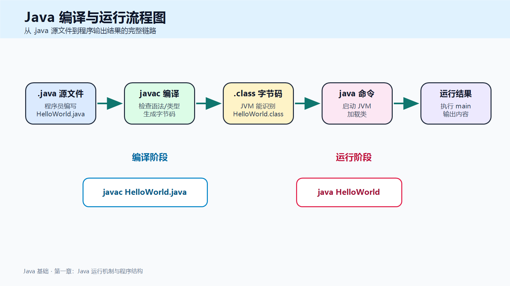
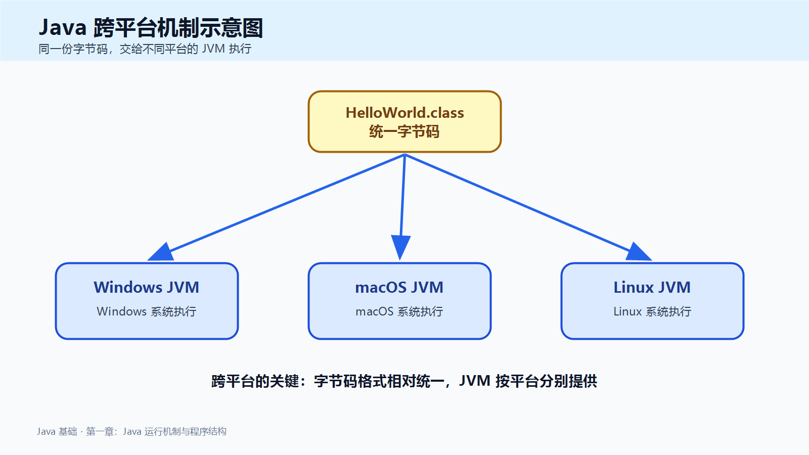
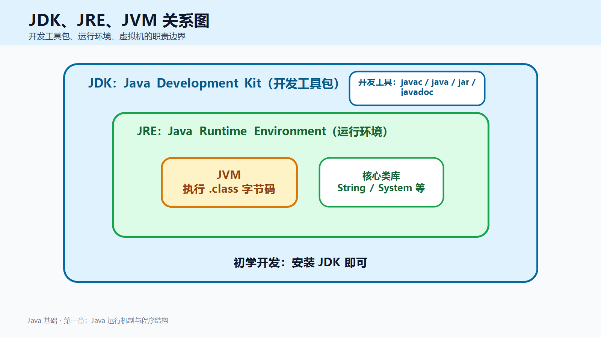
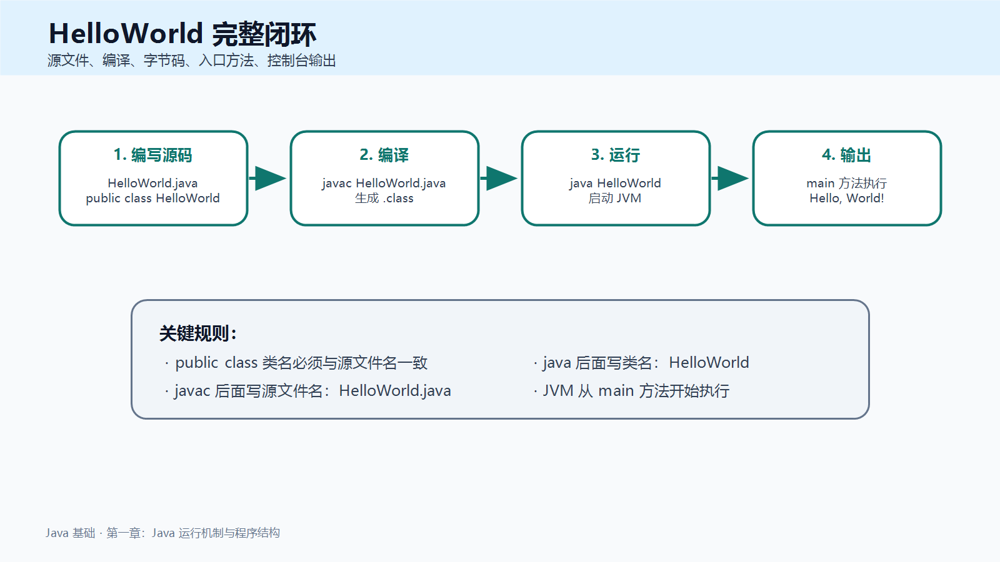
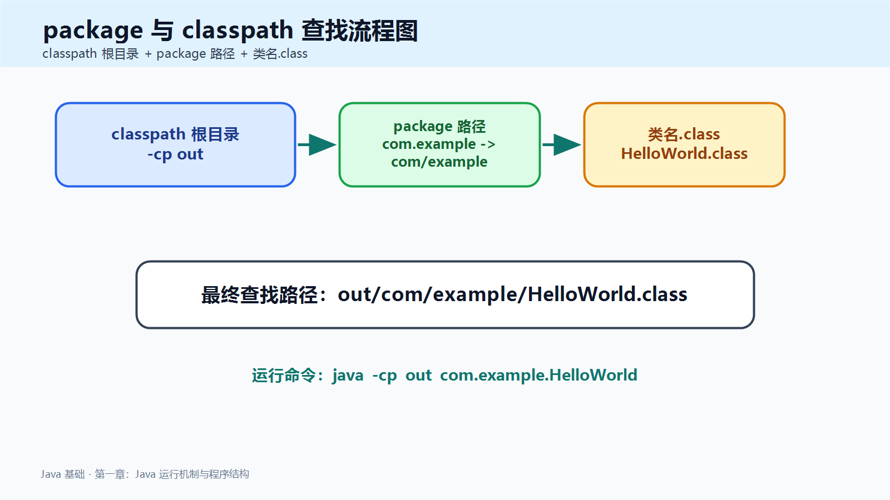
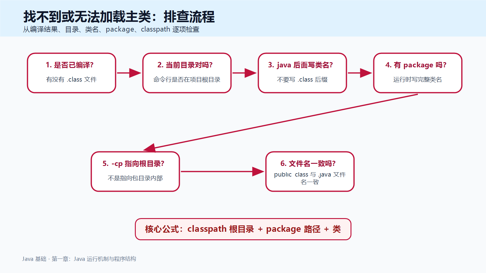

> [!info] 知识摘要
> **总结**
> - Java 程序通常经历 `.java` 源文件、`javac` 编译、`.class` 字节码、`java` 启动 JVM 运行这条链路。
> - 本篇先讲清 `javac`、`java`、`class`、`package`、`classpath` 等入门阶段最容易混淆的概念。
>
> **文章元信息**
> - 更新时间：2026-05-15
> - 系列定位：Java 基础语言第 01 篇
> - 适合读者：已经搭好 Java 环境，准备真正理解第一个 Java 程序的初学者
> - 前置知识：能创建并运行最简单的 `HelloWorld`
>
> **相关知识点**
> - `javac`、`java`、`.java`、`.class`、JVM、`package`、`classpath`

---

## 一、先建立 Java 程序运行的整体链路

### 1.1 Java 不是直接运行 `.java` 文件

Java 程序通常从一个 `.java` 文件开始。这个文件是程序员写的源代码，人能看懂，编辑器也能打开。

但是，JVM 并不是直接运行 `.java` 文件，而是运行编译后的 `.class` 字节码文件。

可以先记住这一条主线：

```text
.java 源文件 -> javac 编译 -> .class 字节码 -> java 启动 JVM -> 程序运行
```



**💡 核心结论：** `javac` 负责把源代码编译成字节码，`java` 负责启动 JVM 并运行字节码。

### 1.2 `javac` 和 `java` 的区别

很多初学者会把这两个命令混在一起：

```bash
javac HelloWorld.java
java HelloWorld
```

它们的区别如下：

| 命令 | 作用 | 面向对象 | 是否带后缀 |
| --- | --- | --- | --- |
| `javac` | 编译源代码 | `.java` 源文件 | 要写 `.java` |
| `java` | 运行程序 | 类名 | 不写 `.class` |

所以：

```bash
javac HelloWorld.java
```

表示：把 `HelloWorld.java` 这个源文件编译成字节码。

```bash
java HelloWorld
```

表示：让 JVM 去寻找名为 `HelloWorld` 的类，并从这个类的入口方法开始运行。

> ⚠️ **误区：运行时应该写 `java HelloWorld.class`**
>
> **正确理解：** `java` 后面跟的是类名，不是文件名。JVM 会根据类名寻找对应的 `.class` 文件。

---

## 二、`.java`、`.class`、JVM 分别是什么

### 2.1 `.java` 是源代码文件

`.java` 文件保存的是 Java 源代码。

例如：

```text
HelloWorld.java
```

文件内容可能是：

**✅ HelloWorld 源码示例**

```java
public class HelloWorld {
    public static void main(String[] args) {
        System.out.println("Hello, World!");
    }
}
```

这份代码是给人写、给人读、给编译器检查的。

### 2.2 `.class` 是字节码文件

执行：

```bash
javac HelloWorld.java
```

如果编译成功，当前目录通常会生成：

```text
HelloWorld.class
```

`.class` 文件保存的是**字节码**。

字节码不是 Windows、macOS 或 Linux 某一个操作系统专属的机器码，而是一种 JVM 能识别的中间格式。

### 2.3 JVM 是执行字节码的核心

JVM，全称 `Java Virtual Machine`，也就是 Java 虚拟机。

它主要负责：

- 加载 `.class` 字节码文件。
- 找到程序入口方法。
- 执行字节码指令。
- 在运行过程中做必要检查。

Java 能跨平台，关键就在这里：

```text
同一份 .class 字节码
    -> Windows 平台 JVM 执行
    -> macOS 平台 JVM 执行
    -> Linux 平台 JVM 执行
```



注意，不是“同一个 JVM 到处运行”，而是不同平台安装不同 JVM，同一份字节码交给对应平台 JVM 执行。

---

## 三、JDK、JRE、JVM 到底是什么关系

### 3.1 三者职责对比

Java 入门阶段经常会看到三个词：`JDK`、`JRE`、`JVM`。

| 名称 | 全称 | 主要作用 | 初学者理解 |
| --- | --- | --- | --- |
| JVM | Java Virtual Machine | 执行 `.class` 字节码 | 真正运行 Java 程序的核心 |
| JRE | Java Runtime Environment | JVM + 运行时核心类库 | Java 程序运行环境 |
| JDK | Java Development Kit | JRE + 开发工具 | Java 开发工具包 |

传统教学中经常用一句话解释：

```text
JDK 包含 JRE，JRE 包含 JVM
```

这句话适合理解三者的大致层级。



### 3.2 初学者应该安装什么

对于刚开始学 Java 的同学，结论很明确：

**💡 核心结论：** 写 Java 程序直接安装 JDK，因为开发者不仅要运行程序，还要使用 `javac` 这样的编译工具。

现代 JDK 发行方式中，很多时候已经不再强调单独安装 JRE。入门阶段不用纠结单独装 JRE，围绕 JDK 理解即可。

### 3.3 JDK 中常见工具

JDK 中不只有 JVM，还包含很多开发工具。

| 工具 | 作用 |
| --- | --- |
| `javac` | 编译 Java 源代码 |
| `java` | 启动 JVM 运行 Java 程序 |
| `javadoc` | 根据注释生成文档 |
| `jar` | 打包 Java 程序或类库 |

第一章重点先放在 `javac` 和 `java` 上，其他工具后续再慢慢接触。

---

## 四、用 HelloWorld 串起完整闭环

### 4.1 第一步：创建源文件

创建文件：

```text
HelloWorld.java
```

写入代码：

**✅ 最小 HelloWorld 程序**

```java
public class HelloWorld {
    public static void main(String[] args) {
        System.out.println("Hello, World!");
    }
}
```

这里有一个非常重要的规则：

```text
public class HelloWorld  ->  文件名必须是 HelloWorld.java
```

如果文件名和 `public class` 类名不一致，编译阶段就会报错。

### 4.2 第二步：编译源文件

在命令行进入文件所在目录，执行：

```bash
javac HelloWorld.java
```

编译成功后，会生成：

```text
HelloWorld.class
```

编译阶段主要检查：

- 语法是否正确。
- 类型是否匹配。
- 类名和文件名是否一致。
- 包依赖是否能找到。

### 4.3 第三步：运行程序

继续执行：

```bash
java HelloWorld
```

控制台输出：

```text
Hello, World!
```

完整闭环可以总结成：

| 步骤 | 你做的事 | Java 背后的动作 |
| --- | --- | --- |
| 1 | 写 `HelloWorld.java` | 保存源代码 |
| 2 | 执行 `javac HelloWorld.java` | 编译生成 `HelloWorld.class` |
| 3 | 执行 `java HelloWorld` | 启动 JVM |
| 4 | JVM 加载类 | 找到 `main` 方法 |
| 5 | 执行输出语句 | 控制台打印结果 |



---

## 五、Java 程序的基本结构

### 5.1 类是 Java 程序的基本组织单位

Java 代码必须写在类中。

最小结构如下：

```java
public class HelloWorld {
}
```

这里的 `HelloWorld` 是类名。

类名建议使用大驼峰命名法：

```text
HelloWorld
Student
StudentManager
OrderService
```

>**作者有话说**：大驼峰命名法为每个单词首字母大写，小驼峰命名法为首字母小写，后续每个单词首字母大写。


### 5.2 源文件名和 `public class` 的关系

如果一个类被声明为 `public class`，那么文件名必须和这个类名完全一致。

| 类声明 | 正确文件名 |
| --- | --- |
| `public class HelloWorld` | `HelloWorld.java` |
| `public class Student` | `Student.java` |
| `public class Main` | `Main.java` |

> ⚠️ **误区：文件名和类名差不多就行**
>
> **正确理解：** 不行。`public class` 的类名必须和 `.java` 文件名一致，大小写也要一致。

### 5.3 `main` 方法是程序入口

Java 程序从 `main` 方法开始执行：

```java
public static void main(String[] args) {
    System.out.println("Hello, World!");
}
```

第一章只需要先记住：

- `main` 是程序入口。
- JVM 启动后会寻找这个入口。
- 没有正确入口，普通 Java 程序不知道从哪里开始执行。

`public`、`static`、`void`、`String[] args` 的完整含义，不需要在第一章一次性吃完。后面学封装、类与对象、数组时会继续拆开。

---

## 六、package：用包管理类

### 6.1 package 是什么

`package` 用来声明当前类属于哪个包。

示例：

**✅ 带 package 的 HelloWorld**

```java
package com.example;

public class HelloWorld {
    public static void main(String[] args) {
        System.out.println("Hello from package");
    }
}
```

这里表示 `HelloWorld` 属于 `com.example` 包。

包名通常和目录结构对应：

```text
com.example -> com/example
```

对应目录可以理解为：

```text
项目根目录/
└── com/
    └── example/
        └── HelloWorld.java
```

### 6.2 package 的基本规则

`package` 有几个基础规则：

- 必须放在 `.java` 文件第一行非注释代码处。
- 一个 `.java` 文件最多只有一个 `package` 声明。
- 包名通常要和目录结构保持一致。
- 运行带包名的类时，要写完整类名。

### 6.3 package 解决什么问题

| 作用     | 说明            |
| ------ | ------------- |
| 组织代码   | 把相关类放到同一个逻辑空间 |
| 避免类名冲突 | 不同包中可以有同名类    |
| 形成访问边界 | 默认权限只在同包可见    |

例如两个类都叫 `Frame`，只要包名不同，就可以同时存在：

```text
java.awt.Frame
photo.Frame
```

---

## 七、import：让类名写起来更简单

### 7.1 import 的作用

`import` 用来简化其他包中类名的书写。

不使用 `import` 时：

```java
public class Main {
    public static void main(String[] args) {
        java.util.Scanner scanner = new java.util.Scanner(System.in);
    }
}
```

使用 `import` 后：

**✅ import 简化类名示例**

```java
import java.util.Scanner;

public class Main {
    public static void main(String[] args) {
        Scanner scanner = new Scanner(System.in);
    }
}
```

### 7.2 package 和 import 的位置

标准结构如下：

```java
package com.example;

import java.util.Scanner;

public class Main {
    public static void main(String[] args) {
        Scanner scanner = new Scanner(System.in);
    }
}
```

对比：

| 语句 | 作用 |
| --- | --- |
| `package` | 声明当前类属于哪里 |
| `import` | 声明当前类要使用哪里的其他类 |

### 7.3 import 的常见误区

> ⚠️ **误区：import 会把别人的代码复制进当前文件**
>
> **正确理解：** `import` 只是帮助编译器解析类名，不是复制源码，也不是运行时一次性加载整个包。

> ⚠️ **误区：`import java.util.*` 会导入所有子包**
>
> **正确理解：** 不会。`import java.util.*` 只导入 `java.util` 包下的类，不会递归导入 `java.util.concurrent` 等子包。

### 7.4 同名类冲突怎么办

如果两个包里有同名类，直接写短类名会产生歧义。这时可以使用完整类名。

**✅ 同名类使用完整类名示例**

```java
public class Main {
    public static void main(String[] args) {
        java.awt.Frame awtFrame = new java.awt.Frame();
        photo.Frame photoFrame = new photo.Frame();
    }
}
```

这种写法虽然长，但能明确告诉编译器：你到底要用哪个类。

---

## 八、classpath：JVM 从哪里找类

### 8.1 classpath 是什么

`classpath` 可以理解为 JVM 寻找 `.class` 文件的搜索起点。

JVM 不会扫描整个电脑硬盘。你告诉它从哪里开始找，它就从对应位置按包名路径去找类。

记住这个公式：

```text
实际 class 文件路径 = classpath 根目录 + package 对应目录 + 类名.class
```

### 8.2 无包名类怎么运行

如果代码没有 `package`：

```java
public class HelloWorld {
    public static void main(String[] args) {
        System.out.println("Hello");
    }
}
```

编译：

```bash
javac HelloWorld.java
```

运行：

```bash
java HelloWorld
```

这种情况下，JVM 通常从当前目录寻找 `HelloWorld.class`。

### 8.3 带包名类怎么运行

假设目录结构如下：

```text
project/
└── src/
    └── com/
        └── example/
            └── HelloWorld.java
```

代码：

```java
package com.example;

public class HelloWorld {
    public static void main(String[] args) {
        System.out.println("Hello from package");
    }
}
```

在 `project` 目录下编译：

```bash
javac -d out src/com/example/HelloWorld.java
```

编译结果：

```text
project/
└── out/
    └── com/
        └── example/
            └── HelloWorld.class
```

运行：

```bash
java -cp out com.example.HelloWorld
```

拆解：

| 命令片段 | 含义 |
| --- | --- |
| `java` | 启动 JVM |
| `-cp out` | 指定 classpath 根目录是 `out` |
| `com.example.HelloWorld` | 要运行的完整类名 |

JVM 最终寻找：

```text
out/com/example/HelloWorld.class
```



**💡 核心结论：** `package` 决定类的相对路径，`classpath` 决定查找的根目录。两者配合正确，JVM 才能找到类。

---

## 九、常见问题排查

### 9.1 找不到或无法加载主类

常见报错：

```text
错误: 找不到或无法加载主类 HelloWorld
```

排查表：

| 可能原因 | 排查方式 |
| --- | --- |
| 没有先编译 | 看当前目录是否生成 `.class` 文件 |
| 当前目录不对 | 确认命令行位置是否在正确目录 |
| 运行时写了 `.class` 后缀 | 改成 `java HelloWorld` |
| 类有 `package` | 运行时写完整类名，如 `com.example.HelloWorld` |
| `-cp` 指错 | `-cp` 应指向包结构根目录 |
| 文件名和类名不一致 | 检查 `public class` 和 `.java` 文件名 |
| 扩展名隐藏 | 确认不是 `HelloWorld.java.txt` |



### 9.2 package 和目录不一致

如果代码写：

```java
package com.example;
```

那么最终类文件应该在：

```text
com/example/HelloWorld.class
```

运行时不能只写：

```bash
java HelloWorld
```

应该从 classpath 根目录运行：

```bash
java -cp out com.example.HelloWorld
```

### 9.3 编译通过不代表运行路径一定对

有时 `.java` 能编译，但运行时仍找不到类。原因通常不是语法，而是：

- 当前工作目录错了。
- `classpath` 根目录错了。
- 完整类名写错了。
- 编译输出目录和运行目录不是同一个。

这类问题要按下面这条公式排查：

```text
classpath 根目录 + package 路径 + 类名.class
```

---

## 十、本章不展开哪些内容

第一章只解决“Java 程序怎么跑起来”这个问题，下面这些内容不在本章展开：

| 内容 | 后续位置 |
| --- | --- |
| 栈、堆、垃圾回收 | Java 内存布局与垃圾回收 |
| `static` 完整语义 | 面向对象基础：类与对象 |
| 访问控制修饰符 | 封装 |
| 异常处理 | 异常处理章节 |
| IDEA 安装与环境变量 | Java 开发环境搭建 |

这样安排的原因很简单：第一章如果把所有概念都塞进来，反而会让初学者失去主线。

**💡 核心结论：** 当前阶段只要先把 `.java -> .class -> JVM` 这条链路打通，再理解 `package` 和 `classpath` 如何影响 JVM 找类，就已经完成第一章的核心目标。

---

## 总结

| 知识点 | 必须记住的结论 |
| --- | --- |
| `.java` | Java 源代码文件，给人写和读 |
| `.class` | 编译后的字节码文件，给 JVM 执行 |
| `javac` | 编译命令，输入 `.java` 文件 |
| `java` | 运行命令，后面跟类名 |
| JVM | 执行字节码的核心 |
| JDK | Java 开发工具包，初学开发直接安装它 |
| `package` | 声明当前类属于哪个包，通常对应目录 |
| `import` | 简化其他包中类名的书写 |
| `classpath` | JVM 寻找 `.class` 文件的起点 |

第一章的目标不是把 JVM 内存、垃圾回收、`static`、访问控制全部讲完，而是先建立一个最关键的闭环：你写的 `.java` 文件，如何经过 `javac` 变成 `.class`，再由 JVM 找到并运行。

**💡 核心结论：** 只要你能分清 `.java`、`.class`、`javac`、`java`、JVM、`package`、`import`、`classpath` 的职责，Java 入门阶段最常见的“编译失败”和“运行找不到类”问题，就能有清晰的排查方向。
