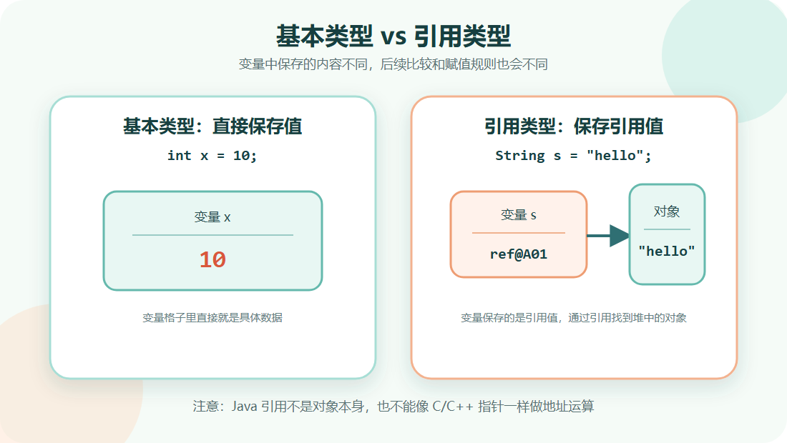
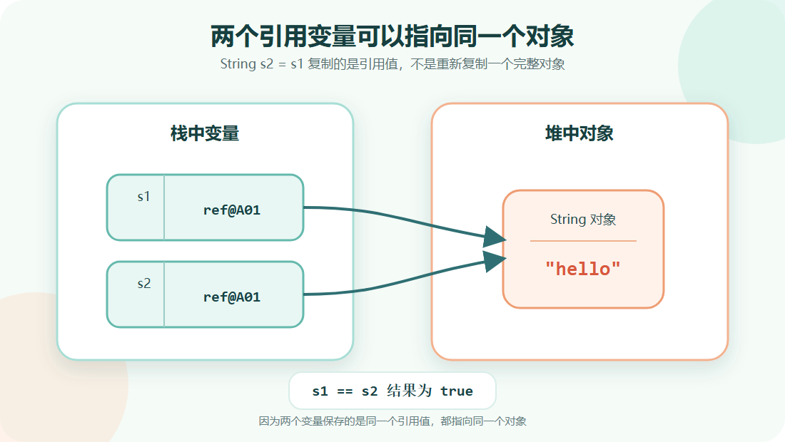
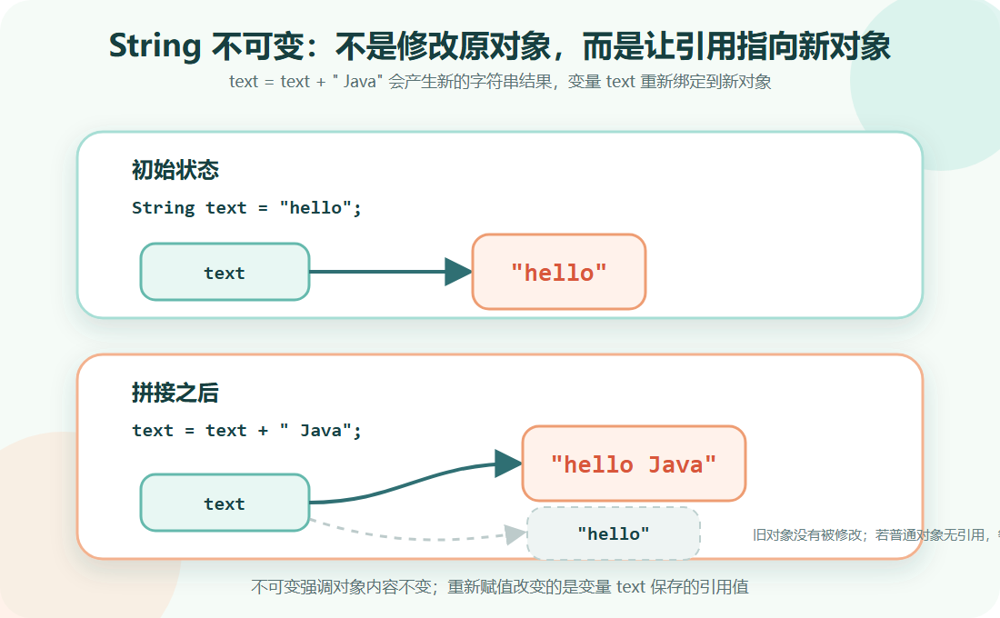

> [!info] 知识摘要
> **总结**
> - Java 是强类型语言，变量类型决定能保存什么数据、能参与什么运算，以及编译器如何检查代码。
> - 本篇围绕数据类型和运算符建立入门认知，并提示类型转换、字符串比较、整数运算、浮点精度等常见问题。
>
> **文章元信息**
> - 更新时间：2026-05-16
> - 系列定位：Java 基础语言第 02 篇
> - 适合读者：已经能运行 `HelloWorld`，准备系统学习变量、数据类型和运算符的初学者
> - 前置知识：理解 `.java -> .class -> JVM` 的基本运行链路
>
> **相关知识点**
> - 基本类型、引用类型、类型转换、运算符、`String`、`==`、短路逻辑、取模、浮点数精度

---

## 一、先建立 Java 类型系统的整体认知

### 1.1 Java 变量必须有明确类型

Java 是一门强类型语言。定义变量时，必须先声明这个变量属于什么类型。

例如：

**✅ 变量声明示例**

```java
int age = 18;
double score = 95.5;
boolean passed = true;
String name = "Java";
```

这里的 `int`、`double`、`boolean`、`String` 都是在告诉编译器：这个变量未来可以保存什么样的数据。

如果类型不匹配，编译阶段就会直接报错。例如把字符串赋给 `int`：

**✅ 类型不匹配示例**

```java
int age = "18"; // 编译错误
```

这不是 JVM 运行时才发现的问题，而是编译器在 `javac` 阶段就会检查出来。

**💡 核心结论：** Java 中变量不是“想放什么就放什么”，变量的类型会决定它能保存的数据范围、能参与的运算方式和编译器检查规则。

### 1.2 基本类型与引用类型

Java 中的数据类型可以先分成两大类：**基本数据类型**和**引用数据类型**。

| 类型类别 | 保存内容 | 示例 | 初学者理解 |
| --- | --- | --- | --- |
| 基本数据类型 | 具体值 | `int x = 10;` | 变量里直接放数据 |
| 引用数据类型 | 对象引用 | `String s = "abc";` | 变量里放的是对象的“地址牌” |

可以先用下面这张图理解：

```text
基本类型变量：
int x = 10;
x 直接保存 10

引用类型变量：
String s = "hello";
s 保存的是 JVM 用来找到字符串对象的引用
```



引用类型变量保存的是一个引用值，不是对象本身。你可以把它理解成对象的“地址牌”：通过它找到对象，但不能直接操作地址。

基本类型不是对象，不能直接调用方法。引用类型通常指向对象，对象才有属性和方法。

例如：

**✅ 引用类型调用方法示例**

```java
String text = "hello";
int length = text.length();
```

这里 `text` 是 `String` 类型，`String` 是引用类型，所以可以调用 `length()` 方法。

---

## 二、八种基本数据类型

### 2.1 基本类型总览

Java 一共有八种基本数据类型。学习它们时，不只要知道名字，还要知道**大小、范围和默认值**，因为这些信息会直接影响字面量、类型转换、数组默认初始化和空指针问题。

| 类型 | 大小 | 取值范围 | 默认值† | 常见用途 |
| --- | --- | --- | --- | --- |
| `byte` | 8 位 | `-128 ~ 127` | `0` | 文件、网络、二进制数据 |
| `short` | 16 位 | `-32768 ~ 32767` | `0` | 较少直接使用 |
| `int` | 32 位 | `-2^31 ~ 2^31 - 1`，约 `±21` 亿 | `0` | 默认整数类型，最常用 |
| `long` | 64 位 | `-2^63 ~ 2^63 - 1`，约 `±9.22e18` | `0L` | 大整数、计数器、时间戳 |
| `float` | 32 位 | 约 `±3.4e38`，有效数字约 `6~7` 位 | `0.0F` | 对内存较敏感的小数场景 |
| `double` | 64 位 | 约 `±1.7e308`，有效数字约 `15~16` 位 | `0.0D` | 默认小数类型，最常用 |
| `char` | 16 位 | `0 ~ 65535`，表示 Unicode 码元 | `'\u0000'` | 字符处理 |
| `boolean` | JVM 未规定精确位数 | `true / false` | `false` | 条件判断 |

† 默认值仅适用于**成员变量**和**数组元素**。局部变量不会自动初始化，必须先赋值才能使用。

**✅ 局部变量没有默认值示例**

```java
int local;
// System.out.println(local); // 编译错误：局部变量没有初始化
```

所有引用类型，包括 `String`、数组和自己写的类，如果作为成员变量或数组元素，默认值都是 `null`。这也是后面理解空指针和自动拆箱风险的重要基础。

入门阶段最常用的是 `int`、`long`、`double`、`boolean`、`char`。其中 `int` 最常用，不是因为它范围最大，而是因为它足够覆盖大部分日常计数场景，且 Java 的整数字面量默认就是 `int`。

**💡 核心结论：** 整数默认用 `int`，大整数用 `long`，小数默认用 `double`，判断条件用 `boolean`，单个字符用 `char`。

### 2.2 整数类型：byte、short、int、long

整数类型用于保存没有小数部分的数字。

**✅ 整数类型示例**

```java
byte b = 10;
short s = 100;
int age = 18;
long count = 10000000000L;
```

这里最需要注意的是 `long` 字面量。整数默认会被当作 `int` 处理，如果数字超出了 `int` 范围，需要在末尾加 `L`。

推荐写大写 `L`，不要写小写 `l`，因为小写 `l` 容易和数字 `1` 混淆。

> ⚠️ **误区：只要左边是 `long`，右边的大整数就不用加 `L`**
>
> **正确理解：** 编译器不是先看左边是 `long`，再决定右边怎么解释。它会先独立评估右侧字面量，如果右侧字面量本身已经超过 `int` 范围，就会在赋值前报错。

先看一组认知冲突：

**✅ long 字面量认知冲突示例**

```java
long a = 10000000000;  // 编译错误：右侧默认按 int 处理，已经超出 int 范围
long b = 10000000000L; // 正确：右侧明确是 long 字面量
```

这里可以把编译器的处理理解成两步：

1. 先独立判断右侧表达式的类型，`10000000000` 没有后缀，默认尝试作为 `int`。
2. 如果右侧表达式本身合法，再检查能不能赋给左侧变量。

所以，`long` 变量能不能接住大整数，不只取决于左边是什么类型，还取决于右边的字面量有没有先通过编译器检查。

### 2.3 小数类型：float、double

小数类型用于保存带小数部分的数字。

**✅ 小数类型示例**

```java
double price = 19.9;
float rate = 0.85F;
```

Java 中小数字面量默认是 `double`。如果要赋给 `float`，通常要在末尾加 `F`。

**✅ float 字面量示例**

```java
float x = 3.14;  // 编译错误
float y = 3.14F; // 正确
```

实际开发中，如果没有特殊要求，小数优先使用 `double`。

### 2.4 char 与 boolean

`char` 表示单个字符，使用单引号。

**✅ char 示例**

```java
char letter = 'A';
char symbol = '#';
```

`String` 表示字符串，使用双引号。

**✅ char 与 String 对比示例**

```java
char c = 'A';
String s = "A";
```

这两者不是一回事：`char` 是基本类型，`String` 是引用类型。

`boolean` 只有两个值：`true` 和 `false`。

**✅ boolean 示例**

```java
boolean isAdult = true;
boolean isEmpty = false;
```

Java 中 `boolean` 不能和数字混用。

**✅ boolean 不能和数字混用示例**

```java
boolean flag = 1; // 编译错误
```

这一点和部分语言不同。Java 不会把 `0` 当作 `false`，也不会把 `1` 当作 `true`。

---

## 三、字面量与变量赋值规则

### 3.1 什么是字面量

字面量可以理解为代码中直接写出来的数据。

| 字面量 | 类型理解 |
| --- | --- |
| `100` | 整数字面量，默认是 `int` |
| `100L` | `long` 字面量 |
| `3.14` | 小数字面量，默认是 `double` |
| `3.14F` | `float` 字面量 |
| `'A'` | `char` 字面量 |
| `"A"` | `String` 字面量 |
| `true` | `boolean` 字面量 |

**✅ 字面量示例**

```java
int a = 100;
long b = 100L;
double c = 3.14;
float d = 3.14F;
char e = 'A';
String f = "A";
boolean g = true;
```

### 3.2 `=` 是赋值，不是判断相等

在 Java 中，`=` 表示赋值。

**✅ 赋值示例**

```java
int x = 10;
x = 20;
```

第一行表示创建变量 `x` 并赋值为 `10`。第二行表示把 `x` 的值改成 `20`。

如果要判断两个值是否相等，使用 `==`。

**✅ 判断相等示例**

```java
int x = 20;
boolean result = x == 20;
```

> ⚠️ **误区：`=` 和数学里的等号一样**
>
> **正确理解：** Java 里的 `=` 是赋值，把右边的结果放到左边变量中；判断是否相等要使用 `==`。

---

## 四、引用类型与对象引用

### 4.1 引用变量保存的是对象引用

引用类型变量中保存的不是对象本身，而是 JVM 用来定位对象的引用值。入门时可以把它理解成对象的“遥控器”或“地址牌”。

先看一个例子：

**✅ 引用赋值示例**

```java
String s1 = new String("hello");
String s2 = s1;
```

这里可以这样理解：

```text
s1 指向一个 String 对象
s2 = s1 复制的是引用
s1 和 s2 指向同一个字符串对象
```

也就是说，`s2 = s1` 并不是重新复制出一个完整对象，而是让 `s2` 也指向同一个对象。



这个点后面学习对象、数组和集合时会反复出现：变量之间赋值时，复制的可能只是“引用”，不是把整个对象重新克隆一份。

### 4.2 字符串内容比较要使用 equals

基本类型用 `==` 比较值。

**✅ 基本类型比较示例**

```java
int a = 10;
int b = 10;
System.out.println(a == b); // true
```

引用类型用 `==` 比较的是两个引用是否指向同一个对象。

**✅ 字符串比较示例**

```java
String s1 = new String("hello");
String s2 = new String("hello");

System.out.println(s1 == s2);      // false
System.out.println(s1.equals(s2)); // true
```

`s1` 和 `s2` 的内容都是 `"hello"`，但它们是两个不同对象，所以 `s1 == s2` 为 `false`。

如果比较字符串内容，应使用 `equals()`。

> ⚠️ **误区：字符串内容一样，`==` 就一定是 true**
>
> **正确理解：** `==` 对引用类型比较的是引用是否相同。字符串内容比较应使用 `equals()`，不要依赖 `==`。

### 4.3 String 是引用类型，但字符串对象不可变

`String` 是引用类型，不是基本类型。

字符串有一个非常重要的特点：**不可变**。

例如：

**✅ 字符串拼接示例**

```java
String text = "hello";
text = text + " Java";
```

这段代码看起来像是修改了原来的字符串，实际上更准确的理解是：产生了一个新的字符串结果，然后让 `text` 指向新的字符串。



严格来说，`"hello"` 作为字符串字面量还涉及字符串常量池，当前阶段先不展开。更通用的理解是：如果一个普通对象后续没有任何引用再指向它，就可能成为垃圾对象，等待 JVM 在合适的时候进行垃圾回收。

当前阶段不需要深入字符串常量池，只要先记住：

- `String` 是引用类型。
- 字符串内容比较用 `equals()`。
- 字符串拼接通常会产生新的字符串结果。

---

## 五、类型转换与包装类

### 5.1 自动类型转换

表示范围更大的类型通常可以接收表示范围更小的类型，编译器会自动完成转换。

**✅ 自动类型转换示例**

```java
int a = 10;
long b = a;
double c = b;
```

入门阶段可以先记住两点：

- 小范围整数赋给大范围整数，通常可以自动转换，例如 `int -> long`。
- 整数转浮点数也可能自动转换，例如 `long -> float`，但这只代表编译器允许，不代表精度一定无损。

本文先只掌握使用结论：**自动类型转换看的是 Java 规则允许不允许，不等于业务上一定安全。**

专题展开：[[宽化基本类型转换|为什么 long 可以自动转 float？宽化基本类型转换与精度丢失详解]]

### 5.2 强制类型转换

表示范围更大或精度规则不同的类型赋给表示能力更窄的类型，通常需要显式强制转换。

**✅ 强制类型转换示例**

```java
long x = 100L;
int y = (int) x;
```

语法格式是：

```text
目标类型 变量名 = (目标类型) 原值;
```

强制类型转换可能带来数据丢失。

**✅ 强制转换丢失小数示例**

```java
double price = 19.99;
int result = (int) price;

System.out.println(result); // 19
```

`double` 转 `int` 时，小数部分会被直接丢掉，不是四舍五入。

再看整数溢出的风险：

**✅ 整数溢出示例**

```java
long big = 3000000000L;
int small = (int) big;

System.out.println(small);
```

这里的输出结果可能不是你想要的 `3000000000`，因为 `int` 根本装不下这么大的数。

**💡 核心结论：** 自动转换通常表示“编译器允许的表示范围转换”，但不代表精度一定无损；强制转换表示“你明确承担可能丢失数据的风险”。

### 5.3 自动装箱与自动拆箱

Java 的八种基本类型都有对应的包装类。

| 基本类型 | 包装类 |
| --- | --- |
| `byte` | `Byte` |
| `short` | `Short` |
| `int` | `Integer` |
| `long` | `Long` |
| `float` | `Float` |
| `double` | `Double` |
| `char` | `Character` |
| `boolean` | `Boolean` |

自动装箱：基本类型自动变成包装类对象。

**✅ 自动装箱示例**

```java
Integer a = 10;
```

自动拆箱：包装类对象自动变成基本类型。

**✅ 自动拆箱示例**

```java
Integer a = 10;
int b = a;
```

为什么需要包装类？一个常见原因是集合泛型不能直接使用基本类型。

**✅ 泛型使用包装类示例**

```java
// List<int> list = new ArrayList<>(); // 错误
// List<Integer> list = new ArrayList<>(); // 正确
```

这里暂时不展开集合，只需要先知道：泛型中要写包装类，不能直接写基本类型。

### 5.4 自动拆箱的空指针风险

包装类是对象，所以可以为 `null`。

**✅ 自动拆箱空指针示例**

```java
Integer count = null;
int value = count; // 运行时抛出 NullPointerException
```

这段代码编译可能通过，但运行时会出问题。原因是 `int value = count;` 触发了自动拆箱，而 `count` 是 `null`。

> ⚠️ **误区：`Integer` 和 `int` 完全一样**
>
> **正确理解：** `int` 是基本类型，不能为 `null`；`Integer` 是包装类对象，可以为 `null`。自动拆箱遇到 `null` 会抛出 `NullPointerException`。

---

## 六、常见运算符

### 6.1 算术运算符

Java 中常见算术运算符如下：

| 运算符 | 含义 | 示例 |
| --- | --- | --- |
| `+` | 加法 / 字符串拼接 | `a + b` |
| `-` | 减法 | `a - b` |
| `*` | 乘法 | `a * b` |
| `/` | 除法 | `a / b` |
| `%` | 取余 | `a % b` |

整数除法会直接舍弃小数部分。

**✅ 整数除法示例**

```java
int result = 5 / 2;
System.out.println(result); // 2
```

如果希望得到小数结果，至少让其中一个参与运算的数据变成小数。

**✅ 浮点除法示例**

```java
double result = 5.0 / 2;
System.out.println(result); // 2.5
```

取余 `%` 常用于判断奇偶、周期循环和下标回绕。

**✅ 判断奇偶示例**

```java
int number = 7;

if (number % 2 == 0) {
    System.out.println("偶数");
} else {
    System.out.println("奇数");
}
```

### 6.2 复合赋值运算符

复合赋值运算符是“运算 + 赋值”的简写形式。

| 运算符 | 常规理解 | 含义 |
| --- | --- | --- |
| `+=` | `a = a + b` | 加后赋值 |
| `-=` | `a = a - b` | 减后赋值 |
| `*=` | `a = a * b` | 乘后赋值 |
| `/=` | `a = a / b` | 除后赋值 |
| `%=` | `a = a % b` | 取余后赋值 |

**✅ 复合赋值示例**

```java
int count = 10;
count += 5;

System.out.println(count); // 15
```

对 `int` 这类常见场景，可以先把 `count += 5` 理解成 `count = count + 5`。

但要知道一个坑：`+=` 并不总是简单的文本替换。遇到 `byte`、`short`、`char` 时，表达式可能先提升为 `int`，复合赋值又会把结果转回左侧变量类型。

本文先只记结论：**复合赋值能简化写法，但小整数类型参与运算时要留意类型提升。**

专题展开：[[复合赋值与类型提升|为什么 b += 1 可以，但 b = b + 1 会报错？复合赋值与类型提升讲清楚]]

### 6.3 字符串拼接中的 `+`

`+` 不只可以做数字加法，也可以做字符串拼接。

**✅ 字符串拼接示例**

```java
String text = "age = " + 18;
System.out.println(text); // age = 18
```

只要表达式中有字符串，`+` 就可能变成字符串拼接。

**✅ 从左到右计算示例**

```java
System.out.println(1 + 2 + "a"); // 3a
System.out.println("a" + 1 + 2); // a12
```

第一行先计算 `1 + 2` 得到 `3`，再和字符串 `"a"` 拼接。

第二行从 `"a" + 1` 开始，已经变成字符串拼接，后面的 `2` 也继续拼接。

如果想改变计算顺序，就使用括号。

**✅ 使用括号改变拼接顺序示例**

```java
System.out.println("a" + (1 + 2)); // a3
```

### 6.4 自增与自减

自增和自减用于让变量加 1 或减 1。

**✅ 自增自减写法示例**

```java
x++;
++x;
x--;
--x;
```

单独使用时，`x++` 和 `++x` 效果一样。

**✅ 单独使用示例**

```java
int x = 1;
x++;
System.out.println(x); // 2
```

参与表达式时，前置和后置有区别。

**✅ 前置与后置区别示例**

```java
int a = 1;
int b = a++;

System.out.println(a); // 2
System.out.println(b); // 1
```

`a++` 是先使用原值，再让 `a` 加 1。

**✅ 前置自增示例**

```java
int a = 1;
int b = ++a;

System.out.println(a); // 2
System.out.println(b); // 2
```

`++a` 是先让 `a` 加 1，再使用新值。

**💡 核心结论：** 初学阶段不要在复杂表达式里混用自增自减。能拆成多行，就拆成多行。

### 6.5 关系运算符

关系运算符用于比较两个值，结果一定是 `boolean`。

| 运算符 | 含义 |
| --- | --- |
| `==` | 等于 |
| `!=` | 不等于 |
| `>` | 大于 |
| `<` | 小于 |
| `>=` | 大于等于 |
| `<=` | 小于等于 |

**✅ 关系运算符示例**

```java
int age = 18;

System.out.println(age >= 18); // true
System.out.println(age == 20); // false
```

关系运算常见于 `if`、`while`、`for` 等流程控制中。流程控制会在下一篇展开。

### 6.6 逻辑运算符与短路

逻辑运算符用于组合多个 `boolean` 条件。

| 运算符 | 含义 | 是否短路 |
| --- | --- | --- |
| `&&` | 与，两个条件都为 true 才为 true | 是 |
| `\|\|` | 或，至少一个条件为 true 就为 true | 是 |
| `!` | 非，取反 | 不涉及 |

短路规则非常重要：

- `a && b`：如果 `a` 已经是 `false`，不会继续计算 `b`。
- `a || b`：如果 `a` 已经是 `true`，不会继续计算 `b`。

短路最常见的用途是避免空指针。

**✅ 短路避免空指针示例**

```java
if (text != null && text.length() > 0) {
    System.out.println("字符串不为空");
}
```

如果 `text` 是 `null`，前面的 `text != null` 为 `false`，后面的 `text.length()` 不会执行。

如果写反顺序，就可能出现空指针：

**✅ 空指针风险示例**

```java
if (text.length() > 0 && text != null) {
    System.out.println("字符串不为空");
}
```

### 6.7 位运算符

位运算符直接操作整数的二进制位。

| 运算符 | 含义 |
| --- | --- |
| `&` | 按位与 |
| `\|` | 按位或 |
| `^` | 按位异或 |
| `~` | 按位取反 |
| `<<` | 左移 |
| `>>` | 右移 |
| `>>>` | 无符号右移 |

入门阶段只需要先知道：位运算不是 Java 基础语法主线，但要和逻辑运算符区分开。

**✅ 逻辑运算与位运算对比示例**

```java
// 逻辑与：用于 boolean 条件
boolean result = age > 0 && age < 120;

// 按位与：用于整数二进制位
int value = 6 & 3;
```

还要注意，`&` 和 `|` 也可以用于 `boolean`，但它们不会短路；`&&` 和 `||` 才是常用的短路逻辑运算符。

**✅ `&` 不短路示例**

```java
String text = null;

// 这里会抛出 NullPointerException，因为 & 右侧仍然会执行
if (text != null & text.length() > 0) {
    System.out.println("字符串不为空");
}
```

实际写条件判断时，优先使用 `&&` 和 `||`。

后续学习权限标记、底层数据结构、哈希计算时，位运算会更常见。

### 6.8 三元运算符

三元运算符用于简单的二选一。

语法：

```text
条件 ? 值1 : 值2
```

**✅ 三元运算符示例**

```java
int a = 10;
int b = 20;

int max = a > b ? a : b;
System.out.println(max); // 20
```

它适合简单赋值，不适合写复杂逻辑。

**✅ 简单二选一示例**

```java
String result = score >= 60 ? "及格" : "不及格";
```

如果条件很多、逻辑很复杂，优先使用 `if...else`，不要强行嵌套三元运算符。

---

## 七、浮点数精度先简单了解

### 7.1 浮点数不能随便用 `==` 比较

很多小数无法用二进制精确表示，所以浮点数计算结果可能和你看到的十进制结果不完全一致。

**✅ 浮点数精度示例**

```java
double result = 0.1 + 0.2;
System.out.println(result);          // 0.30000000000000004
System.out.println(result == 0.3);   // false
```

入门阶段先记住三条：

- `float` 和 `double` 适合表示近似小数，不适合表示绝对精确的十进制金额。
- 计算后的浮点数不建议直接用 `==` 判断相等。
- 金额、账单、税率等精确十进制业务，优先学习 `BigDecimal` 或整数分方案。

专题展开：[[浮点数精度|为什么 0.1 + 0.2 不等于 0.3？IEEE 754 与 BigDecimal 精度处理详解]]

### 7.2 常见错误排查表

| 问题 | 错误原因 | 正确方向 |
| --- | --- | --- |
| `long` 大整数报错 | 字面量默认是 `int` | 末尾加 `L` |
| `float x = 3.14` 报错 | 小数字面量默认是 `double` | 写成 `3.14F` |
| `5 / 2` 得到 `2` | 两边都是整数，执行整数除法 | 至少一边改成小数 |
| 字符串内容比较失败 | 用了 `==` 比较引用 | 使用 `equals()` |
| 自动拆箱空指针 | 包装类变量为 `null` | 拆箱前先判空 |
| `boolean flag = 1` 报错 | Java 不允许布尔值和数字混用 | 使用 `true` / `false` |
| `b = b + 1` 报错 | 表达式结果被提升为 `int` | 先记结论，细节看 [[杂项知识点/复合赋值与类型提升/复合赋值与类型提升|复合赋值与类型提升]] |
| 强转后结果异常 | 数据范围不匹配导致溢出 | 转换前确认范围 |
| `0.1 + 0.2 != 0.3` | 十进制小数不一定能被二进制浮点数精确表示 | 先避免直接 `==`，细节看 [[杂项知识点/浮点数精度/浮点数精度|浮点数精度]] |
| 逻辑判断空指针 | 没有利用短路或顺序写反 | 先判空，再调用方法 |

### 7.3 本篇先不展开哪些内容

这一篇只解决 Java 入门阶段最关键的数据类型和运算符问题，下面内容后续再展开：

| 内容 | 后续位置 |
| --- | --- |
| `if`、`switch`、循环 | 流程控制与数组 |
| 类、对象、成员变量 | 面向对象基础 |
| `String` 常量池细节 | 常用类或 JVM 相关章节 |
| 集合泛型完整用法 | 集合与数据结构章节 |
| `long -> float` 宽化转换与精度边界 | [[宽化基本类型转换]] |
| `b += 1` 与类型提升细节 | [[复合赋值与类型提升]] |
| 浮点数精度与 `BigDecimal` 金额计算 | [[浮点数精度]] |

**💡 核心结论：** 当前阶段先把类型、赋值、转换、比较、运算这些基础规则吃透，后面学习流程控制、面向对象和集合时才不会被低级类型错误卡住。

---

## 总结

| 知识点 | 必须记住的结论 |
| --- | --- |
| 基本类型 | 直接保存具体值，共八种，需要关注大小、范围和默认值 |
| 引用类型 | 保存对象引用值，可理解成对象的“地址牌”，默认值通常是 `null` |
| 默认值 | 只适用于成员变量和数组元素，局部变量必须先赋值 |
| 整数字面量 | 默认是 `int`，大整数用 `L` |
| 小数字面量 | 默认是 `double`，`float` 用 `F` |
| `=` 和 `==` | `=` 是赋值，`==` 是比较 |
| 字符串比较 | 内容比较使用 `equals()` |
| 自动类型转换 | 表示范围更大的类型通常可以接收表示范围更小的类型，但不代表精度一定无损 |
| 强制类型转换 | 可能溢出或丢失精度 |
| 自动装箱拆箱 | 包装类能为 `null`，拆箱要小心 |
| 整数除法 | `5 / 2` 的结果是 `2` |
| 复合赋值 | `+=` 等写法包含运算和赋值，可能涉及隐式转换 |
| 短路逻辑 | `&&` 和 `\|\|` 可以避免不必要计算 |
| 浮点数比较 | 不建议直接用 `==` 比较计算结果 |

这一篇的主线可以压缩成一句话：**类型决定数据怎么存，运算符决定数据怎么用。**

**💡 核心结论：** Java 初学阶段不要急着背大量语法细节，先分清基本类型和引用类型，理解类型转换、字符串比较、整数除法、短路逻辑和自动拆箱风险，就已经能避开大量入门错误。
