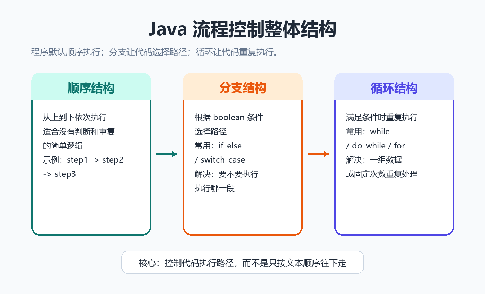
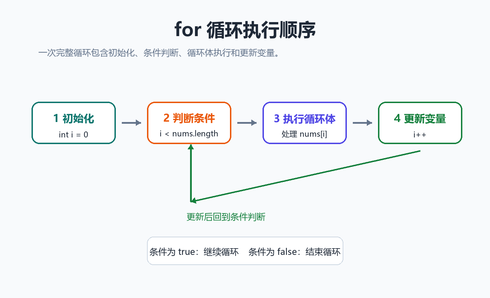
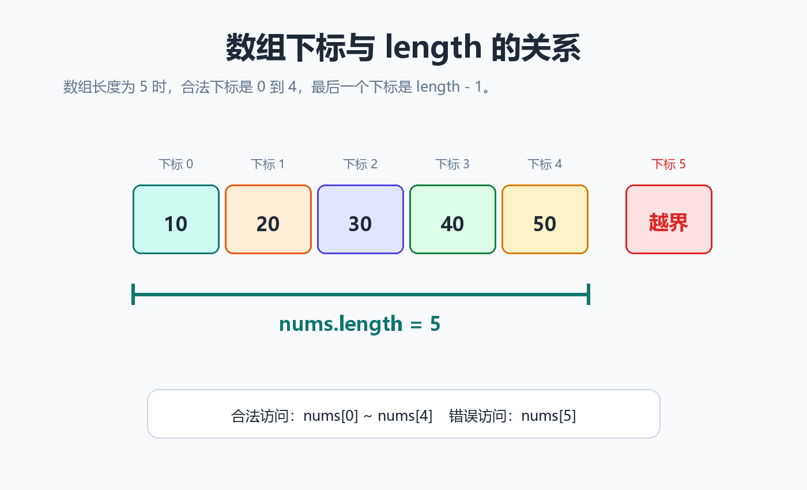
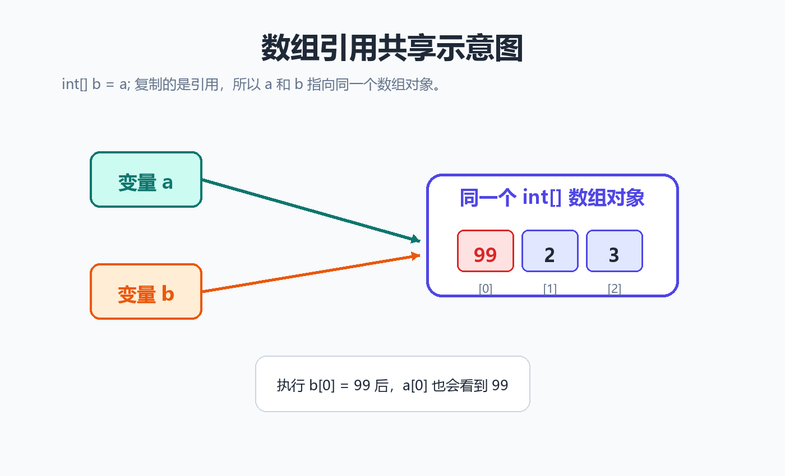

> [!info] 知识摘要
> **总结**
> - 流程控制决定代码按什么路径执行，数组负责把多个同类型数据放在一起存储和访问。
> - 本篇覆盖 `if`、`switch`、循环、`break`、`continue` 和数组基础，重点避开数组越界与引用共享等高频错误。
>
> **文章元信息**
> - 更新时间：2026-05-17
> - 系列定位：Java 基础语言第 03 篇
> - 适合读者：已理解变量、数据类型和运算符，准备继续学习流程控制与数组的初学者
> - 前置知识：建议先理解 `boolean`、关系运算符、逻辑运算符和基本变量声明
>
> **相关知识点**
> - `if`、`switch`、`for`、`while`、`break`、`continue`、数组、索引、数组引用

---

## 一、先建立流程控制的整体认知

### 1.1 程序默认是顺序执行

如果没有任何流程控制语句，Java 程序会按照代码出现的顺序，从上到下一行一行执行。

**✅ 顺序执行示例**

```java
System.out.println("step 1");
System.out.println("step 2");
System.out.println("step 3");
```

输出顺序也是：

```text
step 1
step 2
step 3
```

但实际程序通常不会这么简单。比如：

- 分数大于等于 60 才算及格。
- 用户输入错误时要重新输入。
- 数组里有 100 个元素，需要逐个处理。

这些场景就需要流程控制。

### 1.2 三类最常见的执行路径

可以先把 Java 基础阶段的流程控制理解成三类：

| 类型 | 作用 | 典型语句 |
| --- | --- | --- |
| 顺序结构 | 默认从上到下执行 | 普通代码语句 |
| 分支结构 | 根据条件选择执行哪段代码 | `if-else`、`switch-case` |
| 循环结构 | 重复执行某段代码 | `while`、`do-while`、`for` |



**💡 核心结论：** 分支解决“要不要执行、执行哪一段”的问题，循环解决“重复执行多少次、什么时候停”的问题。

---

## 二、条件分支：让代码按条件选择路径

### 2.1 if 语句：满足条件才执行

`if` 是最基础的条件分支。它的条件表达式必须是 `boolean`，结果只能是 `true` 或 `false`。

**✅ if 基本写法**

```java
int score = 75;

if (score >= 60) {
    System.out.println("pass");
}
```

如果 `score >= 60` 为 `true`，就会执行大括号里的代码；如果为 `false`，就直接跳过。

> ⚠️ **误区：把数字直接当成条件**
>
> **正确理解：** Java 的 `if` 条件必须是 `boolean`。不能像某些语言那样写 `if (1)` 或 `if (num)`。

错误示例：

```java
int num = 1;

if (num) { // 编译错误
    System.out.println("ok");
}
```

### 2.2 if-else：二选一

当条件成立和不成立时都要处理，就使用 `if-else`。

**✅ if-else 示例**

```java
int score = 58;

if (score >= 60) {
    System.out.println("pass");
} else {
    System.out.println("fail");
}
```

这类结构适合处理“是或否”“成功或失败”“满足或不满足”的场景。

### 2.3 else-if：多分支判断

当一个条件有多个区间或多个等级时，可以使用 `else if`。

**✅ 成绩等级判断示例**

```java
int score = 86;
String grade;

if (score >= 90) {
    grade = "A";
} else if (score >= 80) {
    grade = "B";
} else if (score >= 60) {
    grade = "C";
} else {
    grade = "D";
}

System.out.println(grade);
```

多分支判断会从上到下依次判断。只要命中其中一个分支，后面的分支就不会继续执行。

**💡 核心结论：** 写 `else if` 时，要注意判断顺序。范围判断通常把更严格、更具体的条件放在前面。

### 2.4 switch-case：适合固定值匹配

当一个变量有多个固定取值，并且每个取值对应不同处理时，可以使用 `switch`。

**✅ switch 示例**

```java
int month = 4;
int days;

switch (month) {
    case 2:
        days = 28;
        break;
    case 4:
    case 6:
    case 9:
    case 11:
        days = 30;
        break;
    default:
        days = 31;
        break;
}

System.out.println(days);
```

这里的 `case 4`、`case 6`、`case 9`、`case 11` 共用同一段逻辑，表示这些月份都是 30 天。

| 写法 | 适合场景 |
| --- | --- |
| `if-else` | 范围判断、复杂条件判断 |
| `switch-case` | 固定值匹配、枚举式分支 |

> ⚠️ **误区：switch 每个 case 都会自动停止**
>
> **正确理解：** 传统 `switch-case` 中如果不写 `break`，代码会继续执行到后面的 `case`，这叫 case 穿透。

---

## 三、循环结构：让代码重复执行

### 3.1 while 循环：先判断，再执行

`while` 的特点是：先判断条件，条件为 `true` 才执行循环体。

**✅ while 示例**

```java
int i = 0;

while (i < 5) {
    System.out.println(i);
    i++;
}
```

执行结果：

```text
0
1
2
3
4
```

`while` 更适合“不确定要循环多少次，但知道什么时候停止”的场景。

### 3.2 do-while 循环：至少执行一次

`do-while` 的特点是：先执行一次循环体，再判断条件。

**✅ do-while 示例**

```java
int i = 10;

do {
    System.out.println(i);
    i++;
} while (i < 5);
```

虽然 `i < 5` 一开始就是 `false`，但循环体仍然会先执行一次，所以会输出：

```text
10
```

`do-while` 常见于“菜单选择”“输入校验”等至少需要执行一次的场景。

### 3.3 for 循环：适合已知次数的重复

`for` 循环最适合已知循环次数，尤其适合数组下标遍历。

**✅ for 基本写法**

```java
for (int i = 0; i < 5; i++) {
    System.out.println(i);
}
```

它的执行顺序可以理解为：

```text
初始化 -> 判断条件 -> 执行循环体 -> 更新变量 -> 再次判断条件 -> ...
```



| 循环 | 判断时机 | 至少执行一次 | 常见场景 |
| --- | --- | --- | --- |
| `while` | 先判断 | 不一定 | 不确定循环次数 |
| `do-while` | 后判断 | 是 | 菜单、输入校验 |
| `for` | 先判断 | 不一定 | 已知次数、数组遍历 |

**💡 核心结论：** 初学阶段可以优先掌握 `for` 和 `while`。遍历数组时优先想到 `for`，条件驱动的重复逻辑优先想到 `while`。

---

## 四、break、continue 与 return 的区别

### 4.1 break：结束整个循环

`break` 会直接结束当前循环，常用于“找到目标后不需要继续找”的场景。

**✅ break 示例**

```java
int[] nums = {3, 7, 9, 12, 15};
int target = 9;

for (int i = 0; i < nums.length; i++) {
    if (nums[i] == target) {
        System.out.println("found");
        break;
    }
}
```

当找到 `9` 后，循环直接结束，后面的元素不会继续遍历。

### 4.2 continue：跳过本轮循环

`continue` 不会结束整个循环，只会跳过当前这一轮剩余代码，进入下一轮。

**✅ continue 示例**

```java
int[] nums = {3, -1, 7, -2, 9};

for (int i = 0; i < nums.length; i++) {
    if (nums[i] < 0) {
        continue;
    }
    System.out.println(nums[i]);
}
```

这段代码会跳过负数，只输出非负数。

### 4.3 return：结束当前方法

`return` 的作用更强，它会直接结束当前方法。如果方法有返回值，还需要把结果返回给调用处。

**✅ return 示例**

```java
int daysInMonth(int month) {
    switch (month) {
        case 2:
            return 28;
        case 4:
        case 6:
        case 9:
        case 11:
            return 30;
        default:
            return 31;
    }
}
```

三者区别可以这样记：

| 关键字 | 影响范围 | 典型作用 |
| --- | --- | --- |
| `break` | 当前循环或 `switch` | 结束整个循环 / 跳出 `switch` |
| `continue` | 当前这一轮循环 | 跳过本轮，进入下一轮 |
| `return` | 当前方法 | 结束方法，并可返回结果 |

> ⚠️ **误区：return 等于输出**
>
> **正确理解：** `return` 是把结果交给调用者，`System.out.println` 才是把内容打印到控制台。

---

## 五、数组基础：用一个变量管理多个同类型数据

### 5.1 数组是什么

数组用于保存多个同类型元素。比如要保存 5 个学生的分数，如果不用数组，可能要写 5 个变量：

```java
int score1 = 90;
int score2 = 85;
int score3 = 76;
int score4 = 88;
int score5 = 93;
```

使用数组后，可以写成：

**✅ 数组初始化示例**

```java
int[] scores = {90, 85, 76, 88, 93};
```

数组有几个重要特点：

| 特点 | 说明 |
| --- | --- |
| 同类型 | 一个 `int[]` 只能保存 `int` 元素 |
| 长度固定 | 创建后长度不能直接改变 |
| 下标从 0 开始 | 第一个元素是 `arr[0]` |
| 数组是引用类型 | 数组变量保存的是数组对象的引用 |

### 5.2 声明、创建与访问

常见的数组写法有两种。

**✅ 先创建指定长度的数组**

```java
int[] nums = new int[3];
nums[0] = 10;
nums[1] = 20;
nums[2] = 30;
```

**✅ 创建时直接初始化**

```java
int[] nums = {10, 20, 30};
```

访问数组元素时使用下标：

```java
System.out.println(nums[0]); // 10
System.out.println(nums[1]); // 20
System.out.println(nums[2]); // 30
```

数组长度使用 `length` 属性：

```java
System.out.println(nums.length); // 3
```



**💡 核心结论：** 如果数组长度是 `n`，合法下标范围永远是 `0` 到 `n - 1`，最后一个元素不是 `arr[n]`，而是 `arr[n - 1]`。

### 5.3 数组元素的默认值

如果只创建数组但没有手动赋值，数组元素会有默认值。

| 数组元素类型 | 默认值 |
| --- | --- |
| 整数类型 | `0` |
| 浮点类型 | `0.0` |
| `boolean` | `false` |
| `char` | `\u0000` |
| 引用类型 | `null` |

**✅ 默认值示例**

```java
int[] nums = new int[3];

System.out.println(nums[0]); // 0
System.out.println(nums[1]); // 0
System.out.println(nums[2]); // 0
```

注意：数组元素有默认值，不代表所有变量都有默认值。局部变量在使用前仍然必须手动初始化。

### 5.4 数组越界是最常见错误

数组下标越界会抛出 `ArrayIndexOutOfBoundsException`。

**✅ 数组越界示例**

```java
int[] nums = new int[3];

System.out.println(nums[3]); // 错误
```

因为长度为 3 的数组，合法下标只有 `0`、`1`、`2`。

常见越界原因：

- 把最后一个下标误写成 `arr.length`。
- 循环条件写成 `i <= arr.length`。
- 空数组时直接访问 `arr[0]`。

---

## 六、数组遍历：普通 for 与增强 for

### 6.1 使用普通 for 遍历数组

普通 `for` 最适合需要下标的场景。

**✅ 普通 for 遍历示例**

```java
int[] nums = {10, 20, 30};

for (int i = 0; i < nums.length; i++) {
    System.out.println(nums[i]);
}
```

如果需要修改数组元素，也通常使用普通 `for`。

**✅ 使用普通 for 修改数组元素**

```java
int[] nums = {10, 20, 30};

for (int i = 0; i < nums.length; i++) {
    nums[i] = nums[i] * 2;
}
```

### 6.2 使用增强 for 读取元素

增强 `for` 适合只读取元素，不关心下标的场景。

**✅ 增强 for 示例**

```java
int[] nums = {10, 20, 30};

for (int num : nums) {
    System.out.println(num);
}
```

它读起来更简洁，但拿不到当前元素的下标。

| 遍历方式 | 是否能拿到下标 | 是否适合修改元素 | 推荐场景 |
| --- | --- | --- | --- |
| 普通 `for` | 能 | 适合 | 需要下标、需要改值 |
| 增强 `for` | 不能 | 不适合直接改基本类型数组元素 | 只读遍历 |

### 6.3 增强 for 修改基本类型数组的误区

下面这段代码看起来像是在把数组元素翻倍，但实际不会修改原数组。

**✅ 增强 for 修改失败示例**

```java
int[] nums = {10, 20, 30};

for (int num : nums) {
    num = num * 2;
}

System.out.println(nums[0]); // 10
```

原因是：对基本类型数组来说，增强 `for` 中的循环变量 `num` 是元素值的拷贝，修改 `num` 不等于修改数组里的元素。

**💡 核心结论：** 只读取元素可以用增强 `for`；需要下标或需要修改数组元素时，优先使用普通 `for`。

---

## 七、多维数组：数组里面继续放数组

### 7.1 二维数组的基本写法

二维数组可以理解为“数组的数组”。

**✅ 二维数组示例**

```java
int[][] matrix = {
    {1, 2, 3},
    {4, 5, 6},
    {7, 8, 9}
};
```

访问二维数组元素时，需要两个下标：

```java
System.out.println(matrix[0][0]); // 1
System.out.println(matrix[1][2]); // 6
```

### 7.2 Java 的二维数组每一行长度可以不同

Java 中的二维数组本质上是“数组的数组”，所以每一行长度可以不一样。

**✅ 不规则二维数组示例**

```java
int[][] arr = {
    {1, 2, 3},
    {4, 5},
    {6}
};
```

遍历二维数组时，内层循环不要写死列数，应该使用 `arr[i].length`。

**✅ 二维数组遍历示例**

```java
for (int i = 0; i < arr.length; i++) {
    for (int j = 0; j < arr[i].length; j++) {
        System.out.println(arr[i][j]);
    }
}
```

| 表达式 | 含义 |
| --- | --- |
| `arr.length` | 二维数组有多少行 |
| `arr[i].length` | 第 `i` 行有多少列 |
| `arr[i][j]` | 第 `i` 行第 `j` 列的元素 |

---

## 八、数组引用特性：赋值不等于复制

### 8.1 数组变量保存的是引用

数组是引用类型。数组变量里保存的不是所有元素本身，而是数组对象的引用。

**✅ 数组引用共享示例**

```java
int[] a = {1, 2, 3};
int[] b = a;

b[0] = 99;

System.out.println(a[0]); // 99
```

为什么修改 `b[0]` 后，`a[0]` 也变了？

因为 `int[] b = a;` 不是复制了一份新数组，而是让 `b` 和 `a` 指向同一个数组对象。



### 8.2 如果想复制数组，需要创建新数组

如果希望得到一份独立数组，需要创建新数组并复制元素。

**✅ 手动复制数组**

```java
int[] a = {1, 2, 3};
int[] copy = new int[a.length];

for (int i = 0; i < a.length; i++) {
    copy[i] = a[i];
}
```

也可以使用 `Arrays.copyOf`：

**✅ 使用 Arrays.copyOf 复制数组**

```java
import java.util.Arrays;

int[] a = {1, 2, 3};
int[] copy = Arrays.copyOf(a, a.length);
```

**💡 核心结论：** 数组赋值复制的是引用，不是数组内容。想要新数组，就要显式创建并复制元素。

---

## 九、常见错误排查表

| 常见问题 | 错误写法或表现 | 正确理解 |
| --- | --- | --- |
| `if` 条件不是布尔值 | `if (num)` | Java 条件必须是 `boolean` |
| `switch` 忘记 `break` | 命中一个 `case` 后继续往下执行 | 需要结束时写 `break` 或直接 `return` |
| 死循环 | 循环变量没有更新 | 循环条件最终要能变成 `false` |
| 数组越界 | `arr[arr.length]` | 最后一个元素是 `arr[arr.length - 1]` |
| 增强 for 改不动基本类型数组 | `for (int x : arr) { x = 0; }` | `x` 是元素值的拷贝 |
| 以为数组赋值会复制内容 | `int[] b = a;` | 这只是复制引用 |
| 引用类型数组元素为 `null` | `students[0].name` 报空指针 | 先创建对象，再访问对象成员 |

---

## 十、本篇先不展开哪些内容

为了保持这篇文章的主线清晰，下面这些内容只建立基础认知，后续可以单独展开：

| 内容 | 为什么不在本文展开 |
| --- | --- |
| Java 新版 `switch` 表达式 | 入门阶段先掌握传统 `switch-case` |
| 多重循环性能优化 | 更适合放到算法或复杂度专题 |
| 数组扩容 | 数组本身长度固定，扩容通常引出 `ArrayList` |
| 深拷贝与浅拷贝 | 需要结合对象引用、构造方法和面向对象继续讲 |
| 二维数组内存图 | 更适合放到 Java 内存布局章节 |

---

## 总结

这一篇主要把 Java 基础语法中的流程控制和数组串了起来：

| 模块 | 需要掌握的核心点 |
| --- | --- |
| 条件分支 | `if-else` 适合条件判断，`switch-case` 适合固定值匹配 |
| 循环结构 | `while`、`do-while`、`for` 的判断时机和适用场景不同 |
| 流程跳转 | `break` 结束循环，`continue` 跳过本轮，`return` 结束方法 |
| 数组基础 | 数组长度固定，下标从 0 开始，合法下标是 `0` 到 `length - 1` |
| 数组遍历 | 普通 `for` 适合下标和修改，增强 `for` 适合只读 |
| 数组引用 | 数组赋值复制的是引用，不是内容 |

**💡 最后记住一句话：** 流程控制决定代码怎么走，数组决定一组数据怎么放；写 Java 基础代码时，最容易出错的地方通常就是循环边界和数组引用。
