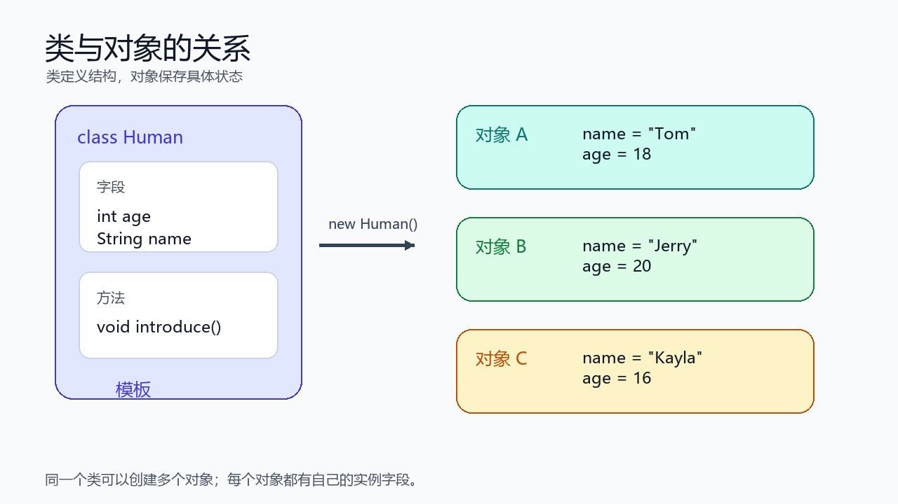
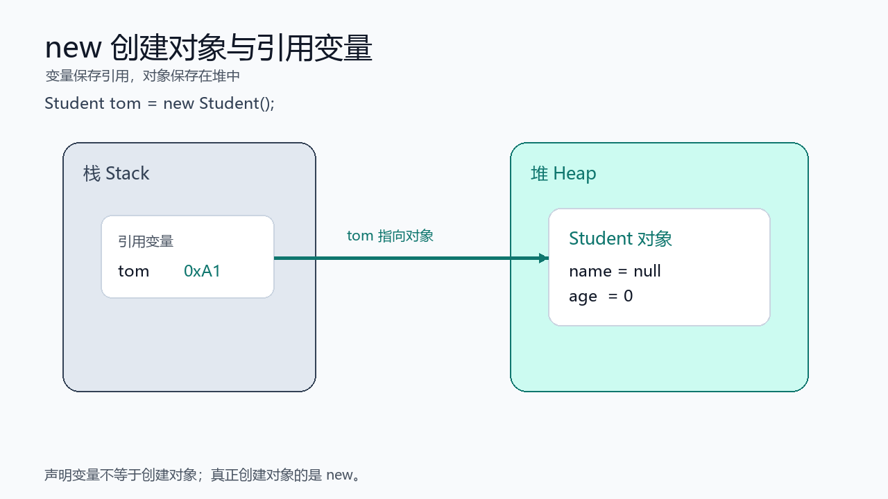
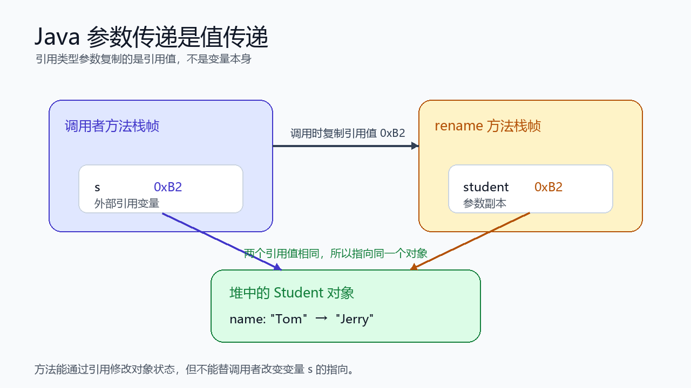
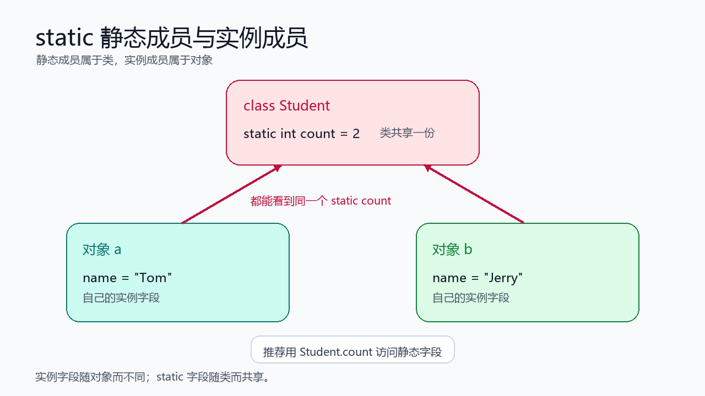

> [!info] 知识摘要
> **总结**
> - 从这一篇开始，Java 代码会围绕对象组织：类描述一类事物，对象保存具体数据并执行行为。
> - 本篇讲清类、对象、字段、方法、构造方法、`this`、`static`、`new` 和参数传递等基础概念。
>
> **文章元信息**
> - 更新时间：2026-05-17
> - 系列定位：Java 基础语言第 04 篇
> - 适合读者：已经掌握变量、流程控制和数组，准备进入面向对象语法的初学者
> - 前置知识：建议先理解基本类型、引用类型、方法调用和数组引用特性
>
> **相关知识点**
> - 类、对象、字段、方法、构造方法、`this`、`static`、`new`、参数传递

---

## 一、先建立类与对象的整体认知

### 1.1 类是模板，对象是实例

在 Java 中，**类**可以理解成一类事物的模板。它描述这类事物有哪些数据，以及能做哪些事情。

**对象**是根据类创建出来的具体个体。每个对象都有自己的一份实例数据。

例如，我们可以定义一个 `Human` 类：

**✅ 类的基本定义示例**

```java
public class Human {
    int age;
    String name;

    void introduce() {
        System.out.println("I'm " + name + ", age " + age);
    }
}
```

这里的含义可以拆开看：

| 代码元素 | 名称 | 作用 |
| --- | --- | --- |
| `Human` | 类名 | 描述一类人 |
| `age`、`name` | 字段 / 实例变量 | 保存对象的数据 |
| `introduce()` | 成员方法 | 描述对象能执行的行为 |

如果创建两个 `Human` 对象，它们属于同一个类，但可以保存不同的数据。



**💡 核心结论：** 类负责定义结构，对象负责保存具体状态；类只有一份模板，对象可以创建很多个。

### 1.2 面向对象解决的是代码组织问题

前面学习流程控制和数组时，代码经常围绕一堆变量展开：

**✅ 分散变量示例**

```java
String name = "Tom";
int age = 18;
double score = 92.5;
```

当数据变多时，这种写法会越来越难管理。比如一个学生有姓名、年龄、成绩；十个学生就会有十组变量。更好的方式是把属于同一个事物的数据放进一个类里。

**✅ 使用类组织数据示例**

```java
public class Student {
    String name;
    int age;
    double score;
}
```

这样代码表达的意思更清楚：`name`、`age`、`score` 不是随便散落的变量，而是一个 `Student` 对象的状态。

---

## 二、类的基本结构：字段与成员方法

### 2.1 字段保存对象状态

字段定义在类中、方法外，用来描述对象有哪些数据。

**✅ 字段定义示例**

```java
public class Student {
    String name;
    int age;
    double score;
}
```

这里的 `name`、`age`、`score` 都是字段。由于它们属于对象，所以也常叫**实例变量**。

字段有一个初学者必须记住的特点：如果没有手动赋值，字段会有默认值。

| 字段类型 | 默认值 |
| --- | --- |
| 整数类型 | `0` |
| 浮点类型 | `0.0` |
| `boolean` | `false` |
| `char` | `'\u0000'` |
| 引用类型 | `null` |

**✅ 字段默认值示例**

```java
Student s = new Student();

System.out.println(s.name);  // null
System.out.println(s.age);   // 0
System.out.println(s.score); // 0.0
```

> ⚠️ **误区：所有变量都有默认值**
>
> **正确理解：** 字段有默认值，数组元素也有默认值，但方法内部的局部变量没有默认值。局部变量必须先赋值再使用。

### 2.2 局部变量只在方法内部有效

局部变量定义在方法、构造方法或代码块内部。它的生命周期只跟当前这次方法调用有关。

**✅ 局部变量示例**

```java
void printMessage() {
    String message = "hello";
    System.out.println(message);
}
```

`message` 只在 `printMessage()` 方法内部有效，方法结束后就不能再访问。

字段和局部变量的区别可以这样记：

| 对比项 | 字段 | 局部变量 |
| --- | --- | --- |
| 定义位置 | 类中、方法外 | 方法或代码块内部 |
| 默认值 | 有默认值 | 没有默认值 |
| 生命周期 | 随对象或类存在 | 随方法调用存在 |
| 访问方式 | `对象.字段` 或类内部直接访问 | 变量名 |

### 2.3 成员方法描述对象行为

方法用于描述对象或类能做什么。

**✅ 成员方法示例**

```java
public class Student {
    String name;
    int age;
    double score;

    void introduce() {
        System.out.println(name + ", " + age + ", " + score);
    }

    boolean isPassed() {
        return score >= 60;
    }
}
```

`introduce()` 没有返回值，所以使用 `void`。`isPassed()` 会返回一个布尔结果，所以返回值类型是 `boolean`。

方法的基本结构是：

```java
返回值类型 方法名(参数列表) {
    方法体
}
```

**💡 核心结论：** 字段描述对象“有什么数据”，方法描述对象“能做什么事情”。

---

## 三、对象创建与使用：new 到底做了什么

### 3.1 使用 new 创建对象

有了类之后，还需要创建对象才能保存具体数据。

**✅ 创建对象示例**

```java
Student tom = new Student();
```

这行代码可以拆成三步理解：

| 步骤 | 代码片段 | 含义 |
| --- | --- | --- |
| 声明变量 | `Student tom` | 声明一个 `Student` 类型的引用变量 |
| 创建对象 | `new Student()` | 在堆中创建一个新的 `Student` 对象 |
| 保存引用 | `=` | 让变量 `tom` 指向这个对象 |



注意，`tom` 不是对象本身。它是一个引用变量，保存的是找到对象的引用。

### 3.2 使用点号访问字段和方法

创建对象后，可以通过点号访问对象的字段和方法。

**✅ 对象字段赋值和方法调用示例**

```java
Student tom = new Student();

tom.name = "Tom";
tom.age = 18;
tom.score = 92.5;

tom.introduce();
System.out.println(tom.isPassed());
```

点号左边是对象引用，右边是字段或方法：

| 写法 | 含义 |
| --- | --- |
| `tom.name` | 访问 `tom` 指向对象的 `name` 字段 |
| `tom.score = 92.5` | 修改 `tom` 指向对象的 `score` 字段 |
| `tom.introduce()` | 调用 `tom` 指向对象的 `introduce` 方法 |

### 3.3 null 表示没有指向任何对象

引用变量可以保存对象引用，也可以保存 `null`。`null` 表示当前变量没有指向任何对象。

**✅ 空引用示例**

```java
Student s = null;

// s.name = "Tom"; // 运行时报 NullPointerException
```

如果一个引用变量是 `null`，却继续访问字段或调用方法，就会出现空指针异常。

> ⚠️ **误区：声明变量就等于创建对象**
>
> **正确理解：** `Student s;` 只是声明了一个引用变量，并没有创建对象。真正创建对象的是 `new Student()`。

---

## 四、方法调用与参数传递机制

### 4.1 方法可以接收参数，也可以返回结果

方法参数用于把外部数据传进方法内部，返回值用于把方法计算结果带回调用处。

**✅ 方法参数和返回值示例**

```java
public class Calculator {
    int add(int a, int b) {
        return a + b;
    }
}
```

调用时：

```java
Calculator calculator = new Calculator();
int result = calculator.add(3, 5);

System.out.println(result); // 8
```

参数 `a`、`b` 是方法内部的局部变量。方法调用时，外部传入的值会复制给这些参数。

### 4.2 Java 参数传递永远是值传递

Java 的参数传递规则只有一句话：**传进去的是值的副本。**

如果传入的是基本类型，复制的是具体值。

**✅ 基本类型参数示例**

```java
public class Demo {
    void change(int x) {
        x = 100;
    }

    public static void main(String[] args) {
        Demo demo = new Demo();
        int num = 10;

        demo.change(num);

        System.out.println(num); // 10
    }
}
```

`change(num)` 调用时，`num` 的值 `10` 被复制给参数 `x`。方法内部修改 `x`，不会影响外部的 `num`。

如果传入的是引用类型，复制的是引用值。

**✅ 引用类型参数示例**

```java
public class Demo {
    void rename(Student student) {
        student.name = "Jerry";
    }

    public static void main(String[] args) {
        Demo demo = new Demo();
        Student s = new Student();
        s.name = "Tom";

        demo.rename(s);

        System.out.println(s.name); // Jerry
    }
}
```

这里并不是把 `s` 这个变量本身传进去了，而是把 `s` 里面保存的引用值复制给参数 `student`。两个引用变量指向同一个对象，所以方法内部可以修改对象字段。



### 4.3 方法内部不能改变外部引用变量的指向

引用类型参数能修改对象内部状态，但不能改变外部引用变量指向哪个对象。

**✅ 不能改变外部引用指向示例**

```java
void reset(Student student) {
    student = new Student();
    student.name = "New";
}
```

调用后，外部变量仍然指向原来的对象。因为 `student = new Student();` 改的是参数变量自己的副本，不是外部那个引用变量。

**💡 核心结论：** Java 只有值传递。基本类型复制具体值，引用类型复制引用值；方法能通过引用修改对象状态，但不能替调用者换掉引用变量本身。

---

## 五、构造方法：对象创建时的初始化入口

### 5.1 构造方法用于初始化对象

构造方法会在使用 `new` 创建对象时被调用，主要作用是初始化对象。

**✅ 构造方法示例**

```java
public class Student {
    String name;
    int age;
    double score;

    public Student(String name, int age, double score) {
        this.name = name;
        this.age = age;
        this.score = score;
    }
}
```

调用方式：

```java
Student tom = new Student("Tom", 18, 92.5);
```

构造方法有三个规则：

| 规则 | 说明 |
| --- | --- |
| 名字必须和类名一致 | 类叫 `Student`，构造方法也叫 `Student` |
| 没有返回值类型 | 不能写 `void`，也不能写其他返回值类型 |
| 通过 `new` 调用 | 创建对象时自动执行 |

> ⚠️ **误区：构造方法前面写 void**
>
> **正确理解：** 构造方法没有返回值类型。如果写成 `public void Student()`，它就不再是构造方法，而是一个普通方法。

### 5.2 默认构造方法不是永远存在

如果一个类没有写任何构造方法，Java 会自动提供一个无参构造方法。

**✅ 默认无参构造方法的等价理解**

```java
public class Student {
    String name;
    int age;
}
```

可以理解成 Java 自动补了：

```java
public Student() {
}
```

所以可以这样创建对象：

```java
Student s = new Student();
```

但只要你手动写了任意构造方法，Java 就不会再自动提供默认无参构造方法。

**✅ 手动写有参构造后无参构造不再自动存在**

```java
public class Student {
    String name;

    public Student(String name) {
        this.name = name;
    }
}
```

这时下面代码会编译失败：

```java
Student s = new Student(); // 编译错误
```

如果仍然需要无参构造方法，就要自己写出来。

### 5.3 构造器重载让对象初始化更灵活

同一个类里可以定义多个构造方法，只要参数列表不同，这叫构造器重载。

**✅ 构造器重载示例**

```java
public class Student {
    String name;
    int age;
    double score;

    public Student() {
    }

    public Student(String name) {
        this.name = name;
    }

    public Student(String name, int age, double score) {
        this.name = name;
        this.age = age;
        this.score = score;
    }
}
```

创建对象时，Java 会根据传入参数匹配对应构造方法：

```java
Student a = new Student();
Student b = new Student("Tom");
Student c = new Student("Jerry", 20, 88.5);
```

重载的判断依据是参数列表：

| 判断维度 | 是否能区分重载 |
| --- | --- |
| 参数个数不同 | 能 |
| 参数类型不同 | 能 |
| 参数顺序不同 | 能 |
| 只有返回值不同 | 不能 |

---

## 六、this 关键字：当前对象引用

### 6.1 this 表示当前对象

在实例方法或构造方法中，`this` 表示当前正在被操作的对象。

最常见的场景是字段名和参数名相同。

**✅ this 区分字段和参数示例**

```java
public class Student {
    String name;
    int age;

    public Student(String name, int age) {
        this.name = name;
        this.age = age;
    }
}
```

这里：

| 写法 | 含义 |
| --- | --- |
| `this.name` | 当前对象的字段 |
| `name` | 构造方法参数 |
| `this.age` | 当前对象的字段 |
| `age` | 构造方法参数 |

如果不写 `this`：

```java
name = name;
```

这行代码只是在把参数 `name` 赋值给参数自己，不会修改对象字段。

### 6.2 this 可以调用当前类的其他构造方法

构造方法之间也可以复用初始化逻辑。

**✅ this 调用构造方法示例**

```java
public class Student {
    String name;
    int age;

    public Student() {
        this("Unknown", 0);
    }

    public Student(String name, int age) {
        this.name = name;
        this.age = age;
    }
}
```

这里 `this("Unknown", 0)` 表示调用当前类中另一个构造方法。

需要注意：如果构造方法里使用 `this(...)` 调用其他构造方法，它必须写在构造方法的第一行。

### 6.3 static 方法中没有 this

`this` 代表当前对象，而静态方法属于类本身，不依赖某个具体对象。

所以静态方法中不能使用 `this`。

**✅ static 方法中不能使用 this**

```java
public class Student {
    String name;

    public static void print() {
        // System.out.println(this.name); // 编译错误
    }
}
```

**💡 核心结论：** `this` 只存在于实例上下文中，用来表示当前对象；静态上下文没有当前对象，所以不能使用 `this`。

---

## 七、static 静态成员：属于类，而不是属于某个对象

### 7.1 实例成员每个对象一份

普通字段和普通方法都属于对象，也叫实例成员。

**✅ 实例字段示例**

```java
public class Student {
    String name;
}
```

如果创建两个对象：

```java
Student a = new Student();
Student b = new Student();

a.name = "Tom";
b.name = "Jerry";
```

`a` 和 `b` 各自有自己的 `name` 字段，互不影响。

### 7.2 静态字段整个类共享一份

被 `static` 修饰的字段属于类，整个类共享一份。

**✅ 静态字段示例**

```java
public class Student {
    static int count = 0;
    String name;

    public Student(String name) {
        this.name = name;
        count++;
    }
}
```

每创建一个 `Student` 对象，构造方法都会让 `count` 加一。因为 `count` 属于类，所以所有对象看到的是同一个 `count`。

访问静态字段时，推荐使用类名：

```java
System.out.println(Student.count);
```



### 7.3 静态方法不能直接访问实例字段

静态方法属于类，不需要对象就能调用。

**✅ 静态方法示例**

```java
public class MathUtil {
    public static int max(int a, int b) {
        return a > b ? a : b;
    }
}
```

调用时：

```java
int result = MathUtil.max(3, 5);
```

静态方法中可以直接访问静态字段和调用静态方法，但不能直接访问实例字段。

**✅ 静态方法访问规则示例**

```java
public class Student {
    static int count = 0;
    String name;

    public static void printCount() {
        System.out.println(count);
        // System.out.println(name); // 编译错误
    }
}
```

原因很简单：调用 `Student.printCount()` 时，可能根本没有任何 `Student` 对象存在。既然没有当前对象，就不知道要访问哪个对象的 `name`。

| 成员类型 | 归属 | 是否每个对象一份 | 推荐访问方式 |
| --- | --- | --- | --- |
| 实例字段 | 对象 | 是 | `对象.字段` |
| 实例方法 | 对象 | 方法代码一份，调用依赖对象 | `对象.方法()` |
| 静态字段 | 类 | 否，类共享一份 | `类名.字段` |
| 静态方法 | 类 | 否 | `类名.方法()` |

**💡 核心结论：** 实例成员依赖对象，静态成员属于类。能不能直接访问实例字段，关键看当前代码有没有明确的对象。

---

## 八、对象引用与别名：赋值不等于复制对象

### 8.1 多个引用可以指向同一个对象

引用类型变量赋值时，复制的是引用值，不是对象本身。

**✅ 对象引用共享示例**

```java
Student a = new Student("Tom", 18, 90.0);
Student b = a;

b.name = "Jerry";

System.out.println(a.name); // Jerry
```

`Student b = a;` 不是复制了一个新的学生对象，而是让 `b` 和 `a` 指向同一个对象。通过 `b` 修改对象字段，通过 `a` 也能看到变化。

这和前面数组引用的逻辑是一致的：数组是对象，自定义类创建出来的实例也是对象。

### 8.2 内容相同不代表是同一个对象

下面这段代码创建了两个不同对象：

**✅ 两个内容相同但对象不同的示例**

```java
Student a = new Student("Tom", 18, 90.0);
Student b = new Student("Tom", 18, 90.0);
```

虽然它们的字段内容一样，但它们是两次 `new` 创建出来的两个对象。

入门阶段可以先这样理解：

| 情况 | 是否同一个对象 |
| --- | --- |
| `Student b = a;` | 是，两个引用指向同一个对象 |
| `new Student(...)` 调用两次 | 不是，创建了两个对象 |

至于对象内容比较、`==` 和 `equals()` 的区别，后面讲 `Object` 类和重写规则时再展开。

---

## 九、常见错误排查表

| 常见问题 | 错误写法或表现 | 正确理解 |
| --- | --- | --- |
| 把类当成对象用 | `Student.name = "Tom"` | 普通字段属于对象，需要先 `new` |
| 只声明变量不创建对象 | `Student s; s.name = "Tom";` | 声明引用变量不等于创建对象 |
| 空引用调用成员 | `s = null; s.name` | `null` 没有指向对象，会空指针 |
| 构造方法写了返回值 | `public void Student()` | 写了返回值就变成普通方法 |
| 写了有参构造后忘记无参构造 | `new Student()` 编译失败 | 有需要就手动补无参构造 |
| 字段和参数同名却不用 `this` | `name = name` | 应写 `this.name = name` |
| 静态方法直接访问实例字段 | `static` 方法中直接用 `name` | 静态方法没有当前对象 |
| 以为对象赋值会复制对象 | `Student b = a` 后修改 `b` 影响 `a` | 赋值复制的是引用 |

---

## 十、本篇先不展开哪些内容

面向对象是一个很大的主题。为了保证这一篇只聚焦“类与对象基础”，下面这些内容先不深入展开：

| 内容 | 为什么不在本文展开 |
| --- | --- |
| `private`、`public` 等访问控制 | 更适合放到封装章节系统讲 |
| Getter / Setter | 本质是封装的一部分，下一篇展开 |
| 继承与 `super` | 需要先掌握类、对象和构造方法 |
| 方法重写与动态方法查找 | 属于继承和多态主线 |
| `equals()` 与 `toString()` | 需要结合 `Object` 类讲更清楚 |
| 对象内存布局细节 | 后续 Java 内存布局章节再展开 |

---

## 总结

这一篇主要建立了 Java 面向对象入门阶段最重要的基础认知：

| 模块 | 需要掌握的核心点 |
| --- | --- |
| 类与对象 | 类是模板，对象是实例 |
| 字段 | 字段保存对象状态，字段有默认值 |
| 方法 | 方法描述对象行为，可以接收参数并返回结果 |
| 对象创建 | `new` 创建对象，引用变量指向对象 |
| 参数传递 | Java 只有值传递，引用类型复制的是引用值 |
| 构造方法 | 构造方法用于初始化对象，名字与类名一致且没有返回值类型 |
| `this` | 表示当前对象，用于区分字段和参数 |
| `static` | 静态成员属于类，实例成员属于对象 |
| 对象引用 | 赋值复制引用，不复制对象本身 |

**💡 最后记住一句话：** 类定义对象应该长什么样，对象保存真实数据；`new` 创建对象，引用变量找到对象，实例成员跟对象走，静态成员跟类走。
