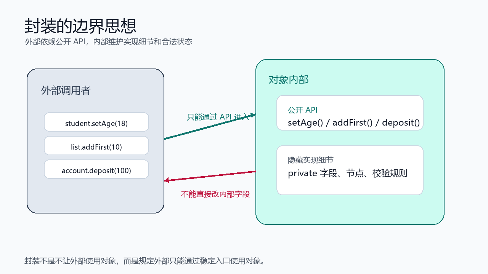
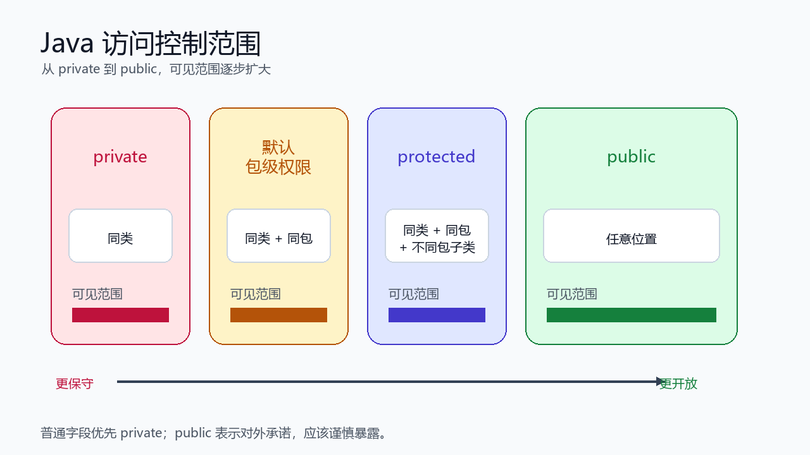
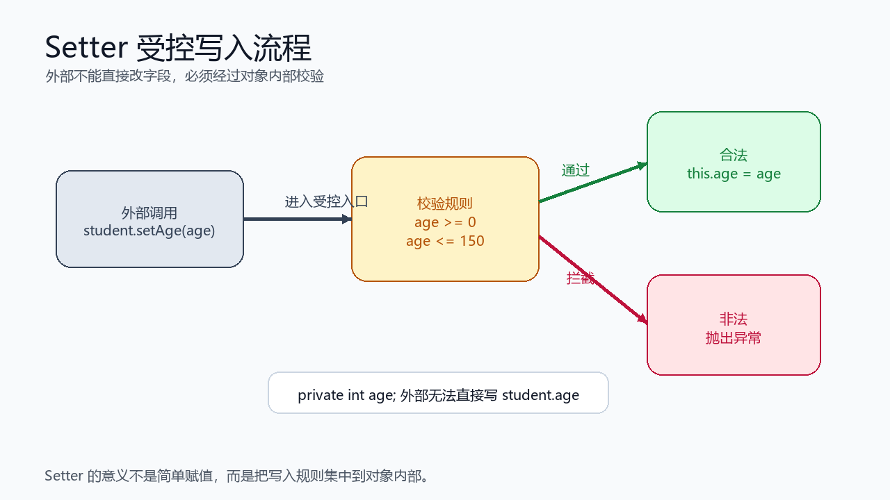
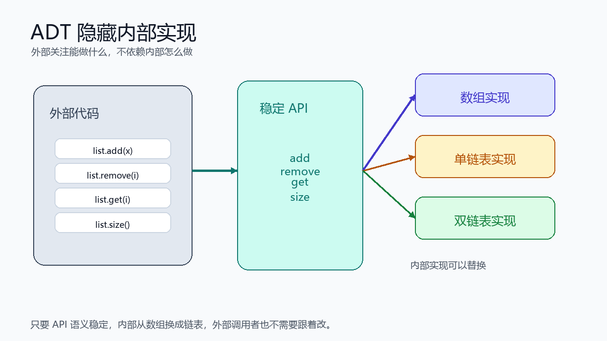

> [!info] 知识摘要
> **总结**
> - 封装不只是把字段改成 `private`，而是让对象维护合法状态，并通过稳定 API 暴露必要能力。
> - 本篇围绕访问控制、Getter / Setter、数据不变式、模块边界和 API 设计理解封装的价值。
>
> **文章元信息**
> - 更新时间：2026-05-17
> - 系列定位：Java 基础语言第 05 篇
> - 适合读者：已理解类、对象、字段、方法和构造方法，准备继续学习面向对象设计基础的初学者
> - 前置知识：建议先理解类与对象、实例字段、成员方法、构造方法和 `this`
>
> **相关知识点**
> - 封装、`private`、访问控制、Getter、Setter、数据不变式、API、对象状态

---

## 一、先建立封装的整体认知

### 1.1 封装不只是 private

很多初学者会把封装理解成一句话：把字段设为 `private`，再生成 Getter / Setter。

这个理解只说到了封装的一小部分。更准确地说，封装的目标是：

- 隐藏对象内部实现细节。
- 限制外部代码直接修改内部状态。
- 对外提供稳定、可控的访问方式。
- 让对象自己维护合法状态。

可以先记住一句话：

```text
外部只依赖公开 API，不依赖内部实现。
```



类内部可以有字段、辅助方法、节点结构、缓存字段等实现细节。外部代码不应该随便依赖这些细节，而应该通过公开方法和对象交互。

封装保护的不只是数据本身，也包括对象背后的行为语义。比如 `setAge()` 表面上是修改年龄，但它也可能包含校验、日志、事件通知或缓存刷新。外部只调用 `setAge()`，不需要知道内部具体做了哪些事情。

**💡 核心结论：** 封装的重点不是“藏起来”本身，而是通过清晰边界控制对象如何被使用、如何保持合法状态，并保持行为逻辑的完整性。

### 1.2 封装解决的是对象状态失控问题

如果一个类把字段全部公开，外部代码就可以随意修改对象状态。

**✅ 字段公开导致状态失控示例**

```java
public class Student {
    public int age;
}
```

外部可以这样写：

```java
Student student = new Student();
student.age = -100;
```

从 Java 语法上看，`-100` 可以赋给 `int`。但从业务含义上看，年龄为负数明显不合理。

如果所有地方都能直接修改 `age`，那么校验规则就会分散在外部代码里。项目越大，越难保证每次修改都是合法的。

不过这里讨论的是**有业务规则的对象**。如果一个类只是纯粹的数据载体，没有状态规则和行为逻辑，公开字段不一定总是错误，后面会单独说明。

---

## 二、为什么需要封装

### 2.1 不封装会让对象状态被随意破坏

假设我们有一个计数器：

**✅ 不封装的 Counter 示例**

```java
public class Counter {
    public int value;
}
```

外部代码可以随便改：

```java
Counter counter = new Counter();
counter.value = -999;
```

如果计数器的规则是“只能从 0 开始递增”，那上面的写法就破坏了对象状态。

封装后的写法应该把字段藏起来，只提供符合规则的操作。

**✅ 封装后的 Counter 示例**

```java
public class Counter {
    private int value;

    public void increment() {
        value++;
    }

    public int getValue() {
        return value;
    }
}
```

这时外部不能直接给 `value` 乱赋值，只能通过 `increment()` 让计数器按规则变化。

### 2.2 封装让校验逻辑集中在对象内部

再看 `Student` 的年龄字段。

**✅ 使用 Setter 维护合法年龄示例**

```java
public class Student {
    private int age;

    public void setAge(int age) {
        if (age < 0 || age > 150) {
            throw new IllegalArgumentException("age invalid");
        }
        this.age = age;
    }

    public int getAge() {
        return age;
    }
}
```

这里的 `IllegalArgumentException` 是 Java 标准库里表示“参数不合法”的运行时异常。异常机制会在后面的异常处理章节系统讲，本篇先把它当成一种“发现非法输入就立刻阻止”的写法。

外部调用：

```java
Student student = new Student();
student.setAge(18);
```

如果传入非法年龄，问题会在 `setAge()` 内部被拦住。外部不需要每次都重复写校验逻辑。

| 写法 | 状态控制 | 后续维护 |
| --- | --- | --- |
| 字段公开 | 外部随便改，容易失控 | 修改规则分散，难排查 |
| 字段私有，方法控制 | 对象自己校验和修改 | 修改规则集中，容易维护 |

**💡 核心结论：** 封装可以把对象状态变化的入口集中起来，让对象自己守住规则，而不是把规则散落到各处调用代码里。

### 2.3 简单数据载体可以有不同选择

封装不是要求所有 Java 类都必须写成“字段 `private` + Getter / Setter”。真实项目里还有一类对象，它们的主要职责只是传输数据，比如 DTO、请求对象、响应对象、配置映射类。

**✅ 简单 DTO 示例**

```java
public class UserDto {
    public String name;
    public int age;
}
```

这种类通常没有复杂业务规则，只是把数据从一层传到另一层。如果团队约定清楚，直接公开字段可以减少样板代码。

现代 Java 还提供了 `record`，用于更简洁地表达不可变数据载体。

**✅ record 数据载体示例**

```java
public record UserDto(String name, int age) {
}
```

`record` 会自动生成构造方法和访问方法，访问时不是 `getName()`，而是：

```java
UserDto user = new UserDto("Tom", 18);
System.out.println(user.name());
```

| 场景 | 推荐思路 |
| --- | --- |
| 有业务规则的领域对象 | 优先隐藏字段，通过方法维护状态 |
| 简单 DTO / 请求响应对象 | 可以按团队规范选择公开字段、Getter / Setter 或 `record` |
| 不可变数据载体 | 优先考虑 `record` 或 `private final` 字段 |

**💡 核心结论：** 封装不是机械套模板，而是先判断对象有没有行为规则和状态约束，再选择合适的暴露方式。

---

## 三、访问控制修饰符：谁能访问谁

### 3.1 四种访问范围总览

Java 常见访问控制有四种：`private`、默认包级权限、`protected`、`public`。

| 修饰符 | 同类 | 同包 | 不同包子类 | 任意位置 |
| --- | --- | --- | --- | --- |
| `private` | 可以 | 不可以 | 不可以 | 不可以 |
| 默认包级权限 | 可以 | 可以 | 不可以 | 不可以 |
| `protected` | 可以 | 可以 | 可以 | 不可以 |
| `public` | 可以 | 可以 | 可以 | 可以 |

默认包级权限指的是：不写 `public`、`private`、`protected`。

**✅ 包级权限示例**

```java
class ListNode {
    int item;
    ListNode next;
}
```

这里 `ListNode` 没有写 `public`，它只能在同一个包内使用，包外代码不能直接访问。



### 3.2 private：隐藏内部实现

`private` 只能在当前类内部访问，常用于字段和内部辅助方法。

**✅ private 字段示例**

```java
public class BankAccount {
    private double balance;

    public void deposit(double amount) {
        if (amount <= 0) {
            throw new IllegalArgumentException("amount invalid");
        }
        balance += amount;
    }

    public double getBalance() {
        return balance;
    }
}
```

外部不能直接写：

```java
// account.balance = -1000; // 编译错误
```

这可以防止外部代码绕过规则，直接制造非法余额。

### 3.3 public：对外承诺的 API

`public` 表示任意位置都可以访问。它通常用于类对外公开的方法、常量或真正需要外部使用的类型。

但 `public` 不应该随便加。一个成员一旦公开，就可能被其他代码依赖，后续再修改就会影响调用者。

**✅ public 方法作为 API 示例**

```java
public class BankAccount {
    private double balance;

    public void deposit(double amount) {
        if (amount <= 0) {
            throw new IllegalArgumentException("amount invalid");
        }
        balance += amount;
    }
}
```

这里 `deposit()` 是外部可以使用的能力，它构成了 `BankAccount` 对外承诺的一部分。

### 3.4 protected：主要服务继承设计

`protected` 的规则比很多初学者想象中更宽：同包可见，不同包的子类也可见。

它适合在继承体系中给子类保留扩展点，但不适合作为普通字段的默认选择。

**✅ protected 方法示例**

```java
public class Animal {
    protected void breathe() {
        System.out.println("breathing");
    }
}
```

如果当前还没有明确的继承设计，通常不要为了“方便访问”随手使用 `protected`。大部分普通字段优先考虑 `private`。

### 3.5 包级权限：隐藏包内协作细节

包级权限适合包内部使用的辅助类。

**✅ 包内节点类示例**

```java
class ListNode {
    int item;
    ListNode next;

    ListNode(int item, ListNode next) {
        this.item = item;
        this.next = next;
    }
}
```

如果 `ListNode` 只是链表内部实现的一部分，就没有必要暴露给包外代码。包外只需要使用 `SList` 提供的方法，不需要知道节点类怎么写。

> ⚠️ **误区：为了方便，把所有成员都设成 public**
>
> **正确理解：** `public` 是对外承诺，不是调试快捷方式。公开得越多，外部依赖越多，后续修改实现的成本越高。

---

## 四、Getter / Setter：不是机械生成

### 4.1 Getter 用于受控读取

Getter 用于让外部读取对象状态。

**✅ Getter 示例**

```java
public class Student {
    private int age;

    public int getAge() {
        return age;
    }
}
```

`getAge()` 看起来只是返回字段，但它的意义是：外部不直接依赖字段本身，而是依赖这个公开方法。

后续如果内部存储方式改变，只要 `getAge()` 的返回语义不变，外部调用代码就可以尽量少受影响。

### 4.2 Setter 用于受控写入

Setter 用于修改对象状态，但它不应该只是简单赋值。

**✅ Setter 校验示例**

```java
public class Student {
    private int score;

    public void setScore(int score) {
        if (score < 0 || score > 100) {
            throw new IllegalArgumentException("score invalid");
        }
        this.score = score;
    }
}
```

这个 Setter 的价值在于：任何分数修改都必须经过范围校验。



### 4.3 不是所有字段都需要 Setter

如果一个字段不应该被外部修改，就不要提供 Setter。

**✅ 只读属性示例**

```java
public class Student {
    private final String id;

    public Student(String id) {
        this.id = id;
    }

    public String getId() {
        return id;
    }
}
```

这里 `id` 创建后不允许改变，所以只提供 Getter，不提供 Setter。

### 4.4 Getter 返回可变对象时要谨慎

如果字段是可变对象，直接返回可能会破坏封装。

**✅ 直接返回内部数组的风险**

```java
public class Team {
    private String[] members = {"Tom", "Jerry"};

    public String[] getMembers() {
        return members;
    }
}
```

外部拿到 `members` 后，可以直接修改数组元素：

```java
String[] members = team.getMembers();
members[0] = "Hacker";
```

这相当于绕过了 `Team` 的控制，直接修改内部状态。更稳妥的方式是返回副本，或者只提供受控查询方法。

**✅ 返回副本示例**

```java
public String[] getMembers() {
    String[] copy = new String[members.length];

    for (int i = 0; i < members.length; i++) {
        copy[i] = members[i];
    }

    return copy;
}
```

返回副本不是唯一方案，它的优点是外部改副本不会影响原对象，但代价也很明显：每次调用都会创建新数组并复制元素。如果数组很大、调用很频繁，就会有额外的内存分配和复制开销。

另一种方式是不要把整个内部对象返回出去，只提供受控查询方法。

**✅ 提供受控查询方法示例**

```java
public int getMemberCount() {
    return members.length;
}

public String getMember(int index) {
    return members[index];
}
```

这种写法不会暴露内部数组，调用者只能按你提供的方法读取数据。如果以后内部从数组换成别的结构，只要公开方法的语义不变，外部代码就不用跟着改。

| 方案 | 优点 | 代价或注意点 |
| --- | --- | --- |
| 直接返回内部数组 | 简单、无额外开销 | 外部可以绕过对象修改内部状态 |
| 返回副本 | 外部修改不会影响原对象 | 有复制开销，调用者修改副本不会改原对象 |
| 提供受控查询方法 | 不暴露内部结构，边界清楚 | 需要额外设计方法 |

选择哪种方式取决于场景：如果更看重隔离性，返回副本；如果更看重边界清晰，提供受控查询方法；如果确实允许外部修改，就应该提供明确的修改方法，而不是偷偷暴露内部对象。

> ⚠️ **误区：生成 Getter / Setter 就等于完成封装**
>
> **正确理解：** Getter / Setter 只是封装的一种手段。真正的封装要看外部是否被限制在合理 API 内，写入是否受控，内部状态是否不容易被破坏。

---

## 五、数据不变式：对象始终要满足的规则

### 5.1 什么是不变式

不变式可以理解为：对象在任何正常时刻都应该满足的规则。

常见例子：

| 对象            | 不变式示例                   |
| ------------- | ----------------------- |
| `Student`     | 年龄不能为负数，分数必须在 `0 ~ 100` |
| `Counter`     | 计数值不能小于 0               |
| `SList`       | `size` 必须等于节点数量         |
| `Stack`       | 栈顶位置必须在有效范围内            |
| `BankAccount` | 余额不能因为非法操作变成异常状态        |

封装的核心价值之一，就是帮助对象维护这些不变式。

### 5.2 不变式被破坏会让错误变得难查

以链表为例，如果 `size` 是公开字段，外部可以随便改：

**✅ 链表 size 被破坏示例**

```java
public class SList {
    public ListNode head;
    public int size;
}
```

外部代码：

```java
SList list = new SList();
list.size = -1;
```

这会让链表进入一个不合理状态。更麻烦的是，错误可能不会立刻暴露，而是在后续调用 `size()`、遍历或删除节点时才出现。

### 5.3 让所有状态变化经过对象自己的方法

封装后的链表应该把关键字段设为私有，并通过方法维护状态。

**✅ 封装后维护 size 的示例**

```java
public class SList {
    private ListNode head;
    private int size;

    public int size() {
        return size;
    }

    public void addFirst(int item) {
        head = new ListNode(item, head);
        size++;
    }
}
```

这样一来，外部无法直接把 `size` 改成负数，也无法随意改 `head` 破坏链表结构。

**💡 核心结论：** 不变式是对象的底线；封装让对象状态只能通过受控方法变化，从而更容易保证对象始终处于合法状态。

---

## 六、模块边界与 API 设计

### 6.1 API 是对外承诺，实现细节应该藏起来

封装不仅发生在一个类内部，也发生在模块边界上。

对外公开的方法、类和行为，可以看成模块的 API。外部代码只应该依赖这些 API，而不是依赖内部字段、节点类、缓存结构或具体算法细节。

| 内容 | 是否应该优先公开 | 原因 |
| --- | --- | --- |
| 稳定业务能力 | 是 | 外部真正需要使用 |
| 字段存储方式 | 否 | 可能会变化 |
| 内部辅助方法 | 否 | 只服务当前实现 |
| 内部节点类 | 否 | 属于数据结构细节 |
| 校验规则入口 | 是 | 外部应该通过它修改状态 |

### 6.2 抽象数据类型关注“能做什么”

抽象数据类型，也就是 ADT，关注的是对象能提供什么操作，而不是内部怎么实现。

以列表为例，对外可以提供：

- `add`
- `remove`
- `get`
- `size`

但内部实现可以有很多种：

- 数组。
- 单链表。
- 双链表。
- 带哨兵节点的链表。

只要 API 不变，外部调用者就不需要关心内部实现怎么换。



### 6.3 好的封装降低耦合

耦合可以简单理解成：一段代码对另一段代码的依赖程度。

如果外部代码直接依赖内部字段：

```java
list.head.next = list.head;
```

那么链表内部结构一改，外部代码就可能全部受影响。

如果外部只依赖公开方法：

```java
list.addFirst(10);
int size = list.size();
```

内部从单链表改成双链表，外部调用代码仍然可能不用改。

**💡 核心结论：** 好的封装会让外部依赖“稳定能力”，而不是依赖“当前实现细节”。

### 6.4 封装也可以选择开放底层接口

隐藏实现细节是默认建议，但不是唯一选择。对于框架、基础库或性能敏感工具类，有时确实需要给高级用户提供更底层的访问能力。

例如链表可以选择公开一个节点类型：

**✅ 开放底层节点类型示例**

```java
public class SList {
    public static class Node {
        public int item;
        public Node next;
    }
}
```

这种设计不是没有封装，而是选择了一个更开放的契约：普通用户仍然使用 `addFirst()`、`size()` 这类稳定 API，高级用户可以在理解风险的前提下访问节点。

关键是文档要说清楚契约。例如：

- `Node` 是底层访问接口，不建议普通业务代码依赖。
- `Node` 可能在后续版本变化，不保证长期兼容。
- 如果外部修改节点关系，调用者需要自己承担破坏结构的风险。

**💡 核心结论：** 封装的本质是控制边界。边界可以保守，也可以开放，但开放时必须把稳定性、责任和风险说清楚。

---

## 七、链表封装示例：从公开字段到稳定 API

### 7.1 不封装的链表问题

下面这种写法把链表内部结构直接暴露给外部。

**✅ 不封装的链表示例**

```java
public class SList {
    public ListNode head;
    public int size;
}

public class ListNode {
    public int item;
    public ListNode next;
}
```

外部可以写：

```java
list.size = -1;
list.head.next = list.head;
```

这会带来几个问题：

- `size` 可能和真实节点数量不一致。
- `head` 可能被改成错误节点。
- 节点之间可能形成异常环。
- 链表类无法保证自己的内部结构正确。

### 7.2 封装后的链表只暴露必要方法

更合理的写法是隐藏节点和关键字段，对外暴露操作。

**✅ 封装后的 SList 示例**

```java
public class SList {
    private ListNode head;
    private int size;

    public void addFirst(int item) {
        head = new ListNode(item, head);
        size++;
    }

    public int getFirst() {
        if (head == null) {
            throw new IllegalStateException("list is empty");
        }
        return head.item;
    }

    public int size() {
        return size;
    }
}
```

内部节点类通常可以不公开：

**✅ 包级节点类示例**

```java
class ListNode {
    int item;
    ListNode next;

    ListNode(int item, ListNode next) {
        this.item = item;
        this.next = next;
    }
}
```

对于普通集合类来说，外部只需要知道 `SList` 可以 `addFirst()`、`getFirst()`、`size()`，不需要知道节点如何连接。如果目标用户是框架开发者或性能敏感场景，也可以额外提供底层遍历接口，但这应该作为清晰标注的高级 API，而不是无意间暴露内部字段。

### 7.3 封装让内部实现可以替换

如果未来发现单链表不适合当前场景，可以把内部实现换成数组或双链表。

只要下面这些公开方法的语义不变：

```java
addFirst(int item)
getFirst()
size()
```

外部调用者就不需要跟着修改。

这就是封装带来的维护价值：**内部实现变化尽量不扩散到外部。**

---

## 八、不可变对象：封装的另一种思路

### 8.1 创建后不允许改变状态

不可变对象创建后状态不能改变。它通常使用 `private final` 字段，并且不提供修改状态的方法。

**✅ 不可变 Point 示例**

```java
public final class Point {
    private final int x;
    private final int y;

    public Point(int x, int y) {
        this.x = x;
        this.y = y;
    }

    public int getX() {
        return x;
    }

    public int getY() {
        return y;
    }
}
```

这里：

- `private` 防止外部直接访问字段。
- `final` 表示字段只能赋值一次。
- 没有 Setter，所以创建后不能改坐标。
- `final class` 表示这个类不能被继承。

### 8.2 不可变对象更容易推理

不可变对象的好处是状态稳定，不容易被意外修改。

例如：

```java
Point p = new Point(3, 5);
```

只要 `Point` 设计正确，`p` 表示的点就一直是 `(3, 5)`。其他代码拿到这个对象，也不能偷偷改掉它的坐标。

不可变对象不是所有场景都必须用，但它是封装思想的一种常见实践：不让外部破坏状态，也不提供改变状态的入口。

---

## 九、常见错误排查表

| 常见问题 | 错误写法或表现 | 正确理解 |
| --- | --- | --- |
| 以为 `private` 就是封装全部 | 字段私有但 Setter 随便赋值 | 封装还要控制状态变化和维护规则 |
| 业务对象字段随意 `public` | `student.age = -100` | 有状态规则的对象应该通过方法控制修改 |
| Getter / Setter 全部机械生成 | 每个字段都有无校验 Setter | 只暴露真正需要的读写能力 |
| Setter 不做校验 | `this.score = score` | 写入入口应该负责合法性检查 |
| 直接返回内部可变对象 | `return members;` | 外部可能绕过对象直接改内部状态 |
| 无契约地公开内部节点类 | `public class ListNode` | 如果要开放底层接口，要说明稳定性和风险 |
| 滥用 `protected` | 想让别人访问就写 `protected` | `protected` 主要服务继承设计，不是普通公开方式 |
| 无说明地暴露实现细节 | `getHeadNode()` | 如果要开放高级能力，要把稳定性和风险写进契约 |

---

## 十、本篇先不展开哪些内容

为了保持这一篇聚焦封装，下面这些内容先不深入展开：

| 内容 | 为什么不在本文展开 |
| --- | --- |
| 继承中的 `protected` 细节 | 需要结合继承和 `super` 系统讲 |
| 接口与抽象类 | 属于抽象能力设计，后续单独展开 |
| 深拷贝与浅拷贝 | 需要结合对象图、数组和可变对象继续讲 |
| JavaBean 规范 | 和 Getter / Setter 有关，但不是封装本身的核心 |
| 线程安全 | 不可变对象会涉及线程安全，但这里先不展开并发 |
| 复杂 API 设计原则 | 会在软件工程与测试章节继续补充 |

---

## 总结

这一篇主要讲清楚了 Java 面向对象中的封装：

| 模块 | 需要掌握的核心点 |
| --- | --- |
| 封装核心 | 外部依赖公开 API，不依赖内部实现 |
| 访问控制 | `private` 隐藏内部，`public` 暴露能力，包级权限隐藏包内细节 |
| Getter / Setter | 不是机械生成，而是控制读取、写入和校验 |
| 数据载体 | DTO、请求响应对象和 `record` 可以按场景采用更轻量的暴露方式 |
| 数据不变式 | 对象始终应该满足的合法状态规则 |
| 模块边界 | 对外公开少量稳定接口，对内隐藏复杂实现 |
| 工程权衡 | 返回副本、受控查询、开放底层接口都要权衡安全性、性能和语义 |
| ADT | 关注“能做什么”，不暴露“内部怎么做” |
| 链表封装 | 普通集合类通常隐藏 `head`、`size`、节点类，提供稳定操作方法 |
| 不可变对象 | 创建后状态不变，是封装思想的一种实践 |

**💡 最后记住一句话：** 封装不是把字段藏起来这么简单，而是让对象通过清晰 API 管理自己的状态和行为语义；具体边界怎么划，要结合安全性、性能、稳定性和使用场景做取舍。
