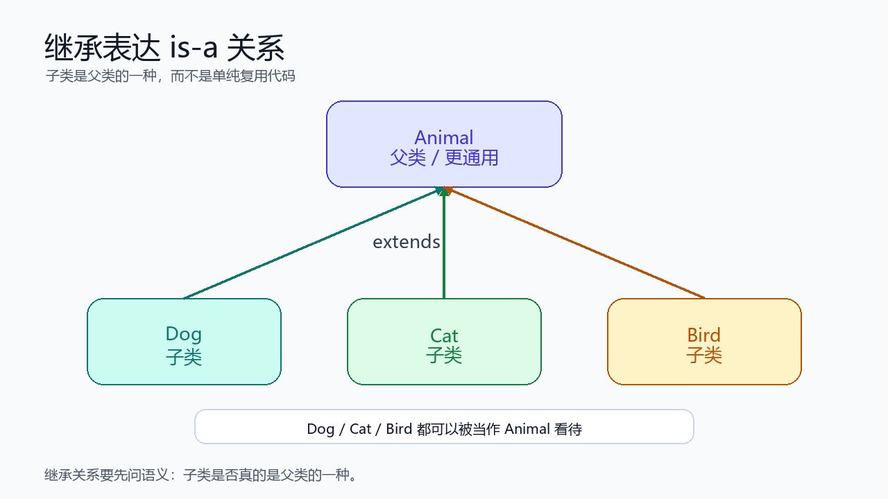
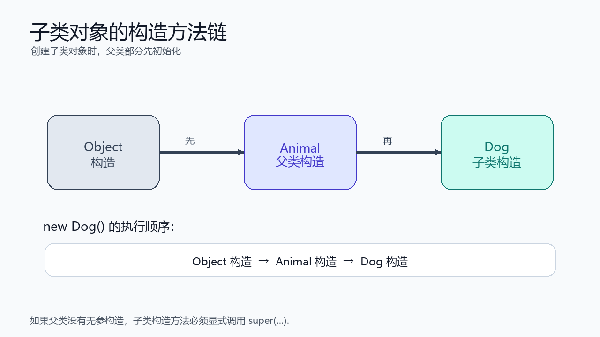
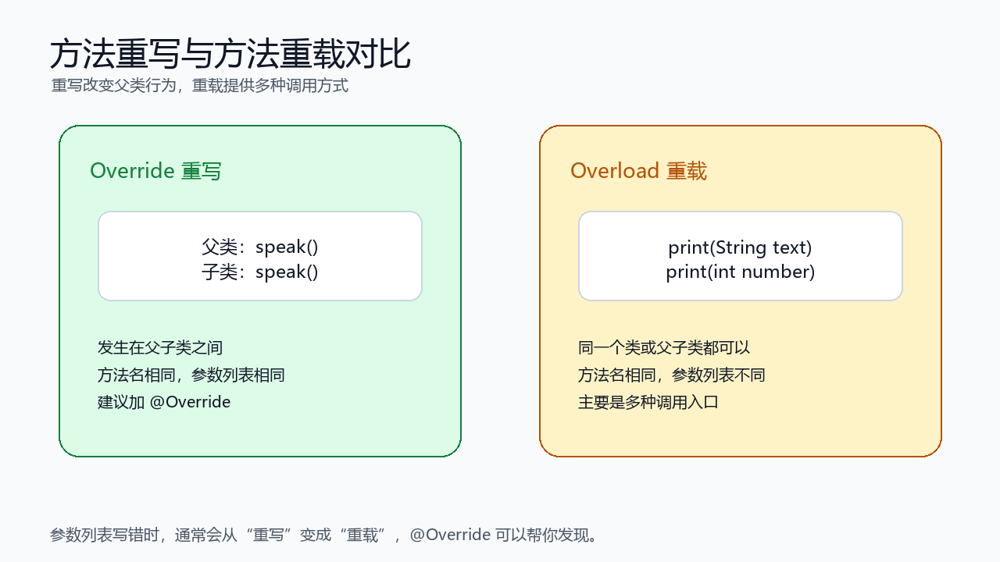
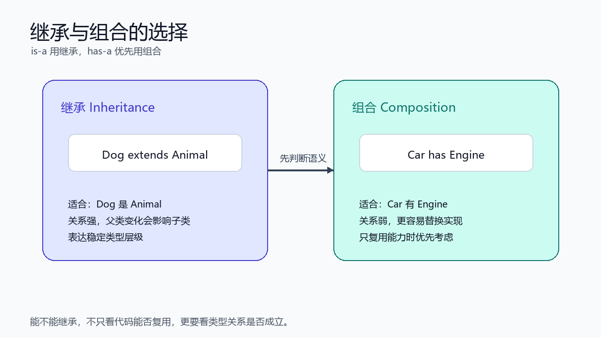

> [!info] 知识摘要
> **总结**
> - 继承表达的是 `is-a` 关系，不只是为了复用代码；滥用继承会让类结构越来越难维护。
> - 本篇从 `extends` 讲到父类与子类、`super`、构造方法链、方法重写、`Object`、`final` 和继承风险。
>
> **文章元信息**
> - 更新时间：2026-05-28
> - 系列定位：Java 基础语言第 06 篇
> - 适合读者：已理解类、对象和封装，准备继续学习继承关系的初学者
> - 前置知识：建议先理解类与对象、构造方法、成员方法、访问控制和封装
>
> **相关知识点**
> - 继承、`extends`、父类、子类、`super`、构造方法链、方法重写、`Object`、`final`、组合

---

## 一、先建立继承的整体认知

### 1.1 继承表达的是 is-a 关系

继承用于表达类之间的“is-a”关系，也就是“子类是父类的一种”。

例如：

- 狗是一种动物。
- 猫是一种动物。
- 学生是一种人。

在 Java 中，继承使用 `extends` 关键字。

**✅ 继承基本语法示例**

```java
public class Animal {
    String name;

    void eat() {
        System.out.println(name + " is eating");
    }
}

public class Dog extends Animal {
    void bark() {
        System.out.println(name + " is barking");
    }
}
```

这里：

| 角色           | 类名                   | 含义                 |
| ------------ | -------------------- | ------------------ |
| 父类 / 超类 / 基类 | `Animal`             | 更通用的类型             |
| 子类 / 派生类     | `Dog`                | 更具体的类型             |
| 关系           | `Dog extends Animal` | `Dog` 是一种 `Animal` |



### 1.2 继承不是单纯为了复用代码

继承确实可以复用父类字段和方法，但这不是它唯一的判断标准。

如果两个类只是有一些重复代码，并不代表它们就应该是父子关系。

例如：

```text
Car 有 Engine
```

这不是“车是一种发动机”，而是“车拥有一个发动机”。这种关系更适合用组合。

**✅ 组合示例**

```java
public class Engine {
    void start() {
        System.out.println("engine start");
    }
}

public class Car {
    private Engine engine = new Engine();

    public void start() {
        engine.start();
    }
}
```

| 关系 | 示例 | 更适合的建模方式 |
| --- | --- | --- |
| is-a | `Dog` 是 `Animal` | 继承 |
| has-a | `Car` 有 `Engine` | 组合 |
| can-do | 一个类能比较大小、能关闭资源 | 接口 |

**💡 核心结论：** 继承首先表达类型关系，其次才是代码复用。只为复用代码而继承，往往会制造错误模型。

---

## 二、子类到底继承了什么

### 2.1 子类可以复用父类的可访问成员

子类可以使用父类中可访问的字段和方法。

**✅ 子类使用父类成员示例**

```java
public class Animal {
    protected String name;

    public void eat() {
        System.out.println(name + " is eating");
    }
}

public class Dog extends Animal {
    public void play() {
        eat();
        System.out.println(name + " is playing");
    }
}
```

这里 `Dog` 可以访问 `Animal` 中的 `eat()` 方法，也可以访问 `protected` 修饰的 `name` 字段。

不过从封装角度看，字段通常不建议轻易设为 `protected`。如果父类字段有维护规则，更稳妥的方式是提供受控方法。

### 2.2 private 成员不能被子类直接访问

父类的 `private` 成员对子类不可直接访问。

**✅ private 成员不可直接访问示例**

```java
public class Animal {
    private String name;

    public String getName() {
        return name;
    }
}

public class Dog extends Animal {
    public void printName() {
        // System.out.println(name); // 编译错误
        System.out.println(getName());
    }
}
```

这里 `Dog` 不能直接访问父类的 `private name`，但可以通过父类提供的 `public getName()` 间接读取。

要注意：子类对象中确实包含父类那部分状态，只是 `private` 成员不能被子类代码直接访问。

### 2.3 构造方法不能被继承

子类不会继承父类构造方法。

**✅ 构造方法不会被继承示例**

```java
public class Animal {
    public Animal(String name) {
    }
}

public class Dog extends Animal {
    public Dog(String name) {
        super(name);
    }
}
```

`Animal(String name)` 不会自动变成 `Dog(String name)`。如果子类也需要对应构造方法，就要在子类中自己写，并调用父类构造方法完成父类部分初始化。

| 成员类型 | 子类是否能直接使用 |
| --- | --- |
| `public` 字段 / 方法 | 能 |
| `protected` 字段 / 方法 | 能，但要谨慎设计 |
| 默认包级成员 | 同包子类能，不同包子类不能直接访问 |
| `private` 字段 / 方法 | 不能直接访问 |
| 构造方法 | 不能被继承 |

---

## 三、super 关键字与构造方法链

### 3.1 super 表示父类部分

`super` 可以理解成当前对象中的父类部分。它常见用途有三个：

- 调用父类构造方法。
- 调用父类被重写的方法。
- 访问父类成员。

**✅ super 调用父类构造方法**

```java
public class Animal {
    private String name;

    public Animal(String name) {
        this.name = name;
    }
}

public class Dog extends Animal {
    public Dog(String name) {
        super(name);
    }
}
```

这里 `super(name)` 表示调用父类 `Animal` 的构造方法，先完成父类部分的初始化。

### 3.2 super(...) 必须放在构造方法第一行

如果子类构造方法要调用父类构造方法，`super(...)` 必须是第一条语句。

**✅ super 必须在第一行**

```java
public class Dog extends Animal {
    public Dog(String name) {
        super(name);
        System.out.println("Dog created");
    }
}
```

下面这种写法会编译失败：

```java
public class Dog extends Animal {
    public Dog(String name) {
        System.out.println("Dog created");
        // super(name); // 编译错误
    }
}
```

原因是：创建子类对象时，必须先初始化父类部分，再初始化子类自己的部分。

### 3.3 如果不写 super，Java 会尝试调用父类无参构造

如果子类构造方法中没有显式写 `super(...)`，Java 会默认尝试调用父类无参构造。

**✅ 默认调用父类无参构造示例**

```java
class Animal {
    Animal() {
        System.out.println("Animal");
    }
}

class Dog extends Animal {
    Dog() {
        System.out.println("Dog");
    }
}
```

执行：

```java
new Dog();
```

输出：

```text
Animal
Dog
```

如果父类没有无参构造，子类就必须显式调用父类已有构造。

**✅ 父类没有无参构造时必须显式调用 super**

```java
class Animal {
    Animal(String name) {
    }
}

class Dog extends Animal {
    Dog(String name) {
        super(name);
    }
}
```



**💡 核心结论：** 创建子类对象时，父类部分一定先初始化。`super(...)` 是子类构造方法把初始化任务交给父类构造方法的入口。

---

## 四、方法重写：子类改变父类行为

### 4.1 什么是方法重写

方法重写指的是：子类提供一个和父类方法签名相同的新实现。

**✅ 方法重写示例**

```java
class Animal {
    void speak() {
        System.out.println("...");
    }
}

class Dog extends Animal {
    @Override
    void speak() {
        System.out.println("wang");
    }
}
```

当 `Dog` 对象调用 `speak()` 时，会执行子类重写后的版本。

```java
Dog dog = new Dog();
dog.speak(); // wang
```

### 4.2 重写方法时建议加 @Override

`@Override` 可以让编译器帮你检查：这个方法是否真的重写了父类方法。

**✅ @Override 帮助发现错误**

```java
class Animal {
    void speak() {
    }
}

class Dog extends Animal {
    @Override
    void speak(String text) { // 编译错误：这不是重写
    }
}
```

这里 `speak(String text)` 的参数列表和父类 `speak()` 不一样，所以它不是重写，而是另一个新方法。加了 `@Override` 后，编译器会直接提醒你。

### 4.3 方法重写的基本规则

方法重写需要遵守这些规则：

| 规则 | 说明 |
| --- | --- |
| 方法名相同 | 子类方法名必须和父类一致 |
| 参数列表相同 | 参数个数、类型、顺序必须一致 |
| 返回值类型兼容 | 可以相同，也可以是协变返回类型 |
| 访问权限不能更严格 | 父类 `public`，子类不能改成 `private` |
| 不能重写 `final` 方法 | `final` 方法不允许被子类改写 |
| 静态方法不是真正重写 | 静态方法属于类，不参与动态方法查找 |

入门阶段先记住：**方法名和参数列表必须一致，访问权限不能缩小，重写时加 `@Override`。**

### 4.4 重写与重载不是一回事

重写和重载名字很像，但含义不同。

| 对比项 | 重写 Override | 重载 Overload |
| --- | --- | --- |
| 发生位置 | 父子类之间 | 同一个类或父子类中都可以 |
| 方法名 | 相同 | 相同 |
| 参数列表 | 必须相同 | 必须不同 |
| 目的 | 子类改变父类行为 | 提供多种调用方式 |
| 是否和多态有关 | 是 | 不是核心关系 |

**✅ 方法重载示例**

```java
public class Printer {
    void print(String text) {
    }

    void print(int number) {
    }
}
```

这里两个 `print` 方法参数不同，所以是重载，不是重写。



> ⚠️ **误区：参数写错也算重写**
>
> **正确理解：** 参数列表不同就是重载，不是重写。为了避免这种错误，重写方法时建议始终加 `@Override`。

---

## 五、调用父类被重写的方法

### 5.1 使用 super.方法名 调用父类版本

有时子类重写方法后，还想复用父类原来的逻辑。这时可以使用 `super.方法名()`。

**✅ super 调用父类方法示例**

```java
class Animal {
    void speak() {
        System.out.println("animal sound");
    }
}

class Dog extends Animal {
    @Override
    void speak() {
        super.speak();
        System.out.println("wang");
    }
}
```

调用：

```java
Dog dog = new Dog();
dog.speak();
```

输出：

```text
animal sound
wang
```

### 5.2 super 和 this 的区别

`this` 表示当前对象，`super` 表示当前对象里的父类部分。

| 写法 | 含义 |
| --- | --- |
| `this.name` | 当前对象的字段 |
| `this.method()` | 当前对象的方法 |
| `super(...)` | 调用父类构造方法 |
| `super.method()` | 调用父类方法 |
| `super.name` | 访问父类可访问字段 |

需要注意：`super` 不是一个独立对象。它只是帮助你访问当前对象中的父类部分。

---

## 六、Object 类：所有类的共同父类

### 6.1 Java 中所有类最终都继承自 Object

如果一个类没有显式写 `extends`，它默认直接继承 `Object`。

```java
public class Student {
}
```

可以理解成：

```java
public class Student extends Object {
}
```

`Object` 是 Java 类继承体系的根。

常见方法包括：

| 方法 | 作用 |
| --- | --- |
| `toString()` | 返回对象的字符串表示 |
| `equals(Object obj)` | 判断两个对象是否相等 |
| `hashCode()` | 返回对象哈希值 |
| `getClass()` | 获取运行时类信息 |

### 6.2 重写 toString 让对象输出更友好

如果不重写 `toString()`，直接打印对象通常会得到类似这样的结果：

```text
Student@1a2b3c4d
```

这对排查问题不友好。

**✅ 重写 toString 示例**

```java
public class Student {
    private String name;
    private int age;

    @Override
    public String toString() {
        return "Student{name='" + name + "', age=" + age + "}";
    }
}
```

之后：

```java
System.out.println(student);
```

会自动调用 `student.toString()`。

### 6.3 equals 用于定义对象相等规则

默认情况下，`Object` 的 `equals()` 行为和 `==` 类似，比较的是两个引用是否指向同一个对象。

如果希望按业务字段判断对象是否相等，就需要重写 `equals()`。

**✅ 重写 equals 和 hashCode 示例**

```java
import java.util.Objects;

public class Student {
    private int id;
    private String name;

    @Override
    public boolean equals(Object obj) {
        if (this == obj) {
            return true;
        }
        if (!(obj instanceof Student)) {
            return false;
        }
        Student other = (Student) obj;
        return this.id == other.id;
    }

    @Override
    public int hashCode() {
        return Objects.hash(id);
    }
}
```

这里用 `id` 判断两个学生是否是同一个业务对象。

> ⚠️ **误区：只重写 equals，不重写 hashCode**
>
> **正确理解：** 如果两个对象通过 `equals()` 判断相等，它们的 `hashCode()` 也应该相等。否则后面放进 `HashSet`、`HashMap` 这类基于哈希的结构时，可能出现异常行为。

### 6.4 equals 的规则要和业务语义一致

重写 `equals()` 时，不是把所有字段都塞进去就一定正确。到底比较哪些字段，要看业务语义。

例如：

- 学生系统里，`id` 可能是学生唯一标识。
- 商品系统里，`skuId` 可能是商品唯一标识。
- 坐标点里，`x` 和 `y` 都应该参与比较。

**💡 核心结论：** `toString()` 解决“对象怎么展示”，`equals()` 解决“对象怎么算相等”，`hashCode()` 要和 `equals()` 保持一致。

---

## 七、字段隐藏：不建议让父子类字段同名

### 7.1 字段不会像方法一样动态绑定

子类可以定义和父类同名字段，但非常不建议这么做。

**✅ 字段隐藏示例**

```java
class Parent {
    int x = 1;
}

class Child extends Parent {
    int x = 2;
}
```

这时访问哪个 `x`，和引用变量的静态类型有关。

```java
Child child = new Child();
Parent parent = child;

System.out.println(child.x);  // 2
System.out.println(parent.x); // 1
```

这很容易让人误以为字段也有“多态”，但实际上字段没有动态方法查找机制。

### 7.2 需要多态行为时使用方法重写

如果想让子类改变行为，应该重写方法，而不是隐藏字段。

**✅ 用方法重写表达可变行为**

```java
class Parent {
    int getX() {
        return 1;
    }
}

class Child extends Parent {
    @Override
    int getX() {
        return 2;
    }
}
```

这样代码表达更清楚，也能和后续多态机制自然衔接。

**💡 核心结论：** 字段隐藏会让代码难懂，父子类尽量避免同名字段；需要改变行为时，优先使用方法重写。

---

## 八、final：限制继承和重写

### 8.1 final 修饰类：不能被继承

`final` 修饰类时，表示这个类不能被继承。

**✅ final 类示例**

```java
public final class IdCard {
}
```

Java 标准库中的 `String` 就是典型的 `final` 类。这样设计可以避免子类破坏它的不可变语义。

### 8.2 final 修饰方法：不能被重写

`final` 修饰方法时，表示这个方法不能被子类重写。

**✅ final 方法示例**

```java
public class Account {
    public final void close() {
        System.out.println("close account");
    }
}
```

如果某个方法承载了关键流程，父类不希望子类改写，就可以使用 `final`。

### 8.3 final 修饰变量：只能赋值一次

`final` 修饰变量时，表示变量只能赋值一次。

**✅ final 变量示例**

```java
final int maxSize = 100;
```

如果是引用类型变量，`final` 限制的是引用不能重新指向别的对象，不代表对象内部状态一定不能改变。

**✅ final 引用示例**

```java
final int[] scores = {90, 80};
scores[0] = 100; // 可以
// scores = new int[]{100, 90}; // 不可以
```

| 用法 | 含义 |
| --- | --- |
| `final class` | 类不能被继承 |
| `final method` | 方法不能被重写 |
| `final variable` | 变量只能赋值一次 |

---

## 九、继承的风险与工程取舍

>**作者有话说**：第九部分为补充内容，如果是初学者，可以选择直接跳过或简要了解。

### 9.1 继承会带来更强的耦合

继承让子类依赖父类实现。父类一旦变化，子类可能受到影响。

常见风险包括：

- 父类变化影响子类行为。
- 子类破坏父类原本的设计假设。
- 继承层次过深，代码阅读成本增加。
- 为了复用代码而继承，导致类型关系不真实。

比如一个“栈”本来应该限制只能按栈规则操作，但如果它继承了一个更通用的容器，父类公开的方法就可能绕过栈自己的限制，破坏栈的语义。

更深一层的问题是：**继承可能破坏封装**。子类不仅依赖父类公开 API，还可能被迫依赖父类内部是怎么实现的。这类问题常被称为“脆弱的基类”问题。

看一个简化场景：我们想统计一个容器执行了多少次添加操作，于是继承父类并重写添加方法。

**✅ 继承统计添加次数的风险示例**

```java
class ItemBox {
    public void add(String item) {
        System.out.println("add " + item);
    }

    public void addTwo(String first, String second) {
        add(first);
        add(second);
    }
}

public class CountingItemBoxByInheritance extends ItemBox {
    private int addCount = 0;

    @Override
    public void add(String item) {
        addCount++;
        super.add(item);
    }

    @Override
    public void addTwo(String first, String second) {
        addCount += 2;
        super.addTwo(first, second);
    }

    public int getAddCount() {
        return addCount;
    }
}
```

看起来很合理：`add()` 添加 1 次就计数加 1，`addTwo()` 添加 2 次就计数加 2。

但问题在于：父类的 `addTwo()` 内部也会调用 `add()`。如果调用下面代码：

```java
CountingItemBoxByInheritance box = new CountingItemBoxByInheritance();
box.addTwo("A", "B");

System.out.println(box.getAddCount()); // 4
```

你预期 `addCount` 是 `2`，实际却可能变成 `4`：`addTwo()` 自己加了 2 次，父类内部调用 `add()` 又触发子类重写方法，再加 2 次。

这就是继承带来的强耦合：子类作者必须知道父类内部方法之间如何互相调用，才能避免错误。而父类内部实现一旦变化，子类行为也可能跟着变化。这里涉及到“重写方法的运行时调用”，下一篇讲多态时会更系统地展开。

### 9.2 组合通常比继承更灵活

如果只是想复用某个类的能力，而不是表达“子类是父类的一种”，组合通常更合适。

同样是“能计数的容器”，用组合可以把行为控制权收回来。

**✅ 使用组合实现 CountingItemBox**

```java
public class CountingItemBoxByComposition {
    private final ItemBox box = new ItemBox();
    private int addCount = 0;

    public void add(String item) {
        addCount++;
        box.add(item);
    }

    public void addTwo(String first, String second) {
        add(first);
        add(second);
    }

    public int getAddCount() {
        return addCount;
    }
}
```

这里 `CountingItemBoxByComposition` 内部持有一个 `ItemBox`，但不继承它。它自己决定 `add()` 和 `addTwo()` 的计数语义，再把真正的添加操作委托给内部对象。

这样有几个好处：

- 不依赖 `ItemBox.addTwo()` 内部是否调用 `add()`。
- 计数规则完全由 `CountingItemBoxByComposition` 控制。
- 未来内部可以换成别的存储实现，外部调用者不需要知道。
- 可以只暴露自己想公开的方法，而不是继承父类所有公开方法。

| 方案 | 依赖对象 | 风险 |
| --- | --- | --- |
| `CountingItemBoxByInheritance extends ItemBox` | 依赖父类公开 API，也依赖父类内部调用关系 | 父类实现变化可能影响子类 |
| `CountingItemBoxByComposition` 持有 `ItemBox` | 只把父类对象当作内部工具使用 | 行为边界由自己控制 |

这就是“组合比继承更灵活”的核心含义：组合让你复用能力，但不把自己的类型身份绑定到某个具体父类上。



### 9.3 is-a 还要看行为契约是否成立

前面一直说继承表达 is-a 关系，但只靠“名词上像不像”还不够。更可靠的判断是：**子类对象能不能在所有需要父类对象的地方正常使用，并且不破坏父类承诺的行为。**

这个思想就是里氏替换原则的核心精神。

一个经典例子是“正方形是不是矩形”。从数学分类上看，正方形当然是一种矩形。但在面向对象里，如果 `Rectangle` 提供了 `setWidth()` 和 `setHeight()`，问题就来了。

**✅ 正方形继承矩形的行为冲突示例**

```java
class Rectangle {
    protected int width;
    protected int height;

    public void setWidth(int width) {
        this.width = width;
    }

    public void setHeight(int height) {
        this.height = height;
    }
}

class Square extends Rectangle {
    @Override
    public void setWidth(int width) {
        this.width = width;
        this.height = width;
    }

    @Override
    public void setHeight(int height) {
        this.width = height;
        this.height = height;
    }
}
```

为了保持正方形宽高相等，`Square` 重写 `setWidth()` 和 `setHeight()` 时会同时修改两个字段。

但对使用 `Rectangle` 的代码来说，这可能很意外：

```java
void resize(Rectangle rectangle) {
    rectangle.setWidth(5);
    rectangle.setHeight(10);
    // 对普通 Rectangle 来说，width 是 5，height 是 10
}
```

如果传进来的是 `Square`，最后宽和高都会变成 `10`。这说明：虽然“正方形是矩形”在静态分类上没问题，但它不一定适合直接建模成继承关系，因为子类无法自然遵守父类方法的行为语义。

判断继承关系时，可以问几个更具体的问题：

- 子类确实是父类的一种。
- 子类可以在需要父类的位置被使用。
- 父类抽取的是稳定的公共行为。
- 子类重写行为不会破坏父类语义。
- 子类不需要禁用父类的某些公开方法。
- 子类不会让父类方法的结果变得出乎调用者预期。

如果只是为了少写几行重复代码，先考虑组合、工具类、委托或接口。

**💡 核心结论：** 继承是强关系，组合是弱关系。能不能继承，不只看代码能否复用，也不只看名词分类是否成立，更要看子类能不能遵守父类的行为契约。

---

## 十、常见错误排查表

| 常见问题 | 错误写法或表现 | 正确理解 |
| --- | --- | --- |
| 只为复用代码而继承 | `Car extends Engine` | 继承表达 is-a，has-a 更适合组合 |
| 继承具体类做统计 | `CountingItemBoxByInheritance extends ItemBox` | 子类可能依赖父类内部调用关系，组合更稳 |
| 只按名词分类判断继承 | `Square extends Rectangle` | 还要看子类能否遵守父类行为契约 |
| 父类没有无参构造，子类忘记 `super(...)` | 子类构造方法编译失败 | 子类必须先完成父类部分初始化 |
| 以为 `private` 成员能直接访问 | 子类直接访问父类私有字段 | `private` 只能在父类内部访问 |
| 重写方法参数写错 | `speak(String text)` | 参数不同是重载，不是重写 |
| 忘记 `@Override` | 重写失败但自己没发现 | 重写方法建议始终加 `@Override` |
| 重写 `equals` 不重写 `hashCode` | 集合行为异常 | 两者应该保持一致 |
| 父子类字段同名 | `parent.x` 和 `child.x` 结果不同 | 字段不参与动态绑定，避免同名 |
| 误用 `final` 引用 | 以为 `final` 数组内容不能变 | `final` 限制引用不能重新赋值，不限制对象内部状态 |

---

## 十一、本篇先不展开哪些内容

为了保持这一篇聚焦继承基础，下面这些内容先不深入展开：

| 内容 | 为什么不在本文展开 |
| --- | --- |
| 多态与动态方法查找 | 下一篇会专门展开编译时类型和运行时类型 |
| 抽象类 | 和继承有关，但需要单独讲抽象方法和模板设计 |
| 接口 | 更适合放在抽象类与接口章节对比 |
| 复杂 `equals` 实现细节 | 涉及继承、对称性、传递性和集合语义 |
| 受检异常重写规则细节 | 后续异常章节再系统讲 |
| 继承中的初始化顺序全部细节 | 可结合内存布局章节继续补充 |

---

## 总结

这一篇主要讲清楚了 Java 继承的基础机制：

| 模块 | 需要掌握的核心点 |
| --- | --- |
| 继承语义 | 继承表达 is-a 关系，不是单纯为了复用代码 |
| `extends` | 子类通过 `extends` 继承父类 |
| 成员继承 | 子类能使用父类可访问成员，但不能直接访问 `private` 成员 |
| 构造方法 | 构造方法不能被继承，子类构造时必须先初始化父类部分 |
| `super` | 用于调用父类构造方法、父类方法或访问父类成员 |
| 方法重写 | 子类用同签名方法改变父类行为，建议加 `@Override` |
| `Object` | 所有类最终继承自 `Object`，常见方法有 `toString`、`equals`、`hashCode` |
| 字段隐藏 | 字段不参与动态绑定，避免父子类字段同名 |
| `final` | 可以限制类被继承、方法被重写或变量重新赋值 |
| 脆弱基类 | 子类可能依赖父类内部实现，父类变化会影响子类 |
| 工程取舍 | 继承是强关系，组合通常更灵活，is-a 还要满足行为契约 |

**💡 最后记住一句话：** 继承应该建立在真实且稳定的行为契约上；当你只是想复用代码，或者子类需要依赖父类实现细节才能正确工作时，优先考虑组合。
