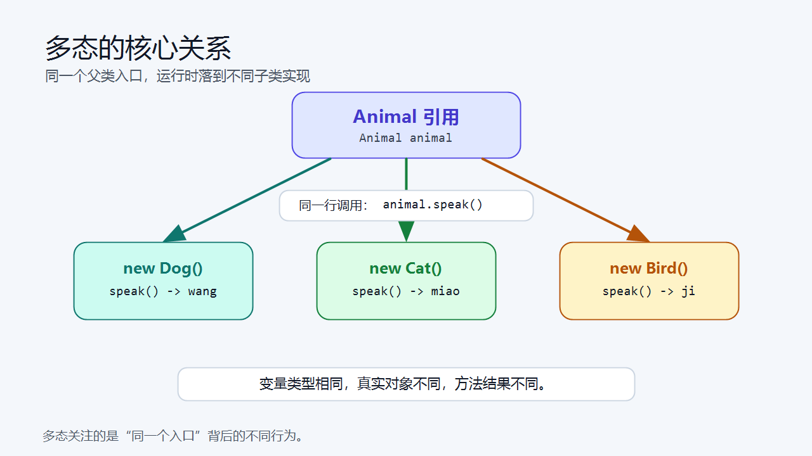
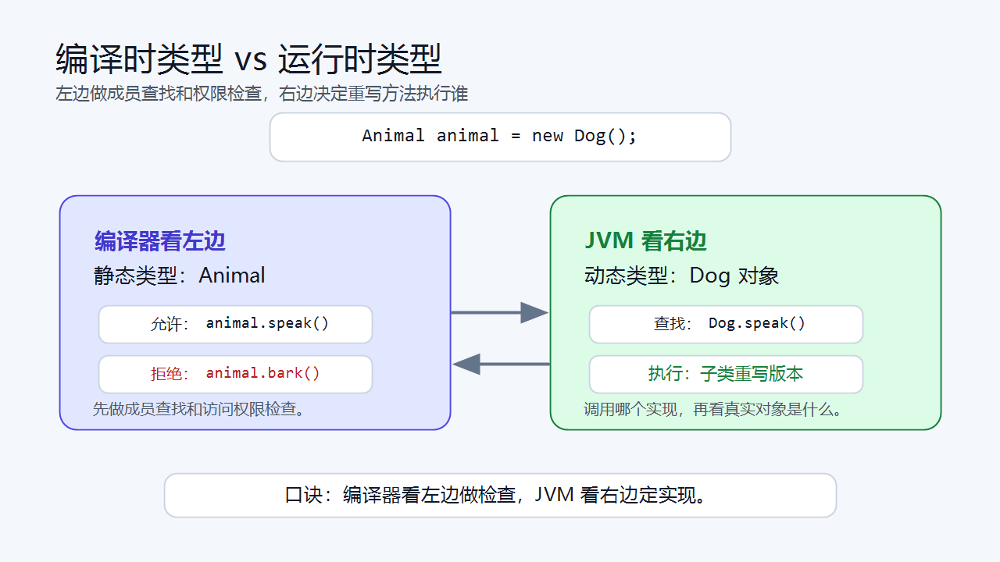
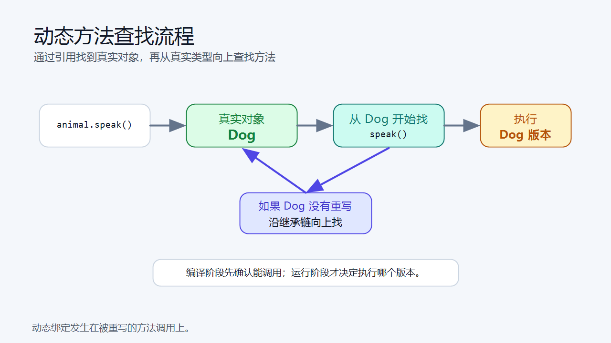
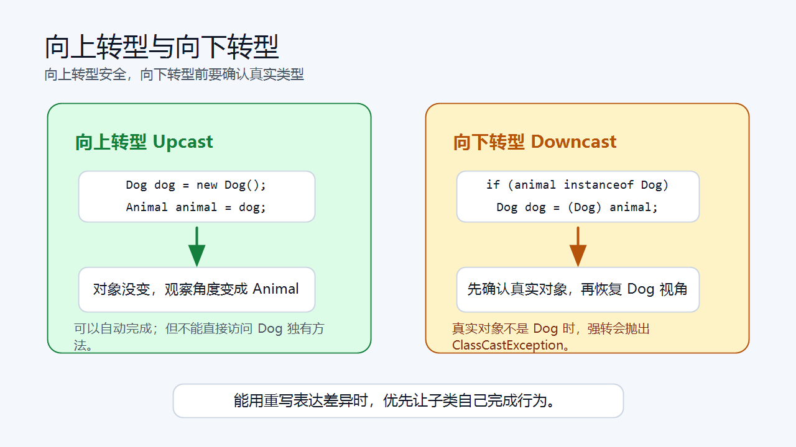

> [!info] 知识摘要
> **总结**
> - 多态关注父类引用指向不同子类对象时，同一个被重写方法在运行时表现出不同结果。
> - 本篇重点区分编译时类型和运行时类型，并解释动态方法查找、向上转型、向下转型和 `instanceof`。
>
> **文章元信息**
> - 更新时间：2026-05-28
> - 系列定位：Java 基础语言第 07 篇
> - 适合读者：已理解继承、方法重写和父子类关系，准备理解动态调用机制的初学者
> - 前置知识：建议先理解继承、方法重写、父类引用、子类对象和类型转换
>
> **相关知识点**
> - 多态、编译时类型、运行时类型、动态方法查找、向上转型、向下转型、`instanceof`、方法重写

---

## 一、先用一句话理解多态

### 1.1 多态的核心含义

多态可以先理解成一句话：

```text
同一个父类引用，指向不同子类对象，调用同一个被重写的方法时，会表现出不同结果。
```

看一个最基础的例子。

**✅ 父类引用指向子类对象示例**

```java
class Animal {
    void speak() {
        System.out.println("...");
    }
}

class Dog extends Animal {
    @Override
    void speak() {
        System.out.println("wang");
    }
}

class Cat extends Animal {
    @Override
    void speak() {
        System.out.println("miao");
    }
}

public class Demo {
    public static void main(String[] args) {
        Animal a1 = new Dog();
        Animal a2 = new Cat();

        a1.speak();
        a2.speak();
    }
}
```

输出结果：

```text
wang
miao
```

这里 `a1` 和 `a2` 的变量类型都是 `Animal`，但它们背后真实指向的对象不同，所以调用同一个 `speak()` 方法时，表现也不同。



### 1.2 多态成立的三个条件

Java 中常见的运行时多态，通常需要满足三个条件：

| 条件 | 说明 |
| --- | --- |
| 有继承或接口实现关系 | 子类和父类之间要有统一类型入口 |
| 子类重写父类方法 | 同一个方法在不同子类中有不同实现 |
| 父类引用指向子类对象 | 例如 `Animal animal = new Dog();` |

**💡 核心结论：** 多态不是“写了继承就自动发生”，而是父类类型的引用在运行时指向不同子类对象，并通过方法重写表现出不同行为。

本文先用父类继承关系讲解多态机制。接口实现同样遵循“编译时看引用类型、运行时看真实对象类型”的规则，下一篇讲抽象类与接口时会继续展开。

---

## 二、编译时类型与运行时类型

### 2.1 一行代码里有两个类型

理解多态，最关键的是看懂这行代码：

```java
Animal animal = new Dog();
```

这行代码里有两个类型：

| 概念 | 对应内容 | 由谁关注 | 作用 |
| --- | --- | --- | --- |
| 编译时类型 / 静态类型 | `Animal` | 编译器 | 决定这个变量“能访问哪些成员” |
| 运行时类型 / 动态类型 | `Dog` | JVM | 决定被重写的方法“最终执行哪个版本” |

也就是说：

- 编译器先看 `animal` 被声明成什么类型。
- JVM 运行时再看 `animal` 实际指向哪个对象。



### 2.2 编译器看静态类型：决定能访问哪些成员

假设 `Dog` 有一个自己独有的方法 `bark()`。

**✅ 静态类型限制可调用方法示例**

```java
class Animal {
    void speak() {
        System.out.println("...");
    }
}

class Dog extends Animal {
    @Override
    void speak() {
        System.out.println("wang");
    }

    void bark() {
        System.out.println("dog bark");
    }
}

public class Demo {
    public static void main(String[] args) {
        Animal animal = new Dog();

        animal.speak();
        // animal.bark(); // 编译错误
    }
}
```

为什么 `animal.bark()` 编译失败？

因为编译器只知道 `animal` 是 `Animal` 类型，而 `Animal` 里面没有声明 `bark()` 方法。虽然运行时它实际指向 `Dog` 对象，但编译阶段不能直接把它当成 `Dog` 使用。

这里要说得更准确一点：编译器不是只看“当前类代码里写了什么”，而是从变量的静态类型出发，查找这个类型声明或继承来的可访问成员。

例如：

```java
class Animal {
    protected String tag = "animal";
}

class Dog extends Animal {
}

public class Demo {
    public static void main(String[] args) {
        Dog dog = new Dog();
        System.out.println(dog.tag); // 同包或符合 protected 访问规则时可以访问
    }
}
```

这里 `Dog` 类本身没有显式声明 `tag` 字段，但它继承了 `Animal` 中可访问的 `protected` 字段，所以通过 `Dog` 引用可以访问。这个过程仍然是编译期成员查找和访问权限检查，不是字段多态。

### 2.3 JVM 看动态类型：决定执行哪个实现

虽然编译器用 `Animal` 判断 `animal.speak()` 能不能调用，但真正运行时，JVM 会发现：

```text
animal 这个引用实际指向的是 Dog 对象
```

于是最终执行的是 `Dog` 重写后的 `speak()`。

**💡 核心结论：** 编译时类型决定“这个成员能不能通过编译检查”，运行时类型决定“被重写的方法最终调用哪个实现”。这是理解多态最重要的一句话。

---

## 三、动态方法查找：为什么执行子类方法

### 3.1 动态方法查找的基本流程

动态方法查找指的是：程序运行时，根据对象真实类型去查找应该执行哪个方法。

可以把流程理解成：

```text
根据引用找到对象
-> 查看对象的真实类型
-> 从真实类型开始查找方法
-> 找不到再沿着继承链向父类查找
-> 找到后执行对应方法
```

例如：

```java
Animal animal = new Dog();
animal.speak();
```

执行过程是：

| 阶段 | 发生了什么 |
| --- | --- |
| 编译阶段 | 编译器确认 `Animal` 中有 `speak()`，所以允许调用 |
| 运行阶段 | JVM 发现真实对象是 `Dog` |
| 方法查找 | JVM 从 `Dog` 类开始找 `speak()` |
| 最终执行 | 找到 `Dog.speak()`，执行子类版本 |



正常从源码编译的程序里，只要编译器允许调用，继承链中就应该有对应方法声明。如果运行时仍然找不到可执行的方法实现，通常说明类文件版本不一致，或者抽象方法没有被正确实现，这类罕见问题可能表现为 `NoSuchMethodError` 或 `AbstractMethodError`。

### 3.2 多态数组：同一静态类型保存不同对象

多态数组的直接表现是：可以用同一种父类类型保存一组不同子类对象。

**✅ 多态数组示例**

```java
Animal[] animals = {
    new Dog(),
    new Cat()
};

for (Animal animal : animals) {
    animal.speak();
}
```

输出：

```text
wang
miao
```

循环中变量 `animal` 的静态类型一直是 `Animal`，但每一次实际指向的对象可能是 `Dog`，也可能是 `Cat`。所以同一行 `animal.speak()` 会执行不同实现。

### 3.3 多态参数：父类形参接收子类实参

除了数组，方法参数也经常使用多态。

**✅ 多态参数示例**

```java
static void makeSound(Animal animal) {
    animal.speak();
}

public static void main(String[] args) {
    makeSound(new Dog());
    makeSound(new Cat());
}
```

`makeSound` 的形参静态类型是 `Animal`。调用时，`new Dog()` 和 `new Cat()` 都可以向上转型成 `Animal` 传入；进入方法后，`animal.speak()` 再按真实对象动态绑定。

**💡 核心结论：** 参数声明为 `Animal` 时，传入的 `Dog`、`Cat` 会先按 `Animal` 接收；真正调用被重写方法时，再按真实对象决定执行结果。

### 3.4 多态返回值：父类返回类型承接子类对象

方法返回值也可以使用父类类型。

**✅ 多态返回值示例**

```java
static Animal createAnimal(String type) {
    if ("dog".equals(type)) {
        return new Dog();
    }
    return new Cat();
}
```

调用方拿到的是 `Animal`：

```java
Animal animal = createAnimal("dog");
animal.speak();
```

这说明返回值声明为 `Animal` 时，方法内部仍然可以返回 `Dog` 或 `Cat` 对象。调用方拿到的静态类型是 `Animal`，运行时对象的真实类型由方法内部决定。

---

## 四、向上转型：把子类当作父类使用

### 4.1 什么是向上转型

向上转型指的是：把子类对象赋给父类引用。

**✅ 向上转型示例**

```java
Dog dog = new Dog();
Animal animal = dog;
```

也可以直接写成：

```java
Animal animal = new Dog();
```

这种写法是自动完成的，不需要强制类型转换。因为 `Dog` 本来就是一种 `Animal`，把更具体的类型当成更通用的类型使用是安全的。

### 4.2 向上转型后的访问范围会变窄

向上转型后，对象本身没有变，变的是“引用变量的观察角度”。

```java
Animal animal = new Dog();
```

此时真实对象仍然是 `Dog`，但你只能通过 `Animal` 这个类型中声明过的成员去使用它。

| 内容 | 是否能通过 `animal` 直接访问 |
| --- | --- |
| `Animal` 中声明的字段或方法 | 可以 |
| `Dog` 重写的 `Animal` 方法 | 可以，运行时执行 `Dog` 版本 |
| `Dog` 独有方法 | 不可以，除非向下转型 |

这也是为什么父类引用不能直接调用子类独有方法。

### 4.3 向上转型后的两个不变

向上转型只改变引用变量的静态类型，不改变对象本身。

```java
Dog dog = new Dog();
Animal animal = dog;
```

这段代码执行后，有两个点不会变：

| 不变点 | 说明 |
| --- | --- |
| 对象本身不变 | 堆里仍然是同一个 `Dog` 对象 |
| 重写方法的动态绑定不变 | 调用 `animal.speak()` 时，仍然执行 `Dog.speak()` |

变的是引用变量的可见范围：通过 `animal` 只能看到 `Animal` 视角下可访问的成员。

**💡 核心结论：** 向上转型的机制结果是“静态可见范围变窄，对象真实类型不变，重写方法仍按运行时类型执行”。

---

## 五、向下转型与 instanceof

### 5.1 什么是向下转型

向下转型指的是：把父类引用重新转回某个子类类型。

**✅ 向下转型示例**

```java
Animal animal = new Dog();
Dog dog = (Dog) animal;

dog.bark();
```

这里 `animal` 的真实对象确实是 `Dog`，所以可以转成 `Dog`。

但向下转型有风险。

**✅ 错误向下转型示例**

```java
Animal animal = new Cat();
Dog dog = (Dog) animal; // 运行时报错
```

这段代码编译可能通过，但运行时会抛出：

```text
ClassCastException
```

原因很简单：真实对象是 `Cat`，不能强行当成 `Dog` 使用。

### 5.2 使用 instanceof 判断真实类型

向下转型前，通常要先用 `instanceof` 判断对象是否属于某个类型。

**✅ instanceof 判断后再向下转型**

```java
Animal animal = new Dog();

if (animal instanceof Dog) {
    Dog dog = (Dog) animal;
    dog.bark();
}
```

`instanceof` 的含义是：判断左侧对象是否是右侧类型，或者是否是右侧类型的子类型。

几个常见点：

- `animal instanceof Dog` 为 `true`，说明可以安全转成 `Dog`。
- `null instanceof Dog` 的结果是 `false`。
- `instanceof` 只负责判断类型，不会改变对象本身。



### 5.3 instanceof 的使用边界

`instanceof` 适合回答一个很窄的问题：这个父类引用此刻能不能安全转成某个子类。

```java
Animal animal = new Dog();

if (animal instanceof Dog) {
    Dog dog = (Dog) animal;
    dog.bark();
}
```

如果代码确实要调用 `Dog` 独有能力，`instanceof` 就是在向下转型前做类型保护。至于是否应该用它分派每个子类的不同行为，放到第八章再从设计价值角度讨论。

---

## 六、方法有多态，字段没有动态绑定

### 6.1 重写方法会动态绑定

方法重写和动态方法查找，是多态能够成立的关键。

```java
Animal animal = new Dog();
animal.speak(); // 执行 Dog.speak()
```

这里 `speak()` 是方法，且 `Dog` 重写了它，所以运行时会执行子类版本。

### 6.2 字段访问通常看静态类型

字段和方法不一样。字段没有动态方法查找机制。

这和“子类引用可以访问父类中可见的字段”不冲突。子类引用能访问继承来的 `protected` 字段，属于编译期成员查找和访问权限检查；而父子类出现同名字段时，最终取哪个字段，仍然看引用变量的静态类型。

**✅ 字段隐藏示例**

```java
class Parent {
    String name = "parent";
}

class Child extends Parent {
    String name = "child";
}

public class Demo {
    public static void main(String[] args) {
        Child c = new Child();
        Parent p = c;

        System.out.println(c.name);
        System.out.println(p.name);
    }
}
```

输出：

```text
child
parent
```

原因是：

- `c` 的静态类型是 `Child`，所以访问 `Child.name`。
- `p` 的静态类型是 `Parent`，所以访问 `Parent.name`。

这类写法很容易让人误解，所以实际开发中不建议让父子类出现同名字段。

### 6.3 用方法才能获得动态绑定

如果希望通过父类引用拿到子类的差异结果，就要把差异放在可重写的方法里。

**✅ 用方法表达多态行为**

```java
class Parent {
    String getName() {
        return "parent";
    }
}

class Child extends Parent {
    @Override
    String getName() {
        return "child";
    }
}
```

这样通过父类引用调用时，才能得到符合多态预期的结果。

```java
Parent p = new Child();
System.out.println(p.getName()); // child
```

**💡 核心结论：** 多态主要体现在被重写的方法上，不要把字段隐藏当成多态。

---

## 七、重载不是运行时多态的核心

### 7.1 重载选择在编译期决定

重载看的是方法名相同、参数列表不同。

```java
static void test(Animal animal) {
    System.out.println("Animal");
}

static void test(Dog dog) {
    System.out.println("Dog");
}
```

看下面这段调用：

**✅ 重载按静态类型选择示例**

```java
Animal animal = new Dog();
test(animal);
```

输出结果是：

```text
Animal
```

很多初学者会以为真实对象是 `Dog`，所以应该调用 `test(Dog dog)`。但重载方法的调用完全由编译期决定，依据的是引用变量的编译时类型，而不是对象的运行时类型。编译器看到 `animal` 的静态类型是 `Animal`，所以选择 `test(Animal animal)`。

### 7.2 重写和重载要分清

| 对比项 | 方法重写 Override | 方法重载 Overload |
| --- | --- | --- |
| 发生位置 | 父子类之间 | 同一个类或父子类中都可以 |
| 参数列表 | 必须相同 | 必须不同 |
| 绑定时机 | 运行时动态查找 | 编译期决定 |
| 是否体现运行时多态 | 是 | 不是核心 |

> ⚠️ **误区：只要方法名一样就是多态**
>
> **正确理解：** 运行时多态关注的是“父类引用调用被子类重写的方法”。方法重载虽然也是同名方法，但调用哪个重载版本由编译期参数类型决定。

---

## 八、多态的真正价值

### 8.1 降低调用方对具体类的依赖

没有多态时，代码容易写成这样：

```java
static void makeDogSound(Dog dog) {
    dog.speak();
}

static void makeCatSound(Cat cat) {
    cat.speak();
}
```

每新增一个动物类型，就要新增一个方法。

使用多态后：

```java
static void makeSound(Animal animal) {
    animal.speak();
}
```

调用方只依赖 `Animal` 这个统一类型。具体传进来的是 `Dog`、`Cat` 还是后续新增的 `Bird`，由运行时对象自己决定行为。

### 8.2 新增子类时，少改已有代码

假设新增一个 `Bird`：

```java
class Bird extends Animal {
    @Override
    void speak() {
        System.out.println("ji");
    }
}
```

原来的调用方法不需要修改：

```java
makeSound(new Bird());
```

这就是多态带来的扩展性：新增具体类型时，尽量让已有调用逻辑保持稳定。

### 8.3 减少类型判断分支

第五章说过，`instanceof` 可以用来保护向下转型。但如果一段代码把每个子类都拆开判断，往往说明行为差异没有放在合适的位置。

例如：

```java
static void handle(Animal animal) {
    if (animal instanceof Dog) {
        Dog dog = (Dog) animal;
        dog.bark();
    } else if (animal instanceof Cat) {
        Cat cat = (Cat) animal;
        cat.speak();
    }
}
```

这段代码的问题不是 `instanceof` 本身，而是调用方开始认识每一个具体子类。每新增一个子类，调用方就可能要跟着修改。

如果差异行为本来就属于对象自身，更好的方式通常是把它放回子类重写方法中：

```java
static void handle(Animal animal) {
    animal.speak();
}
```

这样调用方只面对 `Animal` 这个抽象入口，具体行为交给运行时对象自己完成。

> ⚠️ **误区：只要用了 instanceof 就是不好的代码**
>
> **正确理解：** `instanceof` 本身不是错误。它适合做必要的类型保护，例如向下转型前的安全检查。真正需要警惕的是：本来可以通过方法重写解决的行为差异，却写成一大串类型判断。

### 8.4 为接口编程打基础

这一篇主要用父类讲多态。其实下面这种写法已经在表达同一个方向：

```java
Animal animal = new Dog();
```

这里变量类型是 `Animal`，真实对象是 `Dog`。调用方更多依赖的是 `Animal` 这层抽象能力，而不是某个具体子类。

后面学习接口和集合时，会看到同样的思想：变量尽量依赖更稳定的抽象类型，真实对象可以是不同实现。所以多态不是一个孤立语法点，它是后续理解抽象类、接口、集合框架、设计模式和可测试代码的基础。

### 8.5 子类应该能替代父类使用

多态能成立，不只靠语法上 `extends` 成功，还要看子类对象能不能在父类出现的位置正常工作。

也就是说，如果一个方法声明接收 `Animal`：

```java
static void makeSound(Animal animal) {
    animal.speak();
}
```

那么传入 `Dog`、`Cat` 或其他 `Animal` 子类时，都不应该破坏这个方法对 `Animal` 行为的基本预期。

这就是里氏替换原则的核心思想：**子类对象应该能够替换父类对象，并保持调用方对父类行为的合理预期。**

如果某个子类虽然语法上继承了父类，但一传进去就让父类方法语义失效，那它就不适合放进这个继承体系里。

**💡 核心结论：** 多态的价值不是炫技，而是让代码面向更稳定的抽象入口，减少对具体实现类的依赖。

---

## 九、常见错误排查表

| 常见问题 | 错误表现 | 正确理解 |
| --- | --- | --- |
| 父类引用直接调用子类独有方法 | `animal.bark()` 编译失败 | 编译器看静态类型，`Animal` 没有的方法不能直接调 |
| 向下转型不判断真实类型 | `Dog dog = (Dog) new Cat();` | 运行时会抛出 `ClassCastException` |
| 把字段隐藏当成多态 | `p.name` 和 `c.name` 结果不同 | 字段没有动态绑定，访问通常看静态类型 |
| 把重载当成运行时多态 | `test(animal)` 调用 `test(Animal)` | 重载由编译期参数类型决定 |
| 重写方法参数写错 | `speak(String text)` | 参数列表不同是重载，不是重写，建议加 `@Override` |
| 滥用 `instanceof` | 每个子类都写一段判断 | 能通过重写方法表达差异时，优先使用多态 |

---

## 十、本篇先不展开哪些内容

为了让这一篇聚焦多态本身，下面这些内容先不深入展开：

| 内容 | 为什么不在本文展开 |
| --- | --- |
| 抽象类 | 下一篇会专门讲 `abstract` 和抽象方法 |
| 接口 | 下一篇会讲 `interface`、`implements` 和面向接口编程 |
| JVM 方法表细节 | 当前只需要理解动态方法查找流程，不展开底层实现 |
| 泛型中的多态边界 | 会放到集合或泛型相关内容中再讲 |
| 复杂设计模式 | 本篇先建立基础，策略模式、回调等后续再展开 |

---

## 总结

这一篇主要讲清楚了 Java 多态的核心机制：

| 模块 | 需要掌握的核心点 |
| --- | --- |
| 多态含义 | 父类引用指向不同子类对象，同一方法表现不同 |
| 成立条件 | 继承或接口实现、方法重写、父类引用指向子类对象 |
| 编译时类型 | 决定变量能访问哪些成员 |
| 运行时类型 | 决定被重写方法最终执行哪个实现 |
| 动态方法查找 | 从对象真实类型开始找方法，找不到再向父类查找 |
| 向上转型 | 子类对象自动当成父类使用，访问范围变成父类视角 |
| 向下转型 | 父类引用转回子类类型，有风险，通常先用 `instanceof` |
| 多态返回值 | 方法可以声明父类返回类型，实际返回子类对象 |
| 方法与字段 | 方法重写有多态，字段隐藏没有动态绑定 |
| 重载与重写 | 重写体现运行时多态，重载由编译期参数类型决定 |
| 多态价值 | 降低对具体类的依赖，提高扩展性，为接口编程和替换原则打基础 |

最后记住三句话：

- **编译器看左边：变量声明成什么类型，决定能访问哪些成员。**
- **JVM 看右边：真实创建的是什么对象，决定重写方法执行谁。**
- **多态让代码从“认识每一个具体的你”，变成“理解一个抽象的约定”。**
