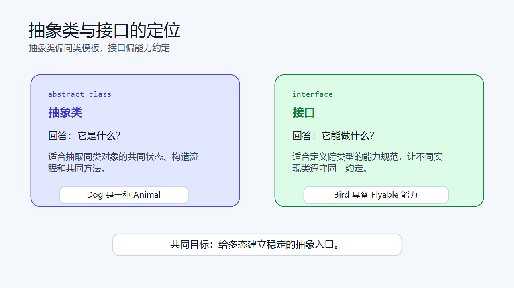
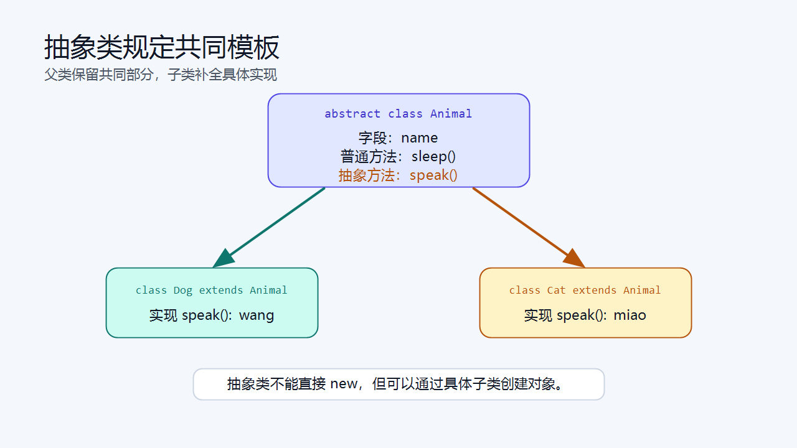
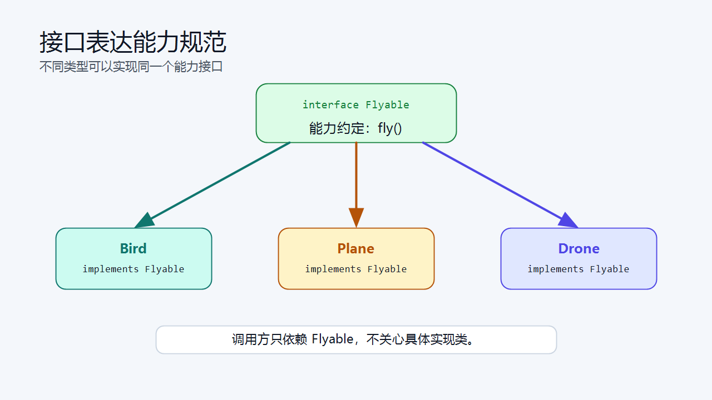
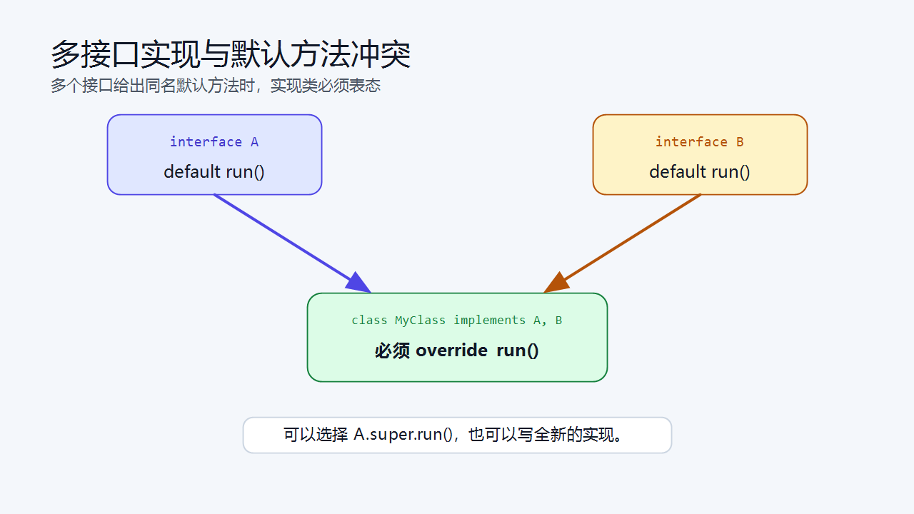
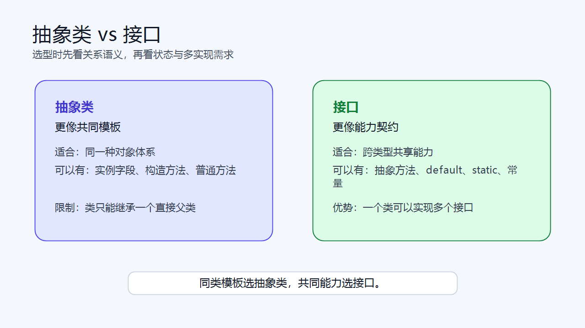

> [!info] 知识摘要
> **总结**
> - 抽象类用于抽取同类对象的共同模板，接口用于定义某种能力规范。
> - 本篇从 `abstract`、`interface`、`implements` 讲到抽象方法、默认方法、多接口实现、默认方法冲突和选择标准。
>
> **文章元信息**
> - 更新时间：2026-05-18
> - 系列定位：Java 基础语言第 08 篇
> - 适合读者：已理解继承、方法重写、多态，准备继续学习抽象设计入口的初学者
> - 前置知识：建议先理解 `extends`、`@Override`、父类引用指向子类对象和动态方法查找
>
> **相关知识点**
> - 抽象类、接口、`abstract`、`interface`、`implements`、抽象方法、默认方法、多接口实现

---

## 一、先建立抽象类与接口的整体认知

### 1.1 为什么多态之后要学抽象

上一篇讲多态时，我们反复使用了类似这样的写法：

```java
Animal animal = new Dog();
animal.speak();
```

这里的关键是：调用方通过 `Animal` 这个统一入口调用 `speak()`，真正执行哪个版本由运行时对象决定。

但继续想一步：`Animal` 这个类型应该怎么写？

如果 `Animal` 只是为了提供统一入口，本身并没有一个完整的“动物对象”可以创建，那么它就不适合写成普通类。此时可以把它设计成抽象类。

如果某种能力不只属于同一类对象，例如“能飞”“能比较大小”“能关闭资源”，那么它也不一定适合放进父类继承体系里。此时可以把它设计成接口。

### 1.2 一句话区分抽象类和接口

可以先用两句话建立直觉：

```text
抽象类：强调“是什么”，用于抽取同类对象的共同模板。
接口：强调“能做什么”，用于定义某种能力规范。
```

| 概念 | 关键字 | 更适合表达 | 典型理解 |
| --- | --- | --- | --- |
| 抽象类 | `abstract class` | 同一类对象的共同模板 | `Dog` 是一种 `Animal` |
| 接口 | `interface` | 某种可被实现的能力规范 | `Bird` 具备 `Flyable` 能力 |



**💡 核心结论：** 抽象类和接口都是为了建立统一调用入口，但抽象类偏“同类模板”，接口偏“能力约定”。

---

## 二、抽象类：把同类对象抽成共同模板

### 2.1 什么是抽象类

使用 `abstract` 修饰的类，就是抽象类。

**✅ 抽象类基本写法**

```java
public abstract class Animal {
    public abstract void speak();
}
```

抽象类有一个最重要的限制：

```java
Animal animal = new Animal(); // 编译错误
```

也就是说，抽象类不能直接创建对象。它通常用于让子类继承，再由子类补全具体行为。

为什么不能直接创建对象？

因为抽象类本身可能没有完整实现。例如 `Animal` 只规定了“动物要能叫”，但没有说明具体怎么叫。真正的行为应该交给 `Dog`、`Cat` 这类具体子类完成。

### 2.2 什么是抽象方法

抽象方法是没有方法体的方法。

**✅ 抽象方法示例**

```java
public abstract void speak();
```

注意它没有 `{}` 方法体，结尾直接使用分号。

抽象方法的含义是：父类只规定“必须有这个能力”，但暂时不提供具体实现。

几个基础规则：

| 规则 | 说明 |
| --- | --- |
| 抽象方法没有方法体 | 只声明方法签名 |
| 抽象方法必须放在抽象类或接口中 | 普通类不能包含抽象方法 |
| 子类通常要实现抽象方法 | 除非子类自己也是抽象类 |
| 抽象方法不能用 `private` 修饰 | 子类看不到，就无法重写 |
| 抽象方法不能用 `final` 修饰 | `final` 禁止重写，与抽象方法目的冲突 |

### 2.3 子类如何实现抽象方法

子类继承抽象类后，如果子类是普通类，就必须实现父类中的抽象方法。

**✅ 子类实现抽象方法**

```java
public class Dog extends Animal {
    @Override
    public void speak() {
        System.out.println("wang");
    }
}
```

此时 `Dog` 是一个完整类，可以创建对象：

```java
Animal animal = new Dog();
animal.speak(); // wang
```

这里又回到了多态：变量的静态类型是 `Animal`，真实对象是 `Dog`，调用 `speak()` 时执行 `Dog` 重写后的版本。

### 2.4 抽象类可以有普通成员

抽象类不是只能写抽象方法。它也可以有字段、构造方法、普通方法和静态方法。

**✅ 抽象类包含普通成员示例**

```java
public abstract class Animal {
    protected String name;

    public Animal(String name) {
        this.name = name;
    }

    public void sleep() {
        System.out.println(name + " sleeps");
    }

    public abstract void speak();
}
```

子类可以复用这些普通成员：

```java
public class Dog extends Animal {
    public Dog(String name) {
        super(name);
    }

    @Override
    public void speak() {
        System.out.println(name + " says wang");
    }
}
```

这里有一个容易误解的点：抽象类不能直接 `new`，但抽象类可以有构造方法。

构造方法不是给抽象类自己直接创建对象用的，而是在创建子类对象时，通过 `super(...)` 初始化父类部分。



**💡 核心结论：** 抽象类可以把共同状态和共同行为放在父类中，同时把必须由子类决定的行为声明成抽象方法。

---

## 三、接口：把共同能力抽成统一契约

### 3.1 什么是接口

接口使用 `interface` 定义。

**✅ 接口基本写法**

```java
public interface Flyable {
    void fly();
}
```

接口更适合表达“具备某种能力”。

例如：

- 鸟可以飞。
- 飞机可以飞。
- 无人机可以飞。

它们不一定适合放在同一个父类下面，但都可以实现 `Flyable` 接口。

### 3.2 类如何实现接口

类实现接口使用 `implements` 关键字。

**✅ 实现接口示例**

```java
public class Bird implements Flyable {
    @Override
    public void fly() {
        System.out.println("bird fly");
    }
}
```

接口中的抽象方法默认是 `public abstract`，所以实现时方法必须是 `public`。

下面这种写法会编译失败：

```java
class Bird implements Flyable {
    @Override
    void fly() { // 编译错误：不能降低访问权限
        System.out.println("bird fly");
    }
}
```

因为接口方法本质上是公开能力，实现类不能把公开能力改成包访问权限。

### 3.3 接口引用也可以体现多态

接口也可以作为引用类型使用。

**✅ 接口引用指向实现类对象**

```java
Flyable f1 = new Bird();
Flyable f2 = new Plane();

f1.fly();
f2.fly();
```

只要 `Bird` 和 `Plane` 都实现了 `Flyable`，调用方就可以通过 `Flyable` 这个统一接口调用 `fly()`。

这和父类引用指向子类对象很像：

```java
Animal animal = new Dog();
Flyable flyable = new Bird();
```

区别在于：

- `Animal` 通常表达“是什么”。
- `Flyable` 通常表达“能做什么”。



**💡 核心结论：** 接口不是为了存储对象状态，而是为了定义一组实现类必须遵守的能力契约。

---

## 四、接口中的成员规则

### 4.1 接口中的抽象方法

接口中最基础的成员就是抽象方法。

```java
public interface RunnableTask {
    void run();
}
```

这等价于：

```java
public interface RunnableTask {
    public abstract void run();
}
```

实际开发中通常省略 `public abstract`，因为接口中的普通方法声明默认就是公开抽象方法。

### 4.2 接口中的默认方法

从 Java 8 开始，接口中可以定义默认方法。

**✅ 默认方法示例**

```java
public interface Loggable {
    default void log() {
        System.out.println("default log");
    }
}
```

实现类可以直接使用默认方法：

```java
public class Service implements Loggable {
}
```

也可以重写默认方法：

```java
public class Service implements Loggable {
    @Override
    public void log() {
        System.out.println("service log");
    }
}
```

默认方法的主要价值是：接口新增方法时，可以给旧实现类一个默认实现，避免所有实现类立刻报错。

但不要因此把接口写成“工具类”或“半个父类”。接口的主职责仍然是定义能力规范。

### 4.3 接口中的静态方法

接口中也可以定义静态方法。

**✅ 接口静态方法示例**

```java
public interface Config {
    static void printInfo() {
        System.out.println("config info");
    }
}
```

调用时使用接口名：

```java
Config.printInfo();
```

接口静态方法不属于某个实现类对象，它通常用于放和接口能力相关的辅助方法。

### 4.4 接口中的私有方法

较新版本 Java 支持接口中的私有方法。它主要用于给接口内部的 `default` 方法或 `static` 方法复用代码。

**✅ 接口私有方法示例**

```java
public interface Loggable {
    default void info(String message) {
        print("INFO", message);
    }

    default void error(String message) {
        print("ERROR", message);
    }

    private void print(String level, String message) {
        System.out.println(level + ": " + message);
    }
}
```

这里的 `print` 只给接口内部使用，实现类不能直接调用。

### 4.5 接口中的字段

接口中的字段默认是：

```java
public static final
```

例如：

```java
public interface Config {
    int MAX_SIZE = 100;
}
```

等价于：

```java
public interface Config {
    public static final int MAX_SIZE = 100;
}
```

所以接口字段本质上是公开静态常量，不是普通实例字段。

```java
Config.MAX_SIZE;
```

不要把接口当成存储对象状态的地方。如果一个类型需要实例字段、构造方法和共同状态，通常应该优先考虑抽象类或普通类。

**💡 核心结论：** 接口可以有抽象方法、默认方法、静态方法、私有方法和常量，但它不适合承担普通对象状态。

---

## 五、多接口实现与接口继承

### 5.1 类可以实现多个接口

Java 类只能直接继承一个父类，但可以实现多个接口。

**✅ 多接口实现示例**

```java
public interface Flyable {
    void fly();
}

public interface Swimmable {
    void swim();
}

public class Duck implements Flyable, Swimmable {
    @Override
    public void fly() {
        System.out.println("fly");
    }

    @Override
    public void swim() {
        System.out.println("swim");
    }
}
```

这说明一个类可以同时具备多种能力。

| 写法 | 含义 |
| --- | --- |
| `extends Animal` | 继承一个父类 |
| `implements Flyable` | 实现一个接口 |
| `implements Flyable, Swimmable` | 实现多个接口 |

### 5.2 接口可以继承多个接口

接口之间也可以使用 `extends`。

**✅ 接口继承接口示例**

```java
public interface Networkable {
    void connect();
}

public interface RunnableDevice {
    void start();
}

public interface SmartDevice extends Networkable, RunnableDevice {
    void shutdown();
}
```

实现 `SmartDevice` 的类，需要实现所有继承来的抽象方法：

```java
public class Camera implements SmartDevice {
    @Override
    public void connect() {
        System.out.println("connect");
    }

    @Override
    public void start() {
        System.out.println("start");
    }

    @Override
    public void shutdown() {
        System.out.println("shutdown");
    }
}
```

注意：类继承类使用 `extends`，类实现接口使用 `implements`，接口继承接口仍然使用 `extends`。

### 5.3 默认方法冲突

如果一个类实现多个接口，而这些接口中有同名默认方法，就会产生冲突。

**✅ 默认方法冲突示例**

```java
interface A {
    default void run() {
        System.out.println("A run");
    }
}

interface B {
    default void run() {
        System.out.println("B run");
    }
}

class MyClass implements A, B {
    @Override
    public void run() {
        A.super.run();
    }
}
```

这里 `MyClass` 必须自己重写 `run()`，明确到底使用哪个实现，或者写出新的实现。

如果不重写，编译器不知道应该继承 `A` 的默认方法，还是 `B` 的默认方法。



**💡 核心结论：** 接口可以多实现、多继承，但多个接口提供同名默认方法时，实现类必须显式解决冲突。

---

## 六、抽象类 vs 接口：到底该选谁

### 6.1 核心区别对比

抽象类和接口都可以作为抽象入口，但它们表达的设计含义不同。

| 对比项 | 抽象类 | 接口 |
| --- | --- | --- |
| 关键字 | `abstract class` | `interface` |
| 实现关键字 | `extends` | `implements` |
| 关系表达 | 是什么 | 能做什么 |
| 继承数量 | 类只能继承一个父类 | 类可以实现多个接口 |
| 实例字段 | 可以有 | 不适合有，字段默认是常量 |
| 构造方法 | 可以有 | 不能有构造方法 |
| 抽象方法 | 可以有 | 可以有 |
| 普通实现 | 可以有普通方法 | 可以有 `default` / `static` 方法 |
| 典型场景 | 提取同类对象的共同状态和行为 | 定义跨类型的能力规范 |



### 6.2 什么时候用抽象类

如果多个类本质上属于同一类对象，并且有共同状态或共同流程，可以优先考虑抽象类。

例如：

```java
public abstract class Account {
    protected double balance;

    public Account(double balance) {
        this.balance = balance;
    }

    public void deposit(double amount) {
        balance += amount;
    }

    public abstract void withdraw(double amount);
}
```

这里不同账户都属于 `Account`，并且共享 `balance` 状态和 `deposit` 行为，所以抽象类比较合适。

### 6.3 什么时候用接口

如果多个类不一定属于同一类对象，但都具备某种能力，可以优先考虑接口。

例如：

```java
public interface Payable {
    void pay(double amount);
}
```

实现类可以来自不同体系：

```java
public class CreditCard implements Payable {
    @Override
    public void pay(double amount) {
        System.out.println("credit card pay: " + amount);
    }
}

public class Wallet implements Payable {
    @Override
    public void pay(double amount) {
        System.out.println("wallet pay: " + amount);
    }
}
```

它们不一定要有共同父类，但都可以通过 `Payable` 表达“可支付”的能力。

### 6.4 一个简单判断标准

可以先用这个判断：

| 问题 | 更可能选择 |
| --- | --- |
| 这些类是不是同一种东西？ | 抽象类 |
| 是否需要共享实例字段或构造流程？ | 抽象类 |
| 只是具备同一种能力吗？ | 接口 |
| 是否希望一个类同时具备多种能力？ | 接口 |
| 是否需要面向多个实现灵活替换？ | 接口 |

**💡 核心结论：** 抽象类解决“同类对象共同模板”的问题，接口解决“共同能力规范”的问题。

---

## 七、面向接口编程与回调

### 7.1 什么是面向接口编程

面向接口编程指的是：调用方尽量依赖接口声明的能力，而不是依赖某个具体实现类。

例如，不要把方法写死成只能接收某个具体类：

```java
public void sendByEmail(EmailSender sender) {
    sender.send("hello");
}
```

可以改成依赖接口：

```java
public void send(MessageSender sender) {
    sender.send("hello");
}
```

接口定义如下：

```java
public interface MessageSender {
    void send(String message);
}
```

不同实现类负责不同发送方式：

```java
public class EmailSender implements MessageSender {
    @Override
    public void send(String message) {
        System.out.println("email: " + message);
    }
}

public class SmsSender implements MessageSender {
    @Override
    public void send(String message) {
        System.out.println("sms: " + message);
    }
}
```

调用方只认识 `MessageSender` 这个约定，不需要知道具体是邮件发送还是短信发送。

### 7.2 面向接口编程的价值

面向接口编程并不是为了让代码看起来更抽象，而是为了降低调用方对具体实现类的依赖。

| 价值 | 说明 |
| --- | --- |
| 降低耦合 | 调用方依赖接口，不依赖具体类 |
| 便于替换实现 | 从 `EmailSender` 换成 `SmsSender` 时，调用方不用大改 |
| 支持多态 | 同一个接口引用可以指向不同实现类对象 |
| 便于测试 | 测试时可以传入模拟实现 |

这也呼应了多态篇的结尾：代码从“认识每一个具体的你”，变成“理解一个抽象的约定”。

### 7.3 接口也可以作为回调规范

接口还经常用于定义回调。

**✅ 回调接口示例**

```java
public interface Task {
    void run();
}
```

执行方法只依赖接口：

```java
public void execute(Task task) {
    task.run();
}
```

不同任务可以提供不同实现：

```java
public class PrintTask implements Task {
    @Override
    public void run() {
        System.out.println("print");
    }
}

public class SaveTask implements Task {
    @Override
    public void run() {
        System.out.println("save");
    }
}
```

调用：

```java
execute(new PrintTask());
execute(new SaveTask());
```

`execute` 不需要知道具体任务是什么，它只需要知道传进来的对象有 `run()` 能力。

**💡 核心结论：** 接口把“调用方需要什么能力”和“实现类具体怎么做”分开，这是面向接口编程的核心。

---

## 八、常见错误与易混点

### 8.1 抽象类不能直接 new

```java
abstract class Animal {
}

Animal animal = new Animal(); // 编译错误
```

抽象类不完整，不能直接创建对象。它要通过具体子类来创建对象。

### 8.2 子类忘记实现抽象方法

```java
abstract class Animal {
    abstract void speak();
}

class Dog extends Animal {
}
```

如果 `Dog` 是普通类，它必须实现 `speak()`。否则 `Dog` 也必须声明为抽象类：

```java
abstract class Dog extends Animal {
}
```

### 8.3 接口字段不是实例字段

```java
interface Config {
    int MAX_SIZE = 100;
}
```

这里 `MAX_SIZE` 不是每个对象一份的实例字段，而是 `public static final` 常量。

> ⚠️ **误区：接口可以用来保存一组对象状态**
>
> **正确理解：** 接口字段默认是公开静态常量。接口适合定义能力规范，不适合保存普通对象状态。

### 8.4 混淆 extends 和 implements

| 关系 | 写法 |
| --- | --- |
| 类继承类 | `class Dog extends Animal` |
| 类实现接口 | `class Bird implements Flyable` |
| 接口继承接口 | `interface A extends B` |
| 类继承父类并实现接口 | `class Dog extends Animal implements RunnableTask` |

类只能 `extends` 一个直接父类，但可以 `implements` 多个接口。

### 8.5 把接口当成万能设计

接口很有用，但不是所有地方都应该先抽接口。

如果只有一个实现类，并且暂时没有替换、扩展或测试隔离需求，直接使用具体类可能更简单。

> ⚠️ **误区：写接口一定比写普通类高级**
>
> **正确理解：** 接口的价值在于稳定能力边界和隔离具体实现。如果没有真实的抽象需求，过早抽接口只会增加理解成本。

---

## 九、本篇先不展开哪些内容

为了让这一篇聚焦抽象类与接口本身，下面这些内容先不深入展开：

| 内容 | 为什么不在本文展开 |
| --- | --- |
| Lambda 表达式 | 后续讲函数式接口或集合时更适合展开 |
| 泛型接口 | 会放到集合或泛型相关内容中系统讲 |
| `Comparable` / `Comparator` 细节 | 会在排序、集合或数据结构中结合场景讲 |
| 框架中的依赖注入 | 属于 Spring 等后端框架内容 |
| 接口设计模式 | 本篇先建立基础，策略模式、适配器模式后续再讲 |

---

## 总结

这一篇主要讲清楚了 Java 抽象类与接口的核心规则：

| 模块        | 需要掌握的核心点                        |
| --------- | ------------------------------- |
| 抽象类       | 使用 `abstract class`，不能直接创建对象    |
| 抽象方法      | 没有方法体，用于规定子类必须实现的行为             |
| 抽象类成员     | 可以有字段、构造方法、普通方法、静态方法和抽象方法       |
| 接口        | 使用 `interface`，用于定义能力规范         |
| 接口实现      | 类使用 `implements` 实现接口，并实现其中抽象方法 |
| 接口方法      | 可包含抽象方法、默认方法、静态方法、私有方法          |
| 接口字段      | 默认是 `public static final` 常量    |
| 多接口实现     | 一个类可以实现多个接口，表达多种能力              |
| 默认方法冲突    | 多个接口默认方法冲突时，实现类必须显式重写           |
| 抽象类 vs 接口 | 抽象类偏共同模板，接口偏能力约定                |
| 面向接口编程    | 调用方依赖抽象能力，而不是依赖具体实现             |

最后记住三句话：

- **抽象类解决“同类对象的共同模板”问题。**
- **接口解决“不同对象的共同能力”问题。**
- **面向接口编程的关键，是让调用方依赖稳定约定，而不是绑定具体实现。**


