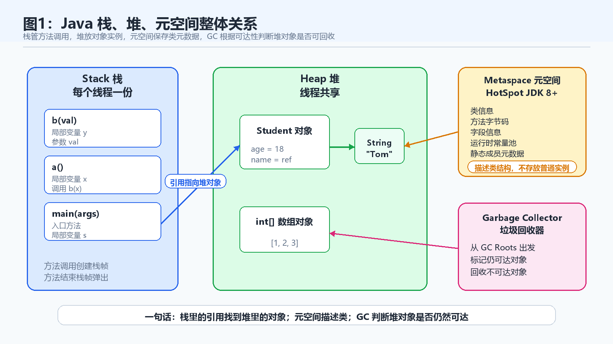
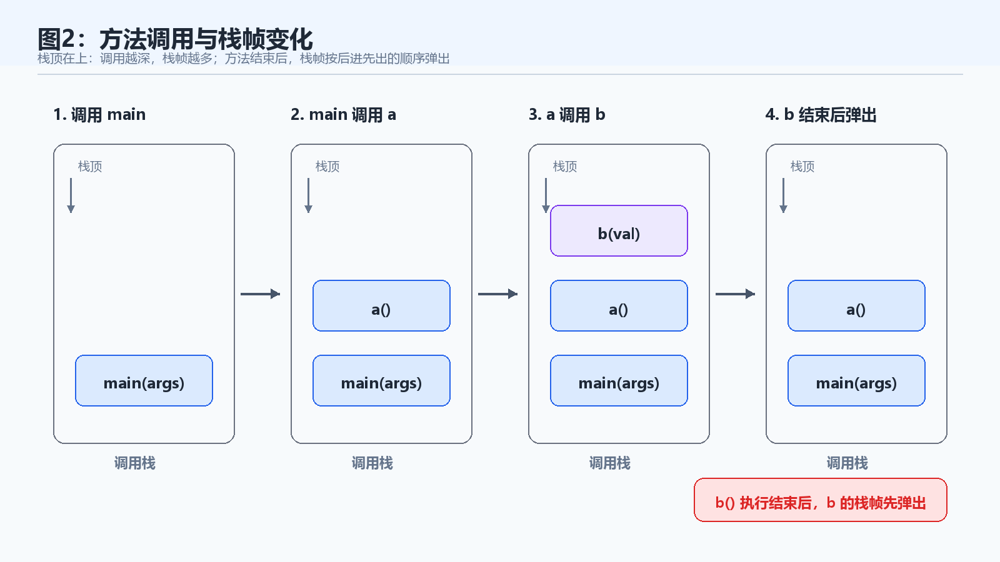
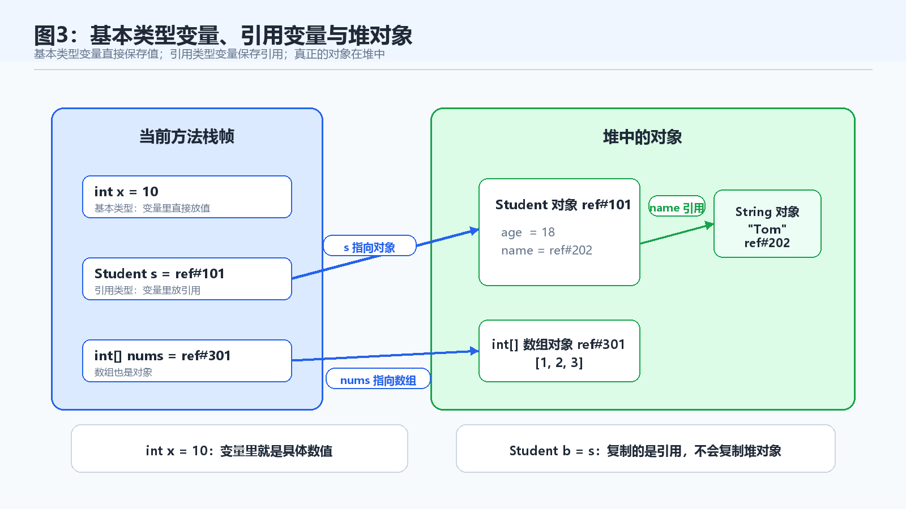
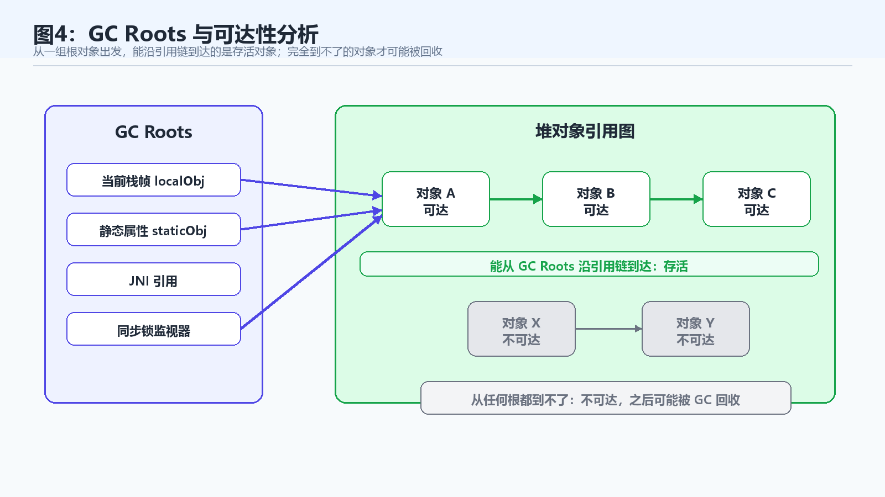

> [!info] 知识摘要
> **总结**
> - 学完面向对象后，需要建立变量、对象、引用、方法调用和垃圾回收之间的内存地图。
> - 本篇先用入门视角理解栈、堆、栈帧、类信息、GC Roots、可达性分析和常见内存问题。
>
> **文章元信息**
> - 更新时间：2026-05-28
> - 系列定位：Java 基础语言第 09 篇
> - 适合读者：已理解类、对象、数组、引用和方法调用，准备建立 Java 内存模型直觉的初学者
> - 前置知识：建议先理解基本类型、引用类型、方法调用、构造方法、继承与多态的基础用法
>
> **相关知识点**
> - 栈、堆、栈帧、对象、引用、类信息、GC Roots、垃圾回收、内存泄漏、`StackOverflowError`

---

## 一、先建立 Java 内存的整体地图

### 1.1 为什么学完面向对象要补内存布局

前面几篇我们已经学过类、对象、封装、继承、多态。代码层面上，我们会写：

```java
Student s = new Student();
s.name = "Tom";
```

但如果继续追问，就会出现几个非常关键的问题：

- `s` 这个变量在哪里？
- `new Student()` 创建出来的对象在哪里？
- `s.name` 修改的是变量本身，还是对象里的字段？
- 方法调用结束后，`s` 消失了，对象是不是也一定消失？
- Java 自动 GC，究竟根据什么判断对象还能不能回收？

这些问题不理解，后面学习集合、递归、异常调用栈、对象生命周期、内存泄漏时都会觉得很虚。

所以本篇先不钻过深的 JVM 参数，而是抓住初学者最应该掌握的主线：

```text
方法调用看栈。
对象实例看堆。
类级信息看方法区 / 元空间。
对象能不能回收，看它是否还能从 GC Roots 到达。
```

### 1.2 入门阶段先记住三块区域

Java 运行时内存区域比较多，入门阶段可以先重点理解下面三类：

| 区域 | 主要存什么 | 入门理解 |
| --- | --- | --- |
| 栈 Stack | 方法调用、局部变量、方法参数、栈帧 | 一次方法调用的一块临时工作区 |
| 堆 Heap | 对象实例、数组对象 | `new` 出来的对象主要在这里 |
| 方法区 / 元空间 | 类信息、方法信息、字段信息、常量池等 | 类本身的元数据有单独区域管理 |

这里先补一句容易被资料绕晕的关系：**方法区是 JVM 规范中的概念，元空间是 HotSpot JVM 在 JDK 8 以后对方法区的一种实现方式，它取代了更早的永久代（PermGen）。** 所以很多文章会把“方法区、永久代、元空间”放在一起讲，但它们不是完全同一个层面的概念。



**💡 核心结论：** 栈解决“方法怎么执行”，堆解决“对象放在哪里”，GC 解决“堆里的对象什么时候可以回收”。

---

## 二、栈：方法调用的临时工作区

### 2.1 栈主要用来管理方法调用

栈（Stack）可以理解为 Java 方法调用的执行现场。

每个线程都有自己的调用栈。每调用一个方法，JVM 就会为这次调用创建一个栈帧；方法执行结束后，这个栈帧就会从栈中弹出。

栈里通常会保存：

| 内容 | 说明 |
| --- | --- |
| 方法参数 | 调用方法时传入的数据 |
| 局部变量 | 方法内部定义的变量 |
| 操作数栈 | 方法执行字节码指令时使用的临时计算区域 |
| 返回信息 | 方法执行完后回到哪里继续执行 |
| `this` 引用 | 非静态方法中指向当前对象的引用 |

可以先把栈帧理解为：**一次方法调用期间使用的小工作台。**

### 2.2 用一段代码看栈帧的创建和销毁

看一个简单例子：

```java
public class StackDemo {
    public static void main(String[] args) {
        a();
    }

    public static void a() {
        int x = 10;
        b(x);
    }

    public static void b(int val) {
        int y = val + 5;
        System.out.println(y);
    }
}
```

执行过程可以理解成：

| 步骤 | 栈中变化 |
| --- | --- |
| 调用 `main` | 创建 `main` 的栈帧 |
| `main` 调用 `a` | 创建 `a` 的栈帧 |
| `a` 调用 `b` | 创建 `b` 的栈帧 |
| `b` 执行结束 | `b` 的栈帧弹出 |
| `a` 执行结束 | `a` 的栈帧弹出 |
| `main` 执行结束 | `main` 的栈帧弹出 |



这里要抓住一个重点：**局部变量通常跟着方法调用存在，方法结束后，对应栈帧会消失，里面的局部变量也就结束了生命周期。**

### 2.3 递归为什么可能导致 StackOverflowError

栈空间不是无限的。

如果方法不断调用自己，每次调用都会创建新的栈帧。递归层数太深时，栈空间可能被耗尽，最终抛出：

```text
StackOverflowError
```

例如：

```java
public class RecursionDemo {
    public static void call() {
        call();
    }

    public static void main(String[] args) {
        call();
    }
}
```

这段代码没有递归结束条件，`call()` 会不断调用自己，栈帧越来越多，最后栈被撑满。

> ⚠️ **误区：StackOverflowError 是对象太多导致的**
>
> **正确理解：** `StackOverflowError` 通常和方法调用栈过深有关，最常见原因是递归没有正确结束，或者调用链过深。

---

## 三、栈帧：一次方法调用的执行现场

### 3.1 栈帧里有什么

栈帧（Stack Frame）是理解方法调用的关键概念。

每次方法调用都会有自己的栈帧。这个栈帧可以粗略理解为：

```text
参数 + 局部变量 + 临时计算区 + 返回信息
```

例如：

```java
public static int add(int a, int b) {
    int sum = a + b;
    return sum;
}
```

调用 `add(10, 20)` 时，这次调用的栈帧中会保存参数 `a`、参数 `b`、局部变量 `sum`，以及方法执行完应该返回到哪里。

这里的“临时计算区”可以用 `a + b` 具象理解：执行加法时，JVM 会先把 `a` 和 `b` 的值压入当前栈帧里的操作数栈，再由加法指令弹出这两个值进行计算，最后把结果压回操作数栈。这个过程就发生在这一次方法调用自己的栈帧内部。

### 3.2 局部变量的生命周期通常不超过方法调用

看这段代码：

```java
public static void test() {
    int x = 10;
}
```

`x` 是局部变量，它存在于 `test()` 这次方法调用对应的栈帧中。

当 `test()` 执行结束，栈帧被弹出，`x` 也就不再存在。

但是这里有一个非常容易混淆的地方：**局部变量消失，不等于它曾经引用的堆对象一定立刻消失。**

例如：

```java
public static void create() {
    Student s = new Student();
}
```

`s` 是局部变量，存在栈帧中；`new Student()` 创建的对象在堆中。

当 `create()` 方法结束时，`s` 这个局部变量确实没了。但堆中的 `Student` 对象是否马上被回收，要看它是否还被其他地方引用，以及 GC 什么时候执行。

**💡 核心结论：** 栈帧结束会让局部变量消失，但堆对象是否回收由 GC 根据可达性判断，不是方法一结束就必然立刻销毁。

---

## 四、堆：对象和数组主要生活的地方

### 4.1 new 出来的对象通常在堆中

堆（Heap）是 Java 存放对象实例和数组对象的主要区域。

只要看到 `new`，入门阶段基本就可以先建立这个直觉：

```java
Student s = new Student();
```

这行代码可以拆成两部分理解：

| 部分 | 位置 | 含义 |
| --- | --- | --- |
| `s` | 当前方法的栈帧中 | 一个引用变量 |
| `new Student()` | 堆中 | 一个真正的 `Student` 对象 |

`s` 不是对象本身，它保存的是一个引用。这个引用让程序能够找到堆里的对象。

### 4.2 数组也是对象

数组在 Java 中也是对象。

```java
int[] nums = new int[3];
```

这行代码同样可以拆开看：

| 部分 | 位置 | 含义 |
| --- | --- | --- |
| `nums` | 栈帧中 | 引用变量 |
| `new int[3]` | 堆中 | 一个数组对象 |

所以数组作为参数传给方法时，传递的并不是整个数组的复制品，而是数组对象的引用值。

例如：

```java
public static void change(int[] arr) {
    arr[0] = 100;
}

public static void main(String[] args) {
    int[] nums = {1, 2, 3};
    change(nums);
    System.out.println(nums[0]); // 100
}
```

`change(nums)` 之后，`nums[0]` 变成了 `100`，因为方法里改的是同一个堆数组对象。

### 4.3 基本类型和引用类型在内存中的区别

对比下面两行：

```java
int x = 10;
Student s = new Student();
```

它们的关键区别是：

| 类型 | 变量保存什么 |
| --- | --- |
| 基本类型变量 | 直接保存具体值 |
| 引用类型变量 | 保存对象引用 |

`x` 直接保存整数值 `10`。

`s` 保存的是引用，真正的 `Student` 对象在堆中。

如果对象内部还有字段：

```java
class Student {
    int age;
    String name;
}
```

当 `Student` 对象在堆中时：

- `age` 是对象内部的基本类型字段。
- `name` 是对象内部的引用字段。
- `name` 如果指向某个字符串对象，那么字符串对象也在堆中。



---

## 五、引用与别名：复制引用不等于复制对象

### 5.1 两个变量可以指向同一个对象

看下面这段代码：

```java
Student a = new Student();
a.age = 18;

Student b = a;
b.age = 20;

System.out.println(a.age); // 20
```

为什么通过 `b` 修改以后，`a.age` 也变了？

因为：

```java
Student b = a;
```

复制的是引用值，不是复制一个新的 `Student` 对象。

此时 `a` 和 `b` 保存的是同一个引用，它们指向同一个堆对象。通过任何一个引用修改对象字段，另一个引用看到的都是同一个对象的最新状态。

### 5.2 复制对象需要重新 new

如果你想得到两个不同对象，就必须创建新的对象：

```java
Student a = new Student();
a.age = 18;

Student b = new Student();
b.age = a.age;

b.age = 20;

System.out.println(a.age); // 18
System.out.println(b.age); // 20
```

这时堆中有两个 `Student` 对象，`a` 和 `b` 分别指向不同对象。

> ⚠️ **误区：把引用赋值理解成复制对象**
>
> **正确理解：** `Student b = a;` 只是让 `b` 指向 `a` 指向的同一个对象，并没有创建新对象。

---

## 六、方法区与元空间：类信息放在哪里

### 6.1 类本身的信息也需要被管理

除了栈和堆，JVM 还需要保存类本身的信息。

例如一个类：

```java
public class Student {
    private int age;

    public void study() {
        System.out.println("study");
    }
}
```

JVM 不仅要创建 `Student` 对象，还需要知道：

- `Student` 这个类有哪些字段。
- 有哪些方法。
- 方法的字节码是什么。
- 常量池里有哪些常量。
- 类的继承关系是什么。

这些类级别的信息不会放在某一个普通对象里，而是由 JVM 的专门区域管理。

### 6.2 方法区和元空间怎么理解

在 Java 语言规范和 JVM 规范层面，我们常听到“方法区”这个概念。

在 HotSpot JVM 的实现里，JDK 8 以后，类元数据主要放在元空间（Metaspace）中。元空间使用的是本地内存，而不是传统意义上的 Java 堆内部区域。

不过，本地内存不代表没有上限。元空间默认仍会受到 JVM 参数（如 `MaxMetaspaceSize`）和机器可用内存限制，动态生成或加载大量类时也可能出现与元空间相关的 `OutOfMemoryError`。

更严谨一点说：**方法区是规范概念，永久代和元空间是 HotSpot 对方法区的不同实现。** 在 JVM 规范里，方法区可以理解为逻辑上的“堆的一部分”；但在 HotSpot JDK 8+ 的具体实现中，类元数据主要放在本地内存的元空间里，而不是放在 Java 堆内部。JDK 8 之前，HotSpot 常用永久代（PermGen）实现方法区；JDK 8 移除了永久代，改用元空间来存放类元数据。所以“方法区到底算不算堆”这个问题，要区分“规范里的逻辑概念”和“具体 JVM 的物理实现”。

入门阶段不需要纠结所有实现细节，可以先这样理解：

| 概念 | 入门理解 |
| --- | --- |
| 方法区 | JVM 规范中的运行时数据区域概念，用来存放类级信息 |
| 元空间 | HotSpot JVM 对方法区的一种实现方式，JDK 8 以后主要存放类元数据 |

需要注意的是，不同 JVM 实现和不同版本会有细节差异。初学阶段最重要的不是背具体物理位置，而是建立边界：

```text
对象实例主要在堆。
方法调用过程主要在栈。
类的元数据由 JVM 的专门区域管理。
```

**💡 核心结论：** 元空间不是让我们在 Java 代码里直接操作的区域，它帮助 JVM 管理类的信息。

---

## 七、垃圾回收：Java 为什么不需要手动 free

### 7.1 GC 回收的是不再可达的堆对象

Java 程序员通常不需要像 C/C++ 那样手动释放对象。

例如：

```java
Student s = new Student();
s = null;
```

当 `s = null` 之后，原来的 `Student` 对象如果没有其他引用指向它，就可能成为垃圾回收的候选对象。

注意这里说的是“可能”，不是“立刻”。

GC 要解决的核心问题是：

```text
哪些对象还活着？
哪些对象已经不可能再被程序访问？
```

### 7.2 可达性分析：从 GC Roots 出发找对象

现代 JVM 判断对象是否存活时，常用思想是可达性分析。

可以把它理解成一张引用关系图：

```text
GC Roots -> 对象 A -> 对象 B -> 对象 C
```

如果某个对象能从 GC Roots 出发，通过一条引用链访问到，就认为它是存活对象。

如果一个对象从任何 GC Roots 出发都到不了，它就可以被认为是不可达对象，之后可能被 GC 回收。

常见的 GC Roots 包括：

| GC Roots 来源 | 示例 |
| --- | --- |
| 虚拟机栈中的引用 | 当前正在执行的方法里的参数、局部变量、操作数栈引用 |
| 静态属性引用 | 类的静态字段引用的对象 |
| 常量引用 | 常量池中引用的对象 |
| 本地方法栈中的 JNI 引用 | Native 方法中持有的 Java 对象引用 |
| 被同步锁持有的对象 | 正在作为 `synchronized` 监视器的对象 |
| JVM 内部引用 | JVM 自身运行需要持有的对象，例如系统类加载器、基础类对象等 |

用代码对号入座会更直观：

```java
public class GCRootDemo {
    private static Object staticObj = new Object();

    public static void main(String[] args) {
        Object localObj = new Object();

        synchronized (localObj) {
            System.out.println(staticObj);
        }
    }
}
```

当 `main` 方法正在执行时，`localObj` 可以从当前线程的栈帧中找到，所以它引用的对象是可达的；`staticObj` 可以从类的静态属性中找到，所以它引用的对象也是可达的；进入 `synchronized` 代码块时，`localObj` 指向的对象还会作为同步监视器参与运行时管理。

不同 JVM 和不同 GC 实现对 GC Roots 的细节描述可能略有差异。入门阶段不需要死背完整清单，但要记住：GC 不是随便扫描堆，而是从一组“根”出发判断对象是否还能被访问。



### 7.3 obj = null 到底做了什么

很多初学者会写：

```java
Object obj = new Object();
obj = null;
```

这行 `obj = null` 的含义是：让变量 `obj` 不再指向原来的对象。

但它不等于“强制释放内存”。

只有当原来的对象没有其他可达引用时，它才会变成可回收对象。即使对象已经可回收，具体什么时候回收，也由 JVM 的垃圾回收器决定。

> ⚠️ **误区：`obj = null` 会立刻释放对象内存**
>
> **正确理解：** `obj = null` 只是断开一个引用。对象是否可回收要看是否还可达，什么时候回收由 GC 决定。

---

## 八、常见垃圾回收思路

### 8.1 标记-清除：先找活对象，再清理垃圾

标记-清除（Mark-Sweep）是最基础的垃圾回收思想之一。

它大致分两步：

| 步骤 | 做什么 |
| --- | --- |
| 标记 | 从 GC Roots 出发，标记所有可达对象 |
| 清除 | 清理没有被标记的不可达对象 |

优点是思路简单，不需要一开始就移动对象。

缺点是清除后可能产生内存碎片。

例如一块堆内存中间被回收出很多小空洞，虽然总空闲空间不少，但如果要分配一个较大的连续对象，可能仍然放不下。

### 8.2 复制算法：只复制还活着的对象

复制算法的思路是：把内存分成两块，每次只使用其中一块。GC 时，把存活对象复制到另一块连续空间中，然后一次性清空原来的区域。

它的特点是：

| 优点 | 缺点 |
| --- | --- |
| 回收后空间连续 | 需要额外空间 |
| 适合存活对象少的区域 | 存活对象很多时复制成本高 |

正因为新生代对象大多“朝生夕死”，每次 GC 后真正要复制的存活对象很少，复制成本低，复制后空间还天然连续。所以复制算法天生适合新生代。

在 HotSpot 的常见理解里，新生代通常可以继续拆成 Eden 区和两个 Survivor 区。新对象大多先进入 Eden；发生 Minor GC 时，仍然存活的对象会从 Eden 和当前 Survivor 复制到另一块 Survivor；如果对象经历多次回收后还活着，就可能晋升到老年代。

而对老年代这类长寿对象较多的区域，复制算法就不太划算了。如果大量对象每次都要复制，成本会明显增加，所以老年代通常会采用标记-清除、标记-整理等更适合长寿对象的思路。

### 8.3 分代回收：不同年龄的对象用不同策略

分代回收基于一个经验观察：

```text
大多数对象生命周期很短。
```

所以堆通常会按对象年龄划分为不同区域，例如年轻代和老年代。

| 区域 | 特点 | 回收思路 |
| --- | --- | --- |
| 年轻代 | 新对象主要在这里创建，回收频繁 | 常用复制思想 |
| 老年代 | 多次回收后仍存活的对象可能进入这里 | 回收频率较低，策略更复杂 |

比如方法中临时创建的对象、循环中的短期对象，很多很快就失去引用，适合在年轻代快速回收。

而一些长期被引用的缓存对象、全局对象、静态引用对象，可能存活时间更长，更可能进入老年代。

### 8.4 内存压缩：解决碎片问题

标记-清除会带来碎片问题。

为了让空闲空间变得连续，某些 GC 策略会移动存活对象，把它们整理到一起，这就是内存压缩（Compaction）的基本思想。

压缩的好处是：

- 空闲空间更连续。
- 更容易分配大对象。
- 内存布局更规整。

代价是：

- 移动对象需要更新引用。
- 回收过程可能带来暂停。

入门阶段不需要背每个垃圾回收器的具体实现，但要知道：**GC 不只是简单删除对象，它还可能移动对象、整理空间、更新引用。**

---

## 九、句柄与直接引用：引用不等于内存地址

### 9.1 Java 代码不能直接操作对象地址

在 Java 里，我们经常说：

```java
Student s = new Student();
```

`s` 保存了对象引用。

但这个“引用”不能简单理解为 Java 程序员可以直接操作的内存地址。Java 屏蔽了底层地址细节，程序员不能像 C/C++ 指针那样对地址做加减运算。

JVM 内部可以用不同方式实现引用访问，常见理解包括直接引用和句柄引用。

### 9.2 直接引用

直接引用可以粗略理解为：引用直接指向对象所在位置。

它的特点是：

| 特点 | 说明 |
| --- | --- |
| 访问速度较快 | 少一次中间跳转 |
| 对象移动时引用需要更新 | GC 移动对象后，要保证引用仍然正确 |

直接引用更接近“引用直接找到对象”的直觉。

### 9.3 句柄引用

句柄引用可以粗略理解为：引用先指向一个句柄表，句柄表里再保存对象的真实位置信息。

它的特点是：

| 特点 | 说明 |
| --- | --- |
| 对象移动时更容易集中更新 | 主要更新句柄表中的对象地址 |
| 访问对象多一层间接跳转 | 访问路径略长 |

入门阶段不需要记住哪种实现一定用于哪个 JVM。真正要掌握的是：

```text
Java 引用是 JVM 管理对象访问的一种抽象。
程序员不能直接操作真实内存地址。
GC 可以在 JVM 内部移动对象，并维护引用关系的正确性。
```

---

## 十、System.gc()：它只是建议，不是命令

### 10.1 System.gc() 做了什么

Java 提供了这样一个方法：

```java
System.gc();
```

很多初学者会误以为它能强制 JVM 立即进行垃圾回收。

但更准确的理解是：

```text
System.gc() 只是向 JVM 提出执行 GC 的建议。
```

JVM 可以选择响应，也可以不立即响应。即使响应了，也不代表所有你认为“该回收”的对象都会立刻被回收。

还要注意一个工程风险：在不少 HotSpot 配置下，显式调用 `System.gc()` 往往可能触发一次 Full GC 或比较重的全堆回收行为。Full GC 通常会带来 Stop-The-World 暂停，在繁忙服务中可能造成明显卡顿。因此线上系统一般不建议业务代码主动调用它，有些系统甚至会通过 JVM 参数禁用显式 GC。

### 10.2 工程中不要依赖手动 GC

在普通业务代码里，不建议依赖 `System.gc()` 来解决内存问题。

更应该关注的是：

- 不再使用的大对象，及时断开无用引用。
- 集合、缓存、静态变量不要无限增长。
- 文件、网络连接等资源要及时关闭。
- 对象创建频率过高时，优化代码结构。
- 出现内存问题时，借助日志、监控和内存分析工具定位。

> ⚠️ **误区：调用 `System.gc()` 就能解决内存泄漏**
>
> **正确理解：** 内存泄漏的本质是对象仍然可达。只要引用链还在，GC 就不能随便回收它。

---

## 十一、常见内存问题与排查方向

### 11.1 StackOverflowError

`StackOverflowError` 通常和栈有关。

典型原因：

- 递归没有结束条件。
- 递归层数过深。
- 方法调用链异常变长。

示例：

```java
public static void loop() {
    loop();
}
```

每次调用 `loop()` 都会创建新的栈帧，永远不返回，最终栈空间耗尽。

### 11.2 OutOfMemoryError

`OutOfMemoryError` 表示某个内存区域不足，无法继续分配需要的内存。

最常见的理解场景是堆内存不足：

```java
byte[][] blocks = new byte[10000][];

for (int i = 0; i < blocks.length; i++) {
    blocks[i] = new byte[1024 * 1024];
}
```

这里不断创建大数组，并且一直放进 `blocks` 数组里。因为 `blocks` 仍然引用这些大数组，GC 认为它们还活着，不能回收，最终可能导致堆内存耗尽。

### 11.3 Java 也会内存泄漏

很多人以为 Java 有 GC，就不会有内存泄漏。

这是一个非常常见的误区。

Java 中的内存泄漏通常不是“对象完全没人管”，而是：

```text
对象已经不再被业务需要，但仍然被某个引用链持有。
```

例如：

- 静态集合一直保存对象。
- 缓存只放不清。
- 监听器注册后没有移除。
- ThreadLocal 使用后没有清理。
- 长生命周期对象引用了短生命周期对象。

只要对象仍然可达，GC 就会认为它还活着。

**💡 核心结论：** GC 只能回收不可达对象，不能判断一个对象在业务上“还有没有用”。

---

## 十二、本篇先不展开哪些内容

为了让这一篇聚焦 Java 基础阶段最需要的内存直觉，下面这些内容先不深入展开：

| 内容 | 为什么不在本文展开 |
| --- | --- |
| JVM 运行时数据区完整规范 | 容易和入门主线混在一起，后续 JVM 专题更适合系统讲 |
| 具体垃圾回收器 | G1、ZGC、Shenandoah 等涉及较多 JVM 调优知识 |
| GC 日志分析 | 需要结合 JVM 参数、日志格式和真实案例 |
| 对象头与锁升级 | 更适合放到并发或 JVM 对象模型专题 |
| 逃逸分析与栈上分配 | 属于编译器优化和 JVM 性能优化内容 |
| 引用类型细分 | 强引用、软引用、弱引用、虚引用后续可单独展开 |

这一篇的目标不是把 JVM 学完，而是先让你能看懂最基础的内存关系图。

---

## 总结

### 误区速查表

前面已经逐段解释过这些问题，这里先用一张表回收重点：

| 常见误区 | 更准确的理解 |
| --- | --- |
| 局部变量都在堆里 | 局部变量通常在栈帧中；如果它是引用类型，引用指向的对象通常在堆中 |
| 方法结束，对象一定立刻消失 | 方法结束只会弹出栈帧；堆对象是否可回收，要看它是否仍然可达 |
| 有 GC 就不用关心内存 | GC 只能回收不可达对象，仍然可达但业务上不用的对象也会造成泄漏 |
| 引用变量就是对象本身 | 引用变量保存的是访问对象的引用值，对象本身通常在堆中 |
| `System.gc()` 可以强制回收 | 它只是建议 JVM 执行 GC，而且可能带来 Full GC 暂停风险 |

### 知识点总表

这一篇主要围绕 Java 内存布局与垃圾回收建立了入门级认知：

| 模块 | 需要掌握的核心点 |
| --- | --- |
| 栈 | 管理方法调用，每次方法调用会创建栈帧 |
| 栈帧 | 保存参数、局部变量、操作数栈和返回信息等 |
| 堆 | 存放对象实例和数组对象，由 GC 管理 |
| 基本类型 | 变量通常直接保存具体值 |
| 引用类型 | 变量保存引用，对象本身在堆中 |
| 引用别名 | 多个引用可以指向同一个对象 |
| 方法区 / 元空间 | 方法区在规范中可理解为逻辑上的堆的一部分；HotSpot JDK 8+ 主要用本地内存中的元空间实现 |
| GC | 自动回收不再可达的堆对象 |
| GC Roots | 可达性分析的起点，包括栈引用、静态属性引用、常量引用、JNI 引用、同步锁持有对象等 |
| 标记-清除 | 标记存活对象，清除不可达对象，但可能产生碎片 |
| 复制算法 | 复制存活对象到新区域，尤其适合新生代这种存活对象少的区域 |
| 分代回收 | 根据对象生命周期长短采用不同回收策略 |
| 内存压缩 | 移动存活对象，让空闲空间更连续 |
| `System.gc()` | 只是建议 JVM 执行 GC，不是强制命令，且可能带来 Full GC 停顿风险 |
| 内存泄漏 | 对象不再需要但仍然可达，GC 无法回收 |

最后记住四句话：

- **栈管方法调用，堆放对象实例。**
- **引用变量不是对象本身，它只是通向对象的一条线索。**
- **GC 判断对象能不能回收，看的是可达性，不是你主观上还需不需要。**
- **Java 有自动垃圾回收，但仍然需要写清楚对象生命周期。**


