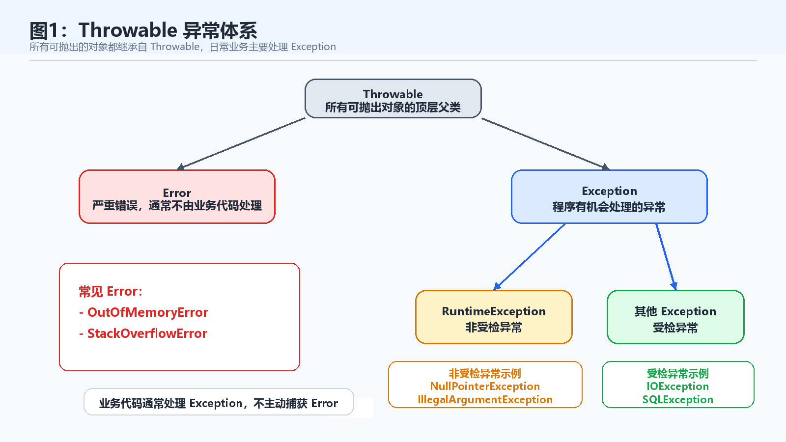
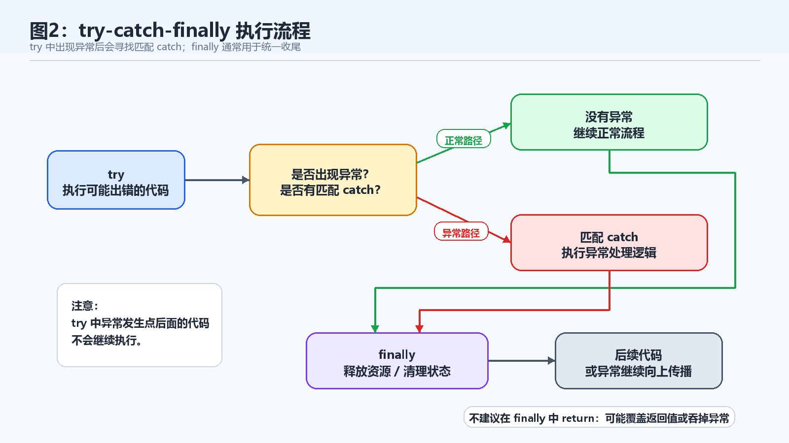
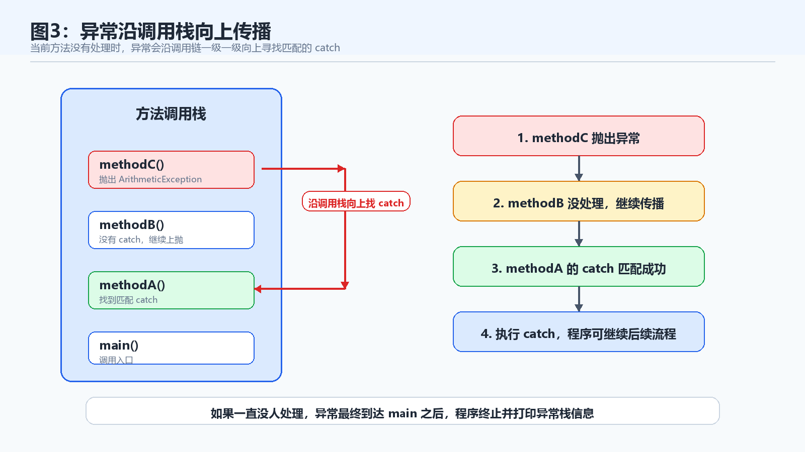

> [!info] 知识摘要
> **总结**
> - Java 异常机制把正常流程和错误处理分开，所有可抛出的对象都从 `Throwable` 体系出发。
> - 受检异常强调调用方必须面对失败，非受检异常更常提示代码逻辑、参数或状态问题。
>
> **相关知识点**
> - [[010_第九篇：Java 内存布局与垃圾回收|方法调用栈]]、`Throwable`、`Exception`、`RuntimeException`、`try-catch-finally`、异常传播

---

## 概念入口

> 写 Java 程序时，错误不可能完全避免：数组可能越界，参数可能不合法，文件可能不存在，网络可能断开，对象也可能是 `null`。如果所有错误都混在正常逻辑里处理，代码很快就会变得又乱又难维护。
>
> 异常处理要解决的核心问题，就是把“正常流程”和“出错后的处理流程”分开，并且允许错误沿着方法调用链向上传递。本笔记先整理异常处理的基础部分：`Throwable` 体系、`Error` 和 `Exception` 的区别、受检异常与非受检异常、`try-catch-finally` 的执行规则，以及如何阅读异常调用栈。

---

## 一、先建立异常处理的整体认知

### 1.1 异常到底是什么

异常（Exception）用于表示程序运行过程中出现的非正常情况。

例如：

| 场景            | 典型异常                             |
| ------------- | -------------------------------- |
| 对 `null` 调用方法 | `NullPointerException`           |
| 数组下标越界        | `ArrayIndexOutOfBoundsException` |
| 整数除以 0        | `ArithmeticException`            |
| 类型强转失败        | `ClassCastException`             |
| 文件不存在         | `FileNotFoundException`          |
| 参数不合法         | `IllegalArgumentException`       |

异常不是为了让程序“看起来不会错”，而是为了让程序在出错时有一套清晰的处理机制。

它至少能解决三件事：

- 把正常业务逻辑和错误处理逻辑分开。
- 让错误可以沿着方法调用链向上传递。
- 给调用者机会记录日志、提示用户、释放资源或尝试恢复。

### 1.2 为什么不能只靠 if-else 处理所有错误

当然，很多错误也可以用 `if-else` 提前判断。

例如：

```java
if (age < 0) {
    System.out.println("年龄不能为负数");
}
```

但有些错误不是简单判断就能完全处理的。

比如读取文件：

```java
FileInputStream in = new FileInputStream("a.txt");
```

文件是否存在、权限是否足够、磁盘是否异常，这些都可能受到外部环境影响。调用者不一定能在执行前全部判断清楚。

这里先不展开 IO 流本身，`FileInputStream` 只是用来说明“外部资源失败时很适合用异常表达”。文件读写、字节流、字符流和资源关闭，会放到后面的 IO 流章节系统讲。

这时异常机制就很有价值：它允许底层代码在失败时抛出异常，再由更合适的上层代码决定怎么处理。

**💡 核心结论：** `if-else` 更适合处理可预期的业务分支，异常更适合表达程序执行过程中出现的非正常失败。

---

## 二、Throwable 体系：先分清谁是谁

### 2.1 Java 中能被抛出的对象都属于 Throwable

Java 中所有可以被抛出的对象，顶层父类都是 `Throwable`。

可以先记住这棵树：

```text
Throwable
├── Error
└── Exception
    ├── RuntimeException
    └── 其他受检异常
```



这几个概念的定位如下：

| 类型 | 作用 |
| --- | --- |
| `Throwable` | 所有可抛出对象的顶层父类 |
| `Error` | 严重错误，通常不由业务代码捕获处理 |
| `Exception` | 程序可能处理的异常 |
| `RuntimeException` | 运行时异常，通常表示代码逻辑错误或参数问题 |

初学阶段最容易混淆的是：`Error` 和 `Exception` 都属于 `Throwable`，但它们的处理态度完全不同。

### 2.2 Error：通常不是业务代码该接住的东西

`Error` 通常表示 JVM 或系统层面的严重问题。

常见例子：

```text
OutOfMemoryError
StackOverflowError
```

比如上一篇讲内存时提到的：

- 对象太多且无法回收，可能导致 `OutOfMemoryError`。
- 递归太深，调用栈被撑满，可能导致 `StackOverflowError`。

这类问题一般不是靠业务代码 `catch` 一下就能解决的。

更正确的处理方向通常是：

- 修复递归终止条件。
- 优化对象创建和缓存管理。
- 调整 JVM 参数。
- 排查资源泄漏。
- 改善系统容量和配置。

> ⚠️ **误区：所有 Throwable 都应该 catch**
>
> **正确理解：** `Error` 通常表示严重系统问题，业务代码一般不主动捕获。日常开发主要处理的是 `Exception`。

### 2.3 Exception：程序有机会处理的异常

`Exception` 表示程序运行中可能被处理的异常。

它大致可以分成两类：

| 分类 | 是否受编译器强制处理 | 典型代表 |
| --- | --- | --- |
| 受检异常 Checked Exception | 是 | `IOException`、`FileNotFoundException`、`SQLException` |
| 非受检异常 Unchecked Exception | 否 | `NullPointerException`、`IllegalArgumentException`、`ArithmeticException` |

这两个概念非常重要，因为它们直接决定了代码写不写得过编译。

---

## 三、受检异常：编译器要求你给出处理方案

### 3.1 什么是受检异常

受检异常（Checked Exception）是编译器强制要求处理的异常。

如果一个方法可能抛出受检异常，你必须给出处理方案：

```text
要么 try-catch 捕获处理。
要么 throws 声明继续交给调用者。
```

本笔记重点先讲 `try-catch`，`throws` 会在下一篇“异常处理（下）”里继续展开。

### 3.2 用文件读取理解受检异常

例如读取文件：

```java
import java.io.FileInputStream;
import java.io.FileNotFoundException;

public class CheckedDemo {
    public static void main(String[] args) {
        try {
            FileInputStream in = new FileInputStream("a.txt");
        } catch (FileNotFoundException e) {
            System.out.println("文件不存在：" + e.getMessage());
        }
    }
}
```

`FileInputStream` 打开文件时，文件可能不存在。这不是简单的代码写错，而是外部环境导致的失败。

所以编译器会要求你处理 `FileNotFoundException`。

如果不处理，代码会直接编译失败。

再次强调一下：这个例子只服务于“受检异常”这个知识点。至于 `FileInputStream` 如何读取文件、什么时候关闭、字节流和字符流有什么区别，会放到后面的 IO 流（上）里展开。

### 3.3 受检异常适合表达什么

受检异常更适合表达那些“调用方可能有恢复策略”的问题。

比如：

| 场景 | 为什么适合受检异常 |
| --- | --- |
| 文件不存在 | 可以提示用户重新选择文件 |
| 网络连接失败 | 可以重试或提示稍后再试 |
| 数据库访问失败 | 可以回滚事务、记录日志、返回错误结果 |
| 外部资源不可用 | 调用方可能切换备用方案 |

受检异常的重点不是“错误更严重”，而是：**调用方应该被提醒，这件事可能失败，并且你需要决定怎么处理。**

---

## 四、非受检异常：编译器不强制，但不代表可以忽略

### 4.1 什么是非受检异常

非受检异常（Unchecked Exception）通常指 `RuntimeException` 及其子类。

常见例子：

| 异常 | 常见原因 |
| --- | --- |
| `NullPointerException` | 对 `null` 调用方法或访问字段 |
| `ArrayIndexOutOfBoundsException` | 数组下标越界 |
| `ArithmeticException` | 整数除以 0 |
| `ClassCastException` | 类型强转失败 |
| `IllegalArgumentException` | 方法参数不合法 |

这类异常编译器不会强制你捕获。

例如：

```java
public class RuntimeDemo {
    public static void main(String[] args) {
        int x = 10 / 0;
        System.out.println(x);
    }
}
```

这段代码可以通过编译，但运行时会抛出：

```text
ArithmeticException
```

### 4.2 非受检异常通常说明代码有问题

运行时异常经常意味着：

- 参数没有校验。
- 对象状态不符合预期。
- 数组下标计算错误。
- 类型判断不充分。
- 调用顺序不合理。

例如：

```java
public static int getLength(String text) {
    return text.length();
}
```

如果传入 `null`：

```java
getLength(null);
```

就会出现 `NullPointerException`。

这时更好的写法通常不是在内部随手 `catch`，而是先明确方法的参数约束：

```java
public static int getLength(String text) {
    if (text == null) {
        throw new IllegalArgumentException("text 不能为 null");
    }
    return text.length();
}
```

这里的 `throw` 会在下一篇详细讲。本笔记先理解它的意图：**让错误在更明确的位置暴露出来，而不是等到更深处变成难排查的空指针。**

### 4.3 受检异常和非受检异常怎么区分

可以用这张表建立直觉：

| 对比项 | 受检异常 | 非受检异常 |
| --- | --- | --- |
| 编译器是否强制处理 | 强制 | 不强制 |
| 常见父类 | `Exception` 但不属于 `RuntimeException` | `RuntimeException` 及其子类 |
| 常见原因 | 外部环境、资源访问、调用方可恢复的问题 | 代码逻辑错误、参数错误、状态错误 |
| 处理方式 | 捕获处理或继续声明抛出 | 通常优先修复代码、校验参数 |
| 示例 | `IOException`、`SQLException` | `NullPointerException`、`IllegalArgumentException` |

**💡 核心结论：** 受检异常强调“调用方必须面对这个失败”，非受检异常更多是在提醒“代码逻辑或输入状态可能有问题”。

---

## 五、try-catch：把可能出错的代码包起来

### 5.1 基本语法

`try-catch` 是最基础的异常处理结构。

```java
try {
    // 可能出错的代码
} catch (ExceptionType e) {
    // 异常处理逻辑
}
```

执行逻辑可以这样理解：

| 步骤 | 发生什么 |
| --- | --- |
| 进入 `try` | 执行可能出错的代码 |
| 出现异常 | JVM 创建异常对象 |
| 查找 `catch` | 看有没有类型匹配的处理块 |
| 匹配成功 | 执行对应 `catch` 中的代码 |
| 匹配失败 | 异常继续向调用者传播 |



### 5.2 一个最小示例

```java
public class TryCatchDemo {
    public static void main(String[] args) {
        try {
            int x = 10 / 0;
            System.out.println(x);
        } catch (ArithmeticException e) {
            System.out.println("除数不能为 0");
        }
    }
}
```

运行结果：

```text
除数不能为 0
```

这里要注意：`try` 中一旦出现异常，异常发生位置后面的代码不会继续执行，而是直接跳到匹配的 `catch`。

例如：

```java
try {
    System.out.println("A");
    int x = 10 / 0;
    System.out.println("B");
} catch (ArithmeticException e) {
    System.out.println("C");
}
```

输出是：

```text
A
C
```

`B` 不会输出，因为异常已经打断了 `try` 中后续代码。

### 5.3 catch 参数到底是什么

看这一句：

```java
catch (ArithmeticException e)
```

它的含义是：如果 `try` 中抛出的异常对象是 `ArithmeticException` 类型，或者是它的子类，就进入这个 `catch`。

`e` 是异常对象的引用，可以用它拿到异常信息：

```java
try {
    int x = 10 / 0;
} catch (ArithmeticException e) {
    System.out.println(e.getClass().getName());
    System.out.println(e.getMessage());
}
```

输出类似：

```text
java.lang.ArithmeticException
/ by zero
```

调试时，不要只看“程序报错了”，要先看异常类型，再看异常消息。

---

## 六、多个 catch：子类在前，父类在后

### 6.1 为什么需要多个 catch

同一段代码可能出现不同类型的异常。

为了不提前展开 IO 流，这里用字符串转数字来说明多个 `catch` 的写法。

可以写多个 `catch`：

```java
try {
    int number = Integer.parseInt("abc");
    System.out.println(number);
} catch (NumberFormatException e) {
    System.out.println("字符串不能转换成数字");
} catch (IllegalArgumentException e) {
    System.out.println("参数不合法");
}
```

### 6.2 catch 的顺序为什么重要

多个 `catch` 的顺序必须遵守一个原则：

```text
子类异常写前面，父类异常写后面。
```

因为异常匹配是从上往下进行的。

例如：

```java
try {
    int number = Integer.parseInt("abc");
} catch (IllegalArgumentException e) {
    System.out.println("参数不合法");
} catch (NumberFormatException e) {
    System.out.println("字符串不能转换成数字");
}
```

这段代码会编译错误。

原因是 `NumberFormatException` 是 `IllegalArgumentException` 的子类。如果父类 `IllegalArgumentException` 已经写在前面，后面的 `NumberFormatException` 永远没有机会执行。

正确写法是：

```java
try {
    int number = Integer.parseInt("abc");
} catch (NumberFormatException e) {
    System.out.println("字符串不能转换成数字");
} catch (IllegalArgumentException e) {
    System.out.println("参数不合法");
}
```

> ⚠️ **误区：catch 顺序随便写**
>
> **正确理解：** 多个 `catch` 要从具体到宽泛。子类在前，父类在后。

---

## 七、finally：无论成功失败，都要收尾

### 7.1 finally 的基本作用

`finally` 通常用于放置必须执行的收尾代码。

基本结构：

```java
try {
    // 使用资源
} catch (Exception e) {
    // 处理异常
} finally {
    // 释放资源、关闭连接、清理状态
}
```

常见场景包括：

- 关闭文件流。
- 关闭网络连接。
- 释放锁或其他资源。
- 清理临时状态。

### 7.2 finally 什么时候执行

通常情况下，无论 `try` 中是否出现异常，`finally` 都会执行。

例如：

```java
public class FinallyDemo {
    public static void main(String[] args) {
        try {
            System.out.println("try");
            int x = 10 / 0;
        } catch (ArithmeticException e) {
            System.out.println("catch");
        } finally {
            System.out.println("finally");
        }
    }
}
```

输出：

```text
try
catch
finally
```

如果没有异常：

```java
try {
    System.out.println("try");
} finally {
    System.out.println("finally");
}
```

输出：

```text
try
finally
```

所以可以先记住一句话：

```text
finally 更像是“无论前面成功还是失败，都尽量做一次收尾”。
```

这里说“通常”和“尽量”，是因为极端情况也可能让 `finally` 来不及执行，例如 JVM 直接退出、进程被强杀、机器断电等。入门阶段重点掌握正常控制流下的规则即可。

### 7.3 不建议在 finally 中 return

`finally` 里可以写很多代码，但不建议写 `return`。

看一个危险示例：

```java
public static int test() {
    try {
        return 1;
    } finally {
        return 2;
    }
}
```

这个方法最终返回的是：

```text
2
```

`finally` 中的 `return` 会覆盖 `try` 中的返回结果。

更糟糕的是，如果 `try` 中本来抛出了异常，`finally` 中的 `return` 还可能把异常吞掉，让问题变得非常难排查。

> ⚠️ **误区：finally 中 return 只是普通返回**
>
> **正确理解：** `finally` 中的 `return` 可能覆盖正常返回值或异常信息，实际开发中应尽量避免。

---

## 八、异常传播：错误会沿着调用栈往上找人处理

### 8.1 当前方法不处理，异常会继续往上抛

如果当前方法没有处理异常，异常会沿着调用链继续向上传播。

假设有这样一条调用链：

```text
main -> methodA -> methodB -> methodC
```

如果 `methodC` 抛出异常，JVM 会按下面的顺序查找处理者：

| 步骤 | 查找位置 |
| --- | --- |
| 1 | `methodC` 自己有没有匹配的 `catch` |
| 2 | 没有就回到 `methodB` |
| 3 | `methodB` 没有就回到 `methodA` |
| 4 | `methodA` 没有就回到 `main` |
| 5 | 如果一直没人处理，程序终止并打印异常栈信息 |



这就是为什么异常和上一篇讲的“方法调用栈”关系非常密切。

异常不是凭空跳走的，它是沿着方法调用路径一级一级往回找处理者。

### 8.2 用代码看异常传播

```java
public class ExceptionFlowDemo {
    public static void main(String[] args) {
        methodA();
    }

    public static void methodA() {
        methodB();
    }

    public static void methodB() {
        methodC();
    }

    public static void methodC() {
        int x = 10 / 0;
    }
}
```

如果没有任何地方捕获异常，运行后会看到类似信息：

```text
Exception in thread "main" java.lang.ArithmeticException: / by zero
    at ExceptionFlowDemo.methodC(ExceptionFlowDemo.java:16)
    at ExceptionFlowDemo.methodB(ExceptionFlowDemo.java:12)
    at ExceptionFlowDemo.methodA(ExceptionFlowDemo.java:8)
    at ExceptionFlowDemo.main(ExceptionFlowDemo.java:4)
```

这段输出就是异常栈信息。

它告诉你：

- 异常类型是 `ArithmeticException`。
- 异常消息是 `/ by zero`。
- 最直接出错位置在 `methodC`。
- 调用路径是 `main -> methodA -> methodB -> methodC`。

### 8.3 如果中间方法捕获了异常

如果 `methodA` 负责捕获：

```java
public static void main(String[] args) {
    methodA();
}

public static void methodA() {
    try {
        methodB();
    } catch (ArithmeticException e) {
        System.out.println("methodA 处理了异常");
    }
}

public static void methodB() {
    methodC();
}

public static void methodC() {
    int x = 10 / 0;
}
```

那么异常会从 `methodC` 传播到 `methodB`，再传播到 `methodA`，最终被 `methodA` 的 `catch` 捕获。

程序输出：

```text
methodA 处理了异常
```

**💡 核心结论：** 异常传播不是乱跳，而是沿着方法调用栈向上查找匹配的处理逻辑。

---

## 九、怎么看异常栈信息

### 9.1 异常栈至少看三件事

很多初学者看到一大段红色报错，会下意识只看最后一行。

但异常栈真正要看的是三件事：

| 看什么 | 作用 |
| --- | --- |
| 异常类型 | 判断是哪类错误 |
| 异常消息 | 获取具体失败原因 |
| 第一处自己代码的行号 | 找到最值得排查的位置 |

例如：

```text
java.lang.NullPointerException: Cannot invoke "String.length()" because "text" is null
    at Demo.getLength(Demo.java:8)
    at Demo.main(Demo.java:4)
```

可以这样读：

- 异常类型：`NullPointerException`。
- 异常消息：`text` 是 `null`，却调用了 `length()`。
- 第一处自己代码：`Demo.java:8`。

所以排查时应该先去看 `Demo.java` 第 8 行，而不是被整段栈信息吓住。

### 9.2 调用栈通常从“出错点”往“调用入口”排列

异常栈中越靠上的位置，通常越接近真正出错点。

例如：

```text
at Demo.methodC(Demo.java:16)
at Demo.methodB(Demo.java:12)
at Demo.methodA(Demo.java:8)
at Demo.main(Demo.java:4)
```

这说明：

```text
main 调 methodA
methodA 调 methodB
methodB 调 methodC
methodC 出错
```

阅读时可以从上往下找出错点，也可以从下往上还原调用链。

> ⚠️ **误区：只看异常栈最后一行**
>
> **正确理解：** 最后一行往往只是入口方法，真正出错点通常在异常栈上方第一处自己的业务代码。

---

## 十、常见运行时异常速查

### 10.1 NullPointerException

`NullPointerException` 是最常见的运行时异常之一。

典型原因：

```java
String text = null;
System.out.println(text.length());
```

问题是：`text` 没有指向任何字符串对象，却调用了 `length()`。

常见处理思路：

- 明确哪些参数允许为 `null`，哪些不允许。
- 在方法入口处做参数校验。
- 不要让对象处于半初始化状态。
- 读异常消息和出错行号，不要盲猜。

### 10.2 ArrayIndexOutOfBoundsException

数组下标越界：

```java
int[] nums = {1, 2, 3};
System.out.println(nums[3]);
```

数组长度是 3，合法下标是：

```text
0, 1, 2
```

访问 `nums[3]` 就会越界。

### 10.3 ArithmeticException

整数除以 0：

```java
int x = 10 / 0;
```

会抛出：

```text
ArithmeticException
```

注意，整数除以 0 会报错；浮点数除以 0 的表现和整数不同，这属于数值运算规则，可以在数据类型与运算符中单独理解。

### 10.4 ClassCastException

类型强转失败：

```java
Object obj = "hello";
Integer num = (Integer) obj;
```

`obj` 实际指向的是 `String` 对象，却被强转成 `Integer`，运行时会抛出 `ClassCastException`。

在继承和多态场景中，强转前可以使用 `instanceof` 判断。

### 10.5 IllegalArgumentException

`IllegalArgumentException` 通常用于表示方法参数不合法。

例如：

```java
public static void setAge(int age) {
    if (age < 0) {
        throw new IllegalArgumentException("age 不能为负数");
    }
}
```

它比空指针或数组越界更主动，因为它把错误拦在了方法入口。

---

## 十一、什么时候该捕获异常

### 11.1 适合捕获的情况

异常不是看到就一定要 `catch`。

适合捕获的情况通常有：

| 情况 | 示例 |
| --- | --- |
| 能恢复 | 文件不存在时让用户重新选择 |
| 能给用户友好提示 | 输入格式错误时提示重新输入 |
| 能补充日志后继续流程 | 某个非核心任务失败，但主流程可以继续 |
| 能转换成更合适的错误结果 | 后端接口返回统一错误响应 |
| 能释放资源 | 捕获或最终收尾时关闭文件、连接 |

捕获异常的前提是：你知道接下来要做什么。

### 11.2 不适合捕获的情况

不适合捕获的情况也很常见：

| 错误写法 | 问题 |
| --- | --- |
| `catch (Exception e) {}` | 什么都不做，问题被隐藏 |
| 捕获后继续使用错误状态 | 程序可能进入更混乱的状态 |
| 到处捕获宽泛的 `Exception` | 真正错误类型被掩盖 |
| 用异常控制正常流程 | 性能和可读性都不好 |
| 只打印一句“出错了” | 排查时没有足够信息 |

例如：

```java
try {
    int x = 10 / 0;
} catch (Exception e) {
}
```

这段代码最危险的地方不是“捕获了异常”，而是捕获后什么也不做。

程序表面上继续运行，但真正的问题已经被藏起来了。

> ⚠️ **误区：catch 越多越安全**
>
> **正确理解：** 捕获异常不是为了把错误压下去，而是为了在合适的位置处理、记录或继续交给上层。

---

## 十二、本笔记先不展开哪些内容

为了让这一篇聚焦异常处理基础，下面这些内容先不深入展开：

| 内容 | 为什么不在本笔记展开 |
| --- | --- |
| `throw` 关键字 | 下一篇会结合主动抛异常系统讲 |
| `throws` 声明 | 本笔记只提基本概念，下一篇讲方法签名和调用方责任 |
| 自定义异常类 | 需要先理解异常体系和主动抛出 |
| 异常链与异常包装 | 适合放在进阶部分讲 |
| try-with-resources | 与资源关闭关系密切，后续可结合 I/O 展开 |
| 日志框架中的异常记录 | 属于工程实践内容，后续结合后端项目更合适 |

这一篇的目标，是先让你知道 Java 异常怎么分类、怎么捕获、怎么传播，以及怎么读懂异常栈。

---

## 总结

### 误区速查表

| 常见误区 | 更准确的理解 |
| --- | --- |
| 所有 `Throwable` 都应该捕获 | 日常业务主要处理 `Exception`，通常不主动捕获 `Error` |
| 受检异常更严重 | 受检异常只是编译器强制处理，不等于一定更严重 |
| 运行时异常不用管 | 编译器不强制捕获，但通常意味着代码逻辑或参数状态有问题 |
| `catch (Exception e) {}` 很安全 | 空 `catch` 会隐藏问题，是非常危险的写法 |
| 多个 `catch` 顺序随便写 | 子类异常要写前面，父类异常写后面 |
| `finally` 中 `return` 没问题 | 可能覆盖返回值或吞掉异常，不建议这样写 |
| 异常栈只看最后一行 | 应先看异常类型、异常消息、第一处自己代码的行号 |

### 知识点总表

这一篇主要讲清楚了 Java 异常处理的基础知识：

| 模块 | 需要掌握的核心点 |
| --- | --- |
| 异常的作用 | 表示程序执行中的非正常情况，把正常逻辑和错误处理分开 |
| `Throwable` | 所有可抛出对象的顶层父类 |
| `Error` | 严重错误，通常不由业务代码主动捕获 |
| `Exception` | 程序可能处理的异常 |
| 受检异常 | 编译器强制处理，要么捕获，要么继续声明抛出 |
| 非受检异常 | 编译器不强制捕获，通常表示逻辑错误、参数错误或状态错误 |
| `try-catch` | 捕获并处理匹配类型的异常 |
| 多个 `catch` | 子类异常在前，父类异常在后 |
| `finally` | 通常用于释放资源或执行收尾逻辑 |
| 异常传播 | 当前方法不处理时，异常沿调用栈向上传播 |
| 异常栈 | 能看到异常类型、消息、出错行号和调用路径 |
| 捕获原则 | 能处理再捕获，不能处理就不要把问题悄悄吞掉 |

最后记住四句话：

- **异常不是为了掩盖错误，而是为了让错误有清晰的传播和处理机制。**
- **`Error` 通常不由业务代码处理，日常重点是 `Exception`。**
- **受检异常编译器强制处理，运行时异常更常提示代码逻辑问题。**
- **读异常栈时，先看异常类型，再看第一处自己的代码行号。**
