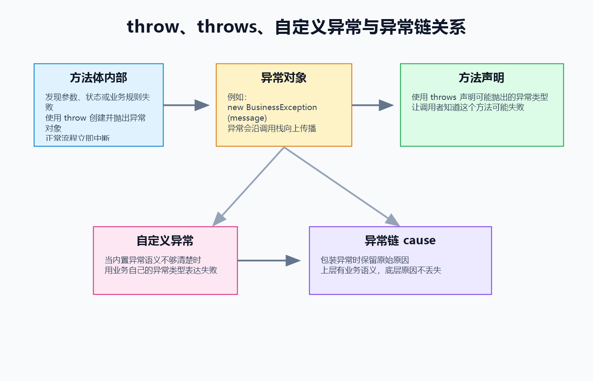
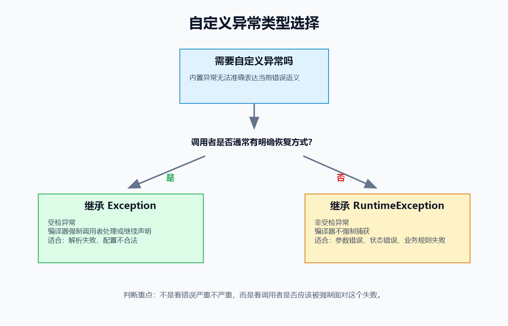
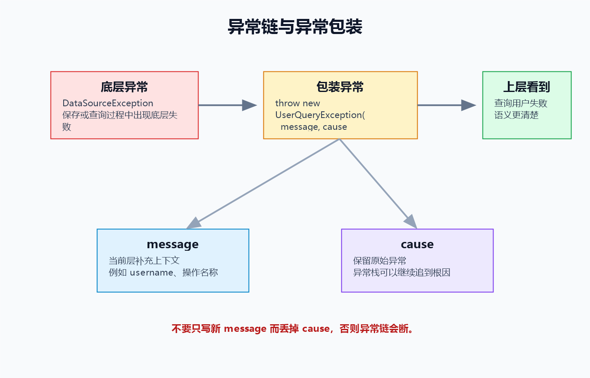
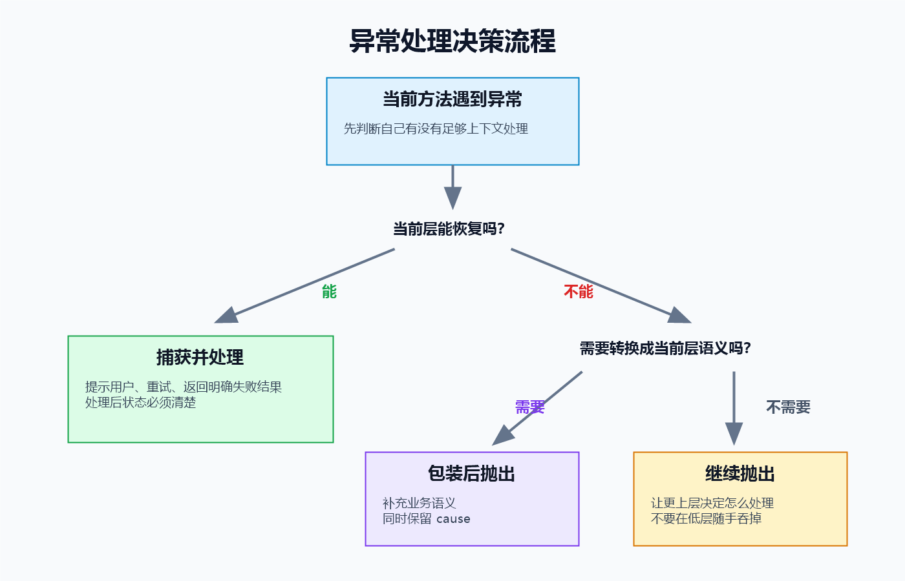

> [!info] 知识摘要
> **总结**
> - `throw` 用于在方法内部主动表达失败，`throws` 用于把可能失败写进方法声明。
> - 自定义异常和异常链可以让错误语义更准确；包装异常时要保留 `cause` 和上下文。
>
> **相关知识点**
> - [[011_第十篇：异常处理（上）——基础|异常处理基础]]、`throw`、`throws`、自定义异常、异常链、异常包装、multi-catch

---

## 概念入口

> [[011_第十篇：异常处理（上）——基础|上一篇]]整理了异常处理最基础的问题：异常是什么，`try-catch-finally` 怎么执行，异常为什么会沿着方法调用栈向上传播。学到这里，已经能看懂大多数报错信息，也能写出基本的捕获逻辑。
>
> 但真正写代码时，还会遇到更进一步的问题：什么时候应该主动 `throw`？方法声明上的 `throws` 到底有什么用？Java 内置异常不够表达业务错误时，能不能自己定义异常？包装异常时为什么一定要保留原始原因？本笔记就围绕这些问题，把异常处理从“会接住”推进到“会设计”。

---

## 一、先看进阶异常处理要解决什么问题

### 1.1 上篇和下篇的分工

异常处理可以分成两层：

| 层次 | 重点问题 | 代表知识点 |
| --- | --- | --- |
| 基础篇 | 异常怎么被捕获、怎么传播、怎么阅读异常栈 | `Throwable`、`try-catch-finally`、调用栈 |
| 进阶篇 | 异常什么时候主动抛、怎么声明、怎么设计、怎么包装 | `throw`、`throws`、自定义异常、异常链 |

也就是说，基础篇更像是在回答：

```text
程序出错以后，Java 怎么处理？
```

进阶篇更像是在回答：

```text
我们写代码时，应该怎样主动表达失败？
```

### 1.2 核心地图

可以先用一张表建立整体直觉：

| 知识点 | 一句话理解 |
| --- | --- |
| `throw` | 在方法内部主动抛出一个异常对象 |
| `throws` | 在方法声明上告诉调用者：这个方法可能抛异常 |
| 自定义异常 | 用自己的异常类型表达更准确的错误语义 |
| 异常链 | 包装异常时保留底层原始原因 |
| 异常包装 | 把底层异常转换成当前层更合适的异常 |
| 最佳实践 | 不吞异常、不乱捕获、不丢 cause、不用异常控制正常流程 |



**💡 核心结论：** 异常处理不是只会写 `catch`，更重要的是知道“当前方法发现失败时，应该自己处理、继续抛出，还是转换成更合适的异常”。

---

## 二、throw：主动抛出异常

### 2.1 throw 是什么

`throw` 用在方法体内部，用于主动抛出一个异常对象。

基本格式：

```java
throw new 异常类名("异常信息");
```

例如：

```java
throw new IllegalArgumentException("age 不能为负数");
```

这行代码的意思是：当前方法发现参数不合法，已经无法按照正常流程继续执行，于是主动创建一个异常对象并抛出去。

### 2.2 用参数校验理解 throw

**✅ 参数校验失败时主动抛出异常**

```java
public static void setAge(int age) {
    if (age < 0) {
        throw new IllegalArgumentException("age 不能为负数，age=" + age);
    }

    System.out.println("年龄设置成功：" + age);
}
```

这里的逻辑很清楚：

- `age >= 0`：继续正常执行。
- `age < 0`：参数不合法，方法无法完成“设置年龄”这个职责，直接抛出异常。

`throw` 执行后，当前正常流程会被打断。也就是说，异常抛出之后，同一个分支后面的普通代码不会继续执行。

### 2.3 throw 适合用在哪些场景

常见场景包括：

| 场景 | 常见异常 |
| --- | --- |
| 参数不合法 | `IllegalArgumentException` |
| 对象状态不允许当前操作 | `IllegalStateException` |
| 数组下标越界 | `ArrayIndexOutOfBoundsException` |
| 业务规则失败 | 自定义业务异常 |
| 当前操作不支持 | `UnsupportedOperationException` |

例如，除数不能为 0：

```java
public static int divide(int a, int b) {
    if (b == 0) {
        throw new IllegalArgumentException("除数不能为 0");
    }

    return a / b;
}
```

这里不建议随便返回 `0` 或 `-1`，因为“除数为 0”不是一个正常计算结果，而是方法无法完成职责。

### 2.4 throw 和 return 的区别

`throw` 和 `return` 都会让当前方法停止继续向下执行，但语义完全不同。

| 对比项 | `return` | `throw` |
| --- | --- | --- |
| 表达含义 | 方法正常完成 | 方法无法正常完成 |
| 返回内容 | 正常结果 | 异常对象 |
| 传播方向 | 只返回给直接调用者 | 沿调用栈向上传播，直到被捕获 |
| 常见场景 | 计算完成、查询成功、条件满足 | 参数错误、状态错误、外部失败、业务规则失败 |

**💡 核心结论：** 能给出正常结果时用 `return`；方法已经无法正常完成时，用 `throw` 表达失败。

---

## 三、throws：把异常风险写在方法声明上

### 3.1 throws 是什么

`throws` 写在方法声明上，用于说明这个方法可能向外抛出哪些异常。

基本格式：

```java
修饰符 返回值类型 方法名(参数列表) throws 异常类型1, 异常类型2 {
    // 方法体
}
```

示例：

```java
public static void parseExpression(String expression) throws ExpressionParseException {
    if (expression == null || expression.isBlank()) {
        throw new ExpressionParseException("表达式不能为空");
    }
}
```

这里有两个动作：

- 方法声明上的 `throws ExpressionParseException`：告诉调用者这个方法可能抛出 `ExpressionParseException`。
- 方法体里的 `throw new ExpressionParseException(...)`：真正创建并抛出异常对象。

### 3.2 throw 和 throws 的区别

这两个关键字非常容易混，但它们不是一回事。

| 对比项 | `throw` | `throws` |
| --- | --- | --- |
| 位置 | 方法体内部 | 方法声明上 |
| 后面跟什么 | 一个异常对象 | 一个或多个异常类型 |
| 是否真的抛异常 | 是 | 否，只是声明 |
| 作用 | 主动抛出异常 | 提醒调用者方法可能失败 |

**✅ throw 与 throws 同时出现的示例**

```java
public static void checkAge(int age) throws IllegalArgumentException {
    if (age < 0) {
        throw new IllegalArgumentException("age 不能为负数，age=" + age);
    }
}
```

严格来说，`IllegalArgumentException` 是运行时异常，不强制写 `throws`。这里保留它，只是为了帮助观察两个关键字的位置差异。

### 3.3 受检异常为什么经常配合 throws

如果一个方法内部可能抛出受检异常，并且当前方法不打算捕获处理，就必须在方法声明上写 `throws`。

先定义一个受检异常：

```java
public class ExpressionParseException extends Exception {
    public ExpressionParseException(String message) {
        super(message);
    }
}
```

再让解析方法声明它：

```java
public static void parse(String expression) throws ExpressionParseException {
    if (expression == null || expression.isBlank()) {
        throw new ExpressionParseException("表达式不能为空");
    }
}
```

调用者有两种选择。

方式一：自己捕获处理。

```java
try {
    parse("");
} catch (ExpressionParseException e) {
    System.out.println("解析失败：" + e.getMessage());
}
```

方式二：继续声明抛出。

```java
public static void compile(String expression) throws ExpressionParseException {
    parse(expression);
}
```

这就是受检异常的核心规则：**要么当前层处理，要么继续告诉上一层。**

> ⚠️ **误区：throws 表示这个方法一定会抛异常**
>
> **正确理解：** `throws` 只是声明“可能抛出”。至于运行时到底抛不抛，要看方法体中的实际执行路径。

---

## 四、自定义异常：让错误语义更准确

### 4.1 为什么需要自定义异常

Java 内置异常已经很多，例如：

```text
NullPointerException
IllegalArgumentException
IllegalStateException
IOException
SQLException
```

但实际开发中，经常会遇到更具体的业务错误：

- 用户名已存在。
- 余额不足。
- 订单状态不允许取消。
- 配置格式不合法。
- 表达式解析失败。

如果这些问题全部用 `RuntimeException` 表示，代码确实能跑，但语义很模糊。调用者只知道“出错了”，却不知道“到底是哪类错误”。

自定义异常的价值，就是让异常类型本身带有语义。

### 4.2 自定义运行时异常

自定义运行时异常通常继承 `RuntimeException`。

**✅ 自定义业务运行时异常**

```java
public class BusinessException extends RuntimeException {
    public BusinessException(String message) {
        super(message);
    }

    public BusinessException(String message, Throwable cause) {
        super(message, cause);
    }
}
```

使用：

```java
public static void pay(int balance, int amount) {
    if (amount > balance) {
        throw new BusinessException("余额不足，balance=" + balance + ", amount=" + amount);
    }

    System.out.println("支付成功");
}
```

运行时异常适合表达：

- 参数错误。
- 状态错误。
- 业务规则失败。
- 调用者通常无法在当前代码附近恢复的问题。

### 4.3 自定义受检异常

自定义受检异常通常继承 `Exception`。

**✅ 自定义解析异常**

```java
public class ExpressionParseException extends Exception {
    public ExpressionParseException(String message) {
        super(message);
    }

    public ExpressionParseException(String message, Throwable cause) {
        super(message, cause);
    }
}
```

使用：

```java
public static void parseExpression(String expression) throws ExpressionParseException {
    if (expression == null || expression.isBlank()) {
        throw new ExpressionParseException("表达式不能为空");
    }

    if (!expression.endsWith(";")) {
        throw new ExpressionParseException("表达式缺少结束符 ;");
    }
}
```

受检异常适合表达：

- 调用者确实有机会恢复的问题。
- API 希望强制调用者面对的问题。
- 外部输入、外部资源或可预期失败。

### 4.4 到底继承 Exception 还是 RuntimeException

可以先用这张表判断：

| 选择 | 编译器是否强制处理 | 适合场景 | 典型例子 |
| --- | --- | --- | --- |
| 继承 `Exception` | 强制 | 调用者有明确恢复方式 | 解析失败、配置错误 |
| 继承 `RuntimeException` | 不强制 | 参数错误、状态错误、业务规则失败 | 余额不足、非法参数 |



入门阶段可以先记住一个朴素判断：

- 如果你希望调用者必须处理这个失败，考虑受检异常。
- 如果这个失败更多表示参数、状态或业务规则不满足，通常使用运行时异常更自然。

**💡 核心结论：** 自定义异常不是为了“显得高级”，而是为了让错误类型更准确，让调用者更容易判断该怎么处理。

---

## 五、异常链与异常包装：不要弄丢真正原因

### 5.1 什么是异常链

异常链用于把“当前层抛出的异常”和“底层原始异常”连接起来。

例如：

```java
try {
    loadConfig();
} catch (ConfigSourceException e) {
    throw new ConfigException("加载系统配置失败", e);
}
```

这里的 `e` 就是原始异常，也叫 `cause`。

如果把它传给新异常：

```java
throw new ConfigException("加载系统配置失败", e);
```

那么后续排查问题时，既能看到“加载系统配置失败”这个当前层语义，也能继续往下看到底层到底为什么失败。



### 5.2 自定义异常要支持 cause

为了保留异常链，自定义异常建议提供带 `Throwable cause` 的构造方法。

```java
public class ConfigException extends RuntimeException {
    public ConfigException(String message) {
        super(message);
    }

    public ConfigException(String message, Throwable cause) {
        super(message, cause);
    }
}
```

两个构造方法分别解决：

| 构造方法 | 适用场景 |
| --- | --- |
| `ConfigException(String message)` | 只有当前层错误信息 |
| `ConfigException(String message, Throwable cause)` | 包装底层异常，同时保留原始原因 |

### 5.3 异常包装的正确姿势

异常包装不是把异常藏起来，而是把底层异常转换成当前层更合适的语义。

错误示例：

```java
try {
    queryUser(username);
} catch (DataSourceException e) {
    throw new RuntimeException("查询用户失败");
}
```

问题是：原始异常 `e` 被丢掉了。以后看到异常栈，只知道“查询用户失败”，却看不到底层到底发生了什么。

更好的写法：

```java
try {
    queryUser(username);
} catch (DataSourceException e) {
    throw new RuntimeException("查询用户失败，username=" + username, e);
}
```

这样做有两个好处：

- `username` 这样的当前上下文被补充进异常消息。
- 底层的 `DataSourceException` 作为 cause 被保留下来。

> ⚠️ **误区：包装异常时只写 message 就够了**
>
> **正确理解：** 包装异常时应该尽量保留 `cause`。只保留 message 会让原始异常链断掉，排查问题会困难很多。

---

## 六、遇到异常时，到底捕获、上抛还是包装

### 6.1 三种选择

一个方法遇到异常时，通常有三种选择：

| 选择 | 适用情况 | 例子 |
| --- | --- | --- |
| 捕获并处理 | 当前层知道怎么恢复 | 提示用户重新输入 |
| 继续抛出 | 当前层没有足够上下文 | 工具方法把失败交给调用方 |
| 包装后抛出 | 当前层需要转换错误语义 | 底层数据异常包装成业务异常 |



判断标准很简单：**谁有足够上下文，谁处理。**

### 6.2 当前层能处理，就处理

例如用户输入年龄：

```java
try {
    int age = Integer.parseInt(input);
    setAge(age);
} catch (NumberFormatException e) {
    System.out.println("请输入合法数字");
}
```

这里当前层知道可以提示用户重新输入，所以捕获处理是合理的。

### 6.3 当前层不能处理，就继续抛

如果当前方法只是一个底层工具方法，不知道调用者想怎么处理失败，就不要擅自决定。

```java
public static void parse(String expression) throws ExpressionParseException {
    if (expression == null || expression.isBlank()) {
        throw new ExpressionParseException("表达式不能为空");
    }
}
```

这个方法只负责解析。解析失败后，提示用户、记录日志、终止流程还是换一个表达式重试，应该由更上层决定。

### 6.4 当前层需要换语义，就包装后抛

例如底层异常叫 `DataSourceException`，但当前业务动作是“查询用户”：

```java
try {
    queryUser(username);
} catch (DataSourceException e) {
    throw new UserQueryException("查询用户失败，username=" + username, e);
}
```

这样上层看到的是更清晰的业务语义：用户查询失败。

**💡 核心结论：** 异常不是“越早 catch 越好”，而是谁真正知道怎么处理，谁再处理。

---

## 七、进阶规则：重写、多异常捕获和资源边界

### 7.1 方法重写时 throws 不能随便扩大

继承里有一个容易忽略的规则：子类重写父类方法时，不能随便扩大受检异常范围。

可以这样理解：父类方法已经向调用者承诺了“我可能抛哪些受检异常”。子类重写后，如果突然抛出更宽、更陌生的受检异常，调用者按父类类型使用时就会被坑。

合法示例：

```java
class SaveException extends Exception {
}

class DetailSaveException extends SaveException {
}

class Parent {
    public void save() throws SaveException {
    }
}

class Child extends Parent {
    @Override
    public void save() throws DetailSaveException {
    }
}
```

如果 `DetailSaveException` 是 `SaveException` 的子类，这样是可以的。

不合理示例：

```java
class Parent {
    public void save() {
    }
}

class Child extends Parent {
    @Override
    public void save() throws SaveException {
    }
}
```

如果 `SaveException` 是受检异常，这样不可以。因为父类方法没有声明这个受检异常，子类不能突然新增。

### 7.2 多异常捕获

如果多种异常的处理逻辑完全一致，可以使用多异常捕获。

```java
try {
    int number = Integer.parseInt(input);
    int result = 100 / number;
    System.out.println(result);
} catch (NumberFormatException | ArithmeticException e) {
    System.out.println("输入不合法：" + e.getMessage());
}
```

适合：

- 多个异常处理方式相同。
- 只是统一提示、统一记录或统一转换。

不适合：

- 不同异常需要不同恢复方式。
- 不同异常需要不同提示。
- 为了省事把完全不同的问题混在一起处理。

注意：multi-catch 里的异常类型不能有父子类关系。比如不能同时写 `NumberFormatException | IllegalArgumentException`，因为 `NumberFormatException` 本身就是 `IllegalArgumentException` 的子类。

### 7.3 try-with-resources 放到 IO 章节讲

`try-with-resources` 是非常重要的异常处理写法，它常用于自动关闭资源。

不过它和文件读写、字节流、字符流、资源关闭关系很紧密。为了避免异常篇提前展开 IO，本笔记只先留一个边界结论：

```text
需要关闭资源时，不要依赖“记得手写 close”，后续 IO 流章节会系统讲 try-with-resources。
```

这里先知道它存在即可，不急着展开。

---

## 八、异常处理最佳实践

### 8.1 不要吞异常

最危险的写法之一：

```java
try {
    doSomething();
} catch (Exception e) {
}
```

这段代码的问题是：异常消失了。

后果包括：

- 真实问题没有任何线索。
- 后续代码可能在错误状态下继续运行。
- 排查问题时只能靠猜。

至少应该做其中一件事：

- 记录异常信息。
- 给调用者返回明确失败结果。
- 重新抛出异常。
- 包装成更合适的异常再抛出。

更合理的示例：

```java
try {
    doSomething();
} catch (BusinessException e) {
    System.out.println("业务处理失败：" + e.getMessage());
    throw e;
}
```

### 8.2 不要捕获过宽

不推荐在底层代码里随手写：

```java
try {
    doSomething();
} catch (Exception e) {
    System.out.println("出错了");
}
```

问题在于：

- 真实异常类型被掩盖。
- 不同错误被迫走同一套处理逻辑。
- 原本应该暴露的编程错误也可能被吃掉。

更好的思路是：能捕获具体异常，就捕获具体异常。

```java
try {
    register(username);
} catch (DuplicateUsernameException e) {
    System.out.println("用户名已存在：" + username);
}
```

当然，在程序最外层做兜底捕获是另一回事。顶层兜底可以防止程序直接崩掉，但也应该记录完整异常信息，而不是把异常静默忽略。

### 8.3 不要滥用异常控制正常流程

异常适合表达非正常情况，不适合替代普通条件判断。

不推荐：

```java
try {
    int number = Integer.parseInt(input);
    System.out.println(number);
} catch (Exception e) {
    System.out.println("输入不是数字");
}
```

如果“输入是不是数字”是一个经常发生的普通分支，可以先做条件校验。

```java
if (input != null && input.matches("\\d+")) {
    int number = Integer.parseInt(input);
    System.out.println(number);
} else {
    System.out.println("请输入数字");
}
```

注意，这里重点不是推荐所有场景都用正则，而是强调：**普通分支优先用条件判断，异常用于非正常失败。**

### 8.4 异常消息要有上下文

异常消息不要只写：

```java
throw new IllegalArgumentException("error");
```

更好的写法：

```java
throw new IllegalArgumentException("score 必须在 0 到 100 之间，score=" + score);
```

好的异常消息通常包含：

- 哪个参数或对象出了问题。
- 当前值是什么。
- 为什么不合法。
- 当前正在执行什么操作。

### 8.5 异常分支也要测试

异常分支也是代码逻辑的一部分，也需要测试。

例如用 JUnit 风格写：

```java
assertThrows(IllegalArgumentException.class, () -> {
    setScore(-1);
});
```

如果要检查异常消息：

```java
IllegalArgumentException e = assertThrows(IllegalArgumentException.class, () -> {
    setScore(-1);
});

assertTrue(e.getMessage().contains("score"));
```

测试异常的意义是：

- 防止以后改代码时删掉参数校验。
- 防止异常类型变得过宽。
- 防止异常消息丢失关键上下文。
- 防止包装异常时忘记保留 cause。

> ⚠️ **误区：运行时异常不用管**
>
> **正确理解：** 运行时异常只是编译器不强制捕获，不代表设计上可以忽略。参数、状态、业务规则这些问题，仍然需要清晰表达和测试。

---

## 九、常见误区速查表

| 常见误区 | 更准确的理解 |
| --- | --- |
| `throw` 和 `throws` 差不多 | `throw` 是真正抛异常，`throws` 是声明可能抛异常 |
| `throws` 表示方法一定会抛异常 | `throws` 只表示可能抛出 |
| 自定义异常只是换个名字 | 自定义异常的核心价值是表达更准确的错误语义 |
| 捕获异常就算处理了 | 捕获后必须有明确动作：恢复、记录、提示、重新抛出或包装 |
| 包装异常时只保留 message 就够了 | 应该保留 cause，否则原始异常链会断 |
| `catch (Exception e)` 最省事 | 低层代码捕获过宽容易掩盖真正问题 |
| 运行时异常不用管 | 编译器不强制处理，不代表设计上可以忽略 |
| 异常可以代替所有 `if` 判断 | 普通业务分支优先用条件判断，异常用于非正常情况 |

---

## 总结

### 知识点总表

| 知识点 | 关键结论 |
| --- | --- |
| `throw` | 方法内部主动抛出异常对象，表示当前方法无法正常完成 |
| `throws` | 方法声明上说明可能抛出的异常类型，尤其常见于受检异常 |
| 自定义异常 | 用更具体的异常类型表达更准确的业务或领域错误 |
| 运行时异常 | 编译器不强制处理，常用于参数、状态、业务规则失败 |
| 受检异常 | 编译器强制处理或继续声明，适合调用者可恢复的问题 |
| 异常链 | 用 `cause` 保留底层原始异常 |
| 异常包装 | 把底层异常转换成当前层更合适的语义 |
| 多异常捕获 | 适合同一处理逻辑，但异常类型之间不能有父子关系 |
| 最佳实践 | 不吞异常、不捕获过宽、不丢 cause、不滥用异常控制流程 |

这个知识点的最终记忆可以压缩成四句话：

- **能处理，就捕获并给出明确处理动作。**
- **不能处理，就继续向上抛。**
- **需要转换语义，就包装后抛，并保留原始 cause。**
- **异常不是为了掩盖错误，而是为了让失败更清楚、更可控地传播。**
