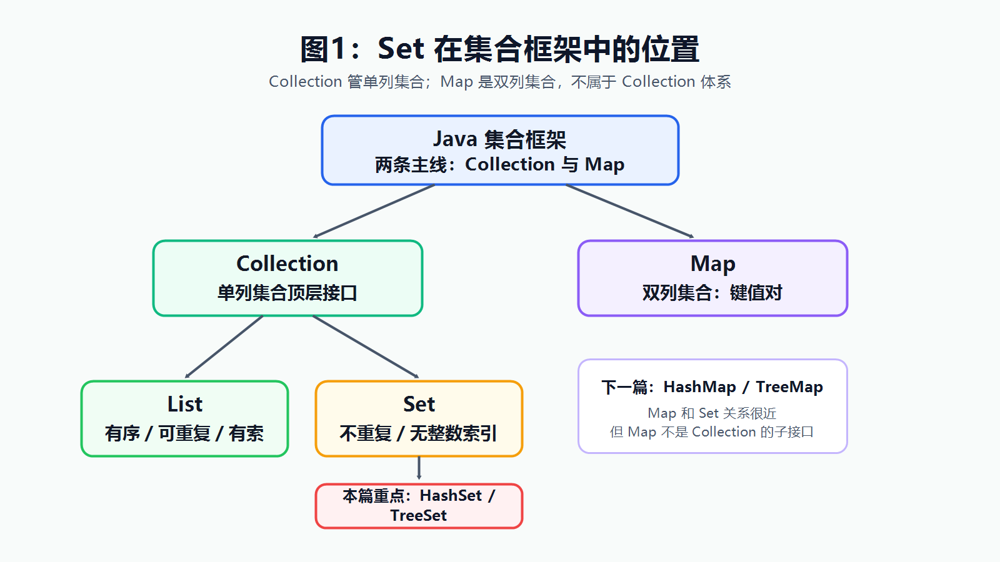
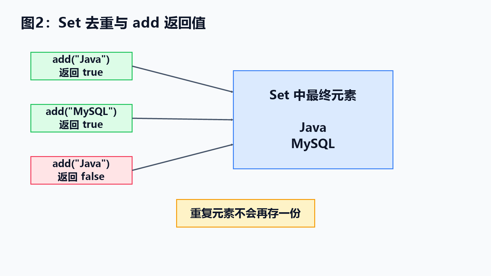
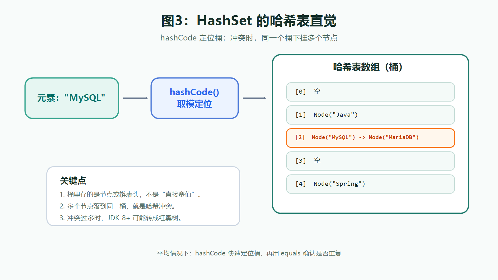
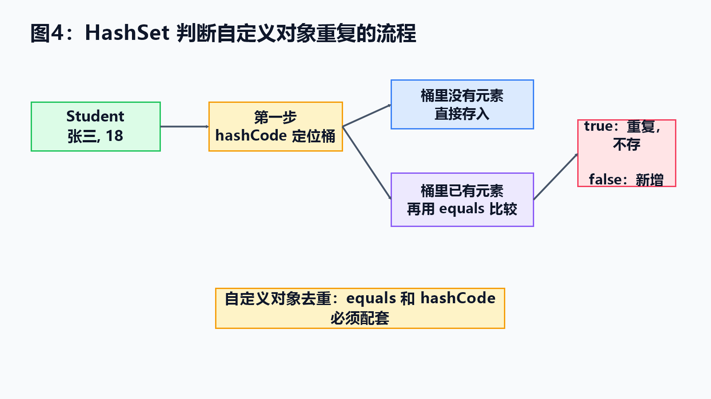
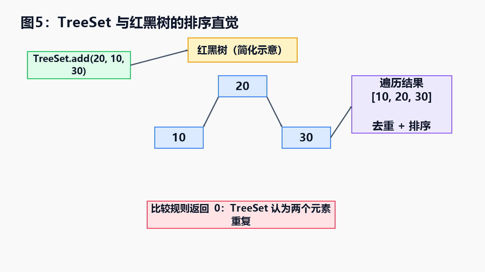

> [!info] 知识摘要
> **总结**
> - `Set` 负责去重，不提供 `List` 式索引；`HashSet` 依赖哈希表，`TreeSet` 依赖比较规则和红黑树排序。
> - 自定义对象放入 `HashSet` 要配套实现 `equals()` / `hashCode()`；放入 `TreeSet` 时比较结果 `0` 就代表重复。
>
> **相关知识点**
> - `Set`、`HashSet`、`LinkedHashSet`、`TreeSet`、`hashCode()`、`equals()`、红黑树、[[017_第十六篇：集合框架（下）——Map、HashMap 与 TreeMap|Map]]

---

## 概念入口

> 上一篇我们讲了 `Collection`、集合泛型和 `List`。`List` 的关键词是“有序、可重复、有索引”，而这一篇的主角 `Set` 正好反过来：它强调“不重复”，并且没有 `List` 意义上的整数索引。很多同学第一次学 `Set` 时，会卡在三个问题上：为什么重复元素加不进去？为什么 `HashSet` 打印顺序看起来很乱？为什么 `TreeSet` 能自动排序？本笔记就围绕这三件事，把 `Set`、`HashSet`、哈希表、`TreeSet` 和树结构串起来。

---

## 一、先建立 Set 的位置

### 1.1 Set 在集合框架里属于哪里

`Set` 是 `Collection` 的子接口，和 `List` 是同一级别的兄弟。

| 名称 | 一句话理解 |
| --- | --- |
| `Collection` | 单列集合顶层接口，一次存一个元素 |
| `List` | 有序、可重复、有索引 |
| `Set` | 不重复、没有 `List` 意义上的整数索引 |
| `Map` | 双列集合，存键值对，不属于 `Collection` 体系 |

**核心结论：** `Set` 不是 `List` 的升级版，它解决的是“去重”问题，不解决“按下标访问”问题。



### 1.2 Set 和 List 最该分清什么

`List` 和 `Set` 最关键的区别只有三点：

| 对比点 | `List` | `Set` |
| --- | --- | --- |
| 是否允许重复 | 允许 | 不允许 |
| 是否有索引 | 有 | 没有 `List` 意义上的整数索引 |
| 常见用途 | 保留顺序、按位置取元素 | 去重、判断是否出现过 |

所以如果你写的是：

```java
Set<String> set = new HashSet<>();
```

就不要再想着这样取值：

```java
set.get(0); // 编译错误，Set 没有 get(int index)
```

这不是 `HashSet` 不支持，而是整个 `Set` 体系就不提供按整数下标访问的能力。注意：没有索引不等于没有遍历顺序，像 `LinkedHashSet` 会保留插入顺序，`TreeSet` 会按比较规则排序，但它们仍然不能 `get(0)`。

---

## 二、Set 的基本用法

### 2.1 Set 的三个特点

入门阶段先记住：

- `Set` 不允许重复元素。
- `Set` 没有索引，不能用普通 `for + get(i)` 遍历。
- `Set` 的元素顺序取决于具体实现类，不要默认等于添加顺序。

**示例：Set 去重**

```java
Set<String> set = new HashSet<>();

set.add("Java");
set.add("MySQL");
set.add("Java");

System.out.println(set);
System.out.println(set.size());
```

这里虽然添加了两次 `"Java"`，但集合里只会保留一个。

### 2.2 add 的返回值要会看

`Set.add(E e)` 的返回值很有用：

```java
boolean first = set.add("Java");
boolean second = set.add("Java");

System.out.println(first);  // true
System.out.println(second); // false
```

第一次添加成功，返回 `true`。第二次因为元素已经存在，添加失败，返回 `false`。



### 2.3 Set 怎么遍历

因为 `Set` 没有索引，所以常见遍历方式是增强 `for` 或迭代器。

**示例：增强 for 遍历 Set**

```java
for (String value : set) {
    System.out.println(value);
}
```

**示例：迭代器遍历 Set**

```java
Iterator<String> iterator = set.iterator();

while (iterator.hasNext()) {
    System.out.println(iterator.next());
}
```

如果只是读元素，增强 `for` 最简单。如果遍历时需要删除元素，仍然用迭代器自己的 `remove()`。

Java 8 之后，也可以用 Lambda 方式遍历。下面这两行属于后续内容预告，当前阶段先会增强 `for` 和迭代器即可：

```java
set.forEach(value -> System.out.println(value));
```

如果只是打印，也可以写成：

```java
set.forEach(System.out::println);
```

其中 `value -> ...` 是 Lambda 表达式，`System.out::println` 是方法引用，后面的 Stream 流和方法引用章节会专门讲。

---

## 三、HashSet：靠哈希表去重

### 3.1 HashSet 的基本特点

`HashSet` 是最常用的 `Set` 实现类。

它有三个特点：

- 底层依赖哈希表。
- 元素不重复。
- 不保证存取顺序。

注意第三点很重要。下面这段代码：

```java
Set<String> set = new HashSet<>();
set.add("ccc");
set.add("aaa");
set.add("bbb");

System.out.println(set);
```

输出顺序不一定是 `ccc`、`aaa`、`bbb`。不要把 `HashSet` 当成“会去重的 List”。

### 3.2 哈希表的直觉

哈希表可以粗略理解成：

> 先通过 `hashCode()` 算出一个哈希值，再根据这个值找到数组中的某个位置。

比如：

```text
"Java"  -> hashCode() -> 2301506 -> 某个桶
"MySQL" -> hashCode() -> 74771305 -> 另一个桶
```

这个“桶”可以理解成哈希表数组中的一个位置。

用文字画出来，大概是这样：

```text
哈希表数组
[0]  空
[1]  Node("Java")
[2]  Node("MySQL") -> Node("MariaDB")
[3]  空
[4]  Node("Spring")
```

这里的桶里不是直接“塞字符串”，而是存放节点或链表头。`[2]` 这个位置挂了 `Node("MySQL")` 和 `Node("MariaDB")`，就可以理解成它们发生了哈希冲突。

**核心结论：** `HashSet` 查找快，是因为它不是从头到尾挨个找，而是先用哈希值定位大概位置。



### 3.3 哈希冲突：不同对象可能进同一个桶

哈希值不是身份证，不保证每个对象都能分到完全不同的位置。

如果两个不同元素算出来的位置相同，就叫**哈希冲突**。

Java 的哈希表会在同一个桶里继续存放多个元素。入门阶段可以这样理解：

- JDK 8 以前：数组 + 链表。
- JDK 8 以后：数组 + 链表；当某个桶里的链表过长，并且数组容量足够时，会转成红黑树。

更具体一点：`HashSet` 底层依赖 `HashMap`，源码里常被问到三个常量：树化阈值 `TREEIFY_THRESHOLD = 8`，退化阈值 `UNTREEIFY_THRESHOLD = 6`，最小树化容量 `MIN_TREEIFY_CAPACITY = 64`。可以口语化记作：同一个桶里的节点数超过 `8`，并且数组容量至少为 `64`，才会考虑把链表转成红黑树；如果容量小于 `64`，会优先扩容；树节点数量降到 `6` 左右时，又可能退回链表。`8` 和 `6` 分开，是为了避免链表和树之间频繁来回切换。

真正要记住的是：

> 哈希表不是完全没有冲突，而是有一套处理冲突的办法。

### 3.4 容量、负载因子和扩容

`HashSet` 之所以快，不只因为“用了数组”，还因为它会在元素变多时扩容。

入门阶段先记住三个数字：

| 概念 | 常见默认值 | 作用 |
| --- | --- | --- |
| 初始容量 | `16` | 默认构造下，首次放入元素后底层数组通常初始化到这个长度 |
| 负载因子 | `0.75` | 控制什么时候扩容 |
| 扩容条件 | `元素个数 > 容量 * 负载因子` | 超过阈值后扩容并重新分布元素 |

比如默认容量是 `16`，负载因子是 `0.75`，阈值就是 `12`。当元素数量继续增加，超过这个阈值时，底层数组会扩容，原来的元素也要重新计算位置。

所以如果你大概知道会放很多元素，可以提前指定容量，减少频繁扩容：

```java
Set<String> set = new HashSet<>(1024);
```

注意，这里的 `1024` 是初始容量，不表示集合里已经有 `1024` 个元素，`size()` 仍然是 `0`。

如果预计要放 `1000` 个元素，容量最好不要只写 `1000`，因为超过 `容量 * 0.75` 就会扩容。可以按 `预估元素个数 / 0.75` 粗略反推初始容量，减少扩容和元素重新分布的次数。

### 3.5 hashCode 的质量为什么重要

`hashCode()` 的目标不是“保证唯一”，而是尽量把对象均匀分散到不同桶里。

如果大量对象的 `hashCode()` 都一样，所有元素就会挤到同一个桶里，`HashSet` 的查找就会从“快速定位”退化成“在一串元素里找”。JDK 8 之后红黑树能缓解极端冲突，但这不是让我们随便写 `hashCode()` 的理由。

像 `String` 这样的类已经认真实现了 `hashCode()`，会把每个字符都纳入计算，经典形式类似 `31 * 前一次结果 + 当前字符`，尽量让不同字符串分布得更均匀。自己写类时，最稳妥的做法是让 IDE 自动生成 `equals()` 和 `hashCode()`，或者使用 `Objects.hash(...)` 这类工具方法。

---

## 四、HashSet 如何判断重复

### 4.1 先看字符串为什么能去重

字符串可以正常去重：

```java
Set<String> set = new HashSet<>();

set.add("Java");
set.add("Java");

System.out.println(set.size()); // 1
```

这是因为 `String` 已经重写好了 `equals()` 和 `hashCode()`。

`HashSet` 判断重复时，大致分两步：

1. 先看 `hashCode()`，决定大概去哪个桶找。
2. 如果桶里已有元素，再用 `equals()` 确认是不是同一个元素。



### 4.2 自定义对象必须重写 equals 和 hashCode

如果你往 `HashSet` 里存自定义对象，比如 `Student`：

```java
Set<Student> students = new HashSet<>();

students.add(new Student("张三", 18));
students.add(new Student("张三", 18));

System.out.println(students.size());
```

如果 `Student` 没有重写 `equals()` 和 `hashCode()`，这两个对象通常会被当成两个不同对象。

**示例：Student 去重所需方法**

```java
public class Student {
    private String name;
    private int age;

    public Student(String name, int age) {
        this.name = name;
        this.age = age;
    }

    public String getName() {
        return name;
    }

    public int getAge() {
        return age;
    }

    // 这里只为演示风险：age 参与 hashCode，加入 HashSet 后不建议再修改。
    public void setAge(int age) {
        this.age = age;
    }

    @Override
    public boolean equals(Object o) {
        if (this == o) {
            return true;
        }
        if (!(o instanceof Student)) {
            return false;
        }
        Student other = (Student) o;
        return age == other.age && name.equals(other.name);
    }

    @Override
    public int hashCode() {
        int result = name.hashCode();
        result = 31 * result + age;
        return result;
    }
}
```

**核心结论：** 想让 `HashSet` 按对象内容去重，`equals()` 和 `hashCode()` 必须一起重写。

### 4.3 入 Set 后不要乱改关键字段

这是一个很容易埋雷的点。

如果 `name` 和 `age` 参与了 `hashCode()` 计算，那么对象加入 `HashSet` 后，就不要再修改这些字段。

错误示例：

```java
Student s = new Student("张三", 18);

Set<Student> set = new HashSet<>();
set.add(s);

s.setAge(20);

System.out.println(set.contains(s)); // 可能变成 false
```

为什么？

因为对象加入集合时，是按旧的哈希值放进某个桶里的。你改了参与哈希计算的字段，新哈希值变了，集合再找它时就可能去错桶。

> ⚠️ **误区：只要对象还在 HashSet 里，就一定能 contains 找到**
>
> **正确理解：** 如果对象参与 `equals()` / `hashCode()` 的字段被修改，`HashSet` 可能找不到它，删除也可能失败。

---

## 五、TreeSet：靠树结构排序

### 5.1 TreeSet 的基本特点

`TreeSet` 也是 `Set` 的实现类，但它和 `HashSet` 的目标不同。

| 实现类 | 底层直觉 | 核心能力 |
| --- | --- | --- |
| `HashSet` | 哈希表 | 去重快，不保证顺序 |
| `TreeSet` | 红黑树 | 去重，并按照规则排序 |

**示例：TreeSet 排序**

```java
Set<Integer> set = new TreeSet<>();

set.add(30);
set.add(10);
set.add(20);
set.add(10);

System.out.println(set); // [10, 20, 30]
```

`TreeSet` 仍然不允许重复，重复的 `10` 不会存两份；同时它会按照自然顺序排序。

### 5.2 TreeSet 的排序从哪里来

`TreeSet` 有两种排序来源：

| 排序方式 | 写法 | 适合场景 |
| --- | --- | --- |
| 自然排序 | 元素类实现 `Comparable` | 类本身就应该有默认顺序 |
| 比较器排序 | 创建 `TreeSet` 时传入 `Comparator` | 这次集合需要临时指定顺序 |

对于初学者，更推荐先会用比较器，因为它不会强迫你改类本身。

下面为了让代码短一些，使用了 Java 8 的 Lambda 写法。如果暂时看不懂 `->`，先把它理解成“传入一段比较规则”；Lambda 会在后面的 Stream 流章节再系统讲。

**示例：使用 Comparator 指定排序规则**

```java
TreeSet<Student> set = new TreeSet<>((a, b) -> {
    int result = Integer.compare(a.getAge(), b.getAge());
    if (result != 0) {
        return result;
    }
    return a.getName().compareTo(b.getName());
});
```

这里的规则是：

1. 先按年龄从小到大排序。
2. 年龄相同，再按姓名排序。

这个例子默认 `name` 不为 `null`。真实业务中如果姓名可能为空，要么在入集合前做非空校验，要么使用能处理 `null` 的比较器，例如 `Comparator.nullsLast(...)`。

不要写成：

```java
return a.getAge() - b.getAge();
```

这个写法看起来简单，但遇到极端数值时可能发生整数溢出。更稳妥的写法是 `Integer.compare(a, b)`。

### 5.3 compare 返回 0 就等于重复

`TreeSet` 判断重复不靠 `equals()`，而是看比较结果。

如果比较器返回 `0`，`TreeSet` 就认为两个元素重复。

错误示例：

```java
TreeSet<Student> set = new TreeSet<>((a, b) -> {
    return Integer.compare(a.getAge(), b.getAge());
});
```

这段代码只比较年龄。结果就是：两个学生只要年龄相同，就会被 `TreeSet` 当成重复元素，即使姓名不同也可能加不进去。

正确做法是补上次要条件：

```java
TreeSet<Student> set = new TreeSet<>((a, b) -> {
    int result = Integer.compare(a.getAge(), b.getAge());
    if (result != 0) {
        return result;
    }
    return a.getName().compareTo(b.getName());
});
```

**核心结论：** `TreeSet` 里，比较规则不仅决定排序，也决定“谁算重复”。

---

## 六、树结构：为什么 TreeSet 能有序

### 6.1 二叉搜索树的直觉

`TreeSet` 的底层是红黑树。要理解红黑树，先知道二叉搜索树的基本规则：

```text
左边比当前节点小
右边比当前节点大
```

例如：

```text
        20
       /  \
     10    30
```

查找 `30` 时，不需要把所有元素都看一遍：

1. 先看 `20`。
2. `30` 比 `20` 大，往右走。
3. 找到 `30`。

这就是树结构能加速查找的直觉。

### 6.2 红黑树解决什么问题

普通二叉搜索树有一个问题：如果数据按顺序插入，树可能歪成一条链。

```text
10
  \
   20
     \
      30
        \
         40
```

这样查找就慢了，和链表差不多。

红黑树可以理解成一种“会自我修正的二叉搜索树”。它给节点染上红色或黑色，并在插入、删除时通过**变色**和**旋转**调整结构，避免树一路歪下去。

入门阶段不用背红黑树规则，只要知道：

> `TreeSet` 使用红黑树，是为了在保持排序能力的同时，让添加、删除、查找在最坏情况下也保持在较稳定的 `O(log n)` 级别。

这和 `HashSet` 的思路不同：`HashSet` 追求平均 `O(1)` 的增删查，但性能受哈希分布和冲突影响；`TreeSet` 牺牲一点平均速度，换来稳定的排序能力和 `O(log n)` 的复杂度边界。



---

## 七、HashSet、LinkedHashSet 和 TreeSet 怎么选

真正写代码时，不要纠结名字高级不高级，按需求选。

### 7.1 按需求选

| 需求 | 推荐选择 | 原因 |
| --- | --- | --- |
| 只需要去重，不关心顺序 | `HashSet` | 最常用，查找和添加通常更快 |
| 去重后还要排序 | `TreeSet` | 自动按照比较规则排序 |
| 去重后还想保留添加顺序 | `LinkedHashSet` | 维护插入顺序 |
| 需要键值对 | `Map` | 下一篇专门讲 |

`LinkedHashSet` 可以理解成：它在 `HashSet` 的基础上，额外维护了一条链表记录插入顺序，所以遍历时能按添加顺序输出。

**示例：去重后保留添加顺序**

```java
Set<String> set = new LinkedHashSet<>();

set.add("Java");
set.add("MySQL");
set.add("Java");
set.add("Spring");

System.out.println(set); // [Java, MySQL, Spring]
```

这类写法适合“去重，但不要打乱用户输入顺序”的场景，比如标签列表、导入记录、访问历史等。

### 7.2 性能和顺序对比

| 实现类 | 增删查复杂度直觉 | 遍历顺序 | 典型场景 |
| --- | --- | --- | --- |
| `HashSet` | 平均 `O(1)`，极端冲突会变差 | 不保证顺序 | 只关心去重和快速查找 |
| `LinkedHashSet` | 平均 `O(1)`，比 `HashSet` 多维护链表 | 按插入顺序 | 去重后保留添加顺序 |
| `TreeSet` | `O(log n)` | 按比较规则排序 | 去重后还要排序、范围查询 |

**核心结论：** 默认先想 `HashSet`；需要保留添加顺序用 `LinkedHashSet`；需要排序再换 `TreeSet`；需要键值对就不是 `Set` 的任务了。

### 7.3 null 和线程安全边界

`null` 的处理也容易踩坑：

| 实现类 | 是否允许 `null` | 说明 |
| --- | --- | --- |
| `HashSet` | 允许一个 `null` | 第二个 `null` 会被当成重复元素 |
| `LinkedHashSet` | 允许一个 `null` | 规则和 `HashSet` 类似 |
| `TreeSet` | 自然排序下不允许 | 因为 `null` 没法参与默认比较，会抛出 `NullPointerException` |

另外，`HashSet`、`LinkedHashSet`、`TreeSet` 本身都不是线程安全集合。多线程同时读写时，要使用同步包装或并发集合。当前还没讲并发集合，先认识一个同步包装写法即可：

```java
Set<String> set = Collections.synchronizedSet(new HashSet<>());
```

上面代码需要导入 `java.util.*`。更专门的并发集合会放到多线程章节再讲。

这些内容不要求现在全部掌握，但要知道：`Set` 负责去重，不天然负责线程安全。

---

## 八、常见误区速查表

| 常见误区 | 更准确的理解 |
| --- | --- |
| `Set` 是会去重的 `List` | 不是，`Set` 没有索引，不能按位置取元素 |
| `HashSet` 会按添加顺序输出 | 不保证，输出顺序不要依赖 |
| 自定义对象放进 `HashSet` 自动按内容去重 | 不会，必须正确重写 `equals()` 和 `hashCode()` |
| 只重写 `equals()` 就够了 | 不够，`HashSet` 还依赖 `hashCode()` 定位桶 |
| `TreeSet` 的比较器只影响排序 | 不只影响排序，返回 `0` 还表示重复 |
| 对象进了 `HashSet` 后可以随便改字段 | 参与 `equals()` / `hashCode()` 的字段不要乱改，否则可能找不到或删不掉 |
| `HashSet` 不能存 `null` | 可以存一个 `null`，第二个会被当成重复 |
| `TreeSet` 默认也能随便存 `null` | 自然排序下不能比较 `null`，会抛出 `NullPointerException` |
| `Set` 实现类天然线程安全 | 不是，多线程读写要使用同步包装或并发集合 |

---

## 总结

| 知识点 | 一句话理解 |
| --- | --- |
| `Set` | 不重复、无索引，适合去重 |
| `HashSet` | 基于哈希表，去重快，不保证顺序 |
| `LinkedHashSet` | 基于哈希表并维护插入顺序，适合“去重但保序” |
| `hashCode()` | 帮对象找到大概桶位置 |
| `equals()` | 在桶里进一步确认是否真的是同一个元素 |
| `TreeSet` | 基于红黑树，去重同时排序 |
| `Comparator` / `Comparable` | 决定 `TreeSet` 的排序规则，也决定谁算重复 |
| `null` 与线程安全 | `HashSet` 可存一个 `null`，`TreeSet` 自然排序下通常不行；常见 `Set` 实现不是线程安全的 |

最终记忆：

- **`Set` 解决去重问题，不解决按索引访问问题。**
- **`HashSet` 判断自定义对象重复，`equals()` 和 `hashCode()` 必须配套。**
- **`TreeSet` 的比较规则返回 `0`，就表示两个元素重复。**
- **需要去重选 `HashSet`，需要保留添加顺序选 `LinkedHashSet`，需要排序选 `TreeSet`。**

下一篇会继续讲集合框架下篇：`Map`、`HashMap`、`TreeMap`。到那里，你会看到“键值对”是怎么工作的，也会理解为什么 `HashMap` 和 `HashSet` 的底层关系非常近。

