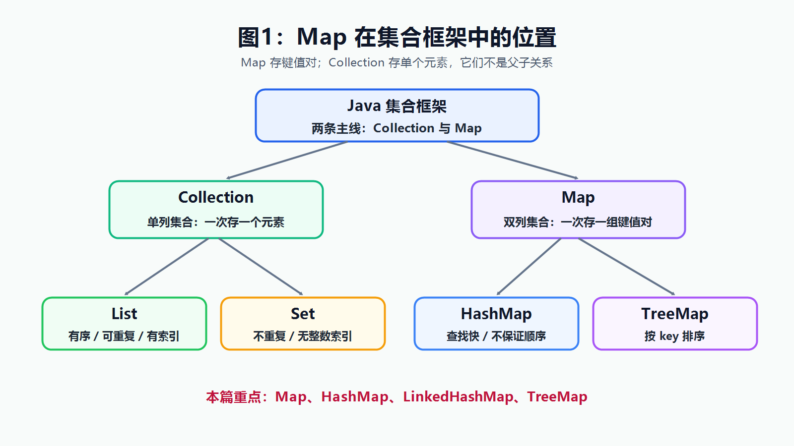
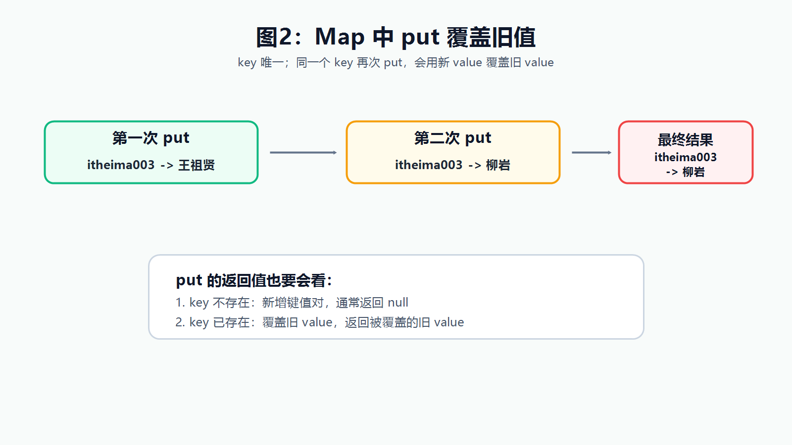
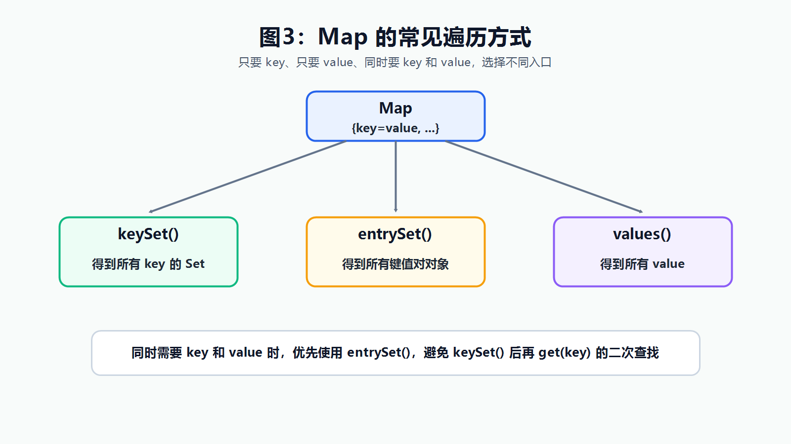
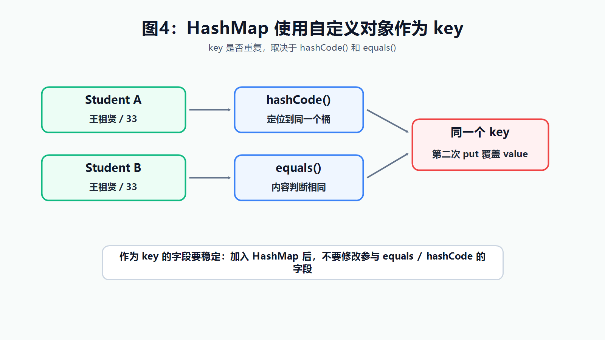
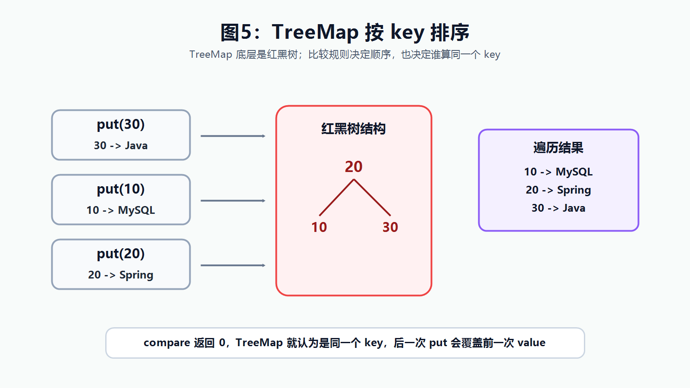

> [!info] 知识摘要
> **总结**
> - `Map` 是键值对集合，key 唯一、value 可重复，和 `Collection` 是集合框架里的两条主线。
> - `HashMap` 依赖 `equals()` / `hashCode()` 判断 key 唯一，`TreeMap` 依赖比较规则排序并判定 key 是否相同。
>
> **相关知识点**
> - [[016_第十五篇：集合框架（中）——Set、哈希表与树结构|Set 与哈希表]]、`Map<K,V>`、`HashMap`、`LinkedHashMap`、`TreeMap`、`ConcurrentHashMap`

---

## 概念入口

> 前面几篇我们一直在讲“单列集合”：`List` 一次存一个元素，`Set` 也是一次存一个元素，只是它负责去重。而实际开发里，经常会遇到另一类需求：根据一个编号找到姓名、根据用户名找到用户信息、根据商品 ID 找到库存数量。这时就需要 `Map`。本笔记会从 `Map` 的基本使用讲起，再讲 `HashMap` 的键唯一机制、`TreeMap` 的排序机制，以及几个非常容易踩坑的边界。

---

## 一、先建立 Map 的位置

### 1.1 Map 不是 Collection 的子接口

`Map` 和 `Collection` 都属于 Java 集合框架，但它们不是父子关系。

| 体系 | 一句话理解 | 常见实现 |
| --- | --- | --- |
| `Collection` | 单列集合，一次存一个元素 | `ArrayList`、`HashSet`、`TreeSet` |
| `Map` | 双列集合，一次存一组键值对 | `HashMap`、`LinkedHashMap`、`TreeMap` |

`Map` 的定义可以这样理解：

```java
Map<K, V>
```

- `K`：key，键的类型。
- `V`：value，值的类型。

比如：

```java
Map<String, String> map = new HashMap<>();
```

可以理解成：用一个 `String` 类型的键，找到另一个 `String` 类型的值。

**核心结论：** `Map` 存的是键值对，`Set` / `List` 存的是单个元素；不要把 `Map` 当成 `Collection` 的子类。



### 1.2 Map 最重要的特点

`Map` 入门阶段先记住三句话：

- 一个键只能对应一个值。
- 键不能重复，值可以重复。
- 同一个键在 `Map` 里只保留一份映射关系。

例如：

```java
Map<String, String> map = new HashMap<>();

map.put("itheima001", "林青霞");
map.put("itheima002", "张曼玉");
map.put("itheima003", "王祖贤");
map.put("itheima003", "柳岩");

System.out.println(map);
```

输出中只会保留三组映射关系，`"itheima003"` 对应的是最后一次写入的值。

---

## 二、Map 的基本用法

### 2.1 put：添加或覆盖

`put(K key, V value)` 是 `Map` 最核心的方法。

```java
Map<String, String> map = new HashMap<>();

String oldValue = map.put("张无忌", "赵敏");
System.out.println(oldValue); // null

oldValue = map.put("张无忌", "周芷若");
System.out.println(oldValue); // 赵敏

System.out.println(map.get("张无忌")); // 周芷若
```

| 情况 | `put` 的效果 | 返回值 |
| --- | --- | --- |
| 键不存在 | 新增键值对 | 通常返回 `null` |
| 键已存在 | 用新值覆盖旧值 | 返回被覆盖的旧值 |



### 2.2 常用方法速览

| 方法 | 作用 |
| --- | --- |
| `put(K key, V value)` | 添加或覆盖键值对 |
| `get(Object key)` | 根据键获取值 |
| `remove(Object key)` | 根据键删除键值对 |
| `containsKey(Object key)` | 判断是否包含指定键 |
| `containsValue(Object value)` | 判断是否包含指定值 |
| `keySet()` | 获取所有键组成的 `Set` |
| `values()` | 获取所有值组成的 `Collection` |
| `entrySet()` | 获取所有键值对对象组成的 `Set` |
| `size()` | 获取键值对数量 |
| `clear()` | 清空所有键值对 |

示例：

```java
Map<String, String> map = new HashMap<>();

map.put("郭靖", "黄蓉");
map.put("杨过", "小龙女");

System.out.println(map.get("郭靖"));          // 黄蓉
System.out.println(map.containsKey("杨过")); // true
System.out.println(map.containsValue("黄蓉")); // true

map.remove("郭靖");
System.out.println(map.size()); // 1
```

### 2.3 Java 8 常用扩展方法

Java 8 之后，`Map` 多了一些很实用的方法。入门阶段不要求全背，但看到代码要能读懂。

| 方法 | 作用 |
| --- | --- |
| `getOrDefault(key, defaultValue)` | key 不存在时返回默认值 |
| `putIfAbsent(key, value)` | key 不存在，或者 key 对应的值为 `null` 时才放入 |
| `computeIfAbsent(key, mappingFunction)` | key 不存在，或者 key 对应的值为 `null` 时，根据函数计算并放入 value |

示例：

```java
Map<String, Integer> scores = new HashMap<>();

scores.put("Java", 90);

int mysqlScore = scores.getOrDefault("MySQL", 0);
System.out.println(mysqlScore); // 0

scores.putIfAbsent("Java", 100);
System.out.println(scores.get("Java")); // 90

Map<String, List<String>> groups = new HashMap<>();
groups.computeIfAbsent("backend", key -> new ArrayList<>()).add("Java");
```

上面这段示例需要导入 `java.util.*`。其中 `key -> new ArrayList<>()` 是 Lambda 表达式，下一篇会专门讲；这里重点先看 `computeIfAbsent()` 的作用。

`computeIfAbsent()` 常用于“按组收集数据”：如果某个 key 对应的集合还没有创建，就先创建一个，再把元素加进去。

### 2.4 get 返回 null 的小坑

很多初学者会写：

```java
String value = map.get("张三丰");

if (value == null) {
    System.out.println("这个键不存在");
}
```

这在大多数情况下没问题，但并不完全严谨。因为 `HashMap` 允许值本身就是 `null`：

```java
Map<String, String> map = new HashMap<>();
map.put("empty", null);

System.out.println(map.get("empty"));   // null
System.out.println(map.get("missing")); // null
```

`get()` 返回 `null` 不能证明键不存在，因为值本身可能就是 `null`。必须用 `containsKey()` 来判定键是否存在。

更严谨的判断方式是：

```java
if (map.containsKey("empty")) {
    System.out.println("键存在");
}
```

所以：只想取值用 `get()`；要判断键是否存在，用 `containsKey()`。

---

## 三、Map 的三种遍历方式

### 3.1 只需要键：keySet

如果只关心所有键，可以使用 `keySet()`。

```java
Map<String, String> map = new HashMap<>();

map.put("张无忌", "赵敏");
map.put("郭靖", "黄蓉");
map.put("杨过", "小龙女");

Set<String> keys = map.keySet();

for (String key : keys) {
    System.out.println(key);
}
```

`keySet()` 返回的是一个 `Set<K>`，这也解释了为什么 `Map` 的键不能重复。

### 3.2 需要键和值：entrySet 更推荐

如果遍历时同时需要键和值，更推荐使用 `entrySet()`：

```java
Map<String, String> map = new HashMap<>();

map.put("张无忌", "赵敏");
map.put("郭靖", "黄蓉");
map.put("杨过", "小龙女");

Set<Map.Entry<String, String>> entries = map.entrySet();

for (Map.Entry<String, String> entry : entries) {
    String key = entry.getKey();
    String value = entry.getValue();
    System.out.printf("%s,%s%n", key, value);
}
```

`Map.Entry<K, V>` 可以理解成一个键值对对象，里面同时保存了键和值。

### 3.3 Java 8 的 forEach 写法

Java 8 之后，也可以使用 `forEach`。下面写法属于后续内容预告，当前阶段先重点掌握 `entrySet()`：

```java
map.forEach((key, value) -> {
    System.out.printf("%s,%s%n", key, value);
});
```

这类写法很简洁，适合简单遍历。`(key, value) -> ...` 是 Lambda 表达式，下一篇会展开；入门阶段至少要先看懂 `entrySet()`，因为它最能体现 `Map` 的结构。



### 3.4 遍历时不要随便改结构

`keySet()`、`values()`、`entrySet()` 返回的不是一份完全独立的拷贝，而是和原 `Map` 关联的视图。

例如：

```java
Set<String> keys = map.keySet();
keys.remove("郭靖");
```

这会影响原来的 `map`。

遍历过程中如果直接调用 `map.remove(key)` 修改结构，可能触发 `ConcurrentModificationException`。如果确实要一边遍历一边删除，使用迭代器的 `remove()`，或者先收集要删除的键，遍历结束后再统一删除。

补充一点：`keySet()` 返回的视图本身支持删除操作，`keys.remove("郭靖")` 会同步删除 `Map` 中对应的键值对。但它适合在非遍历过程中使用；如果正在增强 `for` 遍历这个 `keySet`，仍然不要直接调用 `keys.remove(key)`，要用当前迭代器的 `remove()`。

---

## 四、HashMap：最常用的 Map 实现类

### 4.1 HashMap 的基本特点

`HashMap` 是最常用的 `Map` 实现类。

它有几个特点：

- 底层依赖哈希表。
- 键不能重复。
- 值可以重复。
- 不保证遍历顺序。
- 允许一个 `null` 键，也允许多个 `null` 值。

注意：`HashMap` 的“键唯一”很像 `HashSet` 的“元素唯一”。实际上，`HashSet` 底层就和 `HashMap` 关系非常近，可以简单理解为：`HashSet` 把元素当成 `HashMap` 的 key 来管理。

### 4.2 HashMap 如何判断 key 重复

`HashMap` 判断 key 是否重复，依赖两个方法：

1. `hashCode()`：先决定大概放到哪个桶。
2. `equals()`：在桶里进一步确认是不是同一个 key。

如果 key 是 `String`、`Integer` 这类常用类型，它们已经重写好了 `equals()` 和 `hashCode()`。

如果 key 是自定义对象，就要自己处理。

### 4.3 自定义对象当 key

假设我们希望：姓名和年龄相同的学生，就认为是同一个 key。

示例：`Student` 作为 `HashMap` 的 key

```java
public class Student {
    private String name;
    private int age;

    public Student(String name, int age) {
        this.name = name;
        this.age = age;
    }

    public String getName() {
        return name;
    }

    public int getAge() {
        return age;
    }

    // 这里只为演示风险：age 参与 hashCode，作为 HashMap 的 key 后不建议再修改。
    public void setAge(int age) {
        this.age = age;
    }

    @Override
    public boolean equals(Object o) {
        if (this == o) {
            return true;
        }
        if (!(o instanceof Student)) {
            return false;
        }
        Student other = (Student) o;
        return age == other.age && name.equals(other.name);
    }

    @Override
    public int hashCode() {
        int result = name.hashCode();
        result = 31 * result + age;
        return result;
    }
}
```

测试：

```java
Map<Student, String> map = new HashMap<>();

map.put(new Student("王祖贤", 33), "郑州");
map.put(new Student("王祖贤", 33), "北京");

System.out.println(map.size()); // 1
```

因为两个 `Student` 对象的姓名和年龄相同，所以会被认为是同一个 key，第二次 `put` 会覆盖第一次的值。



### 4.4 key 放进去以后不要乱改

如果一个对象已经作为 key 放进 `HashMap`，就不要再修改参与 `equals()` / `hashCode()` 的字段。

错误示例：

```java
Student s = new Student("张三", 18);

Map<Student, String> map = new HashMap<>();
map.put(s, "北京");

s.setAge(20);

System.out.println(map.get(s)); // 可能变成 null
```

这和 `HashSet` 的坑是同一个原因：对象放入时按旧哈希值定位，字段修改后新哈希值变了，`HashMap` 再找它时可能去错桶。

实际开发里，最稳妥的做法是：把适合作为 key 的对象设计成**不可变对象**，例如关键字段用 `final` 修饰、构造方法一次性初始化、不提供修改这些字段的 setter。这样对象一旦放进 `HashMap`，它的哈希值和相等判断就不会半路改变。

> ⚠️ **误区：只要 key 对象还在 HashMap 里，就一定能 get 到**
>
> **正确理解：** 如果 key 参与 `equals()` / `hashCode()` 的字段被修改，`HashMap` 可能找不到它，也可能删除失败。实际开发中，适合作为 key 的对象最好保持关键字段稳定。

### 4.5 HashMap 的容量和负载因子

`HashMap` 和前面讲过的 `HashSet` 一样，也有容量和负载因子的概念。

| 概念 | 常见默认值 | 作用 |
| --- | --- | --- |
| 初始容量 | `16` | 第一次真正分配底层数组时，默认会用到的长度 |
| 负载因子 | `0.75` | 控制什么时候扩容 |
| 扩容阈值 | `容量 * 负载因子` | 添加元素后 `size > threshold` 时扩容 |

本笔记后面涉及 `HashMap` 底层实现的部分，都按 JDK 8 及以后常见实现来讲。无参构造的 `HashMap` 内部有“默认初始容量 `16`”这个概念，但底层 `table` 数组是懒加载的：`new HashMap<>()` 时还没有真正创建 `16` 个桶，第一次 `put` 时才会通过 `resize()` 初始化数组。

等第一次 `put` 之后，底层数组长度通常是 `16`，负载因子是 `0.75`，第一次扩容阈值就可以粗略理解成 `16 * 0.75 = 12`。也就是说，“默认容量”描述的是默认初始化后的数组长度，不等于构造对象那一刻已经分配好的实际空间。

如果不指定初始容量，添加元素后 `size > threshold` 就会触发扩容；`size == threshold` 本身还不会扩容。源码判断可以简化理解成：

```java
if (++size > threshold) {
    resize();
}
```

扩容会创建更大的数组，并重新分布已有节点；数据量较大时，这个过程会带来明显开销。不同 JDK 的源码实现可能调整初始化时机，本笔记统一以 JDK 8+ 的实现口径理解即可。

如果预计要放大量数据，可以提前给容量：

```java
Map<String, Integer> map = new HashMap<>(1024);
```

注意，`1024` 是初始容量，不表示已经有 `1024` 个键值对。此时 `map.size()` 仍然是 `0`。

如果使用 `new HashMap<>(initialCapacity)`，JDK 会把你传入的初始容量调整成**大于等于该值的 2 的幂**，第一次 `put` 时再按调整后的容量创建数组。比如传入 `1000`，内部实际使用的容量通常会被调整到 `1024`。

### 4.6 选读：HashMap 如何定位 key 的位置

下面两节属于底层直觉，不影响你日常使用 `Map`。如果你刚入门，可以先跳过 `4.6` 和 `4.7`，直接阅读第五章 `TreeMap`；如果你准备面试或想理解性能问题，再继续看这部分。

`HashMap` 并不是直接拿 `key.hashCode()` 当数组下标。

在 JDK 8 中，它会先对原始 `hashCode()` 做一次扰动，简化后可以这样看：

```java
static final int hash(Object key) {
    int h;
    return (key == null) ? 0 : (h = key.hashCode()) ^ (h >>> 16);
}
```

然后再通过数组长度计算桶下标：

```java
int index = (n - 1) & hash;
```

这里的 `n` 是数组长度。因为 `HashMap` 的数组长度通常保持为 `2` 的幂，所以 `(n - 1) & hash` 可以高效地把哈希值映射到合法下标范围内。

为什么要做扰动？因为如果只看低位，而很多 key 的低位又刚好相同，就容易挤到同一个桶里。`h ^ (h >>> 16)` 会让高位信息也参与进来，尽量减少碰撞。

不过，扰动函数只能缓解问题，不能替代好的 `hashCode()` 设计。自定义对象作为 key 时，最终分布是否均匀，关键仍然取决于 `hashCode()` 本身是否合理。

### 4.7 选读：哈希冲突和树化

`HashMap` 底层不是“一个 key 一个位置”这么理想。不同 key 可能落到同一个桶里，这就是哈希冲突。

JDK 8 以后，`HashMap` 的桶内结构可以从链表转成红黑树。常见记法和上一篇 `HashSet` 一样：

| 条件 | 结果 |
| --- | --- |
| 同一个桶中节点数量达到 `8`，并且数组容量至少为 `64` | 链表可能转成红黑树 |
| 同一个桶中节点数量达到 `8`，但数组容量小于 `64` | 优先扩容，不急着转树 |
| 树节点数量降到 `6` | 可能退回链表 |

入门阶段不需要死背源码，但要知道：`HashMap` 的平均查找效率很高，前提是 key 的 `hashCode()` 分布足够均匀；如果大量 key 挤到同一个桶里，性能就会变差。

---

## 五、TreeMap：会按照 key 排序的 Map

### 5.1 TreeMap 的基本特点

`TreeMap` 底层是红黑树结构，它和 `HashMap` 最大的区别是：`TreeMap` 会按照 key 排序。

```java
Map<Integer, String> map = new TreeMap<>();

map.put(30, "Java");
map.put(10, "MySQL");
map.put(20, "Spring");

System.out.println(map); // {10=MySQL, 20=Spring, 30=Java}
```

`TreeMap` 不是为了“更快”，而是为了“有序”。

### 5.2 TreeMap 的排序规则从哪里来

`TreeMap` 的排序规则有两种来源：

| 排序方式 | 写法 | 适合场景 |
| --- | --- | --- |
| 自然排序 | key 所属类实现 `Comparable` | key 本身就应该有默认顺序 |
| 比较器排序 | 创建 `TreeMap` 时传入 `Comparator` | 这次 Map 临时需要一种排序规则 |

更推荐初学者先会用比较器，因为它不强迫你修改类本身。

下面为了让代码短一些，使用了 Java 8 的 Lambda 写法。如果暂时看不懂 `->`，先把它理解成“传入一段比较规则”；Lambda 会在下一篇再系统讲。

示例：按照年龄排序，年龄相同再按姓名排序

```java
Map<Student, String> map = new TreeMap<>((a, b) -> {
    int result = Integer.compare(a.getAge(), b.getAge());
    if (result != 0) {
        return result;
    }
    return a.getName().compareTo(b.getName());
});
```

不要写成：

```java
return a.getAge() - b.getAge();
```

这个写法看起来简单，但遇到极端数值时可能发生整数溢出。更稳妥的写法是 `Integer.compare(a, b)`。

这个示例默认 `name` 不为 `null`。真实业务中如果姓名可能为空，要么在入集合前做非空校验，要么使用能处理 `null` 的比较器，例如 `Comparator.nullsFirst(...)` 或 `Comparator.nullsLast(...)`。

### 5.3 compare 返回 0 就是同一个 key

`TreeMap` 判断 key 是否重复，不靠 `equals()`，也不看 `hashCode()`，而是看比较结果。即使 `Student` 重写了 `equals()` / `hashCode()`，对 `TreeMap` 的排序和去重也没有影响。

如果比较器返回 `0`，`TreeMap` 就认为是同一个 key，后一次 `put` 会覆盖前一次的 value。

错误示例：

```java
Map<Student, String> map = new TreeMap<>((a, b) -> {
    return Integer.compare(a.getAge(), b.getAge());
});

map.put(new Student("张三", 18), "北京");
map.put(new Student("李四", 18), "上海");

System.out.println(map.size()); // 1
```

因为比较器只比较年龄，两个学生年龄一样就被认为是同一个 key。

正确做法是补上次要条件：

```java
Map<Student, String> map = new TreeMap<>((a, b) -> {
    int result = Integer.compare(a.getAge(), b.getAge());
    if (result != 0) {
        return result;
    }
    return a.getName().compareTo(b.getName());
});
```



记住这一点就够了：`TreeMap` 中，比较规则既决定 key 的排序，也决定 key 的唯一性。

### 5.4 TreeMap 如何支持 null key

自然排序下，`TreeMap` 不能放 `null` key：

```java
Map<String, Integer> map = new TreeMap<>();
map.put(null, 1); // NullPointerException
```

如果确实要支持 `null` key，必须让比较器明确知道如何处理 `null`：

```java
Map<String, Integer> map = new TreeMap<>(
        Comparator.nullsFirst(Comparator.naturalOrder())
);

map.put(null, 0);
map.put("Java", 1);
map.put("MySQL", 2);
```

如果比较器没有处理 `null`，即使你传了自定义比较器，`put(null, value)` 仍然可能抛出 `NullPointerException`。

---

## 六、HashMap、LinkedHashMap、TreeMap 怎么选

### 6.1 选型对比

| 需求 | 推荐选择 | 原因 |
| --- | --- | --- |
| 只需要根据 key 快速查找 value | `HashMap` | 最常用，平均增删查效率高 |
| 需要保留插入顺序 | `LinkedHashMap` | 在哈希表基础上维护插入顺序 |
| 需要按照 key 排序 | `TreeMap` | 基于红黑树，按比较规则排序 |
| 需要线程安全 | 不直接用普通 `HashMap` | 使用同步包装或并发集合 |

`LinkedHashMap` 可以简单理解成：它在 `HashMap` 的基础上额外维护了一条链表，所以遍历时能按插入顺序输出。

### 6.2 LinkedHashMap：保留插入顺序的完整例子

如果你既想用 `Map` 的键值映射，又希望遍历时保留添加顺序，可以使用 `LinkedHashMap`。

下面演示的是默认的**插入顺序模式**，也就是构造时没有指定 `accessOrder`。在这种模式下，更新已有 key 不会改变迭代顺序。

```java
Map<String, Integer> map = new LinkedHashMap<>();

map.put("Java", 1);
map.put("MySQL", 2);
map.put("Java", 3);
map.put("Spring", 4);

for (Map.Entry<String, Integer> entry : map.entrySet()) {
    System.out.printf("%s=%d%n", entry.getKey(), entry.getValue());
}
```

输出结果：

```text
Java=3
MySQL=2
Spring=4
```

注意两个细节：

- `"Java"` 第二次 `put` 会更新 value，从 `1` 变成 `3`。
- 默认情况下，更新已有 key 不会把 `"Java"` 移动到最后，它仍然保持第一次插入时的位置。

这类结构适合菜单配置、字段导出顺序、标签映射、需要稳定输出顺序的统计结果。

另外，`LinkedHashMap` 还有一种**访问顺序**模式：构造时传入 `accessOrder = true`，元素会按照最近访问情况调整顺序，常用于实现简单 LRU 缓存。本笔记这里讲的是默认的插入顺序模式，先不要把两者混在一起。

### 6.3 复杂度和顺序对比

| 实现类 | 底层直觉 | 增删查复杂度直觉 | 遍历顺序 |
| --- | --- | --- | --- |
| `HashMap` | 哈希表 | 平均 `O(1)`，极端冲突会变差 | 不保证顺序 |
| `LinkedHashMap` | 哈希表 + 链表 | 平均 `O(1)`，维护顺序有额外成本 | 插入顺序 |
| `TreeMap` | 红黑树 | `O(log n)` | key 的排序顺序 |

### 6.4 null 和线程安全边界

| 实现类 | null 支持 | 线程安全 |
| --- | --- | --- |
| `HashMap` | 允许一个 `null` key，允许多个 `null` value | 否 |
| `LinkedHashMap` | 允许一个 `null` key，允许多个 `null` value | 否 |
| `TreeMap` | 自然排序下不允许 `null` key；自定义比较器需特别处理才能支持；value 可以为 `null` | 否 |
| `Hashtable` | 不允许 `null` key，也不允许 `null` value | 方法级同步，但新代码通常不优先选 |

`Hashtable` 是早期集合类，名字里的 `table` 是小写 `t`，不是 `HashTable`。它很多方法带同步，但不代表它就是现代并发场景下的首选。实际开发中，如果需要并发读写，通常优先考虑 `ConcurrentHashMap`。

```java
Map<String, Integer> concurrentMap = new ConcurrentHashMap<>();
```

这段代码需要导入 `java.util.concurrent.ConcurrentHashMap`。另外，`ConcurrentHashMap` 不允许 `null` key 和 `null` value，这一点和 `HashMap` 不同。

为什么不允许？核心原因不是某个 JDK 版本的限制，而是并发场景下要避免二义性。假设 `ConcurrentHashMap` 允许 `null` value，那么 `map.get(key)` 返回 `null` 时，调用方就分不清两种情况：到底是 key 不存在，还是 key 存在但 value 就是 `null`。更麻烦的是，并发环境里两个判断之间可能被其他线程插入修改：你刚 `get()` 完，另一个线程就可能 `put()` 或 `remove()`，这会让“先 get 再 containsKey”的判断变得脆弱。禁止 `null` 后，`get()` 返回 `null` 就可以明确表示“当前没有这个映射”，并发编程模型也更简单。

---

## 七、常见误区速查表

| 常见误区 | 更准确的理解 |
| --- | --- |
| `Map` 是 `Collection` 的子接口 | 不是，`Map` 和 `Collection` 是集合框架的两条主线 |
| `put` 一定是新增 | 不一定，key 已存在时会覆盖旧 value |
| `get(key) == null` 就说明 key 不存在 | 不严谨，可能是 key 存在但 value 本身为 `null` |
| `HashMap` 会按添加顺序输出 | 不保证顺序，需要保序用 `LinkedHashMap` |
| 自定义对象当 `HashMap` 的 key 不需要额外处理 | 需要正确重写 `equals()` 和 `hashCode()` |
| key 放进 `HashMap` 后可以随便改字段 | 参与 `equals()` / `hashCode()` 的字段不要乱改，最好把 key 设计成不可变对象 |
| `TreeMap` 的比较器只影响排序 | 不只影响排序，返回 `0` 还表示同一个 key |
| `TreeMap` 也依赖 `equals()` / `hashCode()` 判断 key 重复 | 不依赖，它只看 `Comparator` 或 `Comparable` 的比较结果 |
| `TreeMap` 自然排序下可以放 `null` key | 不可以，`put(null, value)` 会抛出 `NullPointerException` |
| `HashMap` 是线程安全的 | 不是，多线程读写要考虑同步或并发集合 |
| `ConcurrentHashMap` 只是某些版本不允许 `null` | 不是版本问题，而是为了避免并发场景下 `get()` 返回 `null` 的二义性 |

---

## 总结

| 知识点 | 一句话理解 |
| --- | --- |
| `Map<K, V>` | 双列集合，一个 key 对应一个 value |
| `keySet()` / `entrySet()` | 分别适合只遍历 key、同时遍历 key 和 value |
| `HashMap` | 基于哈希表，最常用，不保证顺序 |
| `HashMap` 扩容与冲突 | 默认负载因子常见为 `0.75`，冲突严重时桶内链表可能转红黑树 |
| `HashMap` 定位桶 | 先扰动 `hashCode()`，再用 `(n - 1) & hash` 计算下标 |
| `LinkedHashMap` | 基于哈希表并维护插入顺序 |
| `TreeMap` | 基于红黑树，按照 key 排序；key 唯一性由比较结果决定 |
| `ConcurrentHashMap` | 并发场景常用，不允许 `null` key 和 `null` value |

最终记忆：

- **`Map` 存键值对，key 唯一，value 可以重复。**
- **`HashMap` 判断自定义 key 是否重复，依赖 `equals()` 和 `hashCode()`。**
- **默认用 `HashMap`，需要插入顺序用 `LinkedHashMap`，需要 key 排序用 `TreeMap`。**

到这里，集合框架的主线已经基本串起来了：`List` 解决顺序和索引，`Set` 解决去重，`Map` 解决键值映射。下一篇会继续补充 `Stream` 流、不可变集合与方法引用，让集合操作从“会写循环”走向“会写表达式”。

