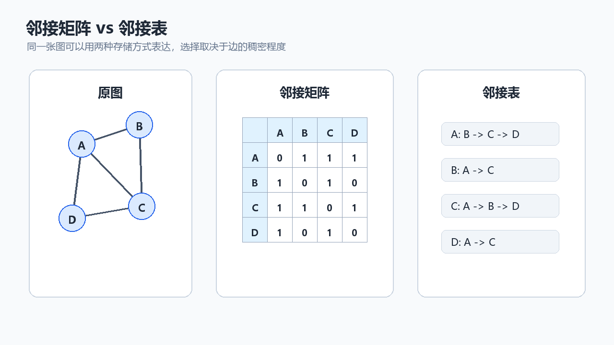
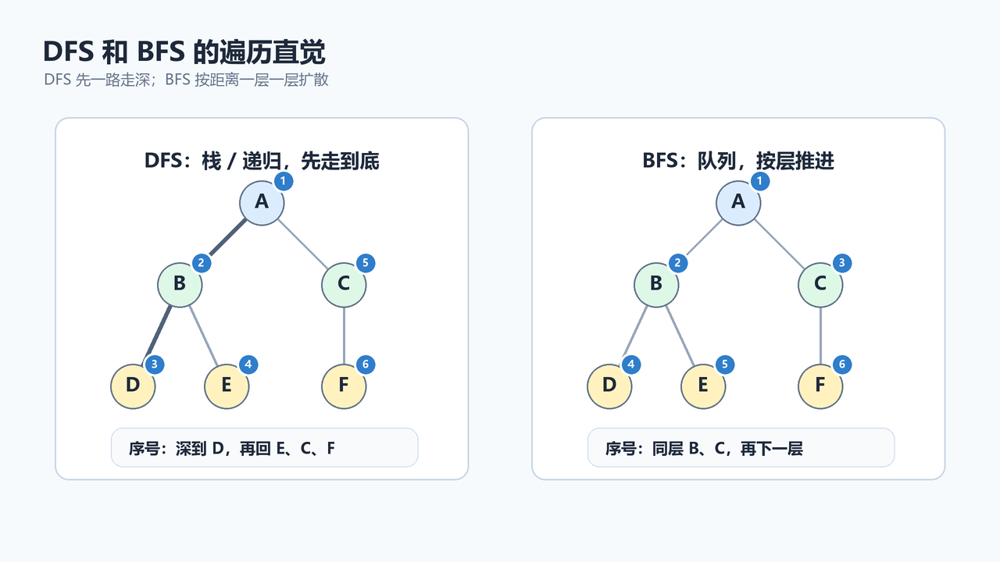

> [!info] 知识摘要
> **总结**
> - 图由顶点和边组成，常用邻接矩阵或邻接表存储连接关系。
> - DFS 适合沿路径深入搜索，BFS 适合按层扩散，也常用于无权图最少边数路径。
>
> **相关知识点**
> - [[019_第十八篇：常用数据结构进阶——并查集与堆|并查集与堆]]、图、邻接矩阵、邻接表、DFS、BFS、visited
>
> **适合读者**：已经理解数组、链表、栈、队列、并查集，准备学习图结构的同学
> **前置知识**：建议先掌握集合、递归、队列、栈和二维数组的基本用法
> **代码说明**：本文示例默认可按需导入 `java.util.*`

---

## 概念入口
> 很多真实问题都不是一条线，也不是一棵树。城市之间有道路，用户之间有关注关系，网页之间有链接，课程之间有先修依赖，服务器之间有网络连接。这些结构都有一个共同点：对象之间可以互相连接，而且连接关系可能非常复杂。图就是用来描述这类关系的数据结构。这一篇我们先不碰复杂算法，而是把图的基本概念、两种存储方式、DFS 和 BFS 讲清楚。

---

## 一、图是什么

图由两部分组成：

| 组成 | 英文 | 含义 |
| --- | --- | --- |
| 顶点 | Vertex | 图中的一个对象 |
| 边 | Edge | 顶点之间的连接关系 |

例如：

```text
A -- B
|    |
C -- D
```

这里 `A`、`B`、`C`、`D` 是顶点，线段是边。

如果换成现实场景：

| 场景 | 顶点 | 边 |
| --- | --- | --- |
| 地图导航 | 城市 / 路口 | 道路 |
| 社交网络 | 用户 | 好友关系 / 关注关系 |
| 网页链接 | 网页 | 超链接 |
| 课程依赖 | 课程 | 先修关系 |
| 网络拓扑 | 服务器 | 网络连接 |

**核心结论：** 图用来表示“多个对象之间的连接关系”。

---

## 二、图的基本类型

### 2.1 无向图

无向图的边没有方向。

```text
A -- B
```

表示 `A` 能到 `B`，`B` 也能到 `A`。

常见例子：

- 双向道路。
- 好友关系。
- 局域网连接。

### 2.2 有向图

有向图的边有方向。

```text
A -> B
```

表示可以从 `A` 到 `B`，但不代表能从 `B` 回到 `A`。

常见例子：

- 用户关注关系。
- 网页链接。
- 课程先修关系。
- 方法调用关系。

### 2.3 带权图

如果边上带有权重，就是带权图。

```text
A --5-- B
```

权重可以表示：

- 距离。
- 时间。
- 成本。
- 风险。

这一篇先重点学习无权图遍历。带权图会涉及最短路径、最小生成树等更进阶算法，后面再展开。

---

## 三、图的存储方式

### 3.1 邻接矩阵

邻接矩阵用二维数组表示顶点之间是否有边。

```java
int[][] graph = new int[n][n];
```

如果：

```java
graph[i][j] = 1;
```

表示 `i` 到 `j` 有边。

无向图中，添加一条 `a -- b` 的边，通常要写两次：

```java
graph[a][b] = 1;
graph[b][a] = 1;
```

示例：

```java
int n = 4;
int[][] graph = new int[n][n];

graph[0][1] = 1;
graph[1][0] = 1;

graph[0][2] = 1;
graph[2][0] = 1;
```

邻接矩阵的特点：

| 优点 | 缺点 |
| --- | --- |
| 判断两点是否有边很快，`O(1)` | 空间是 `O(V^2)` |
| 实现简单 | 稀疏图会浪费大量空间 |

如果顶点个数比较固定，并且经常需要判断两个点之间有没有边，邻接矩阵很方便。但如果顶点很多、边很少，邻接矩阵就不划算；如果顶点还会频繁新增，二维数组扩容也不方便。

### 3.2 邻接表

邻接表给每个顶点维护一个邻居列表。

```java
List<List<Integer>> graph = new ArrayList<>();
```

初始化：

```java
int n = 4;
List<List<Integer>> graph = new ArrayList<>();

for (int i = 0; i < n; i++) {
    graph.add(new ArrayList<>());
}
```

这里外层 `ArrayList` 表示“顶点列表”，内层 `ArrayList` 表示“某个顶点的邻居列表”。所以：

```java
graph.get(a)
```

拿到的是顶点 `a` 的邻居列表；继续调用：

```java
graph.get(a).add(b)
```

就是把 `b` 加进 `a` 的邻居列表里。

添加无向边：

```java
graph.get(0).add(1);
graph.get(1).add(0);
```

可以封装一个方法：

```java
static void addUndirectedEdge(List<List<Integer>> graph, int a, int b) {
    graph.get(a).add(b);
    graph.get(b).add(a);
}
```

邻接表的特点：

| 优点 | 缺点 |
| --- | --- |
| 空间是 `O(V + E)` | 判断两点是否直接相连通常要遍历邻居 |
| 适合稀疏图 | 实现比矩阵稍复杂 |
| 遍历某个点的邻居很方便 | 如果邻居列表很多，顺序需要自己维护 |

为什么内层也常用 `ArrayList`？因为图遍历时最常见的操作是：

```java
for (int next : graph.get(cur)) {
    // 处理邻居
}
```

只要邻居列表能被遍历，`ArrayList`、`LinkedList` 都能用。但在 Java 里，`ArrayList` 连续存储，遍历性能通常很好，写法也简单；`LinkedList` 只有在频繁从中间插入、删除节点时才可能更有意义。对入门图遍历来说，优先用 `ArrayList` 就够了。

### 3.3 邻接矩阵和邻接表怎么选

| 对比点 | 邻接矩阵 | 邻接表 |
| --- | --- | --- |
| 空间复杂度 | `O(V^2)` | `O(V + E)` |
| 判断是否有边 | `O(1)` | `O(度数)` |
| 遍历一个点的邻居 | `O(V)` | `O(度数)` |
| 适合场景 | 点少、边多的稠密图 | 点多、边少的稀疏图 |

大多数算法入门题和业务建模中，邻接表更常用，因为现实世界里的图通常是稀疏图。



---

## 四、图遍历为什么需要 visited

图和树最大的区别之一是：图可能有环。

```text
A -- B
|    |
D -- C
```

如果从 `A` 出发：

```text
A -> B -> C -> D -> A -> B -> ...
```

如果不记录访问过的点，就会无限循环。

所以图遍历几乎都需要：

```java
boolean[] visited = new boolean[n];
```

Java 中 `boolean[]` 创建后默认都是 `false`，所以不需要手动把每个位置初始化成 `false`。

含义是：

```text
visited[i] = 顶点 i 是否已经访问过
```

**核心结论：** 只要遍历图，就先问自己：`visited` 在哪里？

---

## 五、DFS 深度优先搜索

### 5.1 DFS 的直觉

DFS，Depth First Search，深度优先搜索。

它的直觉是：

> 一条路先走到底，走不通再回头换路。

比如：

```text
0 -- 1 -- 3
|
2
```

从 `0` 出发，可能的访问顺序是：

```text
0 -> 1 -> 3 -> 2
```

具体顺序取决于邻接表里邻居的存放顺序。

### 5.2 递归 DFS

先准备一个图：

```java
List<List<Integer>> graph = new ArrayList<>();

for (int i = 0; i < 4; i++) {
    graph.add(new ArrayList<>());
}

addUndirectedEdge(graph, 0, 1);
addUndirectedEdge(graph, 0, 2);
addUndirectedEdge(graph, 1, 3);
```

DFS 方法：

```java
static void dfs(List<List<Integer>> graph, int cur, boolean[] visited) {
    visited[cur] = true;
    System.out.println(cur);

    for (int next : graph.get(cur)) {
        if (!visited[next]) {
            dfs(graph, next, visited);
        }
    }
}
```

调用：

```java
boolean[] visited = new boolean[4];
dfs(graph, 0, visited);
```

递归 DFS 的关键是：

- 先标记当前点已经访问。
- 遍历当前点所有邻居。
- 对没访问过的邻居继续 DFS。

注意标记时机：递归 DFS 通常在进入当前节点时就立刻标记 `visited[cur] = true`。这样后续邻居再遇到它，就不会重复递归进去。

还要注意 Java 方法调用栈的限制。如果图特别深，比如退化成一条很长的链，递归 DFS 可能抛出 `StackOverflowError`。数据规模较大或深度不可控时，优先考虑手动栈 DFS 或 BFS。

### 5.3 DFS 和栈

递归 DFS 本质上依赖方法调用栈。

如果不想用递归，也可以手动使用栈：

```java
static void dfsByStack(List<List<Integer>> graph, int start) {
    boolean[] visited = new boolean[graph.size()];
    Deque<Integer> stack = new ArrayDeque<>();

    stack.push(start);

    while (!stack.isEmpty()) {
        int cur = stack.pop();

        if (visited[cur]) {
            continue;
        }

        visited[cur] = true;
        System.out.println(cur);

        for (int next : graph.get(cur)) {
            if (!visited[next]) {
                stack.push(next);
            }
        }
    }
}
```

这里使用的是：

```java
Deque<Integer> stack = new ArrayDeque<>();
```

而不是 `Stack<Integer>`。`Stack` 是 Java 早期遗留类，很多新代码更推荐使用 `ArrayDeque` 来模拟栈：入栈用 `push`，出栈用 `pop`。

入门阶段优先掌握递归 DFS，因为它更短、更贴近“走到底再回头”的直觉；但遇到很深的图，要记得切换到手动栈版本。

---

## 六、BFS 广度优先搜索

### 6.1 BFS 的直觉

BFS，Breadth First Search，广度优先搜索。

它的直觉是：

> 先访问离起点最近的一层，再访问下一层。

例如：

```text
0 -- 1 -- 3
|
2
```

从 `0` 出发，BFS 可能访问：

```text
0 -> 1 -> 2 -> 3
```

它先处理距离 `0` 一条边的点，再处理距离 `0` 两条边的点。

### 6.2 BFS 使用队列

BFS 依赖队列先进先出的特点。

```java
static void bfs(List<List<Integer>> graph, int start) {
    boolean[] visited = new boolean[graph.size()];
    Queue<Integer> queue = new ArrayDeque<>();

    visited[start] = true;
    queue.offer(start);

    while (!queue.isEmpty()) {
        int cur = queue.poll();
        System.out.println(cur);

        for (int next : graph.get(cur)) {
            if (!visited[next]) {
                visited[next] = true;
                queue.offer(next);
            }
        }
    }
}
```

这里的 `ArrayDeque` 也可以当队列使用：入队用 `offer`，出队用 `poll`。相比 `LinkedList`，`ArrayDeque` 在多数普通队列场景下更轻量；而且它不允许存放 `null`，也能减少一些歧义。

注意：BFS 通常在入队时就标记 `visited[next] = true`，这样可以避免同一个点被多个邻居重复加入队列。DFS 是“进入节点时标记”，BFS 是“准备入队时标记”，核心目的都是避免重复处理。

### 6.3 BFS 和无权图最少边数路径

在无权图里，BFS 第一次到达某个点时，经过的边数一定最少。

可以维护一个距离数组：

```java
static int[] shortestDistance(List<List<Integer>> graph, int start) {
    int n = graph.size();
    int[] dist = new int[n];
    Arrays.fill(dist, -1);

    Queue<Integer> queue = new ArrayDeque<>();
    dist[start] = 0;
    queue.offer(start);

    while (!queue.isEmpty()) {
        int cur = queue.poll();

        for (int next : graph.get(cur)) {
            if (dist[next] == -1) {
                dist[next] = dist[cur] + 1;
                queue.offer(next);
            }
        }
    }

    return dist;
}
```

这里不能直接依赖 `int[]` 的默认值 `0`。因为起点到自己的距离本来就是 `0`，如果其他点也默认是 `0`，就分不清“还没到达”和“距离为 0”。所以用 `-1` 表示不可达。

如果 `dist[i] == -1`，说明从起点到 `i` 不可达。

**核心结论：** 无权图求最少边数路径，优先想到 BFS。

---

## 七、路径查找与还原

有时我们不只想知道能不能到达，还想知道路径是什么。

可以在 BFS 中记录前驱节点：

```java
static List<Integer> shortestPath(List<List<Integer>> graph, int start, int target) {
    int n = graph.size();
    int[] prev = new int[n];
    boolean[] visited = new boolean[n];
    Arrays.fill(prev, -1);

    Queue<Integer> queue = new ArrayDeque<>();
    visited[start] = true;
    queue.offer(start);

    while (!queue.isEmpty()) {
        int cur = queue.poll();

        if (cur == target) {
            break;
        }

        for (int next : graph.get(cur)) {
            if (!visited[next]) {
                visited[next] = true;
                prev[next] = cur;
                queue.offer(next);
            }
        }
    }

    if (!visited[target]) {
        return Collections.emptyList();
    }

    List<Integer> path = new ArrayList<>();
    for (int cur = target; cur != -1; cur = prev[cur]) {
        path.add(cur);
        if (cur == start) {
            break;
        }
    }
    Collections.reverse(path);

    return path;
}
```

测试：

```java
List<Integer> path = shortestPath(graph, 0, 3);
System.out.println(path); // [0, 1, 3]
```

`prev[next] = cur` 的意思是：第一次到达 `next` 时，是从 `cur` 走过来的。`prev[start]` 保持为 `-1`，表示起点没有前驱。最后从目标点倒着往回找，遇到起点后停止，就能还原整条路径。

---

## 八、一个可直接运行的完整示例

前面为了讲清楚概念，把代码拆成了很多小段。下面给一个完整版本，可以直接放进 `Main.java` 运行。

```java
import java.util.*;

public class Main {
    public static void main(String[] args) {
        int n = 4;
        List<List<Integer>> graph = new ArrayList<>();

        for (int i = 0; i < n; i++) {
            graph.add(new ArrayList<>());
        }

        addUndirectedEdge(graph, 0, 1);
        addUndirectedEdge(graph, 0, 2);
        addUndirectedEdge(graph, 1, 3);

        System.out.println("DFS：");
        boolean[] visited = new boolean[n];
        dfs(graph, 0, visited);

        System.out.println("BFS：");
        bfs(graph, 0);

        System.out.println("0 到 3 的最少边数路径：");
        System.out.println(shortestPath(graph, 0, 3));
    }

    static void addUndirectedEdge(List<List<Integer>> graph, int a, int b) {
        graph.get(a).add(b);
        graph.get(b).add(a);
    }

    static void dfs(List<List<Integer>> graph, int cur, boolean[] visited) {
        visited[cur] = true;
        System.out.println(cur);

        for (int next : graph.get(cur)) {
            if (!visited[next]) {
                dfs(graph, next, visited);
            }
        }
    }

    static void bfs(List<List<Integer>> graph, int start) {
        boolean[] visited = new boolean[graph.size()];
        Queue<Integer> queue = new ArrayDeque<>();

        visited[start] = true;
        queue.offer(start);

        while (!queue.isEmpty()) {
            int cur = queue.poll();
            System.out.println(cur);

            for (int next : graph.get(cur)) {
                if (!visited[next]) {
                    visited[next] = true;
                    queue.offer(next);
                }
            }
        }
    }

    static List<Integer> shortestPath(List<List<Integer>> graph, int start, int target) {
        int n = graph.size();
        int[] prev = new int[n];
        boolean[] visited = new boolean[n];
        Arrays.fill(prev, -1);

        Queue<Integer> queue = new ArrayDeque<>();
        visited[start] = true;
        queue.offer(start);

        while (!queue.isEmpty()) {
            int cur = queue.poll();

            if (cur == target) {
                break;
            }

            for (int next : graph.get(cur)) {
                if (!visited[next]) {
                    visited[next] = true;
                    prev[next] = cur;
                    queue.offer(next);
                }
            }
        }

        if (!visited[target]) {
            return Collections.emptyList();
        }

        List<Integer> path = new ArrayList<>();
        for (int cur = target; cur != -1; cur = prev[cur]) {
            path.add(cur);
            if (cur == start) {
                break;
            }
        }
        Collections.reverse(path);

        return path;
    }
}
```

可能输出：

```text
DFS：
0
1
3
2
BFS：
0
1
2
3
0 到 3 的最少边数路径：
[0, 1, 3]
```

如果你调整加边顺序，DFS 的访问顺序可能变化，这是正常的；BFS 仍然会按层推进。

---

## 九、连通性和连通分量

### 9.1 判断两个点是否连通

如果想判断 `a` 是否能到达 `b`，可以从 `a` 出发 DFS 或 BFS，然后看 `b` 有没有被访问。

```java
static boolean connected(List<List<Integer>> graph, int a, int b) {
    boolean[] visited = new boolean[graph.size()];
    mark(graph, a, visited);
    return visited[b];
}

static void mark(List<List<Integer>> graph, int cur, boolean[] visited) {
    visited[cur] = true;

    for (int next : graph.get(cur)) {
        if (!visited[next]) {
            mark(graph, next, visited);
        }
    }
}
```

这类静态查询可以用 DFS/BFS。如果边会不断新增、不断询问两个点是否连通，那么上一篇的并查集更合适。

### 9.2 统计连通分量

无向图里，如果不是所有点都连在一起，就会有多个连通分量。

```text
0 -- 1     3 -- 4     5
|
2
```

这里有 3 个连通分量：

```text
{0, 1, 2}
{3, 4}
{5}
```

统计方式：

```java
static int countComponents(List<List<Integer>> graph) {
    boolean[] visited = new boolean[graph.size()];
    int count = 0;

    for (int i = 0; i < graph.size(); i++) {
        if (!visited[i]) {
            mark(graph, i, visited);
            count++;
        }
    }

    return count;
}
```

每遇到一个还没访问过的点，就从它启动一次 DFS，这一次 DFS 会访问到整个连通分量。

---

## 十、DFS 和 BFS 怎么选

| 需求 | 推荐 |
| --- | --- |
| 判断能不能到达 | DFS 或 BFS 都可以 |
| 找一条路径 | DFS 或 BFS 都可以 |
| 无权图最少边数路径 | BFS |
| 按层处理 | BFS |
| 遍历所有可达点 | DFS 或 BFS |
| 递归写法更自然 | DFS |
| 图很深，担心递归栈溢出 | 手动栈 DFS 或 BFS |

简单记忆：

- DFS 像“沿着一条路走到底”。
- BFS 像“水波一层一层扩散”。



---

## 十一、带权图先认识到这里

带权图的边上有权重，例如：

```text
0 --5-- 1
0 --2-- 2
2 --1-- 1
```

如果权重表示距离，那么从 `0` 到 `1`：

- 直接走 `0 -> 1`，距离是 `5`。
- 先走 `0 -> 2 -> 1`，距离是 `2 + 1 = 3`。

这时“边数最少”不一定等于“权重最小”。所以普通 BFS 不再适合带权最短路径。后面如果继续学习算法，会遇到 Dijkstra、Bellman-Ford、Floyd 等算法。

当前阶段先记住：

| 图类型 | 常见处理 |
| --- | --- |
| 无权图最少边数 | BFS |
| 带权图最短路径 | 需要专门算法 |
| 带权图最小连接成本 | 最小生成树 |

---

## 十二、常见误区速查表

| 常见误区 | 更准确的理解 |
| --- | --- |
| 图就是树 | 树是特殊的图，图可以有环，也可以不连通 |
| 有向图的边可以随便反着走 | 不可以，方向很重要 |
| 邻接矩阵总是更好 | 不一定，稀疏图会浪费空间 |
| 邻接表不能判断两点是否相连 | 可以判断，只是通常要遍历邻居列表 |
| 图遍历不需要 `visited` | 通常需要，否则遇到环可能无限循环 |
| `boolean[] visited` 需要逐个初始化为 `false` | 不需要，Java 中 `boolean[]` 默认值就是 `false` |
| DFS 一定比 BFS 快 | 不一定，取决于问题目标和图结构 |
| Java 写栈就一定用 `Stack` | 新代码更推荐用 `ArrayDeque` 模拟栈 |
| BFS 可以解决所有最短路径 | 只能直接解决无权图的最少边数问题 |
| DFS 的访问顺序唯一 | 不唯一，取决于邻居遍历顺序 |
| BFS 出队时再标记永远没问题 | 可能导致重复入队，常见写法是入队时标记 |
| 连通性只能用并查集 | 静态图可用 DFS/BFS，频繁合并查询时并查集更合适 |

---

## 总结

| 知识点 | 一句话理解 |
| --- | --- |
| 图 | 由顶点和边组成，用来描述连接关系 |
| 无向图 | 边没有方向，能双向理解 |
| 有向图 | 边有方向，不能随便反着走 |
| 带权图 | 边上带有距离、成本等权重 |
| 邻接矩阵 | 用二维数组存边，适合顶点数固定、经常判断是否有边的场景 |
| 邻接表 | 给每个点保存邻居列表，常用 `List<List<Integer>>` 表示 |
| DFS | 深度优先，一条路走到底再回溯 |
| BFS | 广度优先，一层一层向外扩散 |
| `visited` | 防止重复访问和环形死循环 |
| 连通分量 | 图中互相连通的一组顶点 |

最终记忆：

- **图用来表达对象之间的连接关系。**
- **邻接矩阵适合点少边多，邻接表适合点多边少。**
- **DFS 靠递归或显式栈，BFS 靠队列；Java 中常用 `ArrayDeque` 承担栈或队列角色。**
- **无权图求最少边数路径，优先使用 BFS。**

图结构在真实系统里也经常和多线程相遇：比如用线程池巡检网络拓扑、并发抓取网页链接、并行分析依赖关系。下一篇我们会从数据结构转到程序运行模型，学习多线程基础：线程怎么创建、为什么会有线程安全问题，以及如何用同步机制保护共享数据。
