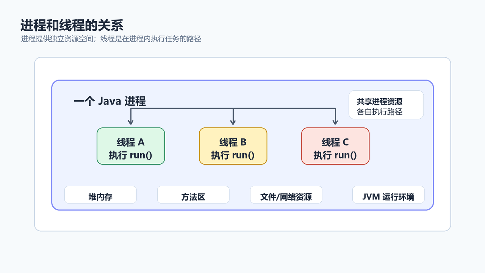
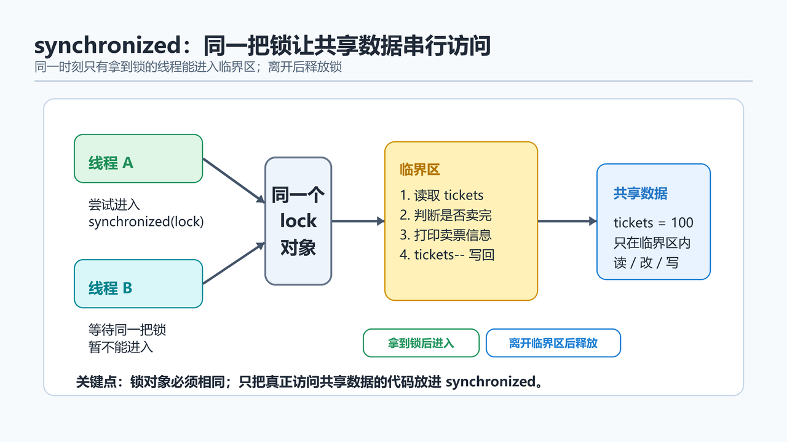

> [!info] 知识摘要
> **总结**
> - 多线程让程序能并发推进多个任务，但会引入共享数据、执行顺序和线程安全问题。
> - `synchronized`、`Lock`、`BlockingQueue` 和线程池是理解 Java 并发基础的重要入口。
>
> **相关知识点**
> - [[020_第十九篇：图与图遍历|图与图遍历]]、线程、线程安全、`synchronized`、`Lock`、死锁、生产者消费者
>
> **适合读者**：已经掌握类、对象、异常、集合，准备理解 Java 多线程基础的同学
> **前置知识**：建议先掌握接口、匿名内部类、Lambda、异常处理和集合基本使用
> **代码说明**：本文示例默认可按需导入 `java.util.*`、`java.util.concurrent.*`、`java.util.concurrent.locks.*`

---

## 概念入口
> 之前我们写的大多数程序，都是一条主线从上往下执行。但现实中的程序经常需要同时做很多事：下载文件时还能刷新进度条，服务器能同时处理多个用户请求，后台任务能定时清理缓存。多线程就是让程序具备“同时做多件事”能力的重要基础。不过多线程不是简单地多开几条执行路线，它还会带来共享数据、执行顺序、线程安全等问题。这一篇先把基础打牢。

---

## 一、进程和线程

### 1.1 进程是什么

进程可以理解成正在运行的程序。

比如：

- 打开的浏览器是一个进程。
- 运行中的 IDEA 是一个进程。
- 启动的 Java 程序也是一个进程。

每个进程都有自己的内存空间。不同进程之间通常相互独立。

### 1.2 线程是什么

线程是进程里的执行单元。

一个进程里可以有多个线程：

```text
Java 程序进程
├── main 线程
├── 下载线程
├── 日志线程
└── 定时任务线程
```

线程之间共享同一个进程里的部分资源，所以它们协作起来很方便，但也容易因为同时操作共享数据产生问题。

### 1.3 并发和并行

| 概念 | 一句话理解 |
| --- | --- |
| 并发 | 多个任务在同一时间段内交替推进 |
| 并行 | 多个任务在同一时刻真正同时执行 |

单核 CPU 上，多个线程通常是快速切换，看起来像同时运行，这叫并发。多核 CPU 上，多个线程可以真的在不同核心上同时运行，这叫并行。

入门阶段不用死抠两个词，先记住：多线程能让多个任务交替或同时推进。



---

## 二、创建线程的三种方式

### 2.1 继承 Thread

第一种方式是继承 `Thread`，重写 `run()`。

```java
class MyThread extends Thread {
    @Override
    public void run() {
        for (int i = 0; i < 5; i++) {
            System.out.println(getName() + " 执行：" + i);
        }
    }
}
```

启动：

```java
MyThread t1 = new MyThread();
MyThread t2 = new MyThread();

t1.setName("线程A");
t2.setName("线程B");

t1.start();
t2.start();
```

注意：启动线程要调用 `start()`，不要直接调用 `run()`。

```java
t1.run();   // 普通方法调用，不会开启新线程
t1.start(); // 开启新线程，由新线程执行 run()
```

### 2.2 实现 Runnable

第二种方式是实现 `Runnable`。

```java
class MyTask implements Runnable {
    @Override
    public void run() {
        for (int i = 0; i < 5; i++) {
            System.out.println(Thread.currentThread().getName() + " 执行：" + i);
        }
    }
}
```

启动：

```java
Runnable task = new MyTask();

Thread t1 = new Thread(task, "线程A");
Thread t2 = new Thread(task, "线程B");

t1.start();
t2.start();
```

这种方式更常用，因为 Java 只能单继承。如果一个类已经继承了别的类，就不能再继承 `Thread`，但仍然可以实现 `Runnable`。

### 2.3 使用 Callable 和 FutureTask

`Runnable` 没有返回值，也不能直接抛出受检异常。需要返回值时，可以使用 `Callable`。

```java
Callable<Integer> task = () -> {
    int sum = 0;
    for (int i = 1; i <= 100; i++) {
        sum += i;
    }
    return sum;
};

FutureTask<Integer> futureTask = new FutureTask<>(task);
Thread thread = new Thread(futureTask, "计算线程");

thread.start();

Integer result = futureTask.get();
System.out.println(result);
```

`futureTask.get()` 会等待线程执行完成并拿到返回值。

| 方式 | 特点 |
| --- | --- |
| 继承 `Thread` | 简单，但受单继承限制 |
| 实现 `Runnable` | 常用，任务和线程分离 |
| 实现 `Callable` | 可以返回结果，也可以配合线程池 |

---

## 三、线程常用方法

### 3.1 设置和获取线程名

```java
Thread thread = new Thread(() -> {
    System.out.println(Thread.currentThread().getName());
});

thread.setName("工作线程");
thread.start();
```

也可以在构造方法里设置：

```java
Thread thread = new Thread(task, "工作线程");
```

`Thread.currentThread()` 表示当前正在执行代码的线程。

### 3.2 sleep 休眠

`sleep` 会让当前线程休眠指定时间。

```java
for (int i = 3; i >= 1; i--) {
    System.out.println(i);
    Thread.sleep(1000);
}
```

`Thread.sleep(...)` 会抛出 `InterruptedException`，实际代码里要处理异常。

```java
try {
    Thread.sleep(1000);
} catch (InterruptedException e) {
    Thread.currentThread().interrupt();
}
```

这里重新设置中断标记，是为了告诉后续代码：这个线程确实被中断过。

### 3.3 线程优先级

Java 线程有优先级：

```java
thread.setPriority(Thread.MAX_PRIORITY);
```

但优先级只是给操作系统线程调度的建议，不代表高优先级线程一定先执行，也不代表低优先级线程一定后执行。

入门阶段记住：不要把程序正确性建立在线程优先级上。

### 3.4 守护线程

守护线程可以理解成“陪伴型线程”。当所有非守护线程都结束后，JVM 会结束，守护线程也会随之停止。

```java
Thread daemon = new Thread(() -> {
    while (true) {
        System.out.println("后台监控中...");
    }
});

daemon.setDaemon(true);
daemon.start();
```

守护线程常见于后台监控、自动清理等场景。注意：不要把重要业务逻辑放到守护线程里，因为它可能来不及执行完就跟着 JVM 退出。

---

## 四、线程安全问题

### 4.1 卖票问题

假设有 100 张票，三个窗口同时卖。

错误写法：

```java
class TicketTask implements Runnable {
    private int tickets = 100;

    @Override
    public void run() {
        while (true) {
            if (tickets <= 0) {
                break;
            }

            System.out.println(Thread.currentThread().getName() + " 卖出第 " + tickets + " 张票");
            tickets--;
        }
    }
}
```

启动：

```java
TicketTask task = new TicketTask();

new Thread(task, "窗口1").start();
new Thread(task, "窗口2").start();
new Thread(task, "窗口3").start();
```

这段代码可能出现：

- 同一张票卖多次。
- 票号跳乱。
- 卖出不存在的票。

原因是 `if (tickets <= 0)`、打印、`tickets--` 不是一个不可分割的整体。多个线程可能在中间插队。

### 4.2 多线程的三个核心问题

多线程出问题，通常绕不开三个词：可见性、原子性、有序性。

| 问题 | 一句话理解 | 典型例子 |
| --- | --- | --- |
| 可见性 | 一个线程改了共享变量，另一个线程不一定立刻看到 | 线程 A 修改停止标记，线程 B 还在循环 |
| 原子性 | 一个操作看起来是一句代码，底层可能分成多步 | `tickets--`、`count++` |
| 有序性 | 编译器或 CPU 可能在不影响单线程结果的前提下调整执行顺序 | 复杂初始化、双重检查锁等 |

先看可见性的直觉：

```java
class StopDemo {
    private static boolean running = true;

    public static void main(String[] args) throws InterruptedException {
        new Thread(() -> {
            while (running) {
                // 模拟持续工作
            }
            System.out.println("子线程结束");
        }).start();

        Thread.sleep(1000);
        running = false;
    }
}
```

主线程把 `running` 改成 `false`，子线程不一定能及时看到这个变化。这个例子不保证每次都复现问题，但它说明了一个事实：多线程之间共享变量时，不能只用单线程思维理解。

再看原子性：

```java
tickets--;
```

它看起来只有一句，底层可以理解成三步：

```text
读取 tickets
计算 tickets - 1
写回 tickets
```

多个线程如果在这三步之间插队，就可能把结果改乱。

有序性在基础阶段先不用展开太深，只要知道：为了提升性能，编译器和 CPU 可能调整某些指令顺序。`synchronized`、`volatile`、线程安全工具类会通过规则约束这些问题。

入门阶段先记住：

- `synchronized` 可以同时处理临界区内的原子性和可见性问题。
- `volatile` 主要解决可见性和一定的有序性问题，但不能保证 `count++` 这种复合操作的原子性。
- `tickets--` 这类“读、改、写”复合操作，不能只靠 `volatile` 保护。

### 4.3 什么是线程安全

当多个线程同时访问可变共享数据时，如果程序仍然能保持正确结果，就可以说这段代码是线程安全的。

线程安全问题通常同时满足三个条件：

| 条件 | 说明 |
| --- | --- |
| 多线程环境 | 有多个线程同时运行 |
| 可变共享数据 | 多个线程访问同一份会变化的数据 |
| 非原子操作 | 判断、修改、写回不是一步完成 |

卖票问题正好满足这三个条件。

反过来，有些数据天然更安全：

```java
void method() {
    int localCount = 0;
    localCount++;
}
```

`localCount` 是方法里的局部变量，每个线程调用方法时都有自己的局部变量副本，不会被其他线程共享。

不可变对象也更安全：

```java
String name = "Java";
```

`String` 本身不可变，多个线程读取同一个字符串对象通常不需要加锁。真正危险的是“多个线程同时修改同一份可变状态”。



---

## 五、synchronized 同步

### 5.1 同步代码块

可以用 `synchronized` 把关键代码包起来，让同一时刻只有一个线程进入。

```java
class SafeTicketTask implements Runnable {
    private int tickets = 100;
    private final Object lock = new Object();

    @Override
    public void run() {
        while (true) {
            synchronized (lock) {
                if (tickets <= 0) {
                    break;
                }

                System.out.println(Thread.currentThread().getName() + " 卖出第 " + tickets + " 张票");
                tickets--;
            }
        }
    }
}
```

关键点：

- 多个线程必须使用同一把锁。
- 锁住的是需要保护共享数据的代码。
- 同步范围不要太大，否则会降低并发效率。

`synchronized` 不只是“排队进入代码块”。进入和退出同一把锁保护的代码块时，Java 还会帮我们处理可见性问题：一个线程在锁内修改过的共享数据，后续另一个线程拿到同一把锁后，能看到前一个线程释放锁前的修改结果。

所以它能解决卖票问题里的两个关键点：

| 问题 | `synchronized` 如何处理 |
| --- | --- |
| 原子性 | 同一时刻只有一个线程执行临界区 |
| 可见性 | 释放锁前的修改，对后续拿到同一把锁的线程可见 |

### 5.2 同步方法

如果一个方法整体都需要同步，可以写成同步方法：

```java
class SafeCounter {
    private int count;

    public synchronized void increment() {
        count++;
    }

    public synchronized int getCount() {
        return count;
    }
}
```

普通同步方法默认锁的是当前对象，也就是 `this`。

这意味着：同一个对象里的多个普通 `synchronized` 方法，默认用的是同一把锁，会互斥。

```java
class Demo {
    public synchronized void methodA() {
        // 锁是 this
    }

    public synchronized void methodB() {
        // 锁也是 this
    }
}
```

如果线程 1 正在调用同一个 `Demo` 对象的 `methodA()`，线程 2 再调用这个对象的 `methodB()`，也要等待。因为它们竞争的是同一个 `this`。

静态同步方法锁的是当前类的 `Class` 对象：

```java
public static synchronized void doSomething() {
    // 锁是 SafeCounter.class
}
```

要特别注意：实例同步方法锁 `this`，静态同步方法锁 `类名.class`，这是两把不同的锁。它们之间不会天然互斥。

```java
class Demo {
    public synchronized void instanceMethod() {
        // 锁是 this
    }

    public static synchronized void staticMethod() {
        // 锁是 Demo.class
    }
}
```

如果共享数据既被实例方法改，又被静态方法改，就要非常小心锁对象是否统一。

### 5.3 synchronized 的边界

`synchronized` 解决的是同一把锁保护下的共享数据安全。

它不能自动解决所有问题：

- 如果多个线程用的不是同一把锁，保护无效。
- 如果只锁了一半关键代码，仍然可能出错。
- 如果锁的范围太大，程序可能变慢。
- 如果多个锁互相等待，可能产生死锁。

---

## 六、Lock 锁

`Lock` 是更灵活的锁接口，常用实现类是 `ReentrantLock`。

```java
class LockTicketTask implements Runnable {
    private int tickets = 100;
    private final Lock lock = new ReentrantLock();

    @Override
    public void run() {
        while (true) {
            lock.lock();
            try {
                if (tickets <= 0) {
                    break;
                }

                System.out.println(Thread.currentThread().getName() + " 卖出第 " + tickets + " 张票");
                tickets--;
            } finally {
                lock.unlock();
            }
        }
    }
}
```

这里有一个非常重要的写法：

```java
lock.lock();
try {
    // 访问共享数据
} finally {
    lock.unlock();
}
```

为什么一定要放到 `finally`？

因为中间代码如果抛异常，也必须释放锁。否则其他线程可能永远拿不到锁。

### 6.1 Lock 和 synchronized 怎么选

| 对比点 | `synchronized` | `Lock` |
| --- | --- | --- |
| 写法 | 关键字，简单 | 需要手动加锁解锁 |
| 释放锁 | 自动释放 | 必须手动 `unlock` |
| 灵活性 | 较低 | 更高 |
| 入门推荐 | 优先掌握 | 在需要更灵活控制时使用 |

入门阶段先把 `synchronized` 学扎实，再学习 `Lock`。

---

## 七、死锁

死锁指的是：多个线程互相等待对方释放锁，结果谁也走不下去。

```java
Object lockA = new Object();
Object lockB = new Object();

new Thread(() -> {
    synchronized (lockA) {
        synchronized (lockB) {
            System.out.println("线程1执行");
        }
    }
}).start();

new Thread(() -> {
    synchronized (lockB) {
        synchronized (lockA) {
            System.out.println("线程2执行");
        }
    }
}).start();
```

线程 1 先拿 `lockA`，再等 `lockB`；线程 2 先拿 `lockB`，再等 `lockA`。如果时机刚好，就可能互相卡住。

避免死锁的常见思路：

- 尽量减少嵌套锁。
- 多把锁时保持固定加锁顺序。
- 锁住的代码尽量短。
- 能用更高层并发工具时，不要手写复杂锁逻辑。

---

## 八、生产者消费者模型

### 8.1 模型直觉

生产者消费者模型里有两类线程：

| 角色 | 作用 |
| --- | --- |
| 生产者 | 生产数据，放入容器 |
| 消费者 | 从容器取数据，处理数据 |

中间通常有一个共享容器。

```text
生产者 -> 队列 -> 消费者
```

如果队列满了，生产者要等；如果队列空了，消费者要等。

### 8.2 使用 BlockingQueue

入门阶段，优先使用 `BlockingQueue`，它已经帮我们处理好等待和唤醒。

```java
BlockingQueue<String> queue = new ArrayBlockingQueue<>(3);
String endSignal = "__END__";

Thread producer = new Thread(() -> {
    boolean interrupted = false;

    try {
        for (int i = 1; i <= 5; i++) {
            queue.put("任务" + i);
            System.out.println("生产：任务" + i);
        }
    } catch (InterruptedException e) {
        interrupted = true;
    } finally {
        while (true) {
            try {
                queue.put(endSignal);
                break;
            } catch (InterruptedException e) {
                interrupted = true;
            }
        }

        if (interrupted) {
            Thread.currentThread().interrupt();
        }
    }
});

Thread consumer = new Thread(() -> {
    try {
        while (true) {
            String task = queue.take();

            if (endSignal.equals(task)) {
                break;
            }

            System.out.println("消费：" + task);
        }
    } catch (InterruptedException e) {
        Thread.currentThread().interrupt();
    }
});

producer.start();
consumer.start();
```

这个版本比固定循环消费 5 次更稳一点：消费者不知道任务数量也没关系，它会一直消费，直到拿到 `endSignal`。生产者即使中途被中断，也会尽量放入结束信号，避免消费者一直阻塞在 `take()`。

如果有多个消费者，通常要放入多个结束信号，保证每个消费者都有机会退出。

关键方法：

| 方法 | 作用 |
| --- | --- |
| `put(e)` | 队列满时等待 |
| `take()` | 队列空时等待 |
| `offer(e)` | 尝试放入，失败可返回 `false` |
| `poll()` | 尝试取出，失败可返回 `null` |

`BlockingQueue` 比手写 `wait` / `notify` 更安全，也更适合入门阶段理解模型。

---

## 九、线程池先认识

频繁创建和销毁线程是有成本的。线程池的思路是：提前准备一组线程，需要执行任务时把任务提交进去，由线程池复用已有线程。

```java
ExecutorService pool = Executors.newFixedThreadPool(3);

try {
    for (int i = 1; i <= 5; i++) {
        int taskId = i;
        pool.submit(() -> {
            System.out.println(Thread.currentThread().getName() + " 执行任务 " + taskId);
        });
    }
} finally {
    pool.shutdown();

    try {
        if (!pool.awaitTermination(10, TimeUnit.SECONDS)) {
            pool.shutdownNow();
        }
    } catch (InterruptedException e) {
        pool.shutdownNow();
        Thread.currentThread().interrupt();
    }
}
```

`shutdown()` 的含义是：不再接收新任务，已经提交的任务继续执行。它不会让当前线程自动等到所有任务结束，所以更稳的写法是配合 `awaitTermination(...)` 等一段时间。如果超时还没结束，再调用 `shutdownNow()` 尝试中断正在执行的任务。

不过实际开发中，不建议无脑使用 `Executors` 创建线程池。因为某些工厂方法会使用无界队列或过大的线程上限，任务很多时可能带来资源风险。

更可控的写法是了解 `ThreadPoolExecutor`：

```java
ExecutorService pool = new ThreadPoolExecutor(
        2,
        4,
        60,
        TimeUnit.SECONDS,
        new ArrayBlockingQueue<>(10),
        Executors.defaultThreadFactory(),
        new ThreadPoolExecutor.AbortPolicy()
);
```

如果这段代码真的放进程序里使用，也要像前面一样在合适的位置调用 `shutdown()`，并配合 `awaitTermination(...)` 做关闭等待。

本篇只先建立概念：线程池用于复用线程、控制并发数量、管理任务队列。参数细节可以放到并发进阶再深入。

---

## 十、基础阶段还需要知道的边界

多线程后面还有很多内容，比如：

- `volatile`：保证可见性，但不能保证复合操作的原子性。
- `AtomicInteger`：用原子类处理一些计数场景。
- `ConcurrentHashMap`：并发环境下常用的 Map。
- `CountDownLatch`、`Semaphore`：常用并发工具类。

这些都很重要，但不适合在第一篇基础文章里全部塞满。当前阶段先抓住主线：

```text
创建线程 -> 共享数据 -> 线程安全 -> 同步机制 -> 线程协作 -> 线程池
```

---

## 十一、常见误区速查表

| 常见误区 | 更准确的理解 |
| --- | --- |
| 调用 `run()` 就能开启新线程 | 不行，开启新线程要调用 `start()` |
| 线程执行顺序是固定的 | 不是，线程调度具有不确定性 |
| 线程优先级高就一定先执行 | 不一定，优先级只是调度建议 |
| 多线程一定更快 | 不一定，线程切换、锁竞争也有成本 |
| 只要是共享数据就一定要加锁 | 不一定，不可变对象和只读共享通常风险较低，重点关注可变共享数据 |
| 只要加了锁就一定安全 | 不一定，多线程必须使用同一把锁保护完整临界区 |
| `synchronized` 锁的是代码 | 更准确地说，锁的是对象，代码只是临界区 |
| 两个普通同步方法互不影响 | 如果是同一个对象，它们默认都锁 `this`，会互斥 |
| 静态同步方法和实例同步方法天然互斥 | 不互斥，静态方法锁 `类名.class`，实例方法锁 `this` |
| `Lock` 不需要手动释放 | 错，必须在 `finally` 中 `unlock()` |
| `sleep` 会释放锁 | 不会，`sleep` 只是让当前线程休眠 |
| 死锁只会出现在复杂项目里 | 简单的两把锁顺序相反也可能死锁 |
| `volatile` 可以替代锁 | 不能替代所有锁，它不能保证复合操作原子性 |
| `shutdown()` 会阻塞等待任务执行完 | 不会，它只是不再接收新任务；等待要配合 `awaitTermination()` |
| `forEach` 开多线程就是线程安全 | 不是，线程安全取决于共享数据和同步策略 |

---

## 总结

| 知识点 | 一句话理解 |
| --- | --- |
| 进程 | 正在运行的程序 |
| 线程 | 进程中的执行单元 |
| 并发 | 多个任务在同一时间段交替推进 |
| 并行 | 多个任务在同一时刻真正同时执行 |
| `Thread` | 可以直接表示线程 |
| `Runnable` | 表示没有返回值的任务 |
| `Callable` | 表示有返回值的任务 |
| `start()` | 开启新线程 |
| 可见性 | 一个线程的修改，另一个线程是否能及时看到 |
| 原子性 | 一个操作是否不可分割 |
| 有序性 | 执行顺序是否可能被调整 |
| 线程安全 | 多线程访问可变共享数据时仍能保持正确结果 |
| `synchronized` | 用同一把锁保护临界区，同时处理原子性和可见性 |
| `Lock` | 更灵活的显式锁 |
| `BlockingQueue` | 适合实现生产者消费者模型 |
| 线程池 | 复用线程并管理任务，关闭时要考虑等待和中断 |

最终记忆：

- **多线程不是简单地“跑得更快”，它首先带来执行顺序不确定。**
- **线程安全问题的核心是多个线程同时操作可变共享数据。**
- **同步要锁住同一份可变共享数据对应的完整临界区，并且必须是同一把锁。**
- **`volatile` 主要管可见性，不适合单独保护 `count++`、`tickets--` 这类复合操作。**
- **能用 `BlockingQueue`、线程池等成熟工具时，不要急着手写复杂线程协作。**

下一篇我们会学习反射基础。反射和多线程一样，都是 Java 后续框架学习的重要入口：多线程帮助我们理解并发执行，反射帮助我们理解框架如何在运行时操作类、对象、字段和方法。
