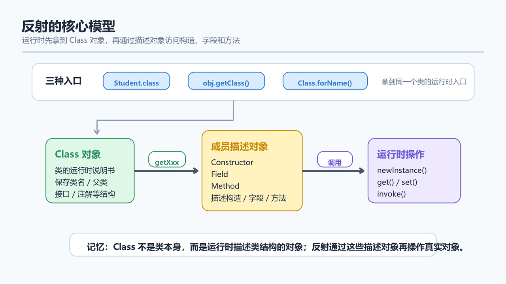
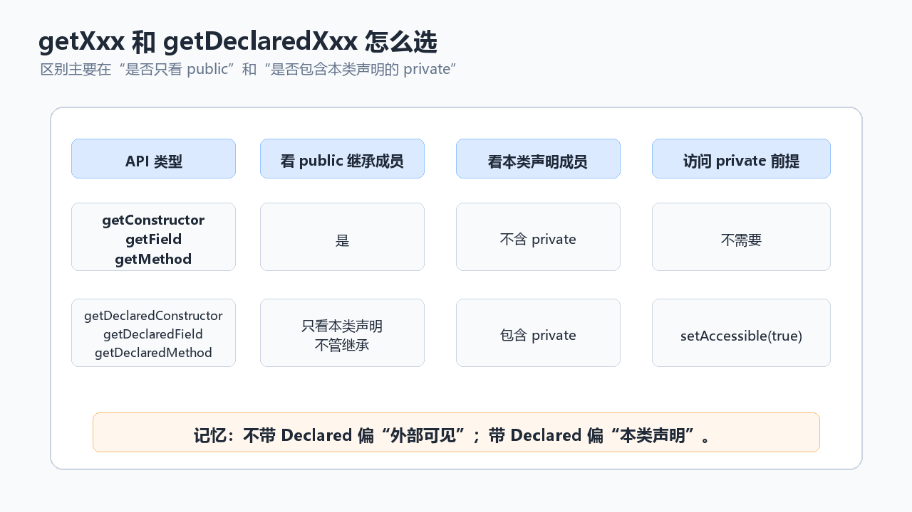

> [!info] 知识摘要
> **总结**
> - 反射让程序在运行时获取类信息，并动态创建对象、访问字段或调用方法。
> - `Class` 是反射入口，`Constructor`、`Field`、`Method` 分别描述构造方法、字段和成员方法。
>
> **相关知识点**
> - [[021_第二十篇：多线程基础|多线程基础]]、反射、`Class`、`Constructor`、`Field`、`Method`、`setAccessible(true)`
>
> **适合读者**：已经掌握类、对象、继承、接口、异常，准备理解框架底层思想的同学
> **前置知识**：建议先掌握构造方法、成员变量、成员方法、访问权限和异常处理
> **代码说明**：本文示例默认可按需导入 `java.lang.reflect.*`、`java.util.*`、`java.io.*`
> **包名说明**：为了让初学者少处理一个变量，本文示例默认把类放在默认包下，所以会出现 `Class.forName("Student")` 这种写法。如果你给类加了 `package`，必须写完整类名，也就是 `包名.类名`，例如 `Class.forName("com.example.Student")`。

---

## 概念入口
> 正常写 Java 代码时，我们通常在编译阶段就知道要创建哪个类、调用哪个方法、访问哪个字段。反射做的事情正好相反：它允许程序在运行时再去认识一个类，获取它的构造方法、字段、方法，甚至创建对象和调用方法。反射不是日常业务代码里随手就用的工具，但它是理解很多框架的关键入口。Spring、MyBatis、JUnit、序列化工具都离不开类似思想。

---

## 一、反射是什么

反射可以理解成：

> 程序在运行过程中，动态获取类的信息，并动态操作类或对象的能力。

普通写法：

```java
Student student = new Student("张三", 18);
student.sayHello();
```

这里我们在写代码时已经明确知道：

- 类名是 `Student`。
- 构造方法参数是 `"张三", 18`。
- 要调用的方法是 `sayHello()`。

反射写法则可以在运行时再决定：

```java
Class<?> clazz = Class.forName("Student");
Constructor<?> constructor = clazz.getConstructor(String.class, int.class);
Object obj = constructor.newInstance("张三", 18);
Method method = clazz.getMethod("sayHello");
method.invoke(obj);
```

这里的 `"Student"` 是一个字符串。本文为了方便演示，默认 `Student` 类没有写 `package`；如果你的类在包里，要写成 `"包名.类名"`。

这段代码更复杂，但它有一个普通写法没有的能力：类名、方法名可以来自配置文件、注解、用户输入或框架扫描结果。

**核心结论：** 反射让 Java 程序从“编译时确定”扩展到“运行时动态决定”。

---

## 二、反射到底学什么

入门阶段不要把反射想得太玄。它主要学四类对象：

| 反射对象 | 对应内容 | 常用类 |
| --- | --- | --- |
| 字节码对象 | 一个类的信息入口 | `Class` |
| 构造方法 | 创建对象 | `Constructor` |
| 成员变量 | 读取或修改字段 | `Field` |
| 成员方法 | 调用方法 | `Method` |

也就是说，反射的主线是：

```text
先拿 Class 对象
再从 Class 对象里拿构造方法、字段、方法
最后创建对象或执行操作
```

---

## 三、准备一个 Student 类

后面的示例都基于这个类：

```java
public class Student {
    private String name;
    private int age;

    public Student() {
    }

    public Student(String name, int age) {
        this.name = name;
        this.age = age;
    }

    private Student(String name) {
        this.name = name;
    }

    public void sayHello() {
        System.out.println("你好，我是 " + name);
    }

    public String introduce(String prefix) {
        return prefix + "：" + name + "，" + age + " 岁";
    }

    private void secret() {
        System.out.println("这是 private 方法");
    }

    @Override
    public String toString() {
        return "Student{name='" + name + "', age=" + age + "}";
    }
}
```

注意：真实项目里通常不会把 private 成员暴露给外部随便访问。这里是为了演示反射能力。

---

## 四、获取 Class 对象

### 4.1 三种常见方式

方式一：通过类名获取。

```java
Class<Student> clazz1 = Student.class;
```

方式二：通过对象获取。

```java
Student student = new Student();
Class<? extends Student> clazz2 = student.getClass();
```

方式三：通过全类名获取。

```java
Class<?> clazz3 = Class.forName("Student");
```

注意：上面这种写法只适合本文这种“默认包”示例。真实项目里大多数类都会写 `package`，这时必须使用完整类名：

```java
Class<?> clazz = Class.forName("com.example.Student");
```

如果这里写错类名，程序不会在编译时报错，而是运行时抛出 `ClassNotFoundException`。初学阶段如果遇到这个异常，先检查字符串里的包名和类名是否完全一致。

### 4.2 Class 对象是什么

Java 程序运行时，每个被加载的类都会有一个对应的 `Class` 对象。这个对象保存了类的结构信息，比如：

- 类名。
- 父类。
- 接口。
- 构造方法。
- 成员变量。
- 成员方法。
- 注解。

可以简单理解成：`Class` 对象是运行时认识一个类的入口。



```java
Class<Student> clazz = Student.class;

System.out.println(clazz.getName());
System.out.println(clazz.getSimpleName());
System.out.println(clazz.getPackageName());
```

---

## 五、获取构造方法并创建对象

### 5.1 获取 public 构造方法

获取无参构造：

```java
Class<Student> clazz = Student.class;

Constructor<Student> constructor = clazz.getConstructor();
Student student = constructor.newInstance();

System.out.println(student);
```

获取带参构造：

```java
Constructor<Student> constructor = clazz.getConstructor(String.class, int.class);
Student student = constructor.newInstance("张三", 18);

System.out.println(student);
```

`String.class`、`int.class` 用来描述构造方法的参数类型。

### 5.2 获取所有声明的构造方法

`getConstructors()` 只能获取 public 构造方法。

如果要获取 private 构造方法，要使用 `getDeclaredConstructor(...)`：

```java
Constructor<Student> constructor = Student.class.getDeclaredConstructor(String.class);
constructor.setAccessible(true);

Student student = constructor.newInstance("李四");
System.out.println(student);
```

可以把 `private` 想成一扇上锁的门。`setAccessible(true)` 相当于告诉反射：这次强制把锁打开。

注意：这不是常规用法。它会破坏封装，除非是在写框架、工具或做特殊测试，普通业务代码不要随便这样访问 private 成员。

### 5.3 构造方法相关 API 对比

| 方法 | 作用 |
| --- | --- |
| `getConstructor(...)` | 获取 public 构造方法 |
| `getDeclaredConstructor(...)` | 获取本类声明的指定构造方法，包括 private |
| `getConstructors()` | 获取所有 public 构造方法 |
| `getDeclaredConstructors()` | 获取本类声明的所有构造方法 |
| `newInstance(...)` | 使用构造方法创建对象 |

如果你目前只是想理解“框架为什么能根据类名创建对象”，看到构造方法这一节就已经抓住了反射的一个核心用途。字段和方法部分可以先读一遍，后面用到时再回来查。

---

## 六、获取成员变量

### 6.1 获取字段对象

获取 private 字段：

```java
Class<Student> clazz = Student.class;

Field nameField = clazz.getDeclaredField("name");
nameField.setAccessible(true);
```

读取字段：

```java
Student student = new Student("张三", 18);

Object value = nameField.get(student);
System.out.println(value); // 张三
```

修改字段：

```java
nameField.set(student, "李四");
System.out.println(student);
```

### 6.2 获取所有字段

```java
Field[] fields = Student.class.getDeclaredFields();

for (Field field : fields) {
    System.out.println(field.getName() + " -> " + field.getType().getSimpleName());
}
```

输出类似：

```text
name -> String
age -> int
```

### 6.3 字段相关 API 对比

| 方法 | 作用 |
| --- | --- |
| `getField(name)` | 获取 public 字段，包括继承来的 public 字段 |
| `getDeclaredField(name)` | 获取本类声明的字段，包括 private |
| `getFields()` | 获取所有 public 字段 |
| `getDeclaredFields()` | 获取本类声明的所有字段 |
| `field.get(obj)` | 获取对象字段值 |
| `field.set(obj, value)` | 设置对象字段值 |

**核心结论：** 带 `Declared` 的方法只看本类声明的成员，但可以拿到 private；不带 `Declared` 的方法通常只拿 public，并且会考虑继承。

如果你只是写普通业务代码，通常不需要用反射直接改字段。这里重点是理解：框架为什么能读取对象里的属性。

---

## 七、获取成员方法并调用

### 7.1 获取 public 方法

```java
Student student = new Student("张三", 18);

Method method = Student.class.getMethod("sayHello");
method.invoke(student);
```

调用有参数、有返回值的方法：

```java
Method method = Student.class.getMethod("introduce", String.class);

Object result = method.invoke(student, "学生信息");
System.out.println(result);
```

`invoke` 的第一个参数是方法调用者，后面的参数是方法实参。

### 7.2 调用 private 方法

```java
Method method = Student.class.getDeclaredMethod("secret");
method.setAccessible(true);

method.invoke(student);
```

和字段一样，调用 private 方法也需要谨慎。普通业务逻辑不应该依赖这种方式破坏封装。

### 7.3 方法相关 API 对比

| 方法 | 作用 |
| --- | --- |
| `getMethod(name, 参数类型...)` | 获取 public 方法 |
| `getDeclaredMethod(name, 参数类型...)` | 获取本类声明的方法，包括 private |
| `getMethods()` | 获取所有 public 方法，包括继承来的 |
| `getDeclaredMethods()` | 获取本类声明的所有方法 |
| `method.invoke(obj, 参数...)` | 调用方法 |



如果你目前只是好奇为什么框架可以“自动调用某个方法”，理解 `Method` 和 `invoke` 的关系就够了。不要急着把所有 API 都背下来。

---

## 八、反射和配置文件

反射真正有价值的地方，不是把简单代码写复杂，而是让程序可以根据配置动态创建对象。

假设有一个接口：

```java
public interface Task {
    void execute();
}
```

两个实现类：

```java
public class EmailTask implements Task {
    @Override
    public void execute() {
        System.out.println("发送邮件");
    }
}
```

```java
public class SmsTask implements Task {
    @Override
    public void execute() {
        System.out.println("发送短信");
    }
}
```

### 8.1 先用写死的字符串理解反射

先不引入文件读取，直接把类名放在字符串里。你可以先把它理解成“这个字符串将来可能来自配置”。

```java
String className = "EmailTask";

Class<?> clazz = Class.forName(className);
Object object = clazz.getDeclaredConstructor().newInstance();

Task task = (Task) object;
task.execute();
```

这段代码的重点只有一个：**程序运行时才根据字符串决定创建哪个类。**

如果以后想切换成短信任务，先改这一行就可以：

```java
String className = "SmsTask";
```

这一步先不关心配置文件放在哪里，也不关心文件路径。先把反射的核心思想看清楚。

### 8.2 再把类名放进配置文件

配置文件 `app.properties`：

```properties
taskClass=EmailTask
```

读取配置并创建对象：

```java
Properties properties = new Properties();

try (InputStream input = new FileInputStream("app.properties")) {
    properties.load(input);
}

String className = properties.getProperty("taskClass");

Class<?> clazz = Class.forName(className);
Object object = clazz.getDeclaredConstructor().newInstance();

Task task = (Task) object;
task.execute();
```

如果以后想切换成短信任务，只需要改配置：

```properties
taskClass=SmsTask
```

Java 代码不用改。

这就是反射的典型价值：把“写死在代码里的类名”转移到配置、注解或框架规则里。

注意：这里的 `FileInputStream("app.properties")` 涉及文件路径和工作目录。基础阶段先感受“类名可以从配置来”这个思想即可，文件到底放哪、框架怎么读配置，后面学项目和框架时会继续细讲。

如果类在包里，配置也要写完整类名：

```properties
taskClass=com.example.EmailTask
```

---

## 九、反射保存对象信息

反射还可以用于通用工具：不提前知道对象具体类型，也能读取它的字段。

```java
static Map<String, Object> toMap(Object object) throws IllegalAccessException {
    Map<String, Object> result = new LinkedHashMap<>();
    Class<?> clazz = object.getClass();

    Field[] fields = clazz.getDeclaredFields();
    for (Field field : fields) {
        field.setAccessible(true);
        result.put(field.getName(), field.get(object));
    }

    return result;
}
```

使用：

```java
Student student = new Student("张三", 18);
Map<String, Object> map = toMap(student);

System.out.println(map);
```

输出类似：

```text
{name=张三, age=18}
```

很多序列化工具、ORM 框架、对象拷贝工具，都会用到类似思想：运行时读取对象结构，再做统一处理。

不过要注意：这只是演示反射能力的玩具版本。真正框架还会处理 `static` 字段、继承字段、嵌套对象、循环引用、注解、类型转换、访问控制、缓存和异常等问题。这里先理解核心思路即可，不要直接拿它当通用工具库。

---

## 十、反射和泛型擦除

Java 的泛型主要在编译阶段起作用。运行时很多泛型信息会被擦除。

例如：

```java
List<String> list = new ArrayList<>();
list.add("Java");
```

正常情况下，下面代码编译不过：

```java
list.add(123);
```

但通过反射可以绕过编译期泛型检查：

```java
Method addMethod = list.getClass().getMethod("add", Object.class);
addMethod.invoke(list, 123);

System.out.println(list);
```

这说明：泛型能帮助我们在编译阶段发现类型错误，但反射有能力绕过一部分编译期约束。

> [!warning] 不要在真实项目里这样写
> 这个例子只是为了说明：泛型主要做编译期检查，运行时会发生擦除。生产代码中不要用反射往 `List<String>` 里塞数字，这会让集合类型变混乱，后面取值时可能出现很难定位的 `ClassCastException`。

---

## 十一、什么时候应该使用反射

适合使用反射的场景：

| 场景 | 说明 |
| --- | --- |
| 框架开发 | 根据配置、注解、扫描结果创建对象 |
| 通用工具 | 对未知类型对象做统一处理 |
| 测试工具 | 运行时查找测试方法或访问特殊成员 |
| 序列化 / 反序列化 | 根据字段结构转换对象和文本 |
| 插件化 | 根据类名动态加载实现 |

不适合滥用反射的场景：

- 普通业务代码可以直接 `new`，就不要反射创建。
- 普通方法调用可以直接写，就不要反射调用。
- 不要依赖反射随意修改 private 字段。
- 高频性能敏感路径要谨慎使用反射。

反射是强工具，不是日常写代码的默认工具。

---

## 十二、反射的代价和风险

反射有几个明显代价：

| 风险 | 说明 |
| --- | --- |
| 可读性下降 | 代码不如直接调用直观 |
| 编译期检查变弱 | 类名、方法名写错可能运行时才报错 |
| 性能有额外成本 | 反射调用通常比直接调用更重 |
| 破坏封装 | `setAccessible(true)` 能访问 private 成员 |

所以学习反射时要保持一个判断：

> 如果只是为了“显得高级”而使用反射，那大概率不该用。

---

## 十三、和动态代理的关系

原始资料里还包含动态代理。动态代理确实和反射关系很近，但它比反射基础更进一步。

简单说：

- 反射：运行时获取类信息、创建对象、调用方法。
- 动态代理：运行时生成一个代理对象，在方法调用前后增强逻辑。

例如日志、权限校验、事务控制等框架功能，都可能用到代理思想。

本篇先把反射基础打牢。等理解了 `Class`、`Method`、`invoke`，再看动态代理会轻松很多。

---

## 十四、常见误区速查表

| 常见误区 | 更准确的理解 |
| --- | --- |
| 反射就是创建对象 | 创建对象只是反射能力之一，它还可以获取字段、方法、注解等信息 |
| `Class` 对象就是 `.class` 文件本身 | 不是，它是类加载后在运行时对应的对象 |
| `getField` 能拿到所有字段 | 不能，通常只能拿 public 字段 |
| `getDeclaredField` 会拿到父类字段 | 不会，它只看本类声明的字段 |
| private 成员完全不能访问 | 反射配合 `setAccessible(true)` 可以访问，但要谨慎 |
| 反射调用方法和普通调用一样安全 | 不一样，很多错误会推迟到运行时暴露 |
| 反射一定很慢，绝对不能用 | 不是绝对不能用，框架和工具场景很常见，但不应滥用 |
| 泛型在运行时完全保留 | Java 泛型存在擦除，运行时信息有限 |
| 类名写简单名称就一定能加载 | 有包名时通常要写完整类名 |
| 动态代理就是反射 | 动态代理会用到反射思想，但它是更高一层的机制 |

---

## 总结

| 知识点 | 一句话理解 |
| --- | --- |
| 反射 | 运行时动态获取和操作类信息 |
| `Class` | 反射入口，表示运行时的类信息 |
| `Constructor` | 表示构造方法，可用于创建对象 |
| `Field` | 表示成员变量，可读取或修改字段值 |
| `Method` | 表示成员方法，可动态调用 |
| `Class.forName` | 根据全类名加载类并获取 `Class` 对象 |
| `getDeclaredXxx` | 获取本类声明的成员，包括 private |
| `setAccessible(true)` | 强制打开 private 访问限制，需谨慎使用 |
| `invoke` | 通过反射调用方法 |
| 配置文件 + 反射 | 让程序运行时决定创建哪个类 |

最终记忆：

- **反射让程序可以在运行时认识类、创建对象、访问字段、调用方法。**
- **反射的入口是 `Class` 对象。**
- **带 `Declared` 的方法更关注本类声明成员，不带 `Declared` 的方法通常只拿 public。**
- **反射很强，但会降低可读性、削弱编译期检查，也可能破坏封装，所以不要滥用。**

到这里，Java 基础系列已经进入“理解框架底层能力”的阶段了。反射不是为了替代普通代码，而是为了理解：为什么框架能够根据配置创建对象、根据注解调用方法、根据字段自动封装数据。掌握这一点，后面学习 Spring、MyBatis、JUnit 等工具时，很多机制就不再神秘。
