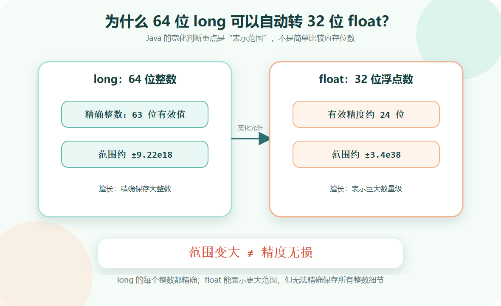
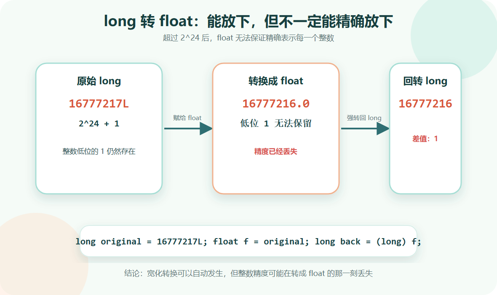

> [!info] 知识摘要
> **总结**
> - 宽化基本类型转换表示 Java 允许自动转到表示范围更大的类型，但不代表精度一定无损。
> - `long -> float` 合法是因为 `float` 的表示范围覆盖 `long`，但浮点有效精度有限，可能丢失整数细节。
>
> **相关知识点**
> - [[【第二篇】数据类型与运算符|自动类型转换]]、`int`、`long`、`float`、`double`、浮点数、精度丢失

---

## 一、先给结论：宽化不等于精度无损

Java 中存在一种自动转换，叫**宽化基本类型转换**（Widening Primitive Conversion）。

例如：

**✅ 宽化基本类型转换示例**

```java
int a = 10;
long b = a;
float c = b;
double d = c;
```

这些代码都可以通过编译，因为 Java 允许某些基本类型自动转换到另一些表示范围更大的类型。

但要特别注意：

```text
宽化转换 = 编译器允许自动转换
宽化转换 ≠ 结果一定完全精确
```

尤其是整数转浮点数时，可能出现精度丢失。

| 转换 | 是否自动 | 是否一定精确 | 说明 |
| --- | --- | --- | --- |
| `int -> long` | 是 | 是 | `long` 可以精确容纳所有 `int` |
| `int -> double` | 是 | 是 | `double` 有足够精度表示所有 `int` |
| `long -> float` | 是 | 否 | `float` 范围够大，但精度不够 |
| `long -> double` | 是 | 不一定 | 大于 `2^53` 的 `long` 可能丢精度 |
| `float -> double` | 是 | 通常保留已有 float 值 | 但不能恢复 `float` 已经丢失的信息 |



**💡 核心结论：** Java 的“宽化”主要强调可表示范围扩大，不保证所有转换都精度无损。

---

## 二、为什么 64 位 long 可以转 32 位 float

先看这个例子：

**✅ long 自动转 float 示例**

```java
long count = 10000000000L;
float value = count;

System.out.println(value);
```

这段代码可以编译。

很多人会困惑：`long` 是 64 位，`float` 是 32 位，为什么不需要强制转换？

原因是：`long` 和 `float` 的“位数”不能直接比较。

### 2.1 long 的特点

`long` 是 64 位整数，取值范围大约是：

```text
-9.22e18 ~ 9.22e18
```

它适合保存大整数、时间戳、计数器、分布式 ID 等。

### 2.2 float 的特点

`float` 是 32 位浮点数，采用类似科学计数法的结构。

它的最大表示范围大约是：

```text
±3.4e38
```

虽然 `float` 只有 32 位，但因为它使用指数位表示数量级，所以能表示非常大的数值范围。

### 2.3 关键区别：范围和精度不是一回事

可以这样理解：

| 类型 | 更擅长什么 | 短板 |
| --- | --- | --- |
| `long` | 精确表示整数 | 范围没有 `float` 的指数范围大 |
| `float` | 表示很大或很小的数量级 | 有效精度有限 |

因此，`long -> float` 在 Java 中被认为是宽化转换：`float` 的数值范围能覆盖 `long` 的范围。

但这不代表 `float` 能精确保存每一个 `long`。

---

## 三、宽化基本类型转换有哪些

常见宽化基本类型转换可以先记住下面这张表：

| 原类型 | 可以自动转换到 |
| --- | --- |
| `byte` | `short`、`int`、`long`、`float`、`double` |
| `short` | `int`、`long`、`float`、`double` |
| `char` | `int`、`long`、`float`、`double` |
| `int` | `long`、`float`、`double` |
| `long` | `float`、`double` |
| `float` | `double` |

注意几点：

- `boolean` 不参与数值类型转换。
- `char` 可以转 `int`，但不能自动转 `short`。
- `byte` 不能自动转 `char`。
- 整数转浮点数时，可能出现精度变化。

下面是一个容易踩坑的例子：

**✅ char 自动转 int 示例**

```java
char c = 'A';
int code = c;

System.out.println(code); // 65
```

这里 `char` 转成 `int` 后，得到的是字符对应的 Unicode 编码值。

> ⚠️ **误区：只要位数小，就一定能自动转到位数大的类型**
>
> **正确理解：** Java 的宽化转换有明确规则，不是单纯比较位数。例如 `char` 是 16 位，但不能自动转成同样 16 位的 `short`。

---

## 四、精度丢失是怎么发生的

`float` 的有效精度大约只有 6 到 7 位十进制有效数字。

从二进制角度看，`float` 的尾数有效精度大约是 24 位。因此，当整数超过 `2^24` 后，`float` 就不一定能精确表示每一个整数。

`2^24` 等于：

```text
16,777,216
```

看下面这个例子：

**✅ long 转 float 丢失精度示例**

```java
long original = 16777217L; // 2^24 + 1
float converted = original;
long back = (long) converted;

System.out.println(original); // 16777217
System.out.println(back);     // 16777216
System.out.println(original - back); // 1
```

这里 `16777217` 比 `2^24` 多 1。

它可以放进 `float` 的表示范围里，但 `float` 没有足够的有效位精确保存这个低位的 `1`，所以转换后再转回 `long`，数值发生了变化。



**能放下，不代表能一模一样地放下。**

这就是 `long -> float` 最容易误解的地方。

---

## 五、double 是否就完全安全

`double` 的有效精度比 `float` 高得多，大约有 53 位二进制有效精度。

因此：

```text
不超过 2^53 的整数，通常可以被 double 精确表示
```

例如：

**✅ double 可精确表示较大整数示例**

```java
long id = 9007199254740992L; // 2^53
double value = id;
long back = (long) value;

System.out.println(id == back); // true
```

但如果超过 `2^53`，`double` 也可能丢失整数精度。

**✅ double 也可能丢失 long 精度示例**

```java
long id = 9007199254740993L; // 2^53 + 1
double value = id;
long back = (long) value;

System.out.println(id);   // 9007199254740993
System.out.println(back); // 9007199254740992
```

所以，`double` 比 `float` 更适合保存较大范围和较高精度的小数，但它也不是“所有 long 都无损”的万能容器。

---

## 六、工程中应该怎么避坑

### 6.1 不要把 ID 转成 float

像订单号、用户 ID、Snowflake ID、数据库主键这类数据，本质上需要精确保存。

不要这样写：

**✅ 错误示例：ID 转 float**

```java
long userId = 16777217L;
float value = userId; // 可能丢失精度
```

更合理的做法是保持 `long`，或者在展示层转成字符串。

**✅ ID 使用字符串展示示例**

```java
long userId = 16777217L;
String text = String.valueOf(userId);
```

### 6.2 金额不要依赖 float 或 double 精确计算

金额计算要求精确，不能依赖二进制浮点数做最终计算。

**✅ 金额使用 BigDecimal 示例**

```java
import java.math.BigDecimal;

BigDecimal price = new BigDecimal("0.1");
BigDecimal count = new BigDecimal("3");

BigDecimal total = price.multiply(count);
System.out.println(total); // 0.3
```

注意：创建 `BigDecimal` 时更推荐使用字符串，而不是直接传入 `double`。

### 6.3 混合运算时留意结果类型

如果 `long` 和 `float` 一起运算，结果可能变成 `float`。

**✅ long 与 float 混合运算示例**

```java
long total = 16777217L;
float rate = 1.0F;

float result = total * rate;
```

这段代码能编译，但 `result` 已经是 `float`，可能失去整数精度。

> ⚠️ **误区：自动转换就代表安全转换**
>
> **正确理解：** 自动转换只代表编译器允许。是否符合业务语义，还要看数据是否需要精确保存。

---

## 总结

| 问题 | 结论 |
| --- | --- |
| 为什么 `long` 可以自动转 `float` | 因为 `float` 的数值表示范围覆盖 `long` |
| 为什么还会丢精度 | `float` 有效精度有限，不能精确表示所有大整数 |
| 宽化看的是位数吗 | 不是单纯看位数，而是 Java 规定的类型转换规则和表示范围 |
| `double` 是否完全安全 | 不是，超过 `2^53` 的整数也可能丢失精度 |
| 工程中怎么处理 ID | 保持 `long` 或转字符串，不要转 `float` |
| 工程中怎么处理金额 | 使用 `BigDecimal`，不要依赖 `float` 或 `double` 精确计算 |

这个知识点可以压缩成一句话：**宽化转换解决的是“能不能自动转”，不是“能不能精确还原”。**

**💡 核心结论：** `long -> float` 合法，是因为 `float` 的表示范围足够大；但 `float` 精度有限，不能保存所有 `long` 的细节。写业务代码时，凡是 ID、金额、精确计数，都不要随意转成浮点数。
