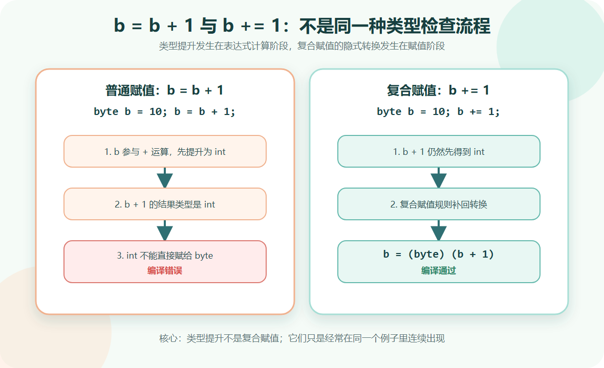
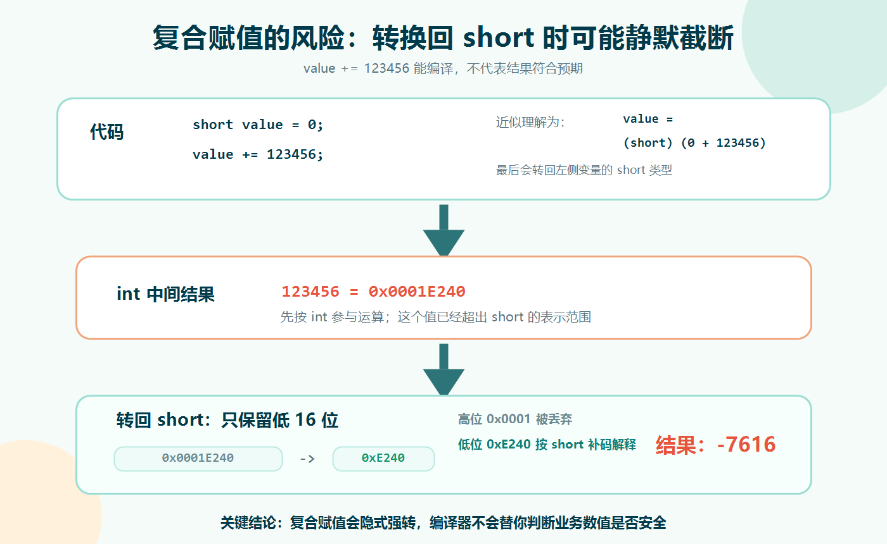

> [!info] 知识摘要
> **总结**
> - `b = b + 1` 报错，是因为表达式计算阶段会先把 `byte` 提升为 `int`。
> - `b += 1` 能通过，是因为复合赋值会隐含一次转换回左侧变量类型的动作。
>
> **相关知识点**
> - [[【第二篇】数据类型与运算符|复合赋值运算符]]、`byte`、`short`、`int`、类型提升、窄化转换、溢出

---

## 一、先给结论：它不是简单的文本替换

`b += 1` 不能简单理解成把代码原封不动替换为 `b = b + 1`。

更准确地说：

```text
E1 op= E2 近似等价于 E1 = (T) ((E1) op (E2))
```

其中 `T` 是左侧变量 `E1` 的类型。

所以：

```java
b += 1;
```

可以近似理解成：

```java
b = (byte) (b + 1);
```

这里面同时涉及两件事：

| 概念 | 发生位置 | 作用 |
| --- | --- | --- |
| 类型提升 | `b + 1` 这个表达式里 | 小整数类型参与运算时先提升为 `int` |
| 复合赋值隐式转换 | `b += 1` 这个赋值动作里 | 把运算结果转换回左侧变量类型 |



**💡 核心结论：** `b = b + 1` 报错，是因为 `b + 1` 的结果是 `int`；`b += 1` 能通过，是因为复合赋值语法隐含了转换回左侧类型的动作。

---

## 二、先看认知冲突

### 2.1 普通赋值为什么报错

先看这段代码：

**✅ 普通赋值报错示例**

```java
byte b = 10;
b = b + 1; // 编译错误
```

问题不在 `b` 不能加 `1`，而在 `b + 1` 的结果类型不是 `byte`。

Java 中，`byte`、`short`、`char` 参与算术运算时，会先被提升为 `int`。这个规则属于 Java 语言规范中的**二元数值提升**（Binary Numeric Promotion）。因此：

```text
b + 1
```

这个表达式的结果类型是 `int`。

而 `int` 的范围比 `byte` 大，编译器不会默认把一个可能超出范围的 `int` 放回 `byte` 变量中，所以报错。

### 2.2 复合赋值为什么能通过

再看这段代码：

**✅ 复合赋值通过示例**

```java
byte b = 10;
b += 1; // 可以通过
```

这不是因为 `b + 1` 在这里突然变成了 `byte`，而是因为 `+=` 有自己的语言规则。

`b += 1` 大致等价于：

```java
b = (byte) (b + 1);
```

也就是说，`b + 1` 仍然会先得到 `int` 结果，只是复合赋值规则在最后帮你补了一次转换回 `byte` 的动作。

> ⚠️ **误区：`b += 1` 就是 `b = b + 1` 的缩写**
>
> **正确理解：** 它们在常见 `int` 场景下结果类似，但在 `byte`、`short`、`char` 等小整数类型上，类型检查规则并不一样。

---

## 三、类型提升到底是什么

类型提升可以理解为：**Java 在做数值运算前，会先把参与运算的操作数提升到更适合计算的类型。**

尤其要记住这条规则：

```text
byte、short、char 参与算术运算时，通常会先提升为 int
```

### 3.1 常见类型提升结果

| 表达式 | 运算前发生什么 | 表达式结果类型 |
| --- | --- | --- |
| `byte + byte` | 两边都提升为 `int` | `int` |
| `short + int` | `short` 提升为 `int` | `int` |
| `char + int` | `char` 提升为 `int` | `int` |
| `int + long` | `int` 提升为 `long` | `long` |
| `long + float` | `long` 提升为 `float` | `float` |
| `float + double` | `float` 提升为 `double` | `double` |

### 3.2 为什么小整数要提升为 int

这可以先从编译器和运行时处理的角度理解：`byte`、`short`、`char` 虽然占用空间较小，但 Java 做整数算术运算时，默认会以 `int` 作为基础计算单位。

所以即使是两个 `byte` 相加：

**✅ byte 相加结果是 int 示例**

```java
byte a = 10;
byte b = 20;

// byte c = a + b; // 编译错误
int c = a + b;     // 正确
```

这里 `a + b` 的结果是 `int`，不是 `byte`。

**💡 核心结论：** 类型提升发生在“表达式计算阶段”，它决定的是表达式结果类型，不是最终能不能赋值成功。

---

## 四、复合赋值到底做了什么

复合赋值运算符包括：

| 运算符 | 常规理解 | 示例 |
| --- | --- | --- |
| `+=` | 加后赋值 | `a += b` |
| `-=` | 减后赋值 | `a -= b` |
| `*=` | 乘后赋值 | `a *= b` |
| `/=` | 除后赋值 | `a /= b` |
| `%=` | 取余后赋值 | `a %= b` |

对于普通 `int` 变量，下面两种写法通常没有差异：

**✅ int 复合赋值示例**

```java
int count = 10;

count = count + 5;
count += 5;
```

但对 `byte`、`short`、`char` 这类小类型，就要小心。

### 4.1 复合赋值的近似公式

Java 语言规范对复合赋值的核心规则可以简化理解为下面这个公式（可参考 JLS 15.26.2）：

```text
E1 op= E2
```

近似等价于：

```text
E1 = (T) ((E1) op (E2))
```

其中 `T` 是左侧变量 `E1` 的类型。

所以：

```java
short s = 1;
s += 1;
```

可以近似理解成：

```java
short s = 1;
s = (short) (s + 1);
```

### 4.2 为什么说是“近似等价”

因为严格来说，复合赋值还有一个细节：左侧表达式只会求值一次。

例如数组访问、对象字段访问这类写法中，左侧如果包含复杂表达式，`op=` 和手写展开式可能在求值次数上有区别。

但对初学者理解 `byte b = 10; b += 1;` 这个问题来说，可以先抓住主线：**复合赋值会把运算结果转换回左侧变量类型。**

---

## 五、隐式转换背后的风险：静默溢出

复合赋值虽然方便，但也有风险：它会把结果转回左侧类型，如果结果超出范围，可能发生截断或溢出。

例如：

**✅ short 复合赋值溢出示例**

```java
short value = 0;
value += 123456;

System.out.println(value); // -7616
```

为什么会这样？

`123456` 超出了 `short` 的范围。复合赋值最后会把结果转换回 `short`，高位信息会被截断，只保留低 16 位。低 16 位再按照 `short` 的补码规则解释，就可能得到一个看起来完全不相关的负数。



如果换成普通强转，其实风险同样存在：

**✅ 显式强转也可能溢出示例**

```java
short value = (short) 123456;

System.out.println(value); // -7616
```

复合赋值的问题在于：这个转换动作不是你手动写出来的，所以更容易被忽略。

> ⚠️ **误区：代码能编译，就说明数值一定安全**
>
> **正确理解：** 编译通过只代表语法规则允许，不代表结果一定符合业务预期。复合赋值里的隐式转换尤其要注意数据范围。

---

## 六、工程中应该怎么写

### 6.1 默认使用 int 做整数计算

在普通业务代码中，不建议为了节省一点空间而大量使用 `byte`、`short` 做中间计算。

更常见、更稳妥的写法是：

**✅ 使用 int 做中间计算示例**

```java
int count = 10;
count += 1;
```

`byte`、`short` 更适合用在文件、网络协议、二进制数据、数组存储等明确需要控制空间或格式的场景。

### 6.2 可能溢出时显式检查范围

如果确实需要把结果放回 `short`，建议先确认范围。

**✅ 转回 short 前检查范围示例**

```java
int result = value + step;

if (result < Short.MIN_VALUE || result > Short.MAX_VALUE) {
    throw new IllegalArgumentException("结果超出 short 范围");
}

short next = (short) result;
```

这比直接 `value += step` 更啰嗦，但在关键业务里更安全。

### 6.3 int 和 long 溢出可考虑 addExact

如果是 `int` 或 `long` 的加法溢出，可以使用 `Math.addExact()`。

**✅ addExact 检测溢出示例**

```java
int a = Integer.MAX_VALUE;
int b = 1;

int result = Math.addExact(a, b); // 溢出时抛出 ArithmeticException
```

注意：`Math.addExact()` 主要用于 `int` 和 `long`，不能直接替代所有 `byte`、`short` 场景。小类型仍然需要根据目标范围做检查。

---

## 总结

| 问题                | 结论                                  |
| ----------------- | ----------------------------------- |
| `b = b + 1` 为什么报错 | `b + 1` 的结果被提升为 `int`，不能直接赋给 `byte` |
| `b += 1` 为什么能通过   | 复合赋值隐含了转换回左侧类型的动作                   |
| 类型提升发生在哪里         | 发生在表达式计算阶段                          |
| 复合赋值转换发生在哪里       | 发生在赋值阶段                             |
| 最大风险是什么           | 结果超出左侧类型范围时，可能静默溢出                  |

这个知识点可以压缩成一句话：**类型提升决定表达式结果类型，复合赋值决定结果如何放回左侧变量。**

**💡 核心结论：** `+=` 不是单纯的文本缩写。遇到 `byte`、`short`、`char` 时，要同时考虑“运算时提升为 `int`”和“复合赋值隐式转回原类型”这两件事。
