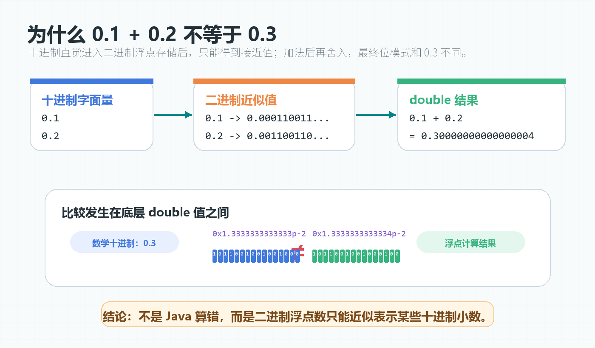
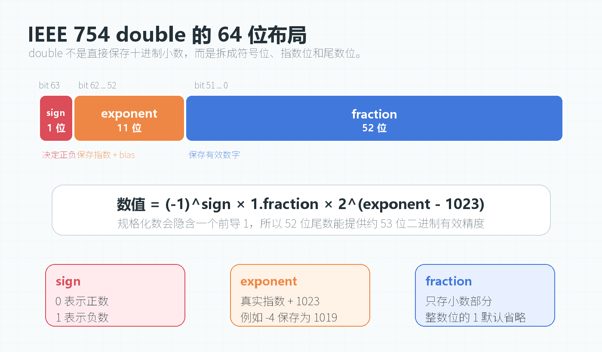
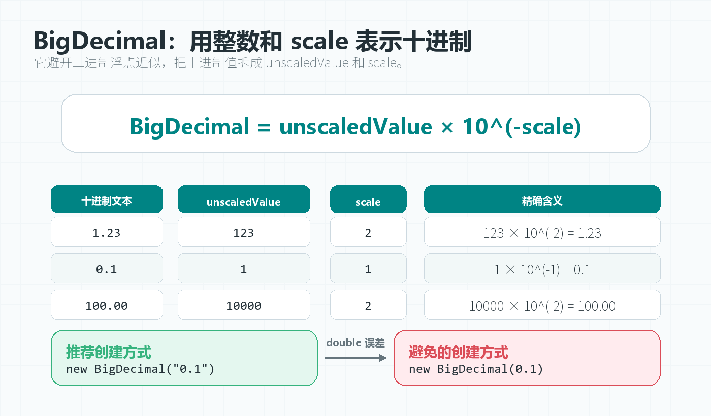

> [!info] 知识摘要
> **总结**
> - `0.1 + 0.2` 不能精确等于 `0.3`，根源是二进制浮点数无法精确表示部分十进制小数。
> - 工程上要区分近似计算和精确计算：测量值可用 `double`，金额优先用 `BigDecimal` 或整数分。
>
> **相关知识点**
> - [[【第二篇】数据类型与运算符|浮点数精度]]、`float`、`double`、IEEE 754、`BigDecimal`、误差范围、金额计算

---

## 一、先看现象：0.1 + 0.2 为什么很反直觉

先看最经典的代码：

**✅ 浮点数精度现象示例**

```java
System.out.println(0.1 + 0.2 == 0.3);
System.out.println(0.1 + 0.2);
```

输出结果通常是：

```text
false
0.30000000000000004
```

从人的十进制直觉看，`0.1 + 0.2` 应该等于 `0.3`。但 Java 中的小数字面量默认是 `double`，而 `double` 底层遵循 IEEE 754 二进制浮点数标准。

问题的关键在于：

```text
十进制里的 0.1，在二进制浮点数里无法被精确表示
```

也就是说，程序里写下 `0.1` 的那一刻，它存进计算机时就已经变成了一个非常接近 `0.1` 的近似值。

| 表达式 | 人类直觉 | 计算机实际处理 |
| --- | --- | --- |
| `0.1` | 一个精确十进制小数 | 一个二进制近似值 |
| `0.2` | 一个精确十进制小数 | 一个二进制近似值 |
| `0.1 + 0.2` | 精确等于 `0.3` | 两个近似值相加后再舍入 |
| `== 0.3` | 应该为 `true` | 两边底层二进制结果不同，所以为 `false` |



**💡 核心结论：** 浮点数精度问题不是 Java 独有的问题，而是大多数遵循 IEEE 754 的语言都会遇到的底层表示问题。

---

## 二、根本原因：十进制小数不一定能被二进制精确表示

人类日常使用的是十进制，计算机底层使用的是二进制。

十进制小数能否有限表示，取决于它的分母能否被 `2` 和 `5` 分解。例如：

| 十进制小数 | 分数形式 | 十进制是否有限 | 二进制是否有限 |
| --- | --- | --- | --- |
| `0.5` | `1/2` | 是 | 是 |
| `0.25` | `1/4` | 是 | 是 |
| `0.1` | `1/10` | 是 | 否 |
| `0.2` | `1/5` | 是 | 否 |
| `0.3` | `3/10` | 是 | 否 |

为什么 `0.1` 在二进制中无法有限表示？

十进制小数转二进制小数，可以使用“乘 2 取整法”：

| 轮次 | 当前处理的小数部分 | 乘以 2 后 | 取出的二进制位 | 下一轮继续处理的小数部分 |
| --- | --- | --- | --- | --- |
| 1 | `0.1` | `0.2` | `0` | `0.2` |
| 2 | `0.2` | `0.4` | `0` | `0.4` |
| 3 | `0.4` | `0.8` | `0` | `0.8` |
| 4 | `0.8` | `1.6` | `1` | `0.6` |
| 5 | `0.6` | `1.2` | `1` | `0.2` |

注意这里的闭环不是“回到最开始的 `0.1`”，而是回到了已经出现过的状态 `0.2`。

第 1 轮处理完 `0.1` 后，下一轮的小数部分就是 `0.2`；第 5 轮处理 `0.6` 时，`0.6 * 2 = 1.2`，取出整数位 `1` 后，剩下的小数部分又变成了 `0.2`。于是后续会重复：

```text
0.2 -> 0.4 -> 0.8 -> 0.6 -> 0.2 -> ...
```

因此，`0.1` 的二进制小数近似是：

```text
0.0001100110011001100110011...
```

后面的 `0011` 会无限循环。

但计算机不可能用无限位来保存一个小数，所以只能在固定长度内截断或舍入。精度误差就是从这里开始的。

> ⚠️ **误区：只要写的是 0.1，内存里就一定存的是精确 0.1**
>
> **正确理解：** 十进制字面量要先转成二进制浮点数才能存储。`0.1` 无法用有限二进制小数精确表示，所以内存里只能保存它的近似值。

---

## 三、IEEE 754 到底怎么存 double

Java 的 `float` 和 `double` 都是二进制浮点数：

| 类型 | 位数 | 常见用途 | 精度特点 |
| --- | --- | --- | --- |
| `float` | 32 位 | 图形、游戏、内存敏感场景 | 大约 6 到 7 位十进制有效数字 |
| `double` | 64 位 | Java 默认小数类型 | 大约 15 到 16 位十进制有效数字 |

`double` 使用 64 位空间，但它不是直接“把小数完整写进去”，而是拆成三部分：

| 组成部分 | 位数 | 作用 | 说明 |
| --- | --- | --- | --- |
| 符号位 `sign` | 1 位 | 决定正负 | `0` 表示正数，`1` 表示负数 |
| 指数位 `exponent` | 11 位 | 决定数量级 | 使用偏移量 `1023` 保存指数 |
| 尾数位 `fraction` | 52 位 | 决定有效数字 | 规格化数会隐含一个前导 `1` |

可以把它近似理解为二进制科学计数法：

```text
(-1)^sign * 1.fraction * 2^(exponent - bias)
```

其中 `double` 的 `bias` 是 `1023`。

### 3.1 为什么要有指数偏移量

指数本质上可能是正数，也可能是负数。

如果直接保存有符号指数，硬件比较和处理会更复杂。IEEE 754 使用偏移量把指数转换成非负形式保存。

例如 `double` 的偏移量是 `1023`：

```text
真实指数 -4  保存为 -4 + 1023 = 1019
真实指数  0  保存为  0 + 1023 = 1023
真实指数  3  保存为  3 + 1023 = 1026
```

这样做可以让硬件更容易按照位模式进行比较和计算。

### 3.2 为什么尾数会有隐含的 1

规格化二进制科学计数法要求小数点左边必须是 `1`。

例如：

```text
0.1 的二进制近似值可以规格化成 1.xxxx * 2^-4
```

既然规格化数的小数点左边一定是 `1`，那这一位就不需要真的存下来。这样 `double` 虽然只有 52 位尾数位，但实际有效精度相当于 53 位二进制有效数字。



**💡 核心结论：** `double` 的精度有限，不是因为 Java “粗心”，而是因为 IEEE 754 必须在固定 64 位里同时保存正负、范围和有效数字。

---

## 四、0.1 + 0.2 的真实计算过程

执行：

```java
0.1 + 0.2
```

大致会经过三步：

| 步骤 | 发生了什么 | 可能产生什么影响 |
| --- | --- | --- |
| 1 | `0.1` 和 `0.2` 转成 IEEE 754 二进制近似值 | 字面量存储时已经有误差 |
| 2 | 做加法时进行指数对齐 | 小数部分可能继续被舍入 |
| 3 | 结果重新规格化并舍入 | 得到最接近真实和的 `double` |

可以用 `Double.toHexString()` 看看底层十六进制浮点表示：

**✅ 查看 double 底层近似值示例**

```java
System.out.println(Double.toHexString(0.1));
System.out.println(Double.toHexString(0.2));
System.out.println(Double.toHexString(0.3));
System.out.println(Double.toHexString(0.1 + 0.2));
```

输出结果类似：

```text
0x1.999999999999ap-4
0x1.999999999999ap-3
0x1.3333333333333p-2
0x1.3333333333334p-2
```

注意最后两行：

```text
0.3       -> 0x1.3333333333333p-2
0.1 + 0.2 -> 0x1.3333333333334p-2
```

它们已经不是同一个 `double` 值，所以：

```java
0.1 + 0.2 == 0.3
```

结果自然是 `false`。

> ⚠️ **误区：输出 0.30000000000000004 是因为 println 显示错了**
>
> **正确理解：** `println` 只是把 `double` 转成十进制字符串展示出来。真正的问题在于底层二进制浮点数本来就不是精确的十进制 `0.3`。

---

## 五、什么时候可以用 double，什么时候不能用

浮点数不是一无是处。它的优势是速度快、范围大、硬件支持好。

适合使用 `float` 或 `double` 的场景，关键不在于“这个场景精不精密”，而在于它处理的是不是**连续量或测量值**，以及能否接受并管理浮点模型下的误差。

| 场景 | 是否适合浮点数 | 关键判断 |
| --- | --- | --- |
| 图形渲染 | 适合 | 处理坐标、颜色、光照等连续量，通常关注性能和视觉结果 |
| 游戏物理 | 适合 | 处理近似物理量，通常接受可控误差 |
| 科学计算 | 视情况而定 | 不是“不精密”，而是要用数值分析管理误差传播 |
| 统计分析 | 视情况而定 | 通常处理测量值或样本数据，要关注误差范围和置信度 |
| 金额计算 | 不适合 | 通常要求十进制规则下的精确结果 |
| 订单号、用户 ID | 不适合 | ID 是离散精确值，不能丢低位 |

Java 基础里经常强调：**浮点数精度不是十进制精确存储，不建议直接用 `==` 比较计算后的浮点数。**

这句话可以拆成两个工程规则：

```text
规则 1：连续量、测量值、模拟值，可以在明确误差边界下使用 double
规则 2：要求绝对十进制精确的小数计算，不要依赖 double
```

### 5.1 连续量场景：使用误差范围比较

如果处理的是测量值、坐标、模拟结果等连续量，并且业务定义允许可控误差，可以使用误差范围 `epsilon`。

**✅ 使用误差范围比较 double 示例**

```java
double a = 0.1 + 0.2;
double b = 0.3;
double epsilon = 1e-10;

System.out.println(Math.abs(a - b) < epsilon); // true
```

这里比较的不是“二进制值是否完全相同”，而是“两个数是否足够接近”。

但要注意，`epsilon` 不应该完全凭感觉乱写。严谨场景下，它应该来自业务容忍度、测量误差范围，或者数值算法本身的误差分析。

### 5.2 十进制精确场景：不要用 double 做最终金额计算

金额、税率、结算、账单、优惠券抵扣等业务，通常要求按照十进制规则得到精确结果，不能接受二进制浮点误差带来的分、厘级偏差。

不要这样写：

**✅ 错误示例：使用 double 计算金额**

```java
double price = 0.1;
double count = 3;
double total = price * count;

System.out.println(total); // 0.30000000000000004
```

这类场景应该使用 `BigDecimal`，或者在某些系统中使用“分”为单位的整数进行存储和计算。

---

## 六、BigDecimal 为什么能解决十进制精度问题

`BigDecimal` 不是用二进制浮点数来表达小数，而是用“整数 + 小数位数”的方式表达十进制数。

可以简单理解为：

```text
BigDecimal = unscaledValue * 10^(-scale)
```

例如：

| 十进制数 | 内部整数值 | scale | 含义 |
| --- | --- | --- | --- |
| `1.23` | `123` | `2` | `123 * 10^-2` |
| `0.1` | `1` | `1` | `1 * 10^-1` |
| `100.00` | `10000` | `2` | `10000 * 10^-2` |

这就避开了“`0.1` 无法用有限二进制小数表示”的问题。



### 6.1 创建 BigDecimal 的正确方式

最容易踩坑的是构造方法。

不要这样写：

**✅ 错误示例：把 double 传给 BigDecimal 构造器**

```java
BigDecimal wrong = new BigDecimal(0.1);
System.out.println(wrong);
```

输出结果类似：

```text
0.1000000000000000055511151231257827021181583404541015625
```

原因很简单：`0.1` 在传给 `BigDecimal` 之前，已经先变成了 `double` 近似值。`BigDecimal` 只是把这个近似值完整记录了下来。

推荐写法：

**✅ 正确示例：优先使用字符串创建 BigDecimal**

```java
BigDecimal a = new BigDecimal("0.1");
System.out.println(a); // 0.1
```

优先级可以这样记：

| 写法 | 是否推荐 | 说明 |
| --- | --- | --- |
| `new BigDecimal("0.1")` | 推荐 | 最清晰，直接表达十进制文本 |
| `BigDecimal.valueOf(0.1)` | 谨慎可用 | 内部基于 `Double.toString()`，只适合你明确知道来源的简单 `double` 值 |
| `new BigDecimal(0.1)` | 不推荐 | 会把 `double` 的二进制误差带进去 |

很多人会问：既然 `0.1` 已经是 `double` 近似值，为什么下面这段代码又能输出 `0.1`？

**✅ valueOf 输出 0.1 的原因示例**

```java
BigDecimal b = BigDecimal.valueOf(0.1);
System.out.println(b); // 0.1
```

原因在于：`BigDecimal.valueOf(0.1)` 内部大致相当于：

```java
new BigDecimal(Double.toString(0.1));
```

而 `Double.toString(0.1)` 不会把底层完整近似值 `0.10000000000000000555...` 全部打印出来。它会生成一个**能够唯一还原该 double 值的最短十进制字符串**，所以结果是 `"0.1"`。

这不是 `valueOf` 把精度“修复”了，而是 `Double.toString()` 的字符串转换规则让它在这个例子里看起来很友好。

真正危险的是计算后的 `double`：

**✅ valueOf 不能挽救已经产生误差的 double 示例**

```java
double d = 0.1 + 0.2;
BigDecimal value = BigDecimal.valueOf(d);

System.out.println(d);     // 0.30000000000000004
System.out.println(value); // 0.30000000000000004
```

这里 `BigDecimal.valueOf(d)` 得到的不是精确的 `0.3`，而是把 `0.30000000000000004` 这个浮点计算结果固化成了一个精确的 `BigDecimal`。

如果数据来自用户输入、数据库字符串、配置文件，优先用字符串构造。

如果数据本来就是程序计算出来的 `double`，再使用 `BigDecimal.valueOf(double)` 也不能让已经发生的浮点误差凭空消失。

### 6.2 BigDecimal 比较：不要随手用 equals

`BigDecimal` 的 `equals()` 不只比较数值，还会比较 `scale`。

**✅ BigDecimal equals 与 compareTo 对比示例**

```java
BigDecimal a = new BigDecimal("1.0");
BigDecimal b = new BigDecimal("1.00");

System.out.println(a.equals(b));    // false
System.out.println(a.compareTo(b)); // 0
```

原因是：

| 值 | scale |
| --- | --- |
| `1.0` | `1` |
| `1.00` | `2` |

如果业务语义是“数值相等”，通常使用：

```java
a.compareTo(b) == 0
```

如果业务语义要求小数位也必须一致，才考虑使用 `equals()`。

### 6.3 BigDecimal 除法：必须处理除不尽

`BigDecimal` 的除法还有一个常见坑：除不尽时，如果没有指定舍入方式，会抛出 `ArithmeticException`。

**✅ 错误示例：除不尽时未指定舍入规则**

```java
BigDecimal a = new BigDecimal("1");
BigDecimal b = new BigDecimal("3");

// a.divide(b); // ArithmeticException
```

标准写法是明确指定精度和舍入模式：

**✅ 正确示例：指定小数位和舍入模式**

```java
BigDecimal a = new BigDecimal("1");
BigDecimal b = new BigDecimal("3");

BigDecimal result = a.divide(b, 2, RoundingMode.HALF_UP);
System.out.println(result); // 0.33
```

常见舍入模式：

| 舍入模式 | 含义 | 常见场景 |
| --- | --- | --- |
| `HALF_UP` | 四舍五入 | 普通展示、部分业务结算 |
| `HALF_EVEN` | 银行家舍入 | 金融系统中减少累计偏差 |
| `DOWN` | 直接截断 | 明确要求不进位的场景 |
| `UP` | 远离零方向进位 | 明确要求有余数就进位的场景 |

具体选择哪一种，要服从业务规则，而不是凭习惯随手写。

> ⚠️ **误区：用了 BigDecimal 就一定没有精度问题**
>
> **正确理解：** `BigDecimal` 能解决十进制表示问题，但前提是创建方式、比较方式、除法舍入方式都要正确。

---

## 七、工程实践建议

### 7.1 浮点数比较要看业务语义

如果只是判断两个测量值、比例值、坐标值是否接近，可以使用误差范围。

**✅ 近似比较封装示例**

```java
public static boolean nearlyEqual(double a, double b, double epsilon) {
    return Math.abs(a - b) < epsilon;
}
```

但如果是金额、库存单价、账单合计，不要用 `double` 的误差范围来“糊过去”，应该从数据类型上换成 `BigDecimal` 或整数分。

### 7.2 金额计算优先使用 BigDecimal 或整数分

常见金额处理方式：

| 方式 | 示例 | 优点 | 注意点 |
| --- | --- | --- | --- |
| `BigDecimal` | `new BigDecimal("19.99")` | 表达直观，适合十进制计算 | 注意构造、比较、舍入 |
| 整数分 | `1999L` 表示 19.99 元 | 精确、高性能 | 展示时要格式化 |

如果系统里金额有明确小数位，例如人民币通常保留两位小数，用 `long` 保存“分”也是常见方案。

**✅ 使用整数分计算金额示例**

```java
long priceCent = 1999;
long count = 3;
long totalCent = priceCent * count;

System.out.println(totalCent); // 5997，表示 59.97 元
```

这种方案非常适合只涉及固定小数位的金额存储和加减乘计算。

### 7.3 不要把 ID、订单号转成浮点数

ID 是精确值，不是近似值。

不要这样写：

**✅ 错误示例：ID 转成 double**

```java
long orderId = 9007199254740993L;
double value = orderId;

System.out.println((long) value); // 9007199254740992
```

`double` 虽然范围很大，但超过 `2^53` 后就无法精确表示所有整数。订单号、用户 ID、雪花算法 ID 等数据，应该保持 `long` 或字符串。

### 7.4 代码审查时重点看这几类写法

| 风险写法 | 问题 | 建议 |
| --- | --- | --- |
| `a == b` 比较计算后的 `double` | 可能因为微小误差失败 | 使用误差范围或改用精确类型 |
| `new BigDecimal(0.1)` | 把 `double` 误差带入 `BigDecimal` | 优先使用字符串构造 |
| `BigDecimal.valueOf(0.1 + 0.2)` | 把浮点计算误差固化成精确十进制值 | 不要用它挽救已经计算过的 `double` |
| `BigDecimal.equals()` 判断金额相等 | `scale` 不同会返回 `false` | 数值相等用 `compareTo()` |
| `a.divide(b)` | 除不尽时抛异常 | 指定小数位和 `RoundingMode` |
| 金额字段用 `double` | 难以保证精确结算 | 使用 `BigDecimal` 或整数分 |

**💡 核心结论：** 浮点数适合近似计算，不适合精确十进制业务。金额、ID、账单这类数据，应该从建模阶段就避开 `float` 和 `double`。

---

## 总结

| 问题 | 结论 |
| --- | --- |
| 为什么 `0.1 + 0.2 != 0.3` | `0.1`、`0.2`、`0.3` 都无法用有限二进制浮点数精确表示 |
| IEEE 754 做了什么 | 用符号位、指数位、尾数位在固定空间内表示近似实数 |
| 能不能用 `==` 比较浮点数 | 不建议比较计算后的浮点数，连续量场景可在明确误差边界下使用误差范围 |
| 金额能不能用 `double` | 不建议，金额计算应使用 `BigDecimal` 或整数分 |
| `BigDecimal` 怎么创建 | 优先 `new BigDecimal("0.1")`；`valueOf(double)` 不能挽救已经产生误差的计算结果 |
| `BigDecimal` 怎么比较 | 数值相等用 `compareTo()`，不要默认用 `equals()` |
| `BigDecimal` 除法注意什么 | 除不尽时必须指定小数位和 `RoundingMode` |

这个知识点可以压缩成一句话：**浮点数解决的是“高效近似表示实数”，不是“精确表示十进制小数”。**

**💡 核心结论：** `0.1 + 0.2` 的结果不是精确 `0.3`，根源在于二进制浮点数无法精确表示某些十进制小数。工程上要按场景选类型：连续量和测量值可以在可控误差下使用 `double`，精确金额用 `BigDecimal` 或整数分，比较浮点数时不要直接依赖 `==`。
