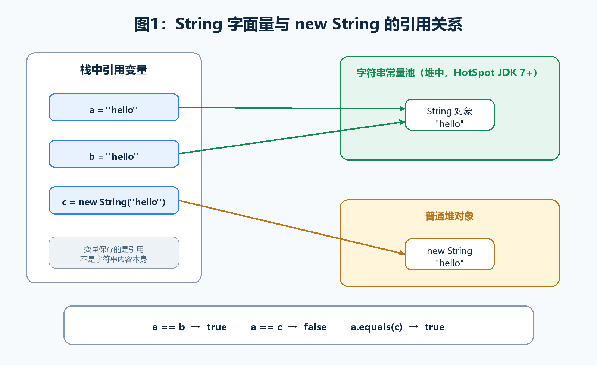
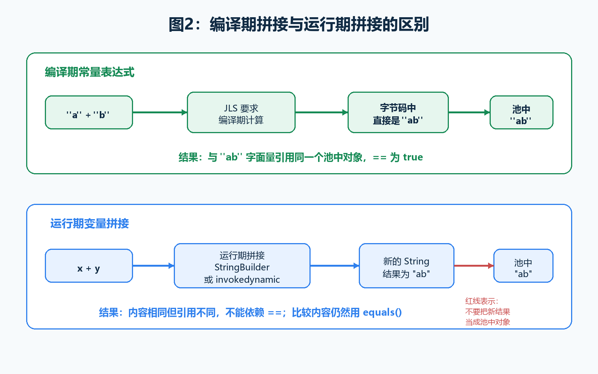
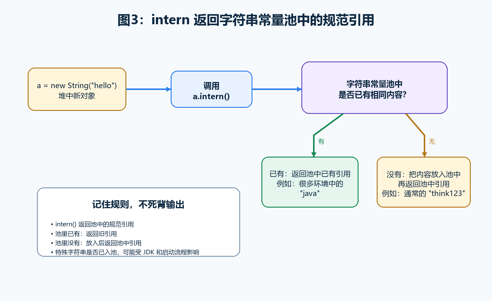
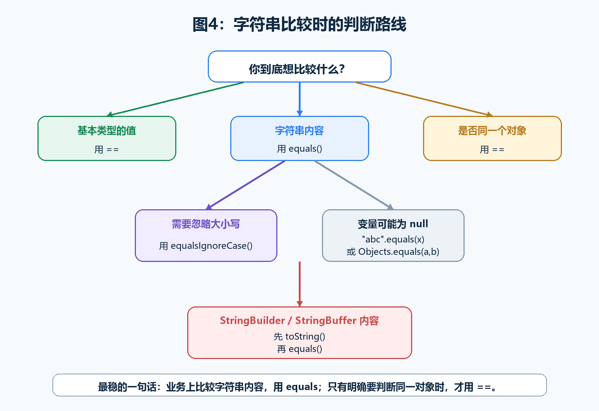

> [!info] 知识摘要
> **总结**
> - `==` 比较引用是否指向同一个对象，`equals()` 是否比较内容取决于类有没有重写。
> - 字符串常量池会让部分 `==` 场景看起来“正确”，但业务字符串内容比较仍应优先用 `equals()`。
>
> **相关知识点**
> - [[【第二篇】数据类型与运算符|字符串内容比较]]、`String`、`==`、`equals()`、字符串常量池、`intern()`、不可变性

---

## 一、先给结论：字符串比较别靠感觉

先把最关键的结论放在前面：

```text
基本类型：== 比较值
引用类型：== 比较是否同一个对象
equals：普通方法，默认也比较引用
String.equals：String 重写后的方法，比较字符串内容
字符串字面量：会和字符串常量池有关
new String(...)：会创建新的 String 对象
```

所以，看到下面这两行代码时，不能只盯着内容是不是一样：

```java
String a = "hello";
String b = new String("hello");
```

它们的内容一样，但不代表它们一定是同一个对象。

| 写法 | 比较内容 | 比较对象是否相同 | 是否推荐用于字符串内容比较 |
| --- | --- | --- | --- |
| `a == b` | 否 | 是 | 不推荐 |
| `a.equals(b)` | 是，前提是 `a` 不为 `null` | 否 | 推荐 |
| `"hello".equals(a)` | 是 | 否 | 推荐，可避免空指针 |

**💡 核心结论：** 字符串内容比较使用 `equals()`，不要因为某些字面量场景下 `==` 返回 `true`，就误以为 `==` 在比较字符串内容。



---

## 二、`==` 到底比较什么

### 2.1 基本类型：比较值本身

如果两边都是基本类型，`==` 比较的是值。

**✅ 基本类型使用 `==` 比较示例**

```java
int a = 10;
int b = 10;

System.out.println(a == b); // true
```

这里没有对象，也没有引用，变量里保存的就是具体数值。

### 2.2 引用类型：比较是否指向同一个对象

如果两边是引用类型，`==` 比较的是两个引用是否指向同一个对象。

**✅ 引用类型使用 `==` 比较示例**

```java
String s1 = new String("hello");
String s2 = new String("hello");

System.out.println(s1 == s2); // false
```

`s1` 和 `s2` 的内容都是 `"hello"`，但它们是两个不同的 `String` 对象，所以 `==` 返回 `false`。

可以把引用先粗略理解成对象的“地址牌”：

```text
s1 ---> String 对象 A，内容是 hello
s2 ---> String 对象 B，内容是 hello
```

内容一样，不代表地址牌一样。

### 2.3 工程结论：字符串内容用 `equals()`

对引用类型来说，`==` 只回答一个问题：**这两个引用是不是指向同一个对象？**

它不会逐字符比较字符串内容。

所以业务代码里判断输入、命令、状态码、配置值这类文本内容时，直接用 `equals()`，不要用 `==` 赌常量池。

> ⚠️ **误区：`==` 不能比较字符串**
>
> **正确理解：** `==` 可以比较字符串引用，但它比较的是是否同一个对象。某些字面量场景下 `==` 返回 `true`，只是因为两个引用刚好指向同一个池中对象，不代表 `==` 是字符串内容比较工具。

---

## 三、`equals()` 不是天生比较内容

### 3.1 `equals()` 是 `Object` 里的方法

Java 中所有类最终都继承自 `Object`。

`Object` 中有一个 `equals(Object obj)` 方法。默认情况下，它的行为和 `==` 很像，也是判断两个引用是否指向同一个对象。

**✅ 普通类未重写 `equals()` 示例**

```java
class Student {
    private String name;

    public Student(String name) {
        this.name = name;
    }
}

Student s1 = new Student("Tom");
Student s2 = new Student("Tom");

System.out.println(s1 == s2);      // false
System.out.println(s1.equals(s2)); // false
```

两个学生对象的 `name` 都是 `"Tom"`，但 `Student` 没有重写 `equals()`，所以这里仍然按对象引用来比较。

**💡 核心结论：** `equals()` 不是语法规则，它只是一个方法。这个方法到底怎么比较，取决于类本身有没有重写它。

### 3.2 `String` 重写了 `equals()`

`String` 的特殊之处在于：它重写了 `equals()`。

所以：

**✅ String 使用 `equals()` 比较内容示例**

```java
String s1 = new String("hello");
String s2 = new String("hello");

System.out.println(s1 == s2);      // false
System.out.println(s1.equals(s2)); // true
```

`s1 == s2` 为 `false`，因为它们不是同一个对象。

`s1.equals(s2)` 为 `true`，因为 `String.equals()` 比较的是字符串内容。

入门阶段不需要背源码，只要知道它的大致逻辑：

```text
如果两个引用本来就是同一个对象，直接返回 true。
如果对方不是 String，返回 false。
如果对方也是 String，再比较字符串内容是否一致。
```

在不同 JDK 中，`String` 内部存储细节可能不同，比如早期常见 `char[]`，后续版本可能使用更紧凑的 `byte[]`。但对我们使用者来说，结论不变：**`String.equals()` 比较字符串内容。**

### 3.3 `StringBuilder` 的 `equals()` 是一个反例

不要把 `String.equals()` 的规则套到所有字符串相关类上。

`StringBuilder` 和 `StringBuffer` 没有像 `String` 那样重写 `equals()`，所以它们的 `equals()` 仍然是引用比较。

**✅ StringBuilder 比较示例**

```java
StringBuilder sb1 = new StringBuilder("abc");
StringBuilder sb2 = new StringBuilder("abc");

System.out.println(sb1 == sb2);              // false
System.out.println(sb1.equals(sb2));         // false
System.out.println(sb1.toString().equals(sb2.toString())); // true
```

如果想比较两个 `StringBuilder` 里的文本内容，可以先转成 `String`，再调用 `String.equals()`。

---

## 四、字符串常量池：为什么有时 `==` 也会返回 true

### 4.1 字符串字面量会被复用

看这段代码：

**✅ 字符串字面量比较示例**

```java
String a = "hello";
String b = "hello";

System.out.println(a == b); // true
```

这段代码里，`a == b` 返回 `true`。

但注意，它不是因为 `==` 突然开始比较内容了，而是因为两个引用指向了同一个字符串对象。

字符串字面量 `"hello"` 会和**字符串常量池**有关。可以先把字符串常量池理解成 JVM 管理的一块字符串缓存：

```text
字符串字面量和编译期常量表达式的结果会被 intern。
相同内容的字符串字面量会引用同一个 String 对象。
```

这里不是“尽量复用”，而是 Java 语言规范对字符串字面量共享语义的保证。具体什么时候解析、怎么放入池中，可以交给 JVM 实现处理；对 Java 代码来说，相同内容的字符串字面量会指向同一个池中对象。

所以：

```text
a ---> 常量池中的 "hello"
b ---> 常量池中的 "hello"
```

两个引用指向同一个对象，`a == b` 才返回 `true`。

### 4.2 `new String("hello")` 会创建新对象

再看这段：

**✅ 字面量与 new String 对比示例**

```java
String a = "hello";
String b = new String("hello");

System.out.println(a == b);      // false
System.out.println(a.equals(b)); // true
```

`a` 指向的是常量池相关的 `"hello"` 对象。

`b` 指向的是 `new` 出来的新 `String` 对象。

它们内容一样，但不是同一个对象。

这里还有一个经常被说错的点：

```text
new String("hello") 至少会创建一个新的 String 对象。
至于常量池中的 "hello" 是否在这一行新建，取决于池中之前是否已经有它。
```

所以，不要死记成“`new String("hello")` 一定创建两个对象”。更严谨的说法是：**`new String("hello")` 一定会创建一个新的堆中 `String` 对象；字符串字面量 `"hello"` 会关联字符串常量池。**

### 4.3 字符串常量池不等于元空间

这里顺手把一个 JVM 概念坑捋清楚。

很多资料会同时提到：

- Class 文件常量池
- 运行时常量池
- 字符串常量池
- 方法区
- 永久代
- 元空间

这些词很容易混在一起。

入门阶段先记住下面这张表：

| 名称 | 入门理解 | 本笔记是否重点 |
| --- | --- | --- |
| Class 文件常量池 | `.class` 文件中的常量表 | 不是 |
| 运行时常量池 | 类加载后，常量池在运行时的形态 | 不是 |
| 字符串常量池 | JVM 用来复用字符串对象引用的结构 | 是 |

在 HotSpot JVM 中：

```text
JDK 6：字符串常量池主要在永久代中。
JDK 7+：字符串常量池移动到了堆中。
JDK 8+：永久代被移除，类元数据主要放到元空间中；但字符串常量池不是“搬到元空间”。
```

**💡 核心结论：** 本笔记讨论的是字符串常量池，也就是字符串字面量和 `intern()` 相关的那部分，不要把它和方法区、元空间直接画等号。

---

## 五、字符串拼接：编译期和运行期不是一回事

### 5.1 字面量拼接会被编译器折叠

下面这段代码很容易让人误判：

**✅ 字符串字面量拼接示例**

```java
String a = "ab";
String b = "a" + "b";

System.out.println(a == b); // true
```

为什么是 `true`？

根据 Java 语言规范，`"a" + "b"` 是编译期常量表达式，编译器必须在编译时计算出 `"ab"`。

也就是说，源码看起来像拼接，但 `b` 在字节码里直接对应的就是 `"ab"`：

```java
String b = "ab";
```

所以 `a` 和 `b` 最终都指向常量池里的同一个 `"ab"`。

### 5.2 变量参与拼接通常是运行期结果

再看这段：

**✅ 变量参与字符串拼接示例**

```java
String x = "a";
String y = "b";
String z = x + y;

System.out.println("ab" == z);      // false
System.out.println("ab".equals(z)); // true
```

`x + y` 需要在程序运行时计算，结果通常是一个新的字符串对象，不会自动等同于常量池中的 `"ab"` 引用。

老版本字节码中，运行期字符串拼接常表现为 `StringBuilder`；JDK 9 以后，底层可能使用 `invokedynamic` 和 `StringConcatFactory`。这些实现细节入门阶段不用展开。

对工程判断来说，关键推论不变：**无论底层是 `StringBuilder` 还是 `invokedynamic`，运行期拼接产生的结果都不能依赖 `==` 与常量池对象相等。**

只要抓住一句话：

```text
字面量拼接属于编译期常量表达式，会在编译期计算。
变量参与拼接通常是运行期结果。
判断内容是否相同，仍然用 equals()。
```

### 5.3 `final` 常量的特殊情况

如果变量是编译期常量，也可能被编译器提前折叠。

**✅ final 编译期常量拼接示例**

```java
final String x = "a";
final String y = "b";
String z = x + y;

System.out.println("ab" == z); // true
```

这里 `x` 和 `y` 都是编译期可以确定的常量，所以 `x + y` 可以被优化成 `"ab"`。

更具体一点，能被编译器折叠的 `String` 变量通常要满足这些条件：

```text
使用 final 修饰。
声明时直接用字符串字面量或其他编译期常量表达式初始化。
编译器在编译阶段就能确定它的值。
```

反过来，如果 `final` 变量的值来自运行期对象创建，就不能按编译期常量处理。

**✅ final 但不能编译期折叠的示例**

```java
final String x = new String("a");
final String y = "b";
String z = x + y;

System.out.println("ab" == z); // false
```

这里 `x` 虽然是 `final`，但 `new String("a")` 是运行期创建对象，不是编译期常量表达式。



---

## 六、`intern()`：手动拿到池中的引用

### 6.1 `intern()` 的基本作用

`intern()` 可以理解成：返回字符串常量池中与当前字符串内容相同的那个规范引用。

**✅ intern 基本示例**

```java
String a = new String("hello");
String b = a.intern();
String c = "hello";

System.out.println(a == b); // false
System.out.println(b == c); // true
```

这里可以这样理解：

```text
a 指向 new 出来的 String 对象。
b 是 intern() 返回的池中引用。
c 是字面量引用，也指向池中的 "hello"。
```

所以 `b == c` 为 `true`。



### 6.2 `intern()` 不适合死背特殊输出

网上经常会看到这种题：

**✅ intern 进阶案例**

```java
String s1 = new StringBuilder().append("think").append("123").toString();
System.out.println(s1.intern() == s1);

String s2 = new StringBuilder().append("ja").append("va").toString();
System.out.println(s2.intern() == s2);
```

以常见 HotSpot JDK 8 环境为例，很多时候会看到这样的结果：

```text
true
false
```

为什么第一个可能是 `true`？

`new StringBuilder().append("think").append("123").toString()` 会在运行期生成一个内容为 `"think123"` 的新 `String` 对象。通常情况下，字符串常量池里原本没有 `"think123"`。在 JDK 7+ 的 HotSpot 中，字符串常量池已经在堆中，调用 `s1.intern()` 时，池里如果没有这个内容，就可能把当前这个堆中字符串对象的引用放进去。因此：

```text
s1.intern() 返回的就是 s1 指向的对象
所以 s1.intern() == s1 为 true
```

为什么第二个可能是 `false`？

`"java"` 这个字符串比较特殊。在 JDK 8 等环境中，它很可能在当前代码执行前，已经被 JVM 或类库内部提前放入字符串常量池。此时 `s2` 是运行期新创建的对象，而 `s2.intern()` 返回的是池里早就存在的那个 `"java"` 引用。因此：

```text
s2 指向新对象
s2.intern() 返回旧的池中对象
所以 s2.intern() == s2 为 false
```

这段例子真正想说明的不是“永远背 true、false”，而是下面这个判断步骤：

更适合记住的是规则：

```text
intern() 返回池中内容相同字符串的引用。
如果池中已经有，返回已有引用。
如果池中没有，会尝试把当前字符串对应内容放入池中，再返回池中的引用。
```

JDK 6、JDK 7+、JDK 11/12 以后，以及不同启动流程下，某些字符串是否提前进入池中可能不同。所以这类题要按规则分析，不要只背输出。

### 6.3 实战中不要乱用 `intern()`

`intern()` 不是性能优化万能药。

字符串常量池本质上也需要管理和查找。如果盲目把大量动态字符串都 `intern()`，可能带来额外内存占用和查找成本。

普通业务代码里，优先做到：

- 字符串内容比较用 `equals()`。
- 不要用 `==` 判断字符串内容。
- 真正需要大量重复字符串去重时，再评估是否使用 `intern()` 或其他更合适的缓存方案。

---

## 七、为什么 `String` 要设计成不可变

字符串常量池能安全复用，有一个重要前提：`String` 是不可变的。

假设 `String` 可以被随便修改，会发生什么？

```text
String a = "hello";
String b = "hello";
```

如果 `a` 和 `b` 指向同一个常量池对象，而 `a` 可以把内容改成 `"java"`，那 `b` 看到的内容也会被影响。这显然很危险。

所以，`String` 不可变带来几个好处：

| 好处 | 说明 |
| --- | --- |
| 支持常量池复用 | 多个引用可以安全共享同一个字符串对象 |
| 线程更安全 | 不可变对象天然更适合多线程共享 |
| 适合作为 Map 的 key | 内容不变，哈希值稳定 |
| 便于缓存 hashCode | 字符串内容不变，计算过的哈希值可以复用 |

这也是为什么后面学习 `HashMap`、`HashSet` 时，经常会看到 `String` 被当作 key 或去重元素。

**💡 核心结论：** `String` 的不可变性不是摆设，它是字符串常量池、线程安全和哈希结构稳定性的基础。

---

## 八、几个真实容易踩的坑

### 8.1 用 `==` 判断字符串内容

**✅ 错误示例**

```java
String input = new String("yes");

if (input == "yes") {
    System.out.println("通过");
}
```

这段代码不可靠，因为 `input` 和 `"yes"` 不一定指向同一个对象。

**✅ 正确写法**

```java
String input = new String("yes");

if ("yes".equals(input)) {
    System.out.println("通过");
}
```

把常量字符串写在前面，可以避免 `input` 为 `null` 时调用 `input.equals(...)` 抛出 `NullPointerException`。

### 8.2 忽略 `equals()` 区分大小写

`equals()` 是严格内容比较，大小写不同就不相等。

**✅ 大小写敏感比较示例**

```java
String input = "YES";

System.out.println("yes".equals(input));           // false
System.out.println("yes".equalsIgnoreCase(input)); // true
```

如果业务规则允许大小写不敏感，例如用户输入 `YES`、`yes`、`Yes` 都算确认，可以使用 `equalsIgnoreCase()`。

但它只忽略大小写，不会自动忽略空格：

```java
System.out.println("yes".equalsIgnoreCase(" yes ")); // false
```

如果输入来自用户，通常还要先考虑是否需要 `trim()` 去掉首尾空白。

### 8.3 以为 `equals()` 永远比较内容

**✅ 易错示例**

```java
StringBuilder a = new StringBuilder("abc");
StringBuilder b = new StringBuilder("abc");

System.out.println(a.equals(b)); // false
```

不是所有类都按内容重写了 `equals()`。

如果是自己写的类，要根据业务语义决定是否重写 `equals()` 和 `hashCode()`。

### 8.4 以为 `new String("abc")` 和 `"abc"` 一样

**✅ 易错示例**

```java
String a = "abc";
String b = new String("abc");

System.out.println(a == b); // false
```

内容一样，只说明 `a.equals(b)` 为 `true`。

是否同一个对象，是另一回事。

### 8.5 把常量池位置说错

容易说错的表达：

```text
JDK 8 以后字符串常量池在元空间。
```

更准确的表达：

```text
HotSpot JDK 7+ 字符串常量池在堆中。
JDK 8 移除永久代，使用元空间存放类元数据。
```

这两个变化有关联，但不是同一件事。



---

## 总结

先用一张速查表收束：

| 问题 | 结论 |
| --- | --- |
| 基本类型能不能用 `==` | 能，比较值 |
| 字符串内容能不能用 `==` | 不要用，`==` 比较引用 |
| `equals()` 是否一定比较内容 | 不一定，取决于类有没有重写 |
| `String.equals()` 比较什么 | 比较字符串内容 |
| `equals()` 是否忽略大小写 | 不忽略，大小写不敏感时用 `equalsIgnoreCase()` |
| 字符串字面量为什么 `==` 可能为 true | 因为常量池复用了同一个对象 |
| `new String("abc")` 要注意什么 | 会创建新的 `String` 对象，不要和字面量引用混为一谈 |
| `intern()` 做什么 | 返回字符串常量池中的规范引用 |

再把这个知识点压缩成三句话：

```text
== 对引用类型比较的是“是否同一个对象”。
String.equals() 比较的是字符串内容。
字符串常量池会让某些 == 看起来“刚好正确”，但这不是判断内容的可靠方式。
```

**💡 核心结论：** 写业务代码时，字符串内容比较优先使用 `equals()`；只有你明确要判断两个引用是否指向同一个对象时，才考虑使用 `==`。

---

## 排查清单

如果字符串比较结果和你预期不一致，可以按这 5 个问题快速自查：

| 自查问题 | 处理方式 |
| --- | --- |
| 是不是用 `==` 比较字符串内容了？ | 改成 `equals()` |
| 是不是和字面量用 `==` 比较，刚好被常量池“骗”了？ | 不依赖 `==`，统一按内容比较 |
| 有没有大小写问题？ | 需要忽略大小写时用 `equalsIgnoreCase()` |
| 是不是在比较 `StringBuilder` / `StringBuffer` 的内容？ | 先 `toString()`，再比较字符串内容 |
| 是不是把 `new String(...)` 和字面量混用了？ | 记住内容相同不代表对象相同 |
