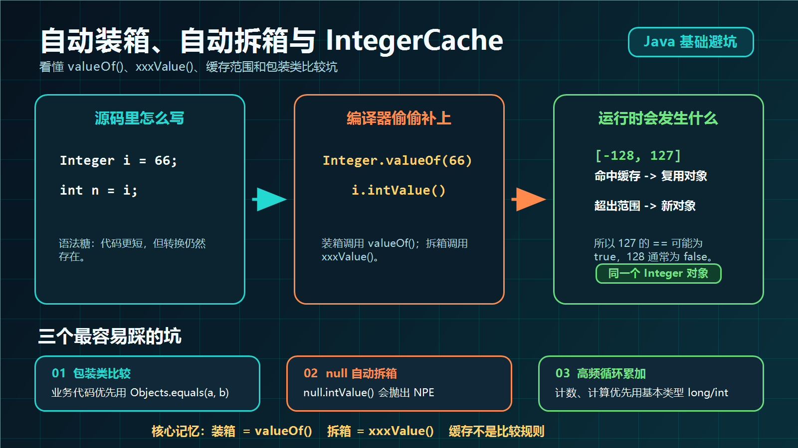

> [!info] 知识摘要
> **总结**
> - 自动装箱和自动拆箱本质上是编译器在背后插入 `valueOf()` 与 `xxxValue()`。
> - `IntegerCache` 只影响部分包装类对象复用，不能把 `==` 当成包装类数值比较规则。
>
> **相关知识点**
> - [[【第二篇】数据类型与运算符|自动装箱与拆箱]]、包装类、`Integer.valueOf()`、`intValue()`、`IntegerCache`、`Objects.equals()`

---

## 一、先看核心结论

自动装箱和自动拆箱本质上是 Java 编译器帮我们补了类型转换代码。它让代码写起来更轻松，但也会带来一些隐藏行为。

| 知识点 | 编译器背后的动作 | 常见场景 | 主要风险 |
|---|---|---|---|
| 自动装箱 | `int` 变 `Integer`，调用 `Integer.valueOf()` | 基本类型赋值给包装类型、放入集合 | 可能触发缓存，也可能创建新对象 |
| 自动拆箱 | `Integer` 变 `int`，调用 `intValue()` | 包装类型参与运算、赋值给基本类型 | 对 `null` 拆箱会抛出 `NullPointerException` |
| `IntegerCache` | `valueOf()` 优先复用缓存对象 | `Integer a = 127` 这类写法 | 用 `==` 比较包装类结果容易误判 |
| 包装类参与循环 | 每次运算可能拆箱再装箱 | `Long sum = 0L; sum += i` | 产生大量临时对象，增加 GC 压力 |

**💡 核心结论：** 自动装箱不是“没有成本的语法糖”。凡是包装类参与赋值、比较、运算、集合取值，都要意识到编译器可能在背后调用 `valueOf()` 或 `xxxValue()`。



---

## 二、自动装箱和自动拆箱是什么

### 2.1 自动装箱：基本类型变包装类型

**自动装箱**就是把基本数据类型自动转换成对应的包装类对象。例如 `int` 转成 `Integer`，`long` 转成 `Long`，`double` 转成 `Double`。

**✅ 自动装箱示例**

```java
Integer num = 10;

List<Integer> list = new ArrayList<>();
list.add(1);
```

上面的代码看起来像是直接把 `int` 放进了 `Integer` 变量或 `List<Integer>` 集合里，但编译器实际会帮你改成类似这样：

```java
Integer num = Integer.valueOf(10);

List<Integer> list = new ArrayList<>();
list.add(Integer.valueOf(1));
```

也就是说，**装箱的关键方法是 `valueOf()`**。

### 2.2 自动拆箱：包装类型变基本类型

**自动拆箱**就是把包装类对象自动转换回基本数据类型。

**✅ 自动拆箱示例**

```java
Integer num = 10;

int value = num;
int result = num + 5;
```

编译器背后会把它理解成：

```java
Integer num = Integer.valueOf(10);

int value = num.intValue();
int result = num.intValue() + 5;
```

所以，**拆箱的关键方法是 `xxxValue()`**，比如 `Integer.intValue()`、`Long.longValue()`、`Double.doubleValue()`。

---

## 三、从字节码角度看它做了什么

我们写下这两行代码：

**✅ 自动装箱与自动拆箱代码**

```java
Integer i = 66;
int n = i;
```

反编译之后，关键指令会出现两个方法调用：

| 源码 | 编译后的核心动作 | 含义 |
|---|---|---|
| `Integer i = 66;` | `Integer.valueOf(66)` | 把 `int` 装箱成 `Integer` |
| `int n = i;` | `i.intValue()` | 把 `Integer` 拆箱成 `int` |

如果换成更接近源码的写法，就等价于：

```java
Integer i = Integer.valueOf(66);
int n = i.intValue();
```

这也是为什么自动装箱和自动拆箱常被称为“语法糖”：源码更简洁，但底层仍然是明确的方法调用。

**💡 核心结论：** 只要记住 `装箱 = valueOf()`，`拆箱 = xxxValue()`，后面很多比较题、空指针题、性能题都能顺着推出来。

---

## 四、IntegerCache 为什么会影响 `==`

先看一道经典题。

**✅ Integer 比较示例**

```java
Integer a = 127;
Integer b = 127;

Integer c = 128;
Integer d = 128;

System.out.println(a == b);
System.out.println(c == d);
```

输出结果是：

```java
true
false
```

关键原因在于：`Integer a = 127` 并不是直接创建对象，而是调用 `Integer.valueOf(127)`。

`Integer.valueOf()` 内部会优先判断当前数字是否落在 `IntegerCache` 范围内。默认情况下，`IntegerCache` 会缓存 `-128` 到 `127` 的 `Integer` 对象。

| 写法 | 是否命中默认缓存 | `==` 比较结果 | 原因 |
|---|---:|---:|---|
| `Integer a = 127; Integer b = 127;` | 是 | `true` | 两个变量指向同一个缓存对象 |
| `Integer c = 128; Integer d = 128;` | 否 | `false` | 两次装箱得到的是不同对象 |
| `Integer x = -128; Integer y = -128;` | 是 | `true` | 默认缓存下限包含 `-128` |
| `Integer x = -129; Integer y = -129;` | 否 | `false` | 超出默认缓存范围 |

注意，`==` 比较包装类对象时，比较的是**引用地址**，不是数值本身。缓存只是让一部分小整数刚好复用了同一个对象，所以结果看起来像是在比较数值。

如果要比较两个包装类的数值，优先使用：

```java
Objects.equals(a, b);
```

或者在确定对象不为 `null` 时使用：

```java
a.equals(b);
```

> ⚠️ **误区：`Integer` 小数字用 `==` 没问题**
>
> **正确理解：** 小数字的 `==` 结果只是被 `IntegerCache` “碰巧救了”。业务代码不能依赖缓存范围判断数值相等，否则换个数值、换个 JVM 参数或换个写法就可能出问题。

---

## 五、包装类缓存不只有 `Integer`

Java 中多个包装类都有缓存设计，但范围并不完全一样。

| 包装类                | 默认缓存范围或对象                      | 说明                                      |
| ------------------ | ------------------------------ | --------------------------------------- |
| `Byte`             | `-128` 到 `127`                 | `byte` 全范围都可缓存                          |
| `Short`            | `-128` 到 `127`                 | 小整数范围复用对象                               |
| `Integer`          | `-128` 到 `127`                 | HotSpot 中上限可通过 `-XX:AutoBoxCacheMax` 调整 |
| `Long`             | `-128` 到 `127`                 | 常见小整数范围复用对象                             |
| `Character`        | `0` 到 `127`                    | 常用 ASCII 字符范围                           |
| `Boolean`          | `Boolean.TRUE`、`Boolean.FALSE` | 只有两个固定对象                                |
| `Float` / `Double` | 无缓存池                           | 浮点值范围大、分布散，缓存命中率低                       |

`Float` 和 `Double` 没有类似整数的缓存池，主要是因为浮点数取值范围非常大，常用值也不像小整数那样集中。即使建立缓存，也很难获得稳定收益，反而会带来额外内存成本。

**💡 核心结论：** 包装类缓存是内存优化，不是比较规则。写业务判断时，始终把 `==` 和 `.equals()` 的语义分清楚。

---

## 六、包装类型比较的几个细节

再看一组更容易绕晕的题。

**✅ 包装类型比较示例**

```java
Integer a = 2;
Integer b = 4;
Integer c = 6;
Integer d = 6;
Integer e = 166;
Integer f = 166;

Long g = 6L;
Long h = 4L;

System.out.println(c == d);          // true
System.out.println(e == f);          // false
System.out.println(c == (a + b));    // true
System.out.println(c.equals(a + b)); // true
System.out.println(g == (a + b));    // true
System.out.println(g.equals(a + b)); // false
System.out.println(g.equals(a + h)); // true
```

逐个拆开看：

| 表达式 | 结果 | 原因 |
|---|---:|---|
| `c == d` | `true` | `6` 命中 `IntegerCache`，两个引用相同 |
| `e == f` | `false` | `166` 默认不在缓存范围，两个引用不同 |
| `c == (a + b)` | `true` | `a + b` 会先拆箱做 `int` 运算，`==` 比较数值 |
| `c.equals(a + b)` | `true` | `a + b` 得到 `6`，再装箱为 `Integer` 参与比较 |
| `g == (a + b)` | `true` | `g` 拆箱成 `long`，右边数值提升后比较数值 |
| `g.equals(a + b)` | `false` | `a + b` 装箱后是 `Integer`，`Long.equals()` 不认 `Integer` |
| `g.equals(a + h)` | `true` | `a + h` 运算结果是 `long`，装箱后是 `Long` |

这里最容易漏掉的一点是：**算术运算会触发拆箱**。只要包装类参与 `+`、`-`、`*`、`/`、`%` 等运算，编译器就会先把它拆成基本类型。

> ⚠️ **误区：`.equals()` 只要数值一样就一定是 `true`**
>
> **正确理解：** `Long.valueOf(6L).equals(Integer.valueOf(6))` 是 `false`。包装类的 `.equals()` 通常会先判断类型，再判断值。

---

## 七、自动拆箱最危险的坑：空指针

自动拆箱最常见、也最隐蔽的运行时问题是 `NullPointerException`。

**✅ Map 取值导致空指针示例**

```java
Map<String, Integer> scoreMap = new HashMap<>();

int score = scoreMap.get("Tom");
```

这段代码会抛出 `NullPointerException`。原因是 `scoreMap.get("Tom")` 返回的是 `null`，但左边是 `int`，编译器会尝试执行：

```java
int score = scoreMap.get("Tom").intValue();
```

对 `null` 调用 `intValue()`，自然会崩。

可以改成：

```java
int score = scoreMap.getOrDefault("Tom", 0);
```

如果需要区分“没有这个 key”和“分数就是 0”，就不要直接给默认值，而是显式判断：

```java
Integer score = scoreMap.get("Tom");
if (score != null) {
    System.out.println(score.intValue());
}
```

三元运算符也要小心：

```java
Integer value = null;
boolean flag = true;

int result = flag ? value : 0;
```

当 `flag` 为 `true` 时，`value` 会被拆箱成 `int`，这同样会抛出 `NullPointerException`。

> ⚠️ **误区：包装类型可以是 `null`，所以赋给 `int` 时会自动变成 `0`**
>
> **正确理解：** Java 不会把 `null` 自动转换成基本类型默认值。`null` 拆箱只会抛出 `NullPointerException`。

---

## 八、高频循环中不要滥用包装类型

包装类型还有一个容易被忽略的性能问题：频繁拆装箱会产生额外对象和额外方法调用。

**✅ 不推荐的累加写法**

```java
private static long sum() {
    Long sum = 0L;
    for (long i = 0; i <= Integer.MAX_VALUE; i++) {
        sum += i;
    }
    return sum;
}
```

`sum += i` 看起来只是普通累加，但对 `Long` 来说，它大致等价于：

```java
sum = Long.valueOf(sum.longValue() + i);
```

也就是每轮循环都可能经历：

1. 把 `Long` 拆箱成 `long`
2. 执行加法运算
3. 再把结果装箱成 `Long`

循环次数很大时，这会制造大量临时对象，增加内存占用和 GC 压力。

更合适的写法是：

```java
private static long sum() {
    long sum = 0L;
    for (long i = 0; i <= Integer.MAX_VALUE; i++) {
        sum += i;
    }
    return sum;
}
```

**💡 核心结论：** 数值计算、高频循环、计数器、累加器优先使用基本类型；包装类型主要用于集合、泛型、可空字段和需要对象语义的场景。

---

## 九、实际编码建议

| 场景 | 推荐写法 | 原因 |
|---|---|---|
| 数值计算、循环累加 | 使用 `int`、`long`、`double` 等基本类型 | 避免频繁拆装箱 |
| 集合元素类型 | 使用 `Integer`、`Long` 等包装类型 | Java 泛型不支持基本类型 |
| 包装类数值比较 | 使用 `Objects.equals(a, b)` | 同时处理 `null`，语义明确 |
| 与 `null` 有关的字段 | 使用包装类型，但拆箱前先判空 | 避免 `NullPointerException` |
| 创建包装对象 | 使用 `valueOf()` 或自动装箱 | 避免显式 `new Integer(...)` 这类过时写法 |
| 面试题判断输出 | 先看是否运算，再看是否拆箱，再看是否缓存 | 按机制推导，不靠背答案 |

可以用下面这条顺序来判断复杂表达式：

**先判断有没有算术运算；有运算就会拆箱。再判断有没有对象比较；对象比较看 `==` 还是 `.equals()`。最后才考虑缓存范围。**

---

## 总结

自动装箱和自动拆箱让 Java 代码更简洁，但它们并不是“消失的转换”，而是编译器帮我们补上了方法调用。

本笔记最该记住三点：

- `装箱 = valueOf()`，`拆箱 = xxxValue()`。
- `IntegerCache` 默认缓存 `-128` 到 `127`，但缓存不是业务比较规则。
- 包装类型参与运算会拆箱，`null` 被拆箱会直接抛出 `NullPointerException`。

**💡 核心结论：** 能用基本类型做计算时，就不要绕到包装类型；需要比较包装类数值时，就不要用 `==` 赌缓存，优先使用 `Objects.equals()`。
