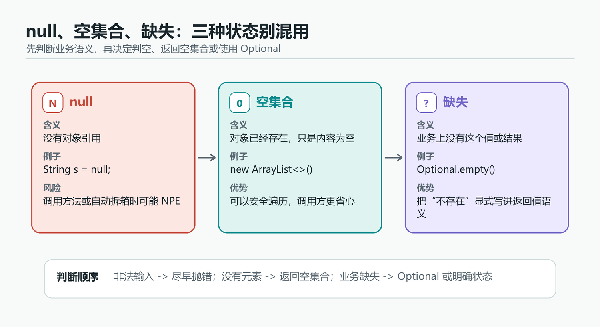
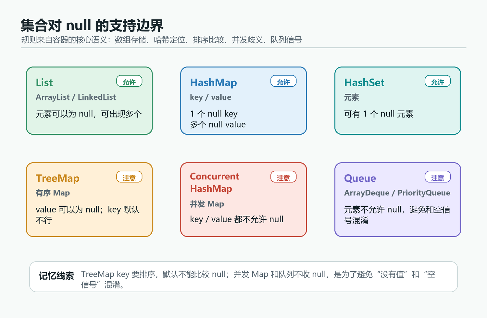
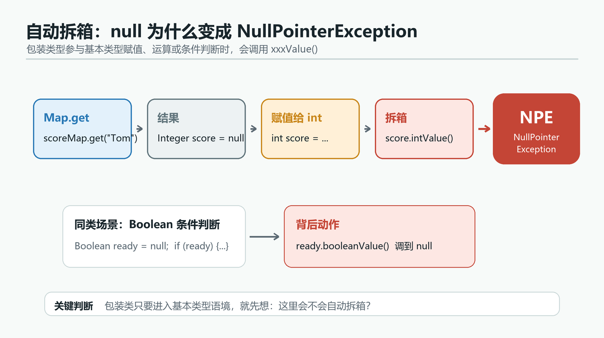

> [!info] 知识摘要
> **总结**
> - `null` 不是统一意义上的“空”，它在引用、拆箱、集合、Map、TreeMap 里的边界完全不同。
> - 最常见的 `NullPointerException` 往往不是“调用方法”本身，而是自动拆箱、条件判断、`Map.get()` 结果直接参与运算。
> - `HashMap`、`ArrayList`、`LinkedList`、`TreeMap`、`ConcurrentHashMap`、`ArrayDeque` 对 `null` 的支持边界不一样。
> - 工程上要把输入校验、空集合返回、`Optional`、显式判空放在边界上，而不是等 `null` 进入核心逻辑。
>
> **相关知识点**
> - `Integer` 自动拆箱、`Boolean` 条件判断、`HashMap.get()`、`TreeMap` 比较器、`Objects.requireNonNull()`、`Optional.ofNullable()`、空集合返回

## 一、先把 `null`、空、缺失分开

`null`、空集合、业务缺失不是一回事。很多坑都是因为这三者被混着用了。

| 状态 | 含义 | 常见表达 |
| --- | --- | --- |
| `null` | 没有对象引用 | `String s = null;` |
| 空 | 对象存在，但内容为空 | `new ArrayList<>()` |
| 缺失 | 业务上没有这个值 | `Optional.empty()` |



再看常见容器对 `null` 的态度：

| 容器 | `null` 规则 | 说明 |
| --- | --- | --- |
| `ArrayList` | 可以存多个 `null` | 只是元素值为空，不影响列表结构 |
| `LinkedList` | 可以存多个 `null` | 但作为队列用时要小心语义混淆 |
| `HashSet` | 可以有一个 `null` 元素 | 底层依赖 `HashMap` |
| `HashMap` | 一个 `null` key，多个 `null` value | `get()` 返回 `null` 不能直接代表“没这个 key” |
| `TreeMap` | `null` value 可以，`null` key 默认不行 | 需要比较 key 来维持有序树 |
| `ConcurrentHashMap` | 不允许 `null` key / value | 避免并发场景的语义歧义 |
| `Hashtable` | 不允许 `null` key / value | 老实现，规则更严格 |
| `ArrayDeque` / `PriorityQueue` | 不允许 `null` | 需要用 `null` 作为空或异常状态的边界信号 |



**一句话记忆：** 容器能不能放 `null`，和它是否要拿 `null` 当“空信号”是两回事。

## 二、最常见的 NPE 来自自动拆箱

`null` 本身不会自动变成 `0`、`false` 或空字符串。只要把包装类型交给基本类型，编译器就会偷偷拆箱。

```java
Integer count = null;
int total = count; // NPE

Boolean ready = null;
if (ready) {       // NPE
    System.out.println("ok");
}
```

编译器背后大致会变成：

```java
int total = count.intValue();
if (ready.booleanValue()) {
    System.out.println("ok");
}
```

再看一个更隐蔽的场景：

```java
Map<String, Integer> scoreMap = new HashMap<>();
int score = scoreMap.get("Tom"); // NPE
```

这里 `get("Tom")` 返回的是 `null`，但左边是 `int`，于是又发生了拆箱。



| 写法 | 触发点 | 结果 |
| --- | --- | --- |
| `int x = integer;` | 自动拆箱 | `Integer.intValue()` 调到 `null` |
| `if (booleanObj)` | 条件判断拆箱 | `Boolean.booleanValue()` 调到 `null` |
| `int x = flag ? integer : 0;` | 三目运算符统一类型 | 可能先选出 `Integer` 再拆箱 |
| `sum += integer;` | 运算前拆箱 | `null` 直接炸掉 |

**核心结论：** 只要包装类型要参与运算、比较或条件判断，就先想一遍“这里会不会被拆箱”。

## 三、`Map.get()` 的 `null` 不一定表示没值

`Map.get()` 返回 `null`，有三种可能：

1. key 不存在。
2. key 存在，但 value 本身就是 `null`。
3. 对于可变 key，key 的哈希身份已经被改坏了。

前两种可以这样区分：

```java
Map<String, Integer> map = new HashMap<>();
map.put("A", null);

System.out.println(map.get("A"));         // null
System.out.println(map.containsKey("A")); // true
```

所以，如果业务上允许 `null` value，`get()` 的结果就不能单独说明问题，得配合 `containsKey()`。

如果业务上不希望出现这个歧义，更稳的做法是：

- 不存 `null` value。
- 返回空集合而不是 `null`。
- 用 `Optional` 表达“可能没有值”。

## 四、`TreeMap` 为什么默认不接受 `null` key

`TreeMap` 的 key 要参与排序。默认自然排序下，key 需要能比较，`null` 没法比较，所以会抛 `NullPointerException`。

```java
TreeMap<String, Integer> map = new TreeMap<>();
map.put("A", 1);
map.put(null, 2); // NPE
```

如果确实有业务需求，可以提供能处理 `null` 的比较器：

```java
TreeMap<String, Integer> map = new TreeMap<>((a, b) -> {
    if (a == b) {
        return 0;
    }
    if (a == null) {
        return -1;
    }
    if (b == null) {
        return 1;
    }
    return a.compareTo(b);
});

map.put(null, 2);
map.put("A", 1);
System.out.println(map.get(null));
```

这里要注意两点：

| 点 | 说明 |
| --- | --- |
| 比较器要稳定 | `compare(a, b)` 不能前后乱跳，否则 `put()` / `get()` 会不一致 |
| `compare(a, b) == 0` 的语义要清楚 | 不然 TreeMap 可能把两个不同对象当成同一个 key |

`TreeSet` 的规则也一样，因为它底层也是 `TreeMap`。

## 五、工程上怎么防 `null`

### 5.1 入参先校验

公共方法和构造函数里，能在入口挡住的 `null` 就别放进去。

```java
public User(String name, Integer age) {
    this.name = Objects.requireNonNull(name, "name");
    this.age = Objects.requireNonNull(age, "age");
}
```

### 5.2 返回空集合，不要返回 `null`

```java
public List<String> listTags() {
    return Collections.emptyList();
}
```

这样调用方就不用先判空再遍历。

### 5.3 `Optional` 只负责“可能没有”，别把它当装饰品

```java
Optional.of(value);       // 已知非空
Optional.ofNullable(val); // 不确定是否为空
```

`of()` 适合已知不为空的值，`ofNullable()` 适合边界输入。

### 5.4 Stream 里先过滤，再收集

`findFirst()`、`max()`、`min()`、`toMap()`、`groupingBy()` 这类操作都要小心 `null`。

| API | 注意点 |
| --- | --- |
| `findFirst()` / `max()` / `min()` | 流里不要混入 `null` 元素 |
| `Collectors.toMap()` | value mapper 不要返回 `null` |
| `Collectors.groupingBy()` | 分组 key 不要返回 `null` |

常见做法是先过滤：

```java
stream.filter(Objects::nonNull)
      .collect(Collectors.toList());
```

### 5.5 静态分析和注解别省

`@Nullable`、`@NotNull` 这类注解配合静态分析工具，能把很多 NPE 提前拦下来。

## 六、总结

| 问题 | 结论 |
| --- | --- |
| `null` 能不能直接参与运算 | 不能，常见结果是自动拆箱 NPE |
| `Map.get()` 返回 `null` 就一定没值吗 | 不一定，可能是 value 本身就是 `null` |
| `TreeMap` 为什么默认不收 `null` key | 因为 key 要参与排序，默认自然顺序无法比较 `null` |
| 哪些容器最容易和 `null` 打架 | `Map`、`Set`、`TreeMap`、`Queue`、包装类型 |
| 工程上最稳的做法 | 入口校验、空集合返回、`Optional`、显式判空 |

**核心结论：** `null` 不是一个统一的“空值”。先分清它在当前场景里代表“缺失”“空对象”还是“非法输入”，后面的代码才不会一路埋雷。
