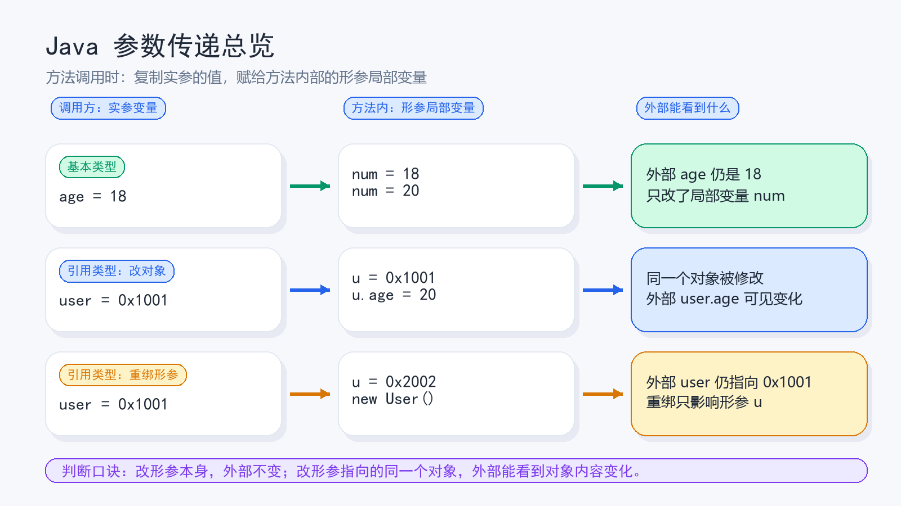
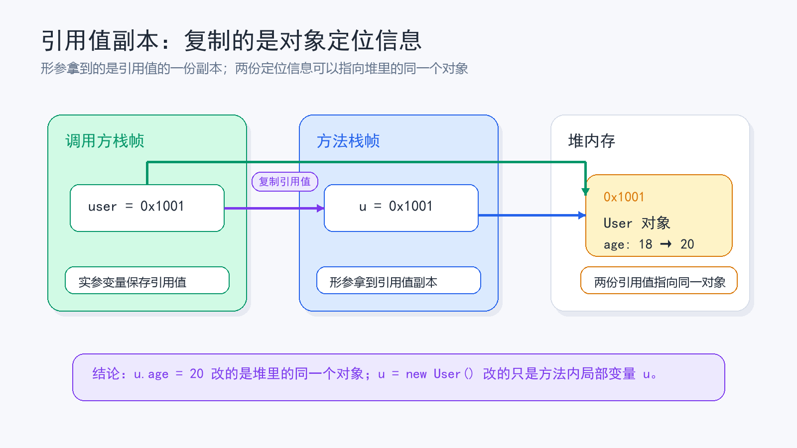
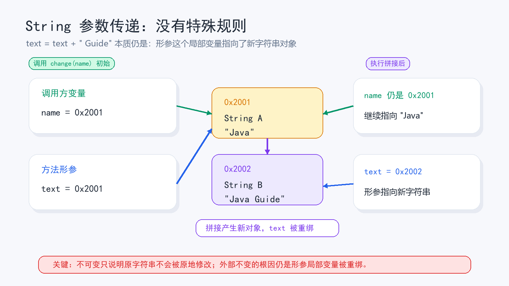
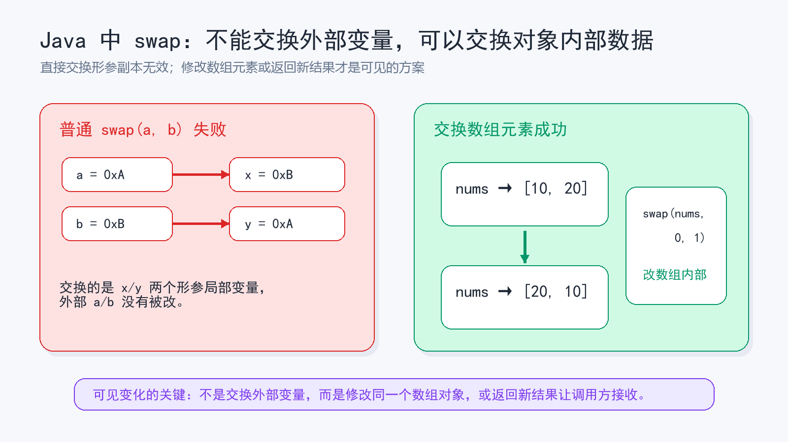

> [!info] 知识摘要
> **总结**
> - Java 方法参数传递只有值传递；基本类型复制数值，引用类型复制引用值。
> - 方法能通过引用副本修改同一个对象的内容，但重新给形参赋值不会改变调用方变量的指向。
>
> **相关知识点**
> - [[【第四篇】面向对象基础——类与对象|方法调用与参数传递]]、基本类型、引用类型、对象、数组、`String`、形参、实参

---

## 一、先给结论：Java 只有值传递

在 Java 中，方法调用时传进去的参数都会被复制一份给形参。更底层一点看：**所有参数传递，本质上都是给方法内部的局部变量赋值。**

形参不是调用方变量的另一个名字，而是方法栈帧里的一个新局部变量。调用方法时，Java 会用实参的值初始化这个局部变量；方法执行过程中再给形参赋值，改的也只是这个局部变量。

区别只在于：基本类型复制的是具体数值，引用类型复制的是引用值。

这里的**引用值**可以先理解成“对象在堆里的地址编号”或“定位对象的一段信息”。Java 语言层面不会把它暴露成 C/C++ 那种可计算、可操作的指针，但它表达的含义就是：这个引用变量现在指向堆里的哪个对象。

| 参数类型 | 实参变量里存的是什么 | 传给方法的是什么 | 方法内能否影响外部 |
|---|---|---|---|
| 基本类型 | 具体数值，比如 `10` | 数值副本 | 改形参本身，不影响外部变量 |
| 对象引用 | 对象的引用值，也就是对象定位信息 | 引用值副本 | 改对象内容会影响；重绑形参不影响 |
| 数组引用 | 数组对象的引用值，也就是数组定位信息 | 引用值副本 | 改数组元素会影响；重绑数组形参不影响 |
| `String` | 字符串对象的引用值，也就是字符串对象定位信息 | 引用值副本 | 字符串不可变，拼接会让形参指向新对象，不影响外部变量 |

**💡 核心结论：** Java 参数传递只有一种规则：值传递。引用类型作为参数时，传递的不是对象本身，也不是“引用传递”，而是引用值的一份副本。



判断一个方法会不会影响外部变量，可以抓住一句话：

```text
改的是副本本身：外部不变
改的是副本指向的同一个对象：外部能看到对象内容变化
```

---

## 二、先分清形参、实参、值传递和引用传递

### 2.1 形参和实参是什么

先看一段最普通的方法调用：

**✅ 形参和实参示例**

```java
String hello = "Hello";
sayHello(hello);

public static void sayHello(String text) {
    System.out.println(text);
}
```

这里的 `hello` 是**实参**，也就是调用方法时真正传进去的东西；`text` 是**形参**，也就是方法定义里用来接收参数的局部变量。

实参属于调用方，形参属于方法内部。方法被调用时，Java 会把实参的值复制一份，再交给形参。

**💡 核心结论：** 形参就是方法内部新建的局部变量。给形参重新赋值，本质上就是给这个局部变量重新赋值，不会直接改掉调用方的变量。

### 2.2 值传递和引用传递的区别

值传递和引用传递的关键差别，不是“能不能改对象属性”，而是**方法内修改形参本身时，会不会反过来改掉调用方的变量**。

| 传递方式 | 方法拿到的是什么 | 修改形参本身是否影响实参 | Java 是否支持 |
|---|---|---|---|
| 值传递 | 实参值的副本 | 不影响 | 支持，而且只有这一种 |
| 引用传递 | 实参变量本身的别名 | 会影响 | 不支持 |

如果 Java 真的是引用传递，那么方法里把形参指向另一个对象，调用方的变量也应该跟着变。但 Java 做不到这一点，这也是判断它不是引用传递的关键证据。

---

## 三、基本类型：复制的是具体数值

基本类型包括 `int`、`char`、`boolean`、`double` 等。它们作为参数传递时，方法拿到的是数值副本。

**✅ 基本类型参数修改示例**

```java
public class Demo {
    public static void main(String[] args) {
        int age = 18;
        change(age);
        System.out.println(age); // 18
    }

    public static void change(int num) {
        num = 20;
    }
}
```

调用 `change(age)` 时，`age` 里的 `18` 被复制一份交给 `num`。随后 `num = 20` 只是修改了方法内部的局部变量，外面的 `age` 仍然是 `18`。

可以把它理解成这样：

```text
调用前：
age = 18

调用 change(age) 后：
age = 18
num = 18

方法内修改：
age = 18
num = 20
```

**💡 核心结论：** 基本类型传参时，方法内部改的是数值副本，不可能直接改掉调用方的原始变量。

---

## 四、引用类型：复制的是引用值

引用类型包括普通对象、数组、集合等。引用类型变量里存的不是对象本身，而是一个能找到对象的引用值。

为了建立直觉，可以把引用值理解成堆中对象的“地址编号”：

```text
User user = new User();

user 变量里存的不是 User 对象本体，
而是类似 0x1001 这样的对象定位信息。

堆内存：
0x1001 -> User对象 { age: 18 }
```

真实 JVM 不要求这个值一定是物理内存地址，也不允许 Java 程序拿它做指针运算。这里把它叫作“地址编号”，只是为了说明一件事：**复制引用值，不会复制对象本身，只会复制一份“指向同一个对象”的定位信息。**



### 4.1 为什么方法里能改对象属性

先看对象属性被修改的情况。

**✅ 修改对象属性示例**

```java
class User {
    int age;
}

public class Demo {
    public static void main(String[] args) {
        User user = new User();
        user.age = 18;

        changeAge(user);

        System.out.println(user.age); // 20
    }

    public static void changeAge(User u) {
        u.age = 20;
    }
}
```

为什么这里外面的 `user.age` 变成了 `20`？

因为 `user` 和 `u` 是两个不同的引用变量，但它们里面保存的引用值一样，都指向堆里的同一个 `User` 对象。方法里执行 `u.age = 20`，不是在修改 `u` 这个变量本身，而是通过 `u` 找到同一个对象，然后修改对象内部的 `age`。

```text
user  --------\
               >  同一个 User 对象 { age: 18 -> 20 }
u     --------/
```

这就是很多人误以为 Java 是引用传递的原因：**对象内容确实被改了，但被改的是对象，不是调用方的引用变量。**

### 4.2 为什么重新赋值形参不影响外部

再看另一个例子：方法里让形参指向新对象。

**✅ 重新绑定引用形参示例**

```java
class User {
    int age;
}

public class Demo {
    public static void main(String[] args) {
        User user = new User();
        user.age = 18;

        reset(user);

        System.out.println(user.age); // 18
    }

    public static void reset(User u) {
        u = new User();
        u.age = 99;
    }
}
```

这一次外面的 `user.age` 还是 `18`。

原因是 `u = new User()` 改的是形参 `u` 这个局部变量保存的引用值，让 `u` 指向了一个新对象。调用方的 `user` 仍然保存原来的引用值，仍然指向原来的对象。

```text
调用 reset(user) 初始：
user  --->  User对象A { age: 18 }
u     --->  User对象A { age: 18 }

执行 u = new User() 后：
user  --->  User对象A { age: 18 }
u     --->  User对象B { age: 99 }
```

**💡 核心结论：** 引用类型传参时，方法可以通过引用副本修改同一个对象的内容，但不能通过重新给形参赋值来改变调用方变量的指向。

---

## 五、数组、String 和 swap 为什么最容易混淆

### 5.1 数组也是对象

数组在 Java 中也是引用类型。方法内修改数组元素，外面能看到变化；方法内让数组形参指向新数组，外面看不到变化。

**✅ 数组参数示例**

```java
public class Demo {
    public static void main(String[] args) {
        int[] nums = {1, 2, 3};

        changeFirst(nums);
        System.out.println(nums[0]); // 99

        resetArray(nums);
        System.out.println(nums[0]); // 99
    }

    public static void changeFirst(int[] arr) {
        arr[0] = 99;
    }

    public static void resetArray(int[] arr) {
        arr = new int[] {7, 8, 9};
    }
}
```

`arr[0] = 99` 改的是同一个数组对象的元素，所以外部可见；`arr = new int[] {7, 8, 9}` 改的是形参 `arr` 的指向，所以外部不可见。

### 5.2 String 不是特殊传参规则，而是同一个重绑模型

很多同学会问：`String` 作为参数传进方法后，方法里拼接了字符串，为什么外面的变量不变？

**✅ String 参数示例**

```java
public class Demo {
    public static void main(String[] args) {
        String name = "Java";
        change(name);
        System.out.println(name); // Java
    }

    public static void change(String text) {
        text = text + " Guide";
    }
}
```

这段代码不要理解成 `String` 有一套特殊传参规则。它本质上仍然是前面讲过的“重绑形参”：

```text
调用 change(name) 初始：
name  --->  String对象A："Java"
text  --->  String对象A："Java"

执行 text = text + " Guide" 后：
name  --->  String对象A："Java"
text  --->  String对象B："Java Guide"
```

`String` 的不可变性只是在这里补了一刀：`text + " Guide"` 不会在原字符串对象上原地修改内容，而是产生一个新字符串对象，然后让形参 `text` 指向新对象。

所以这和前面的 `u = new User()` 完全是同一类事情：**给形参重新赋值，只会改变形参这个局部变量的指向，不会改变调用方变量 `name` 的指向。**



> ⚠️ **误区：String 传参后外部不变，所以 String 是基本类型**
>
> **正确理解：** `String` 是引用类型。外部不变不是因为它像基本类型，也不是因为它有特殊传参规则，而是因为 Java 传的是引用值副本；拼接字符串又会生成新对象，于是方法里发生的是形参重绑。

### 5.3 Java 里普通 swap 方法为什么交换不了

很多面试题会问：Java 能不能写一个方法交换两个变量？

**✅ 交换两个对象引用的失败示例**

```java
class User {
    String name;

    User(String name) {
        this.name = name;
    }
}

public class Demo {
    public static void main(String[] args) {
        User a = new User("小张");
        User b = new User("小李");

        swap(a, b);

        System.out.println(a.name); // 小张
        System.out.println(b.name); // 小李
    }

    public static void swap(User x, User y) {
        User temp = x;
        x = y;
        y = temp;
    }
}
```

`swap()` 里交换的是 `x` 和 `y` 两个形参的引用值副本，外面的 `a` 和 `b` 没有被交换。

如果想让方法调用后外部看到变化，常见做法有三种：

| 需求 | 推荐做法 | 示例 |
|---|---|---|
| 修改一个计算结果 | 用返回值接收 | `num = change(num)` |
| 修改对象状态 | 把值封装到对象里改属性 | `user.age = 20` |
| 需要交换多个值 | 用数组、对象或返回新结果 | `swap(nums, 0, 1)` |

需要注意：这些做法不是让 Java 变成了引用传递，而是换了一种能表达结果的设计方式。

### 5.4 能跑的 swap 替代方案

如果你真的需要“交换后外部可见”，最常见的是交换数组或集合里的元素。此时方法没有交换 `nums` 这个引用变量，而是修改了 `nums` 指向的数组对象内部的数据。

**✅ 方案一：交换数组中的两个元素**

```java
import java.util.Arrays;

public class Demo {
    public static void main(String[] args) {
        int[] nums = {10, 20};

        swap(nums, 0, 1);

        System.out.println(Arrays.toString(nums)); // [20, 10]
    }

    public static void swap(int[] arr, int i, int j) {
        int temp = arr[i];
        arr[i] = arr[j];
        arr[j] = temp;
    }
}
```

如果你要交换的是两个独立变量，那就用返回值把新结果交回调用方。调用方主动接收返回值，变量才会更新。

**✅ 方案二：返回交换后的新结果**

```java
class Pair {
    int first;
    int second;

    Pair(int first, int second) {
        this.first = first;
        this.second = second;
    }
}

public class Demo {
    public static void main(String[] args) {
        int a = 10;
        int b = 20;

        Pair result = swapped(a, b);
        a = result.first;
        b = result.second;

        System.out.println(a); // 20
        System.out.println(b); // 10
    }

    public static Pair swapped(int x, int y) {
        return new Pair(y, x);
    }
}
```

**💡 核心结论：** Java 里不能靠方法形参直接交换外部两个变量；要么修改同一个对象内部的数据，要么返回新结果让调用方接收。



---

## 六、真正的引用传递长什么样

如果一种语言支持真正的引用传递，那么方法形参就像实参变量的别名。方法里改形参，调用方的变量也会跟着变。

例如 C++ 可以写出这种形式：

**✅ C++ 引用传递示例**

```cpp
#include <iostream>

void incr(int& num) {
    num++;
}

int main() {
    int age = 10;
    incr(age);
    std::cout << age << std::endl; // 11
}
```

这里的 `int& num` 才是真正的引用传递。`num++` 改的不是副本，而是外面的 `age` 本身。

Java 没有这种语法，也不允许方法直接把调用方的局部变量改成另一个值。这样的设计让方法调用更可预测：你只需要重点关注对象内容是否被修改，而不用担心自己的局部变量突然被方法重绑到别的对象上。

---

## 七、常见误区

> ⚠️ **误区一：方法里能改对象属性，所以 Java 是引用传递**
>
> **正确理解：** 方法里能改对象属性，是因为形参和实参的引用值副本指向同一个对象。能改对象内容，不代表能改调用方变量本身。

> ⚠️ **误区二：引用类型传参时，传的是对象本身**
>
> **正确理解：** 引用类型传参时，传的是引用值副本。对象仍然在堆里，不会因为方法调用被复制一整个对象。

> ⚠️ **误区三：Java 可以写一个通用 swap 方法交换两个变量**
>
> **正确理解：** 直接交换两个基本类型变量或两个对象引用变量都做不到。方法里交换的是形参副本，外部变量不会变。能交换的是数组元素、对象属性，或者通过返回值把交换后的结果交回调用方。

---

## 总结

这个知识点最需要记住的不是某个例子的输出，而是一条统一判断规则：

```text
Java 方法参数传递时，一定会复制实参的值。
基本类型复制具体数值。
引用类型复制引用值，也就是对象定位信息。
```

**💡 核心结论：** Java 只有值传递，没有引用传递。对象属性能被方法修改，是因为引用值副本和原引用指向同一个对象；形参重新赋值不会影响外部变量，是因为形参只是方法内部的局部变量。

最后再压缩成三句话：

| 场景 | 外部是否变化 | 原因 |
|---|---|---|
| `num = 20` | 不变 | 修改的是基本类型副本 |
| `user.age = 20` | 变化 | 修改的是同一个对象的内容 |
| `user = new User()` | 不变 | 修改的是引用值副本，也就是形参局部变量的指向 |

以后再遇到“Java 是值传递还是引用传递”这类问题，不要只看方法里有没有改动成功，而要追问一句：改的是形参副本本身，还是副本指向的那个对象？
