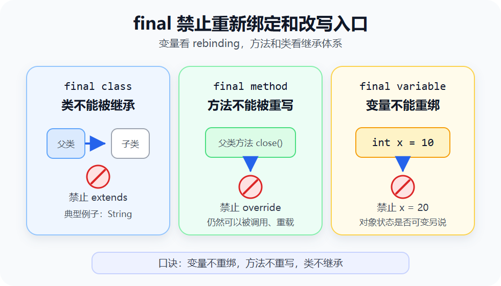
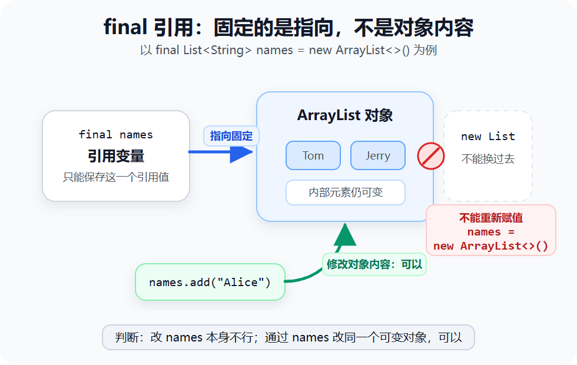
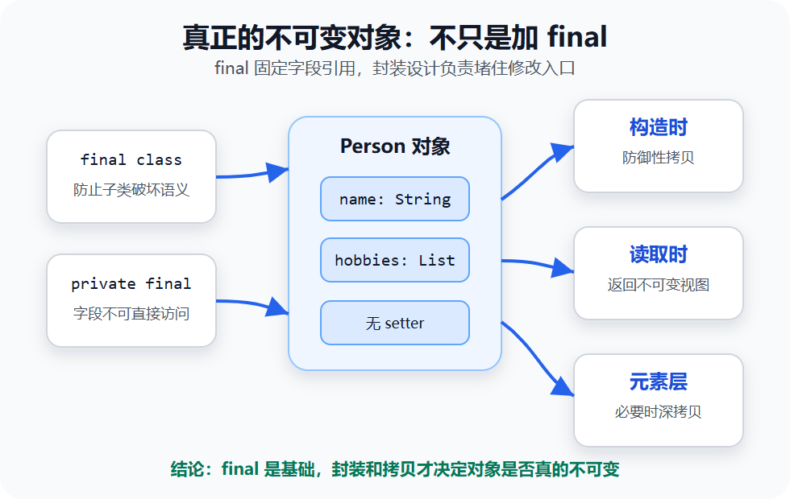

> [!info] 知识摘要
> **总结**
> - `final class` 限制继承，`final method` 限制重写，`final variable` 限制重新赋值。
> - `final` 修饰变量时禁止的是标识符重新绑定，不自动保证对象状态不可变。
>
> **相关知识点**
> - [[【第六篇】继承|继承]]、[[String 为什么不可变|String 不可变]]、[[Java 参数传递到底是不是引用传递|引用值副本]]、对象引用、不可变对象

---

## 一、先给结论：`final` 禁止重新绑定，不等于对象不可变

`final` 的字面意思是“最终的”，但它真正限制的不是同一种“变化”。

在变量层面，`final` 禁止的是标识符的重新绑定（rebinding）：基本类型变量不能再换值，引用类型变量不能再指向另一个对象。

在方法和类层面，`final` 禁止的是继承体系里的改写入口：方法不能被子类重写，类不能被子类继承。

| 修饰位置 | 限制了什么 | 没有限制什么 |
|---|---|---|
| `final class` | 这个类不能被继承 | 不代表类里的对象状态一定不可变 |
| `final method` | 子类不能重写这个方法 | 不影响方法内部是否修改对象状态 |
| `final` 基本类型变量 | 这个变量不能再次赋值 | 不代表别的变量不能使用同样的值 |
| `final` 引用类型变量 | 这个变量不能重新绑定到另一个对象 | 不限制当前对象内部状态变化 |

所以，`final` 最容易被误解的一句话是：

```text
final 修饰对象后，对象就不可变了。
```

这句话不准确。更准确的说法是：

```text
final 修饰变量时，禁止的是这个变量名再次绑定到别的值或别的对象。
```



---

## 二、`final` 修饰变量：只能赋值一次

### 2.1 基本类型变量：值不能再改

`final` 修饰基本类型变量时，变量一旦赋值，就不能再重新赋值。

**基本类型示例**

```java
final int maxRetry = 3;

// maxRetry = 5; // 编译错误
```

这里 `maxRetry` 保存的就是具体数值 `3`。不允许重新赋值，就等于这个变量的值不能再变。

如果是局部变量，也可以先声明，后赋值，但仍然只能赋值一次。

```java
final int score;

score = 100;
// score = 90; // 编译错误
```

这类只声明、还没有立刻赋值的 `final` 变量，常被称为“空白 final 变量”。重点不是记住这个术语，而是理解它背后的规则：编译器必须能确认它最终只会被赋值一次，并且在使用前已经完成赋值。

### 2.2 成员变量：必须完成初始化

`final` 成员变量没有普通成员变量那种“先给默认值，后面再慢慢赋值”的自由。它必须在对象正常构造完成前被明确赋值。

常见方式有三种。

**方式一：声明时直接赋值**

```java
public class User {
    private final int level = 1;
}
```

**方式二：在初始化块中赋值**

```java
public class User {
    private final int level;

    {
        level = 1;
    }
}
```

**方式三：在构造方法中赋值**

```java
public class User {
    private final String name;

    public User(String name) {
        this.name = name;
    }
}
```

如果一个类有多个构造方法，那么每个构造方法都必须保证这个 `final` 成员变量被赋值。

```java
public class User {
    private final String name;

    public User() {
        this.name = "unknown";
    }

    public User(String name) {
        this.name = name;
    }
}
```

如果某个构造方法漏掉赋值，编译器会报错。编译器检查的是所有能正常返回的构造路径：只要构造方法能走到结尾，就必须已经给 `final` 成员变量赋值；如果在赋值前抛出异常，构造失败，不会产生一个缺少 `final` 字段的正常对象。

**核心结论：** `final` 成员变量要么在声明处初始化，要么在初始化块里初始化，要么在每条构造路径里初始化。

### 2.3 `static final`：通常用来定义常量

`static final` 经常组合出现，用来表示类级别常量。

```java
public class CacheConfig {
    public static final int MAX_SIZE = 1000;
    public static final String DEFAULT_REGION = "cn";
}
```

这里有两个含义：

| 关键字 | 含义 |
|---|---|
| `static` | 属于类，而不是某个对象 |
| `final` | 赋值后不能再重新赋值 |

所以 `public static final` 常量通常使用全大写加下划线命名。

如果 `static final` 字段不能在声明处直接算出，也可以放到静态代码块里初始化。

```java
public class AppConfig {
    public static final String ROOT_PATH;

    static {
        ROOT_PATH = System.getProperty("user.dir");
    }
}
```

注意，`static final List<String>` 这种写法只能保证这个静态字段不能换成另一个 `List`，不能保证列表内容不能变。

```java
public class Tags {
    public static final List<String> NAMES = new ArrayList<>();
}

Tags.NAMES.add("java"); // 可以，但通常不推荐把可变集合暴露成 public static final
```

如果要暴露真正不希望被外部修改的集合，应该使用不可变集合或不可变视图，而不是只加 `final`。

---

## 三、`final` 引用为什么还能改内容

先把引用类型变量拆开看：

```java
List<String> names = new ArrayList<>();
```

这行代码里至少有两个层次：

| 层次 | 说明 |
|---|---|
| 引用变量 `names` | 保存一个能找到对象的引用值 |
| `ArrayList` 对象 | 真正存放集合元素的对象 |

当写成 `final` 时：

```java
final List<String> names = new ArrayList<>();
```

锁住的是第一层：`names` 这个标识符不能再绑定到另一个列表对象。

```java
names.add("Tom");               // 可以：修改 ArrayList 对象内容
names.remove("Tom");            // 可以：修改 ArrayList 对象内容
// names = new ArrayList<>();   // 不可以：让 names 指向新对象
```

可以把这个过程理解成：

```text
final 引用变量  --->  某个对象
       ↑               ↑
       |               |
   这条箭头不能换       对象内部是否能变，看对象自己的设计
```

这个 `ArrayList` 例子已经够判断大多数“final 引用为什么还能改内容”的题。再看一个对照例：`String`。

```java
final String name = "Java";

// name = name + " Guide"; // 编译错误
```

这里不能拼接后再赋值，不是因为 `String` 有特殊传参规则，而是因为 `name` 是 `final` 变量，不能重新绑定到拼接出来的新字符串对象。

如果没有 `final`：

```java
String name = "Java";
name = name + " Guide"; // 可以：name 指向了新的 String 对象
```

原来的 `"Java"` 对象也没有被原地修改。这里刚好叠了两层限制：`String` 对象本身不可变，`final` 变量又不能重新绑定。



---

## 四、`final` 修饰方法：不能被子类重写

`final` 修饰方法时，表示这个方法不能被子类重写。

**final 方法示例**

```java
public class Account {
    public final void close() {
        System.out.println("close account");
    }
}

public class VipAccount extends Account {
    // 编译错误：不能重写 final 方法
    // public void close() {
    //     System.out.println("vip close account");
    // }
}
```

这通常用于父类希望固定某个关键流程，不允许子类改写的场景。

但 `final method` 限制的是“重写”，不是“调用”，也不是“方法内部不能改对象状态”。

```java
public class Counter {
    private int count;

    public final void increase() {
        count++;
    }

    public int getCount() {
        return count;
    }
}
```

`increase()` 是 `final` 方法，子类不能重写它，但这个方法内部仍然可以修改当前对象的 `count` 字段。

另外，`final` 方法不能被重写，不代表同一个类里不能重载。

```java
public class Printer {
    public final void print(String text) {
        System.out.println(text);
    }

    public final void print(int number) {
        System.out.println(number);
    }
}
```

这两个 `print` 方法参数不同，是重载，不是重写。

| 行为 | `final method` 是否限制 |
|---|---|
| 子类重写这个方法 | 限制 |
| 外部调用这个方法 | 不限制 |
| 方法内部修改对象字段 | 不限制 |
| 同一个类中方法重载 | 不限制 |

**核心结论：** `final` 方法锁住的是子类改写入口，常用于保护父类中不希望被覆盖的行为。

---

## 五、`final` 修饰类：不能被继承

`final` 修饰类时，表示这个类不能被继承。

**final 类示例**

```java
public final class Token {
    private final String value;

    public Token(String value) {
        this.value = value;
    }

    public String getValue() {
        return value;
    }
}

// 编译错误：不能继承 final 类
// public class LoginToken extends Token {
// }
```

Java 标准库里的 `String` 就是典型的 `final` 类。这样做可以防止别人通过继承改写字符串的核心语义。

不过，`final class` 也不等于“这个类创建出来的对象一定不可变”。更真实的坑不是类里明晃晃写一个 setter，而是把可变对象从 getter 暴露出去。

```java
import java.util.Date;

public final class Session {
    private final Date expiresAt;

    public Session(Date expiresAt) {
        this.expiresAt = expiresAt;
    }

    public Date getExpiresAt() {
        return expiresAt;
    }
}
```

`Session` 不能被继承，`expiresAt` 这个字段也不能重新指向另一个 `Date`。但调用方拿到 getter 返回的同一个 `Date` 对象后，仍然可以改它的内部时间：

```java
Session session = new Session(new Date());
session.getExpiresAt().setTime(0L); // 修改了 Session 内部持有的 Date 对象
```

这比 setter 更隐蔽，也更能说明问题：类不能被继承，不等于内部状态安全。真正想做不可变对象，还要在构造方法和 getter 处做防御性拷贝，或者直接使用不可变类型。

还有一个常见面试点：抽象类不能同时用 `final` 修饰。

```java
// 编译错误
// public abstract final class Animal {
//     public abstract void eat();
// }
```

原因是：

| 修饰符 | 含义 |
|---|---|
| `abstract class` | 这个类通常需要被子类继承并补全实现 |
| `final class` | 这个类禁止被继承 |

二者目标互相冲突，所以不能同时出现。

**核心结论：** `final` 类锁住的是继承入口，不是对象状态；对象是否不可变，还要看字段和方法设计。

---

## 六、真正的不可变对象怎么设计

如果只是这样写：

```java
public class Person {
    private final List<String> hobbies;

    public Person(List<String> hobbies) {
        this.hobbies = hobbies;
    }

    public List<String> getHobbies() {
        return hobbies;
    }
}
```

这个类并不是真正不可变。

问题在于：`final` 只能保证 `hobbies` 字段不能指向另一个列表，但这个列表对象本身仍然可能被修改。

```java
List<String> list = new ArrayList<>();
list.add("reading");

Person person = new Person(list);
list.add("gaming");              // 外部仍然可能影响 person 内部持有的列表
person.getHobbies().add("music"); // getter 暴露出去后也能改
```

如果希望对象真正不可变，通常要配合以下设计：

| 设计 | 作用 |
|---|---|
| 类尽量声明为 `final` | 防止子类破坏不可变语义 |
| 字段使用 `private final` | 防止字段被外部直接访问和重新赋值 |
| 不提供 setter | 不暴露修改入口 |
| 构造方法做防御性拷贝 | 防止外部传入的可变对象继续影响内部状态 |
| getter 返回不可变视图或副本 | 防止外部通过 getter 改内部对象 |

可以改成这样：

```java
import java.util.ArrayList;
import java.util.Collections;
import java.util.List;

public final class Person {
    private final String name;
    private final List<String> hobbies;

    public Person(String name, List<String> hobbies) {
        this.name = name;
        this.hobbies = Collections.unmodifiableList(new ArrayList<>(hobbies));
    }

    public String getName() {
        return name;
    }

    public List<String> getHobbies() {
        return hobbies;
    }
}
```

这里有两个关键点：

- `new ArrayList<>(hobbies)`：构造时拷贝一份，避免外部原列表继续影响内部。
- `Collections.unmodifiableList(...)`：返回的是不可修改的列表视图，外部不能通过 getter 添加或删除元素。

如果列表里的元素本身也是可变对象，还要继续考虑元素对象的不可变性或深拷贝。否则只是列表结构不可变，元素内部仍可能变。

**核心结论：** 不可变对象不是只靠 `final` 写出来的，而是靠字段封装、无修改入口、防御性拷贝和不可变数据结构一起保证的。



---

## 七、常见误区

> [!warning] 误区一：`final class` 就是不可变类
> 
> 正确理解：`final class` 只能防止继承。只要类里有可变字段或修改方法，对象仍然可以变。

> [!warning] 误区二：`final method` 表示方法执行结果永远不变
> 
> 正确理解：`final method` 只表示不能被子类重写。方法内部依然可以读写对象状态，也可能每次返回不同结果。

> [!warning] 误区三：常量只要写 `final` 就够了
> 
> 正确理解：类级别常量通常写成 `static final`。如果常量值是集合、数组这类可变对象，还要避免把可变对象直接暴露出去。

---

## 总结

最后只保留一张查表：

| 写法 | 直接限制 | 典型用途 | 易错点 |
|---|---|---|---|
| `final int count` | `count` 不能再次赋值 | 局部常量、只赋值一次的值 | 只限制当前变量 |
| `final List<String> list` | `list` 不能指向新列表 | 固定引用关系 | `list.add()` 仍可能成功 |
| `final void run()` | 子类不能重写 `run()` | 固定父类关键流程 | 方法内部仍可修改状态 |
| `final class String` | 类不能被继承 | 防止子类破坏语义 | 不等于所有 `final class` 都不可变 |
| `static final int MAX_SIZE` | 类级变量不能重新赋值 | 定义常量 | 可变对象常量仍要谨慎暴露 |

**收束：** 变量看绑定，方法和类看继承入口；不可变对象另看封装和拷贝。
