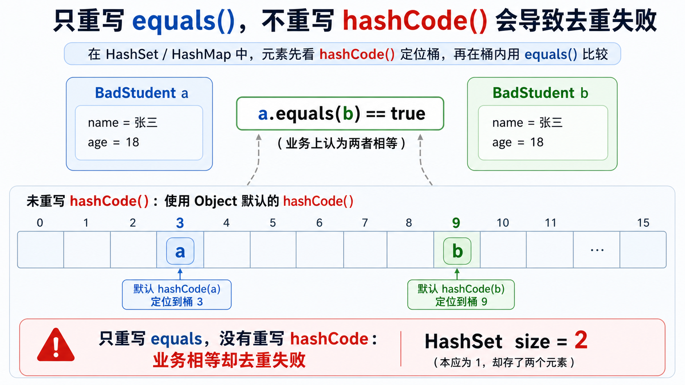
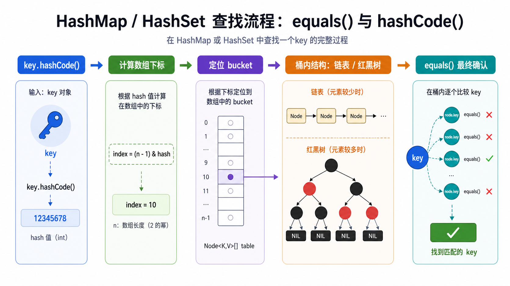
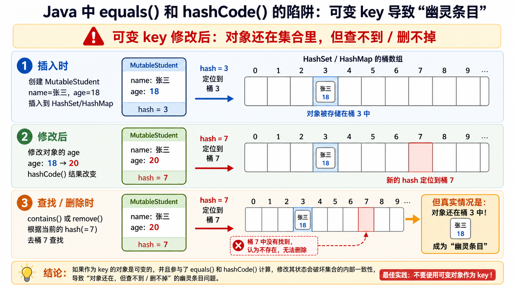

> [!info] 知识摘要
> **总结**
> - 入门层面，`equals()` 负责判断业务相等，`hashCode()` 负责让哈希容器找到候选位置；二者必须表达同一套相等语义。
> - 进阶层面，一个可靠的哈希 key 还要考虑不可变性、继承对称性、哈希冲突、桶内结构和热点路径性能。
>
> **相关知识点**
> - [[String 常量池、==、equals|引用相等与对象相等]]、[[String 为什么不可变|不可变对象]]、`HashSet`、`HashMap`、哈希表、对象相等契约、可变 key

| 层级 | 你要解决的问题 |
| --- | --- |
| 入门篇 | `equals()` 和 `hashCode()` 为什么必须一起重写，以及怎样写才算合格 |
| 进阶篇 | 作为 `HashMap` / `HashSet` 的 key，还要满足哪些设计约束 |

---

## 入门篇：为什么 `equals()` 和 `hashCode()` 必须一起重写

### 1. 先给结论：相等规则必须同时告诉两个入口

只要一个类重写了 `equals()`，就必须同时重写 `hashCode()`。

原因不是“规范强迫症”，而是 Java 里很多容器不是直接把所有对象拿出来逐个 `equals()`。像 `HashSet`、`HashMap` 这类哈希容器，会先用 `hashCode()` 决定对象大概在哪个桶里，再用 `equals()` 判断桶里的候选对象是否真的相等。

所以这两个方法分工不同，但必须表达同一套“对象相等语义”：

| 方法 | 负责什么 | 一句话理解 |
| --- | --- | --- |
| `equals()` | 判断两个对象是否相等 | 最终裁判 |
| `hashCode()` | 给对象生成哈希码，用于定位桶 | 先缩小查找范围 |

必须满足的核心规则是：

```text
如果 a.equals(b) == true，那么 a.hashCode() 必须等于 b.hashCode()
```

反过来不成立：

```text
如果 a.hashCode() == b.hashCode()，a 和 b 不一定 equals
```

因为不同对象可能算出同一个哈希码，这叫哈希冲突。哈希冲突是允许存在的，哈希容器会继续用 `equals()` 做最终确认。

### 2. `equals()`：默认比较引用，重写后表达业务相等

`equals()` 来自 `Object`。

如果一个类没有重写它，默认效果基本等同于 `==`，比较的是两个引用是否指向同一个对象。

```java
Student a = new Student("张三", 18);
Student b = new Student("张三", 18);

System.out.println(a == b);      // false
System.out.println(a.equals(b)); // false，未重写 equals 时默认比较引用
```

这两个 `Student` 的内容一样，但它们是两次 `new` 出来的不同对象。如果业务规则认为“姓名和年龄相同就是同一个学生”，就需要重写 `equals()`，让它从“引用相等”改成“业务字段相等”。

不过 `equals()` 不是想怎么写就怎么写。它自己也有几条基本规则：

| 规则 | 含义 |
| --- | --- |
| 自反性 | `x.equals(x)` 必须是 `true` |
| 对称性 | `x.equals(y)` 为 `true` 时，`y.equals(x)` 也必须为 `true` |
| 传递性 | `x.equals(y)`、`y.equals(z)` 都为 `true` 时，`x.equals(z)` 也必须为 `true` |
| 一致性 | 对象状态没变时，多次比较结果应保持一致 |
| 非空性 | `x.equals(null)` 必须是 `false` |

这些规则看起来像条文，但它们直接影响集合行为。后面提到的继承陷阱，本质上就是对称性和传递性被破坏后，哈希集合开始出现反直觉结果。

### 3. `hashCode()`：不是判断相等，而是帮助哈希表快速定位

`hashCode()` 也是 `Object` 提供的方法。它返回一个 `int` 类型的哈希码，常用于哈希表结构中。

以 `HashSet` 为例，添加元素时大致会经历这几步：

1. 调用对象的 `hashCode()`，得到哈希码。
2. 根据哈希码计算它应该落到哪个桶。
3. 如果桶为空，直接放进去。
4. 如果桶里已有元素，再用 `equals()` 判断是否重复。

这就是为什么 `hashCode()` 的定位能力很重要。它不负责证明两个对象一定相等，只负责把可能相等的对象尽量分到同一个候选范围里。

可以这样理解：

```text
hashCode()：先告诉集合去哪个区域找
equals()：到了这个区域后，再判断是不是同一个对象
```

如果只靠 `equals()`，容器可能需要从头到尾逐个比较。哈希表先用 `hashCode()` 缩小范围，正是为了提高查找、插入、删除的效率。

### 4. 只重写 `equals()` 会发生什么

最容易出问题的场景是：业务上两个对象相等，但它们继承了 `Object` 默认的 `hashCode()`。

看一个故意写错的例子：

```java
import java.util.Objects;

// final 只为排除继承干扰；本例真正的问题是只重写 equals，没有重写 hashCode。
public final class BadStudent {
    private String name;
    private int age;

    public BadStudent(String name, int age) {
        this.name = name;
        this.age = age;
    }

    @Override
    public boolean equals(Object o) {
        if (this == o) {
            return true;
        }
        if (!(o instanceof BadStudent)) {
            return false;
        }
        BadStudent other = (BadStudent) o;
        return age == other.age && Objects.equals(name, other.name);
    }
}
```

这个类只重写了 `equals()`，没有重写 `hashCode()`。注意：这里把类写成 `final` 只是为了暂时排除继承带来的复杂性，和这个错误本身无关；真正的错误是“定义了业务相等规则，却没有同步定义对应的哈希规则”。

于是下面的代码就可能出现反直觉结果：

```java
Set<BadStudent> set = new HashSet<>();

BadStudent a = new BadStudent("张三", 18);
BadStudent b = new BadStudent("张三", 18);

set.add(a);
set.add(b);

System.out.println(a.equals(b)); // true
System.out.println(set.size());  // 可能是 2
```

为什么 `equals()` 都是 `true` 了，`HashSet` 里还能放进两个？

因为 `HashSet` 不是先全量扫描 `equals()`，而是先看 `hashCode()`。默认 `hashCode()` 通常会让不同实例得到不同哈希码，这正是两个“业务上相等”的对象可能落到不同桶里的直观原因。

但更根本的问题不是“这次哈希码刚好不同”，而是：`Object` 默认的 `hashCode()` 只和 `Object` 默认的“引用相等”语义天然配套。JVM 规范不保证不同对象一定有不同哈希码；反过来，即使两个默认哈希码碰巧相同，也只是运气。一旦你把 `equals()` 改成业务相等，却继续保留默认 `hashCode()`，这个类就已经破坏了相等契约，不能安全作为哈希容器元素。



`HashMap` 里也一样：

```java
Map<BadStudent, String> map = new HashMap<>();

BadStudent a = new BadStudent("张三", 18);
BadStudent b = new BadStudent("张三", 18);

map.put(a, "三好学生");

System.out.println(a.equals(b)); // true
System.out.println(map.get(b));  // 可能是 null
```

业务上 `a` 和 `b` 是同一个 key，但 `HashMap` 查 `b` 时会按 `b.hashCode()` 去另一个桶里找，自然找不到当初用 `a` 放进去的值。

### 5. 正确写法：同一组字段参与 `equals()` 和 `hashCode()`

正确做法是：`equals()` 用哪些字段判断相等，`hashCode()` 就应该基于同一组字段计算哈希码。

```java
import java.util.Objects;

public final class Student {
    private String name;
    private int age;

    public Student(String name, int age) {
        this.name = name;
        this.age = age;
    }

    @Override
    public boolean equals(Object o) {
        if (this == o) {
            return true;
        }
        if (!(o instanceof Student)) {
            return false;
        }
        Student other = (Student) o;
        return age == other.age && Objects.equals(name, other.name);
    }

    @Override
    public int hashCode() {
        return Objects.hash(name, age);
    }
}
```

这样一来：

```java
Student a = new Student("张三", 18);
Student b = new Student("张三", 18);

System.out.println(a.equals(b));             // true
System.out.println(a.hashCode() == b.hashCode()); // true
```

再放进 `HashSet`：

```java
Set<Student> set = new HashSet<>();

set.add(a);
set.add(b);

System.out.println(set.size()); // 1
```

再作为 `HashMap` 的 key：

```java
Map<Student, String> map = new HashMap<>();

map.put(a, "三好学生");

System.out.println(map.get(b)); // 三好学生
```

这才符合“姓名和年龄相同就是同一个学生”的业务语义。

日常写代码时，可以先按这张表检查：

| 检查点 | 正确做法 |
| --- | --- |
| 是否只重写了 `equals()` | 不可以，必须补 `hashCode()` |
| 是否只重写了 `hashCode()` | 通常也不应该，业务相等语义不完整 |
| 两个方法是否使用同一组字段 | 必须保持一致 |
| 字段是否可能为 `null` | 用 `Objects.equals(...)` 更稳 |

还有一个要分清的误区：

```text
按规则正确实现时，也就是 equals 为 true 则 hashCode 必须相同：hashCode 不同，equals 一定为 false
hashCode 相同：两个对象不一定相等，还要看 equals
equals 相同：两个对象的 hashCode 必须相同
```

这里的“按规则正确实现”很重要。它指的是 Java 的相等规则：如果两个对象 `equals()` 为 `true`，它们的 `hashCode()` 必须相同。不是哈希值天然决定相等，而是在正确实现下，如果两个对象的 `hashCode()` 不同，`equals()` 就不应该返回 `true`；否则就是类自己的实现违反了规则。

---

## 进阶篇：作为 `HashMap` / `HashSet` 的 key，还要考虑什么

### 1. 哈希容器到底怎么找对象

入门篇只需要记住“先 `hashCode()`，后 `equals()`”。进阶一点，要知道这个“先后”在哈希表里大致对应什么结构。

以 `HashMap` 为例，它的底层核心可以粗略理解成一个数组。数组里的每个位置就是一个桶。对象的 `hashCode()` 会经过哈希扰动和下标计算，决定它落到哪个桶。

```text
key.hashCode()
    -> 计算数组下标
    -> 找到桶 bucket
    -> 桶内再比较 key
    -> equals() 确认是不是同一个逻辑 key
```

桶里不一定只有一个元素。多个 key 可能落到同一个桶，这就是哈希冲突。JDK 8 之后，冲突较少时桶内通常是链表，冲突严重并满足条件时可能转成红黑树。

但不管桶内是链表还是红黑树，最终目标都没变：在候选范围里找到真正相等的 key。



### 2. 哈希冲突不等于对象相等

哈希冲突说明的是：两个对象算出来的哈希位置可能一样。

它不说明这两个对象业务上相等。

```text
hashCode 相同：只是进入同一个候选范围
equals 为 true：才表示同一个逻辑对象
```

所以 `hashCode()` 的质量会影响性能：分布越均匀，桶内候选越少；大量对象挤到同一个桶里，查找就会变慢。红黑树能缓解极端冲突，但它不是让我们随便写 `hashCode()` 的理由。

这也是为什么 `Objects.hash(name, age)` 适合普通场景，却不一定适合所有热点路径。它写起来清楚，但内部会走可变参数，通常会创建临时数组。如果这个 key 会被高频查询、插入、扩容、重哈希，就要评估是否改成手写 `31 * result + fieldHash`，甚至在不可变对象里预计算并缓存哈希码。

### 3. 为什么 `String` 适合当 key

`String` 经常作为 `HashMap` 的 key，也经常放进 `HashSet` 去重。

原因不只是“`String` 已经重写好了 `equals()` 和 `hashCode()`”，还包括一个更关键的前提：`String` 是不可变对象。

这几个条件缺一不可：

| 条件 | 作用 |
| --- | --- |
| 重写 `equals()` | 让内容相同的字符串被视为相等 |
| 重写 `hashCode()` | 让内容相同的字符串进入同一个哈希查找范围 |
| 不可变 | 保证字符串放入 `HashMap` 后，参与计算的内容不会再变化 |

`String` 还有一个性能层面的优势：在主流 JDK 实现中，它的哈希码会被缓存。第一次计算字符串哈希时需要遍历字符，后面再次调用 `hashCode()` 时可以直接复用缓存结果。

这正好对应了上一节提到的优化方向：如果一个 key 是不可变的，而且会频繁参与哈希查询，缓存哈希码就是一种可考虑的设计。`String` 就是这个思路的典型例子。

```java
String a = new String("Java");
String b = new String("Java");

System.out.println(a == b);      // false
System.out.println(a.equals(b)); // true
System.out.println(a.hashCode() == b.hashCode()); // true
```

虽然 `a` 和 `b` 不是同一个对象，但它们内容相同，`equals()` 返回 `true`，`hashCode()` 也相同，所以可以在哈希容器里被当成同一个逻辑 key。

更重要的是，`String` 的内容不会在放入 `HashMap` 后突然改变，所以它不会出现“放进去时在这个桶，修改后去另一个桶找”的问题。

### 4. 可变 key 为什么是生产红线

即使 `equals()` 和 `hashCode()` 都写对了，还有一个常见坑：对象放进 `HashSet` 或作为 `HashMap` key 之后，修改了参与计算的字段。

下面换一个独立示例，避免和前面“缺少 `hashCode()`”的问题混在一起。这里假设 `MutableStudent` 已经正确重写了 `equals()` 和 `hashCode()`，但 `name`、`age` 会参与计算，并且 `age` 可以修改。

```java
MutableStudent s = new MutableStudent("张三", 18);

Set<MutableStudent> set = new HashSet<>();
set.add(s);

s.setAge(20);

System.out.println(set.contains(s)); // 可能是 false
```

问题在于：对象加入集合时，是按旧的 `hashCode()` 放进某个桶里的。后来 `age` 变了，新 `hashCode()` 也可能变了，集合再查它时会去新桶找，自然可能找不到旧桶里的对象。

还有一种更隐蔽的情况：字段修改后 `hashCode()` 碰巧没变，但 `equals()` 的结果已经变了。哈希定位看似还在同一个桶里，最终相等判断却不再成立，`contains()`、`get()`、`remove()` 依然可能失败。所以风险不只是“哈希值变了”，而是参与相等判断的状态变了。



这类问题在 `HashMap` key 上更危险：

```java
Map<MutableStudent, String> map = new HashMap<>();

MutableStudent s = new MutableStudent("张三", 18);
map.put(s, "三好学生");

s.setAge(20);

System.out.println(map.get(s));    // 可能是 null
System.out.println(map.remove(s)); // 可能删除失败
```

对象明明还在集合里，却查不到、删不掉。严格说，这不是 JVM 垃圾回收层面的“对象没人引用但回收不了”，而是集合仍然持有这个对象，业务代码却失去了正常访问和删除它的路径。它会表现成一种逻辑层面的内存泄漏：无用对象一直留在集合中。

这个问题并不温和。如果这种 key-value 大量堆积，`HashMap` 的 `size` 会持续增长，集合强引用着这些条目，垃圾回收器也不会回收它们。换句话说，即使它的根因是逻辑错误，最终也可能变成真实的内存泄漏和性能事故。

所以，参与 `equals()` 和 `hashCode()` 的字段必须保持稳定。生产代码里，默认禁止把这些字段会变化的对象作为 `HashMap` key 或 `HashSet` 元素；如果确实绕不开，也要把它当成需要强约束的设计风险，而不是普通写法。

| 做法 | 适用场景 |
| --- | --- |
| 使用不可变字段作为 key | 最推荐，风险最低 |
| 用唯一 id 判断相等 | 适合实体对象已经有稳定 id 的场景 |
| 入集合后不修改关键字段 | 只能作为受控方案，需要明确边界和代码审查 |

### 5. 继承为什么会破坏 `equals()`

入门篇里的 `Student` 特意写成了 `final class`，因此 `instanceof Student` 不会遇到子类比较问题。如果类不是 `final`，不要把这段 `instanceof` 写法当成万能模板。

父类可能认为“子类也是一种父类，所以相等”，子类却可能多比较了自己的字段，反过来认为“不相等”，对称性就断了。

极简翻车例子如下。这里先只演示 `equals()` 的对称性问题，所以省略 `hashCode()`：

```java
import java.util.Objects;

class Point {
    protected int x;
    protected int y;

    public Point(int x, int y) {
        this.x = x;
        this.y = y;
    }

    @Override
    public boolean equals(Object o) {
        if (!(o instanceof Point)) {
            return false;
        }
        Point other = (Point) o;
        return x == other.x && y == other.y;
    }
}

class ColoredPoint extends Point {
    private String color;

    public ColoredPoint(int x, int y, String color) {
        super(x, y);
        this.color = color;
    }

    @Override
    public boolean equals(Object o) {
        if (!(o instanceof ColoredPoint)) {
            return false;
        }
        ColoredPoint other = (ColoredPoint) o;
        return x == other.x && y == other.y && Objects.equals(color, other.color);
    }
}
```

如果 `p` 是 `Point(1, 2)`，`cp` 是 `ColoredPoint(1, 2, "red")`，那么 `p.equals(cp)` 可能是 `true`，但 `cp.equals(p)` 是 `false`。这就破坏了对称性。集合一旦依赖这种比较结果，表现会非常难排查。

最小的“止血方案”是用 `getClass()` 限制必须是同一个运行时类才比较：

```java
@Override
public boolean equals(Object o) {
    if (this == o) {
        return true;
    }
    if (o == null || getClass() != o.getClass()) {
        return false;
    }
    Point other = (Point) o;
    return x == other.x && y == other.y;
}
```

这个写法可以避免父类对象和子类对象互相比较时破坏对称性，但它也有代价：父类引用指向子类对象时，只要运行时类不同，就不会被视为相等。它不是银弹，只是把边界收紧了。

所以更稳的工程建议仍然是：值对象、key 对象优先设计成不可变的 `final` 类；如果确实要支持继承，就单独设计相等协议，不要顺手套模板。

### 6. 规范只能作为检查清单

阿里巴巴 Java 开发规范对 `hashCode()` 和 `equals()` 的处理给出过明确要求：

- 只要覆写 `equals()`，就必须覆写 `hashCode()`。
- `Set` 存储的是不重复对象，依据 `hashCode()` 和 `equals()` 判断，所以存储的自定义对象必须覆写这两个方法。
- 如果自定义对象作为 `Map` 的 key，那么必须覆写 `hashCode()` 和 `equals()`。

但规范只能作为检查清单，不能替代原因。真正让这条规则成立的，是前面讲过的哈希表工作方式：先用 `hashCode()` 定位候选范围，再用 `equals()` 裁决是否相等。背规范只能避免一部分低级错误，理解机制才知道为什么错。

最后记住这句话：

```text
要么两个都不重写，继续使用 Object 的引用相等语义；
要么两个一起重写，并且使用同一组稳定字段；
如果对象要作为哈希 key，再优先让它不可变、final、边界清楚。
```
