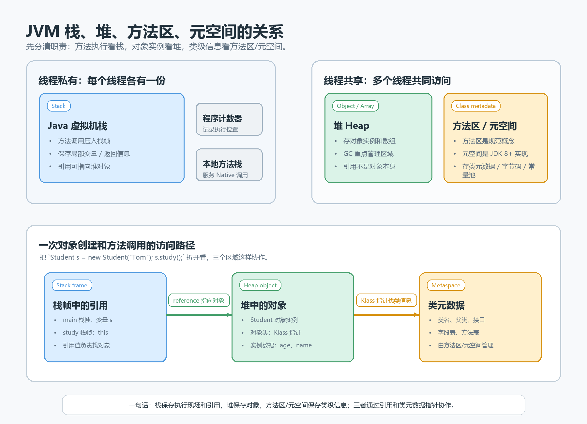
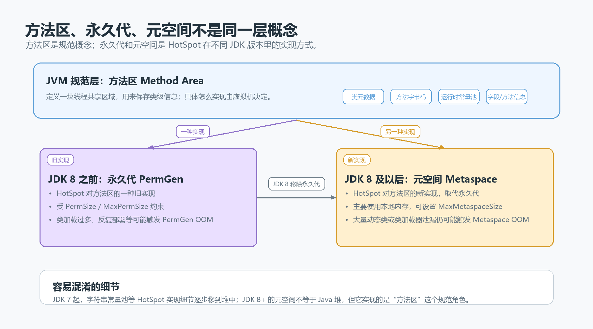

> [!info] 知识摘要
> **总结**
> - 栈管方法调用，堆放对象实例，方法区是类级信息的规范概念，元空间是 HotSpot JDK 8+ 对方法区的一种实现。
> - 理解 JVM 内存区域时要先分清规范概念、具体实现和对象访问关系，不要把方法区、永久代、元空间当成同一层东西。
>
> **相关知识点**
> - [[010_第九篇：Java 内存布局与垃圾回收|Java 内存布局]]、[[Java 参数传递到底是不是引用传递|引用值副本]]、[[String 常量池、==、equals|字符串常量池]]、类加载、运行时常量池、GC

---

## 一、先给结论：四个概念不在同一层

如果只想先建立直觉，可以记住这四句话：

```text
栈：方法调用的执行现场。
堆：对象实例和数组主要生活的地方。
方法区：JVM 规范里描述的类级信息存放区域。
元空间：HotSpot JVM 在 JDK 8 以后对方法区的一种实现。
```

它们最容易混淆，是因为很多资料会同时从三个角度描述 JVM 内存：

| 角度 | 关注点 | 典型词 |
| --- | --- | --- |
| 运行时职责 | 这块区域负责什么 | 栈、堆、方法区 |
| 线程归属 | 是否每个线程独有 | 线程私有、线程共享 |
| JVM 实现 | 某个虚拟机具体怎么落地 | 永久代、元空间、本地内存 |

所以不要把它们强行摆成“同一张物理内存平面图”。更稳的理解方式是：

| 概念 | 所在层级 | 一句话解释 |
| --- | --- | --- |
| JVM 栈 | JVM 运行时数据区 | 每个线程自己的方法调用栈 |
| 堆 | JVM 运行时数据区 | 线程共享，主要存放对象实例和数组 |
| 方法区 | JVM 规范概念 | 线程共享，存放类级信息 |
| 永久代 | HotSpot 旧实现 | JDK 8 之前常用来实现方法区 |
| 元空间 | HotSpot 新实现 | JDK 8 以后取代永久代，主要使用本地内存 |



**核心结论：** 栈、堆、方法区是运行时区域的职责划分；永久代和元空间是 HotSpot 对方法区的不同实现方式。

---

## 二、JVM 运行时数据区先分线程私有和线程共享

JVM 执行 Java 程序时，会把运行时内存划分成多个区域。入门阶段最重要的是先看线程归属。

| 区域 | 线程归属 | 主要职责 |
| --- | --- | --- |
| 程序计数器 | 线程私有 | 记录当前线程执行到哪条字节码指令 |
| Java 虚拟机栈 | 线程私有 | 管理 Java 方法调用，每次调用对应一个栈帧 |
| 本地方法栈 | 线程私有 | 为 Native 方法调用服务 |
| 堆 | 线程共享 | 存放对象实例和数组，是 GC 重点管理区域 |
| 方法区 | 线程共享 | 存放类元数据、方法字节码、运行时常量池等类级信息 |

这张表里，初学者最需要抓住的是：

```text
每个线程有自己的栈。
所有线程共享同一个堆和方法区。
```

所以局部变量不会天然被其他线程共享，因为它通常在某个线程的栈帧中；但局部变量如果保存了某个堆对象的引用，那么不同线程只要拿到同一个引用，就可能访问同一个堆对象。

这也是后面并发问题、对象共享、锁、可见性问题的基础。

---

## 三、栈：一次方法调用就是一个栈帧

Java 虚拟机栈可以理解成线程自己的方法调用记录。

每调用一个 Java 方法，JVM 就会为这次调用创建一个栈帧；方法执行结束后，这个栈帧就会被弹出。

一个栈帧里通常包含：

| 栈帧组成 | 作用 |
| --- | --- |
| 局部变量表 | 保存方法参数、局部变量、对象引用等 |
| 操作数栈 | 保存字节码执行过程中的临时计算数据 |
| 动态链接 | 帮助把符号引用解析到具体方法 |
| 方法返回地址 | 方法结束后回到调用者继续执行 |

看一个例子：

```java
public class StackDemo {
    public static void main(String[] args) {
        int age = 18;
        Student s = new Student("Tom");
        s.study();
    }
}
```

执行 `main()` 时，当前线程会有一个 `main` 栈帧。这个栈帧里可能有：

| 局部变量 | 保存内容 |
| --- | --- |
| `args` | 参数引用 |
| `age` | 基本类型值 `18` |
| `s` | 指向堆中 `Student` 对象的引用 |

注意这个区别：

```text
s 在栈帧中。
new Student("Tom") 创建出来的对象在堆中。
s 保存的只是找到那个堆对象的引用值。
```

所以方法结束后，`s` 这个局部变量会随着 `main` 栈帧消失；但堆里的 `Student` 对象是不是能回收，还要看它有没有被其他引用链继续持有。

> [!warning] 常见误区：引用类型变量在栈里，所以对象也在栈里
>
> 正确理解：局部引用变量通常在栈帧里，但它指向的对象主要在堆里。变量和对象不是同一个东西。

---

## 四、堆：`new` 出来的对象主要在这里

堆是 JVM 管理的最大一块运行时内存区域，线程共享，主要存放对象实例和数组。

入门阶段可以先建立这个直觉：

```java
Student s = new Student("Tom");
int[] nums = new int[3];
```

| 代码片段 | 位置 | 含义 |
| --- | --- | --- |
| `s` | 当前方法栈帧 | 引用变量 |
| `new Student("Tom")` | 堆 | `Student` 对象实例 |
| `nums` | 当前方法栈帧 | 引用变量 |
| `new int[3]` | 堆 | 数组对象 |

堆里的对象通常包含对象头、实例数据和对齐填充。对象头里会有一些运行时信息，比如锁状态、哈希码、GC 年龄，以及指向类元数据的类型指针。实例数据才是我们在类里定义的字段内容。

例如：

```java
class Student {
    int age;
    String name;
}
```

`new Student()` 创建出来的堆对象里会有 `age` 字段和 `name` 字段。`age` 是基本类型字段，直接作为对象实例数据的一部分；`name` 是引用类型字段，它保存的是另一个对象的引用，通常会指向堆里的某个 `String` 对象。

这也解释了为什么两个变量指向同一个对象时，一个变量改字段，另一个变量也能看到变化：

```java
Student a = new Student("Tom");
Student b = a;

b.name = "Jerry";

System.out.println(a.name); // Jerry
```

`b = a` 复制的是引用值，不是复制一个新的 `Student` 对象。堆里还是同一个对象。

**核心结论：** 堆解决的是“对象放在哪里”的问题；变量是否能找到对象，要看栈帧、静态字段、其他堆对象等地方是否还保存着引用。

---

## 五、方法区：不是“方法执行的栈”

方法区最容易被名字误导。

很多人看到“方法区”，会以为它是方法调用时使用的区域。其实方法调用过程主要看栈，方法区更适合理解成“类级信息区”。

当 JVM 加载一个类时，需要知道：

- 这个类的名字是什么。
- 父类是谁，实现了哪些接口。
- 有哪些字段。
- 有哪些方法。
- 方法的字节码是什么。
- 常量池里有哪些字面量和符号引用。

这些信息属于类本身，而不是某个对象实例，也不是某一次方法调用。所以它们由方法区这个规范概念来承载。

例如：

```java
class Student {
    private String name;

    public void study() {
        System.out.println(name + " study");
    }
}
```

可以这样拆：

| 内容 | 更适合归属 |
| --- | --- |
| `new Student()` 对象实例 | 堆 |
| `name` 字段在某个对象里的具体值 | 堆中对象的实例数据 |
| `study()` 这次调用的局部变量和返回信息 | 当前线程的栈帧 |
| `Student` 类有哪些字段和方法 | 方法区 / 元空间里的类元数据 |
| `study()` 方法的字节码 | 方法区 / 元空间管理的类级信息 |

这里要特别注意：**每个 `Student` 对象不会各自复制一份 `study()` 方法字节码。** 对象实例放在堆里，方法的类级描述由方法区 / 元空间管理。对象需要知道自己属于哪个类，JVM 才能找到对应的类元数据和方法信息。

---

## 六、方法区、永久代、元空间到底是什么关系

这一组概念最容易绕晕，因为它们不在同一层。

更准确的关系是：

```text
方法区：JVM 规范中的逻辑概念。
永久代：HotSpot 在 JDK 8 之前对方法区的一种实现。
元空间：HotSpot 在 JDK 8 以后对方法区的一种实现。
```

可以用“接口和实现类”的关系做类比：

```text
方法区像接口：规定这类区域应该承担什么职责。
永久代和元空间像实现类：HotSpot 在不同版本里选择的落地方式。
```



### 6.1 JDK 8 之前：永久代

在 JDK 8 之前，HotSpot JVM 常用永久代（PermGen）来实现方法区。

永久代受 JVM 参数控制，例如：

```text
-XX:PermSize
-XX:MaxPermSize
```

如果加载了太多类、动态生成了大量代理类，或者 Web 应用反复部署导致旧类加载器无法回收，就可能出现类似：

```text
java.lang.OutOfMemoryError: PermGen space
```

### 6.2 JDK 8 以后：元空间

JDK 8 以后，HotSpot 移除了永久代，改用元空间（Metaspace）实现方法区。

元空间主要使用本地内存，而不是传统意义上的 Java 堆内部空间。相关参数包括：

```text
-XX:MetaspaceSize
-XX:MaxMetaspaceSize
```

不过“使用本地内存”不等于不会溢出。如果动态生成大量类、类加载器泄漏，或者把 `MaxMetaspaceSize` 设置得太小，仍然可能出现：

```text
java.lang.OutOfMemoryError: Metaspace
```

### 6.3 字符串常量池、静态变量不要死背旧结论

很多旧资料会说“字符串常量池在方法区”“静态变量在方法区”。这类说法要结合 JVM 版本和实现看。

以 HotSpot 为例，JDK 7 以后，字符串常量池等实现细节逐步从永久代移到了堆中；JDK 8 又移除了永久代，类元数据主要放到元空间。

所以更稳的说法是：

```text
运行时常量池属于方法区这个规范概念。
字符串常量池在 HotSpot 的具体位置随版本变化，JDK 7+ 更常按堆中结构理解。
静态字段和 Class 对象在 HotSpot JDK 8+ 中也不要简单死背成“都在方法区”。
```

对初学者来说，这里不需要一次记住所有实现细节。先抓住主线：

```text
类元数据主要看方法区 / 元空间。
字符串对象、普通对象、数组对象主要看堆。
方法调用过程主要看栈。
```

---

## 七、用 `new Student()` 串起来看一次完整关系

把下面这段代码作为一个小地图：

```java
public class Student {
    private String name;

    public Student(String name) {
        this.name = name;
    }

    public void study() {
        System.out.println(name + " study");
    }
}

public class Demo {
    public static void main(String[] args) {
        Student s = new Student("Tom");
        s.study();
    }
}
```

执行时可以粗略理解成几步。

### 7.1 类信息先要被加载

JVM 第一次使用 `Student` 时，需要加载 `Student` 类。

加载后，类名、字段、方法、构造方法、方法字节码、运行时常量池等类级信息，会由方法区这个规范角色来管理。在 HotSpot JDK 8+ 中，类元数据主要在元空间中。

### 7.2 `new Student("Tom")` 在堆中创建对象

执行 `new` 时，JVM 会在堆中为新的 `Student` 对象分配内存，并完成对象头、零值初始化、构造方法初始化等过程。

此时堆中有一个对象：

```text
Student 对象
  name -> "Tom"
```

这里的 `"Tom"` 也是一个字符串对象。实际字符串常量池和字符串对象的细节与 JVM 版本、编译期常量、`intern()` 等有关，当前只需要知道：`Student` 对象的 `name` 字段保存的是一个引用。

### 7.3 `s` 是栈帧里的局部变量

`main()` 正在执行，所以当前线程有 `main` 栈帧。

局部变量 `s` 在这个栈帧中，它保存的是堆中 `Student` 对象的引用。

```text
main 栈帧中的 s  --->  堆中的 Student 对象
```

### 7.4 调用 `s.study()` 会创建新的栈帧

调用 `study()` 时，当前线程会再压入一个 `study` 栈帧。这个栈帧里会有当前方法执行所需的信息，比如 `this` 引用、操作数栈、返回地址等。

`this` 也会指向同一个堆中的 `Student` 对象。

```text
study 栈帧中的 this  --->  同一个 Student 对象
```

`study()` 执行完，`study` 栈帧弹出；`main()` 继续执行。等 `main()` 结束，`main` 栈帧也弹出，局部变量 `s` 消失。

但堆中的 `Student` 对象是否能回收，要看它是否还可以从 GC Roots 到达。不是方法一结束就一定立刻释放。

---

## 八、这些区域分别容易出什么问题

不同内存区域出问题时，表现也不同。

| 区域 | 常见问题 | 典型表现 | 常见原因 |
| --- | --- | --- | --- |
| Java 虚拟机栈 | 栈深度不够 | `StackOverflowError` | 无限递归、递归层数过深、调用链异常变长 |
| Java 虚拟机栈 / 本地内存 | 线程创建失败 | `unable to create new native Thread` | 线程数过多、每个线程栈太大、系统资源限制 |
| 堆 | 堆内存不足 | `Java heap space` | 大对象、大数组、集合无限增长、内存泄漏 |
| 堆 | GC 过度但回收很少 | `GC overhead limit exceeded` | 堆太小或大量对象仍然可达 |
| 方法区旧实现 | 永久代不足 | `PermGen space` | JDK 8 前加载类过多、类加载器泄漏 |
| 方法区新实现 | 元空间不足 | `Metaspace` | JDK 8+ 动态类过多、代理类过多、类加载器泄漏 |
| 直接内存 | 堆外内存不足 | `Direct buffer memory` | NIO 直接缓冲区使用过多、释放不及时 |

这张表不是为了背错误名，而是为了建立定位直觉：

```text
递归太深，先看栈。
对象太多，先看堆。
类太多、动态代理太多，先看元空间。
直接缓冲区太多，先看直接内存。
```

> [!warning] 常见误区：Java 有 GC，就不会内存泄漏
>
> 正确理解：GC 只能回收不可达对象。如果对象已经不被业务需要，但仍被静态集合、缓存、监听器、线程局部变量或类加载器引用着，它依然是可达对象，GC 不能随便回收。

---

## 九、常见误区

> [!warning] 误区一：栈里存对象，堆里也存对象
>
> 正确理解：局部变量表里可以存引用，引用指向的对象主要在堆中。引用和对象本身要分开。

> [!warning] 误区二：方法区就是执行方法用的地方
>
> 正确理解：方法执行过程主要由栈帧承担。方法区更适合理解为类级信息区域，保存类元数据、方法字节码、运行时常量池等。

> [!warning] 误区三：方法区、永久代、元空间是三个并列区域
>
> 正确理解：方法区是规范概念，永久代和元空间是 HotSpot 的不同实现方式。

> [!warning] 误区四：元空间使用本地内存，所以不会 OOM
>
> 正确理解：元空间不在 Java 堆里，不代表无限。它仍受机器内存和 `MaxMetaspaceSize` 等配置影响。

> [!warning] 误区五：方法结束，对象马上释放
>
> 正确理解：方法结束只会弹出栈帧。堆对象是否可回收，要看它是否仍然可达；什么时候真正回收，由 GC 决定。

---

## 总结

最后用一张表收束：

| 概念 | 重点问题 | 线程归属 | 主要存什么 | 易错点 |
| --- | --- | --- | --- | --- |
| 程序计数器 | 当前线程执行到哪 | 线程私有 | 字节码执行位置 | 它很小，通常不是排查重点 |
| Java 虚拟机栈 | 方法怎么执行 | 线程私有 | 栈帧、局部变量、操作数栈、返回信息 | 引用变量在栈，不代表对象在栈 |
| 本地方法栈 | Native 方法怎么执行 | 线程私有 | Native 方法调用信息 | HotSpot 中常和虚拟机栈合并理解 |
| 堆 | 对象放在哪里 | 线程共享 | 对象实例、数组 | 方法结束不等于对象立刻回收 |
| 方法区 | 类信息放在哪里 | 线程共享 | 类元数据、方法字节码、运行时常量池 | 它是规范概念，不等于永久代或元空间本身 |
| 永久代 | HotSpot 旧实现 | 线程共享 | JDK 8 前的方法区实现 | JDK 8 后已被移除 |
| 元空间 | HotSpot 新实现 | 线程共享 | JDK 8+ 的类元数据 | 使用本地内存，但仍可能 OOM |
| 直接内存 | 堆外缓冲区在哪里 | 进程共享资源 | NIO 直接缓冲区等 | 不属于 JVM 运行时数据区，但也会耗尽 |

可以把整篇压成一句话：

```text
栈保存方法执行现场，堆保存对象实例，方法区保存类级信息；在 HotSpot JDK 8+ 中，方法区主要由元空间实现。
```

只要这句话不混，后面再学 GC Roots、类加载、字符串常量池、OOM 排查，就不会把概念绕成一团。
