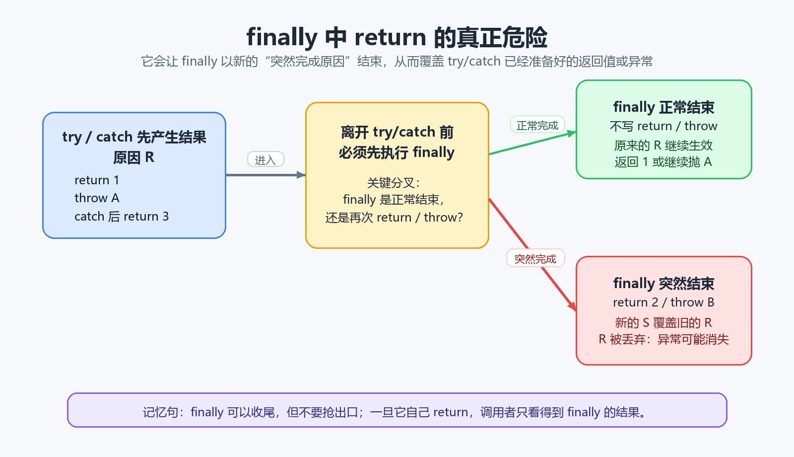

> [!info] 知识摘要
> **总结**
> - `finally` 中的 `return` 不是“最后补一个返回值”这么简单，它会让整个 `try-catch-finally` 以 `finally` 的结果结束，从而覆盖前面已经准备好的返回值或异常。
> - 更深一层看，`finally` 中的 `return` 会改变方法的完成方式，默认风险是让调用者看不到真实失败，误把失败路径当成成功返回。
> - `finally` 最适合做资源释放、状态清理这类收尾动作，不适合放 `return`、主动抛新异常或复杂业务逻辑。
>
> **相关知识点**
> - [[011_第十篇：异常处理（上）——基础|try-catch-finally]]、异常传播、返回值暂存、局部变量表、对象引用、try-with-resources

---

## 一、先给结论：finally 可以收尾，但不要抢出口

`finally` 的定位是收尾。

它常见的用途是：

- 关闭文件流。
- 关闭数据库连接。
- 释放锁。
- 清理临时状态。

但 `finally` 里不建议写 `return`。

原因不是代码风格洁癖，而是 `finally` 中的 `return` 会改变整个方法最终对外呈现的结果。

这里说“不建议”，不是说 Java 语法层面绝对不能写。

少数极端场景下，开发者可能就是要让某个包装方法无论内部发生什么，都返回一个确定状态码或兜底对象。但这种写法必须是明确设计，而不是顺手兜底；并且要把异常记录、返回值语义、调用方预期和测试都交代清楚。

否则，读代码的人很难判断：

```text
这是故意把所有失败都收束成一个结果，
还是不小心把真正的异常藏起来了？
```

可以先记住这张表：

| 前面发生了什么            | `finally` 做了什么    | 调用者最终看到什么              |
| ------------------ | ----------------- | ---------------------- |
| `try` 中 `return 1` | 正常执行完，没有 `return` | 返回 `1`                 |
| `try` 中 `return 1` | `return 2`        | 返回 `2`                 |
| `try` 中抛出异常 `A`    | 正常执行完，没有 `return` | 异常 `A` 继续向外抛           |
| `try` 中抛出异常 `A`    | `return 2`        | 返回 `2`，异常 `A` 被吞掉      |
| `try` 中抛出异常 `A`    | 抛出异常 `B`          | 调用者看到异常 `B`，异常 `A` 被覆盖 |

也就是说，`finally` 中最危险的不是“它会执行”，而是：

```text
finally 如果自己给出了新的出口，前面已经准备好的出口就可能被丢掉。
```



---

## 二、为什么 finally 能覆盖前面的结果

理解这个问题，要先分清两种结束方式。

Java 里一段代码执行完，大致可以分成：

| 结束方式 | 含义 | 例子 |
| --- | --- | --- |
| 正常完成 | 顺着代码执行到代码块末尾 | 普通语句执行完 |
| 突然完成 | 执行过程中跳出了当前代码块 | `return`、`throw`、`break`、`continue` |

注意，`return` 不是“正常完成”，它也是一种突然完成。

例如：

```java
return 1;
```

它的含义不是“代码块自然结束”，而是“我要带着返回值离开当前方法”。

`throw` 也是突然完成：

```java
throw new RuntimeException("error");
```

它的含义是“我要带着异常离开当前执行路径”。

`try-catch-finally` 的关键规则是：

```text
如果 try 或 catch 已经准备以原因 R 离开，
会先执行 finally。

如果 finally 正常结束，
原来的原因 R 继续生效。

如果 finally 又以新的原因 S 离开，
整个 try-catch-finally 就改用原因 S 离开，
原来的原因 R 会被丢弃。
```

这里的原因 `R` 和 `S` 可以是：

- 返回某个值。
- 抛出某个异常。
- `break` 或 `continue` 跳出某个控制结构。

所以 `finally` 中的 `return` 会覆盖前面的 `return`，本质上不是因为它“优先级高”这么口语化，而是因为它给了一个新的突然完成原因。

这是一条确定的语言规则，不是玄学，也不是 JVM 心情不好。

真正需要警惕的是：这条规则一旦被无意触发，方法对调用者呈现的结果可能就不再表达真实执行状态。

---

## 三、返回值覆盖：try 里 return 1，finally 里 return 2

先看最经典的例子：

```java
public class FinallyReturnDemo {
    public static void main(String[] args) {
        System.out.println(test());
    }

    public static int test() {
        try {
            return 1;
        } finally {
            return 2;
        }
    }
}
```

输出是：

```text
2
```

执行过程可以拆成三步：

| 步骤 | 发生什么 |
| --- | --- |
| 1 | `try` 中执行到 `return 1`，准备返回 `1` |
| 2 | 方法真正离开前，先执行 `finally` |
| 3 | `finally` 中执行 `return 2`，新的返回原因覆盖旧的返回原因 |

所以调用者根本看不到 `try` 中的 `1`。

这就是为什么很多代码规范会直接禁止 `finally` 中写 `return`。

它看起来只是“兜底返回”，实际是在改写方法出口。

---

## 四、异常吞掉：try 里已经出错，finally 仍然 return

更危险的是异常被吞掉。

看这个例子：

```java
public class FinallySwallowExceptionDemo {
    public static void main(String[] args) {
        System.out.println(test());
    }

    public static int test() {
        try {
            int x = 10 / 0;
            return x;
        } finally {
            return -1;
        }
    }
}
```

输出是：

```text
-1
```

正常直觉会觉得：

```text
10 / 0 应该抛 ArithmeticException。
```

但调用者最终只看到了 `-1`。

原因是：

| 阶段 | 状态 |
| --- | --- |
| `try` 中 `10 / 0` | 准备抛出 `ArithmeticException` |
| 离开 `try` 前 | 执行 `finally` |
| `finally` 中 `return -1` | 方法改为返回 `-1` |
| 最终结果 | 原异常被丢弃，调用者看不到异常 |

这类代码在生产环境尤其麻烦。

因为日志和调用方都会表现得像“方法正常返回了”，但真实的失败已经被 `finally` 盖住了。

更隐蔽的是受检异常。

例如：

```java
import java.io.IOException;

public class CheckedExceptionDemo {
    public static String load() {
        try {
            throw new IOException("file missing");
        } finally {
            return "default";
        }
    }
}
```

这段代码不需要在方法签名上写 `throws IOException`。

因为编译器能判断：这个方法最终不会把 `IOException` 抛给调用者，`finally` 中的 `return` 会把它盖掉。

这不是好事。

它说明错误不是不存在了，而是被隐藏了。

> [!warning] 常见误区：方法没有抛异常，说明 try 中没有失败
>
> 正确理解：如果 `finally` 中有 `return`，前面的异常可能已经发生过，只是被 `finally` 的返回结果吞掉了。

---

## 五、finally 抛出新异常，也会覆盖原异常

不只是 `return` 会吞掉异常，`finally` 中抛出新异常也会覆盖原异常。

```java
public class FinallyThrowDemo {
    public static void main(String[] args) {
        test();
    }

    public static void test() {
        try {
            throw new IllegalStateException("try failed");
        } finally {
            throw new RuntimeException("finally failed");
        }
    }
}
```

调用者最终看到的是：

```text
RuntimeException: finally failed
```

而不是：

```text
IllegalStateException: try failed
```

也就是说：

```text
try 中的原始失败原因被 finally 中的新失败原因覆盖了。
```

这也是为什么手写资源关闭代码时要格外小心。

例如：

```java
try {
    doWork();
} finally {
    closeResource(); // 如果这里抛异常，可能覆盖 doWork() 的原异常
}
```

如果 `doWork()` 已经抛出了一个真正重要的业务异常，而 `closeResource()` 又抛了关闭失败异常，调用者可能只看到关闭失败，看不到最初的业务失败。

这类资源清理问题，优先使用 `try-with-resources` 更稳。

它的价值不只是少写 `close()`，还包括更好地处理“主异常”和“关闭异常”的关系。

> [!tip] 实战建议
>
> 能用 `try-with-resources` 管理的资源，优先用 `try-with-resources`。手写 `finally` 时，让它尽量只做简单、确定的清理动作，不要在里面制造新的方法出口。

---

## 六、finally 修改局部变量，为什么不一定影响返回值

再看一个容易误判的例子：

```java
public class FinallyModifyPrimitiveDemo {
    public static void main(String[] args) {
        System.out.println(test());
    }

    public static int test() {
        int a = 1;
        try {
            return a;
        } finally {
            a = 2;
        }
    }
}
```

输出是：

```text
1
```

这里 `finally` 明明把 `a` 改成了 `2`，为什么最终还是返回 `1`？

因为执行到 `return a` 时，返回表达式会先被求值。

也就是说：

```text
return a;
```

不是等 `finally` 执行完以后再去读一次 `a`。

它会先把当前 `a` 的值准备好，然后再执行 `finally`。

在这个例子里：

| 步骤 | 发生什么 |
| --- | --- |
| 1 | `a` 当前是 `1` |
| 2 | 执行 `return a`，返回值 `1` 已经准备好 |
| 3 | 执行 `finally`，把局部变量 `a` 改成 `2` |
| 4 | `finally` 正常结束，没有新的 `return` |
| 5 | 方法继续返回之前准备好的 `1` |

所以要分清两件事：

```text
finally 修改局部变量
```

和：

```text
finally 自己 return 一个新值
```

前者不一定改变已经准备好的返回值。

后者会直接覆盖返回出口。

---

## 七、引用类型更容易绕：改对象内容和改引用不是一回事

基本类型比较好理解，因为返回值本身就是那个数值。

引用类型会更容易绕。

看这个例子：

```java
public class FinallyModifyObjectDemo {
    static class Box {
        int value;

        Box(int value) {
            this.value = value;
        }
    }

    public static void main(String[] args) {
        Box box = test();
        System.out.println(box.value);
    }

    public static Box test() {
        Box box = new Box(1);
        try {
            return box;
        } finally {
            box.value = 2;
        }
    }
}
```

输出是：

```text
2
```

为什么这次 `finally` 的修改生效了？

因为 `return box` 准备好的不是整个对象副本，而是一个引用值。

这个引用值指向堆里的同一个 `Box` 对象。

`finally` 中执行：

```java
box.value = 2;
```

改的是这个对象内部的字段。

调用者拿到的引用仍然指向同一个对象，所以会看到 `value` 已经变成 `2`。

但如果 `finally` 中只是让局部变量 `box` 指向另一个新对象，结果就不同了。

```java
public static Box test() {
    Box box = new Box(1);
    try {
        return box;
    } finally {
        box = new Box(2);
    }
}
```

这次调用者拿到的还是旧对象：

```text
value = 1
```

原因是：

| 操作 | 改了什么 | 是否影响已经准备好的返回引用 |
| --- | --- | --- |
| `box.value = 2` | 改旧对象的内部状态 | 会影响，调用者看的是同一个对象 |
| `box = new Box(2)` | 改局部变量 `box` 的指向 | 不影响，返回引用已经准备好 |
| `return new Box(2)` | `finally` 自己给出新返回值 | 会覆盖，调用者拿到新对象 |

这和 [[Java 参数传递到底是不是引用传递|Java 只有值传递]] 的直觉是一致的：

```text
引用变量里保存的是引用值。
重新给局部变量赋值，不等于修改原对象。
通过引用去改对象字段，才是在修改同一个对象。
```

---

## 八、finally 是不是一定会执行

入门时常说：

```text
finally 一定会执行。
```

这句话在普通控制流里是够用的，但严格说应该加上限定：

```text
只要程序真的进入了对应 try，并且 JVM 还有机会继续执行，finally 通常会执行。
```

下面这些情况可能让 `finally` 没机会执行：

| 情况 | 为什么 |
| --- | --- |
| 代码根本没进入对应 `try` | 没进入 `try`，也就没有对应的 `finally` 收尾 |
| `System.exit()` 直接终止 JVM | 虚拟机退出，后续 Java 代码不再继续 |
| JVM 崩溃或进程被强制杀掉 | 程序已经失去继续执行机会 |
| `try` 中陷入死循环 | 控制流一直出不来，无法到达 `finally` |

所以更稳的说法是：

```text
finally 是正常控制流下的收尾保障，不是物理世界里的绝对保证。
```

不过本篇的重点不是这些极端情况。

本篇真正要记住的是：

```text
finally 一旦被执行，它最好只做收尾，不要再决定方法怎么返回。
```

---

## 九、正确写法：return 放在 try/catch 或外层，finally 只收尾

如果只是想让 `finally` 做清理，可以这样写：

```java
public static int test() {
    try {
        return compute();
    } finally {
        cleanup();
    }
}
```

这段代码里，`return` 在 `try` 中，`finally` 只负责清理。

如果 `compute()` 正常返回，`cleanup()` 正常执行后，方法返回 `compute()` 的结果。

如果 `compute()` 抛异常，`cleanup()` 正常执行后，异常继续向外传播。

危险写法是这样：

```java
public static int test() {
    try {
        return compute();
    } finally {
        cleanup();
        return -1;
    }
}
```

这里的 `return -1` 会把两类结果都盖掉：

- `compute()` 原本正常算出的值。
- `compute()` 原本抛出的异常。

如果需要在异常时返回兜底值，应该把这个意图写在 `catch` 中，而不是藏在 `finally` 中。

```java
public static int test() {
    try {
        return compute();
    } catch (RuntimeException e) {
        log(e);
        return -1;
    } finally {
        cleanup();
    }
}
```

这样读代码的人能清楚看到：

```text
异常在哪里被捕获。
异常有没有记录。
兜底返回值从哪里来。
finally 只负责收尾。
```

如果是资源关闭，优先考虑：

```java
try (Resource resource = openResource()) {
    return resource.read();
}
```

这比手写 `finally` 更不容易弄丢主异常。

---

## 十、代码审查时怎么判断有没有风险

看到 `finally`，可以按下面几步快速检查。

### 10.1 finally 里有没有 return

如果有，优先视为危险代码。

```java
finally {
    return result;
}
```

问题是：

```text
它可能覆盖 try/catch 的正常返回值。
它可能吞掉 try/catch 中已经发生的异常。
```

大多数情况下，应该把 `return` 移到 `try`、`catch` 或 `finally` 外面。

### 10.2 finally 里有没有 throw

如果 `finally` 中主动抛新异常，也要小心。

```java
finally {
    throw new RuntimeException("cleanup failed");
}
```

问题是：

```text
如果 try 中已经有原异常，新异常可能覆盖原异常。
```

除非这是非常明确的设计，否则不要在 `finally` 里主动制造新异常。

### 10.3 finally 里的 cleanup 会不会抛异常

有些代码看起来没有主动 `throw`，但调用的方法本身可能抛异常。

```java
finally {
    resource.close();
}
```

如果 `close()` 会抛异常，就可能覆盖前面的主异常。

更稳的做法是：

- 能用 `try-with-resources` 就用它。
- 清理失败要么记录日志，要么作为 suppressed exception 附加到主异常上。
- 不要让清理失败悄悄盖住更重要的业务失败。

### 10.4 finally 里有没有复杂业务逻辑

`finally` 不适合写复杂业务逻辑。

它的职责越复杂，越容易出现：

- 返回值被改写。
- 异常被吞掉。
- 日志顺序混乱。
- 资源释放和业务状态交织。

一个实用标准是：

```text
finally 里的代码，应该让人一眼看出是在收尾。
```

如果需要读很多业务条件才能理解它做什么，通常就该拆出来。

---

## 十一、再深一层：危险在于控制流语义被改写

前面讲的是现象：

```text
finally 中的 return 会覆盖返回值。
finally 中的 return 会吞掉异常。
finally 中的新异常会覆盖原异常。
```

但如果只停在“覆盖”这个词上，还不够触及工程上的风险。

更准确地说，风险在于：

```text
finally 原本是保障不变量的收尾机制，
却被写成了改变方法结论的出口机制。
```

### 11.1 不是值被覆盖，而是调用契约被改写

一个方法对调用者通常有一个隐含契约：

```text
如果成功，就返回一个可信结果。
如果失败，就暴露失败原因。
```

调用者会基于这个契约继续做判断。

例如：

- 返回用户信息，就继续渲染页面。
- 抛出异常，就回滚事务。
- 返回失败结果，就提示用户重试。
- 抛出网络异常，就触发降级或熔断。

`finally` 的契约原本不是“重新决定结果”，而是：

```text
无论 try 是成功还是失败，我都保证完成必要的清理。
```

它是一种不变量保障：资源要释放，锁要归还，临时状态要复原。

如果在 `finally` 里写：

```java
finally {
    return defaultValue;
}
```

问题就不是简单的：

```text
defaultValue 覆盖了真实结果。
```

更准确地说，是：

```text
方法把一次失败呈现成了一次成功返回。
```

这个返回值不再可信。

它不是正常业务算出来的结果，也不是被明确捕获、记录、降级后的结果，而是一个绕过失败通道的成功形态返回。

上层越依赖异常和返回值做恢复决策，这种写法越危险。

因为调用者会以为：

```text
方法成功了，可以继续执行。
```

但真实情况可能是：

```text
核心计算已经失败，只是失败原因被 finally 抹掉了。
```

这就是调用契约被改写：方法没有按调用者预期暴露自己的真实执行状态。

当然，如果方法本身的公开契约就是：

```text
无论内部发生什么，都返回一个确定结果，
失败细节通过日志、状态对象或其他通道暴露。
```

那它可以这么设计。

但这时要把这种契约写清楚，而不是靠 `finally return` 让读者猜。

### 11.2 默认情况下，它会制造难观测的失败

异常最重要的价值之一，是让失败可观测。

一次正常失败至少会留下线索：

| 线索 | 作用 |
| --- | --- |
| 异常类型 | 知道是哪类失败 |
| 异常消息 | 知道失败原因 |
| 调用栈 | 知道从哪里一路调用过来 |
| 日志和监控 | 知道失败发生过、发生了几次 |
| 上层 `catch` | 有机会补偿、回滚、降级或报警 |

但 `finally` 中的 `return` 会把这些线索截断。

```java
public static int divide() {
    try {
        int divisor = 0;
        return 10 / divisor;
    } finally {
        return -1;
    }
}
```

调用者只看到：

```text
-1
```

看不到：

```text
ArithmeticException: / by zero
```

如果上层写了：

```java
try {
    divide();
} catch (ArithmeticException e) {
    log(e);
}
```

这个 `catch` 也不会执行。

因为从调用者视角看，`divide()` 根本没有失败，它“正常返回”了。

默认情况下，问题就在这里：异常不是被处理了，而是被改写成了“不对外存在”。

于是排查时会出现很反直觉的现象：

| 你期待看到 | 实际看到 |
| --- | --- |
| 异常栈 | 没有 |
| 上层 `catch` 断点 | 进不去 |
| 错误日志 | 没有 |
| 失败计数 | 没增加 |
| 返回值 | 像是正常兜底值 |

这会把排错从“沿着异常栈定位”变成“怀疑所有上下游状态”。

代码明明发生了除零错误，系统却像什么都没发生，只留下一个看似合法的 `-1`。

这种失败不是难处理，而是难观测。

不过，“不可观测”不是绝对属性。

你当然可以在 `finally return` 之前显式记录日志，或者把失败写进状态对象，让调用者通过另一个通道读取：

```java
try {
    doWork();
} catch (Exception e) {
    log(e);
    failed = true;
} finally {
    return failed ? Result.failed() : Result.ok();
}
```

这样失败就不是完全不可观测。

但它的代价是：方法的真实语义从“成功返回、失败抛出”变成了“所有结果都从返回值里解释”，调用者必须知道并遵守这套约定。

如果只是为了兜底而把异常压进 `finally`，通常不如在 `catch` 中明确处理。

工程上，默认不可观测、需要额外约定才能观测的失败，往往比直接抛出来的失败更容易拖高排查成本。

### 11.3 try-with-resources 的抑制异常机制更优雅

前面说过，资源清理优先用 `try-with-resources`。

这个建议不只是因为它少写几行代码。

更重要的是，它解决了“主异常”和“清理异常”同时出现时，谁该对外负责的问题。

手写 `finally` 时很容易遇到这个冲突：

```java
try {
    doWork();        // 抛出主异常 A
} finally {
    resource.close(); // 又抛出清理异常 B
}
```

这时如果直接让 `close()` 的异常抛出去，主异常 `A` 可能被异常 `B` 覆盖。

但如果为了保留主异常而完全吃掉 `close()` 的异常，又会丢失清理失败的信息。

`try-with-resources` 的设计更好：

```text
主异常继续作为主异常抛出。
关闭资源时产生的异常作为 suppressed exception 附加到主异常上。
```

也就是说：

```text
主异常是主角。
清理异常是附注。
主次分明，信息不丢。
```

看一个最小例子：

```java
public class SuppressedExceptionDemo {
    static class BadResource implements AutoCloseable {
        @Override
        public void close() {
            throw new RuntimeException("close failed");
        }
    }

    public static void main(String[] args) {
        try (BadResource resource = new BadResource()) {
            throw new RuntimeException("work failed");
        } catch (RuntimeException e) {
            System.out.println("主异常：" + e.getMessage());

            for (Throwable suppressed : e.getSuppressed()) {
                System.out.println("被抑制异常：" + suppressed.getMessage());
            }
        }
    }
}
```

输出是：

```text
主异常：work failed
被抑制异常：close failed
```

这里有一个很重要的设计取舍：

| 异常 | 地位 | 为什么 |
| --- | --- | --- |
| `work failed` | 主异常 | 真正导致业务失败的原因 |
| `close failed` | 被抑制异常 | 清理阶段也失败了，但不应该抢走主失败原因 |

所以 `try-with-resources` 不是单纯的语法糖。

它背后表达的是一种异常设计原则：

```text
失败原因要有主次。
主异常不能被清理异常覆盖。
清理异常也不应该被彻底丢弃。
```

这比手写 `finally` 中随手 `return` 或直接抛新异常要可靠得多。

### 11.4 少数例外：如果真的要 return，要承担这些后果

所以更成熟的说法不是：

```text
finally 中绝对不能 return。
```

而是：

```text
业务代码中默认不要在 finally 中 return；
除非你明确知道它会改写完成方式，并且愿意承担可观测性和维护成本。
```

如果确实要这么写，至少要满足这些条件：

| 条件 | 目的 |
| --- | --- |
| 明确写出方法契约 | 调用者知道所有失败都会被收束成返回值 |
| 在 `catch` 或 `finally` 中记录原始异常 | 排错时还有证据 |
| 返回值能表达成功和失败 | 不要让调用者把失败结果误读成正常结果 |
| 有测试覆盖异常路径 | 防止以后有人误改成吞异常 |
| 能解释静态检查警告 | 这不是手滑，而是有意设计 |

如果做不到这些，就把 `return` 从 `finally` 里拿出去。

### 11.5 工具视角：IDE 和静态检查也会提醒你

这类问题不是只有人脑需要记。

常见 Java 工具通常也会把它当作风险提示：

| 工具 | 典型提示 |
| --- | --- |
| [IntelliJ IDEA / Inspectopedia](https://www.jetbrains.com/help/inspectopedia/finally.html) | `'finally' block which can not complete normally`，会检查 `return`、`throw`、`break`、`continue` 等让 `finally` 突然完成的语句 |
| [Eclipse JDT](https://help.eclipse.org/latest/topic/org.eclipse.jdt.doc.user/reference/preferences/java/compiler/ref-preferences-errors-warnings.htm) | 编译器选项里有 `'finally' does not complete normally`，可配置为 warning 或 error |
| [SonarQube / SonarJava](https://rules.sonarsource.com/java/RSPEC-1143/) | 规则 `java:S1143` / `RSPEC-1143`，主题是 `Jump statements should not occur in "finally" blocks` |

这些工具提示的重点也不是“语法错了”。

它们是在提醒：

```text
finally 如果不是正常完成，就可能抑制 try/catch 中还没向外传播的异常。
```

如果你真的有意这么写，可以通过注释、规则抑制或团队规范解释清楚。

如果你解释不清楚，那工具的 warning 大概率是在帮你挡一次以后会很痛的排查事故。

---

## 总结

### 误区速查表

| 常见误区 | 更准确的理解 |
| --- | --- |
| `finally` 中 `return` 只是最后返回一下 | 它会覆盖前面已经准备好的返回值或异常 |
| `finally` 中 `return` 只是返回值问题 | 更深层是改变方法完成方式，可能让调用者看不到真实失败 |
| `finally` 中绝对不能 return | 语法允许，少数场景可有意设计；但业务代码中默认应避免 |
| `try` 中抛了异常，调用者一定能看到 | 如果 `finally` 中 `return`，异常可能被吞掉 |
| 异常被吞掉一定完全不可观测 | 默认会难观测；除非你显式记录或用返回状态暴露 |
| `finally` 中抛新异常没关系 | 新异常可能覆盖 `try` 中真正重要的原异常 |
| `finally` 修改局部变量就会改变返回值 | 返回表达式通常已经先求值，修改局部变量不一定影响结果 |
| 引用类型返回后在 `finally` 中改字段不会影响调用者 | 如果返回引用指向同一个对象，修改对象字段会被调用者看到 |
| `finally` 绝对一定执行 | 普通控制流下通常执行，但 JVM 退出、崩溃、死循环等情况可能执行不到 |
| `try-with-resources` 只是简化关闭资源 | 它还能保留主异常，并把关闭异常作为 suppressed exception 附加上去 |
| IDE 警告只是吹毛求疵 | 这些 warning 通常是在提醒 `finally` 可能突然完成并压住原异常 |

### 记忆口诀

```text
finally 可以收尾，不要抢出口。

return 放 try/catch 或外层，
清理放 finally，
兜底要写明契约，
资源优先 try-with-resources。
```

最后回到这个问题：

```text
finally 中为什么不要 return？
```

答案就是：

```text
因为它会让 finally 自己成为方法最终出口，
从而覆盖前面的返回值，
吞掉前面已经发生的异常，
并改变调用者原本依赖的“成功返回、失败暴露”语义。
```

这不是一个小语法细节，而是会直接影响排错、恢复决策和系统稳定性的控制流问题。

如果你确实要在 `finally` 里 `return`，可以；但请把它当成一份需要解释、测试和记录的设计决定，而不是随手兜底。
