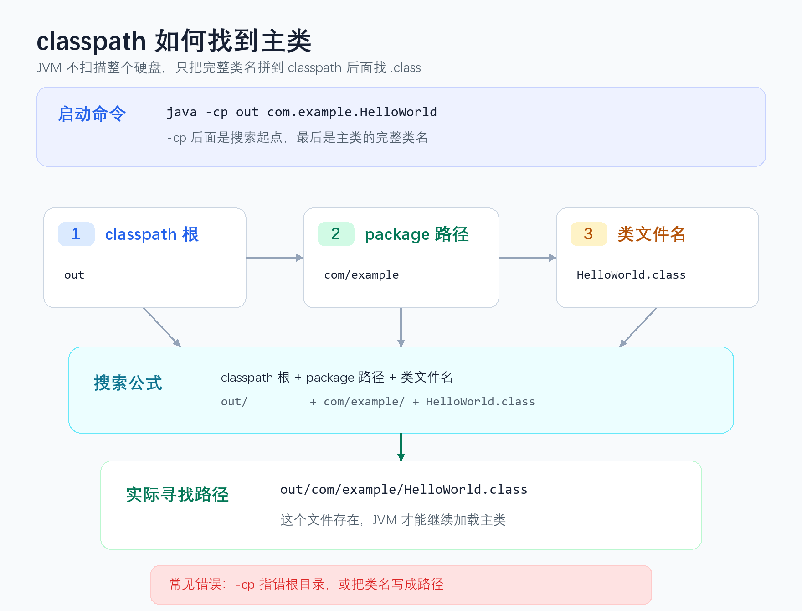

> [!info] 知识摘要
> **总结**
> - `classpath` 是 JVM 查找用户类、资源和依赖 JAR 的搜索范围，核心公式是：`classpath 根目录 + package 路径 + 类名.class`。
> - “找不到或无法加载主类”表面像 IDE 玄学，底层通常仍能还原成编译输出、classpath、完整类名、JAR 清单或模块路径没有对上。
>
> **相关知识点**
> - [[002_第一篇：Java 运行机制与程序结构|Java 运行机制]]、`javac`、`java`、`package`、`import`、`-cp`、`module path`、`MANIFEST.MF`、[[019_IO01_相对路径到底相对谁？IDE、命令行、jar 包运行目录一次讲清|user.dir]]

---

## 一、先给结论：classpath 是 JVM 找类的搜索范围

运行 Java 程序时，`java` 命令不是拿着你的类名去扫描整台电脑。它只会在指定的 `classpath` 里找。

最重要的公式是：

```text
实际 class 文件路径 = classpath 根目录 + package 对应路径 + 类名.class
```

例如：

```bash
java -cp out com.example.HelloWorld
```

这条命令真正表达的是：

```text
classpath 根目录：out
完整类名：com.example.HelloWorld
JVM 实际寻找：out/com/example/HelloWorld.class
```

所以 `classpath` 不是 `package`，不是 `import`，也不是普通文件相对路径的工作目录。

| 概念 | 负责什么 |
| --- | --- |
| `package` | 决定类的完整名字，以及相对路径结构 |
| `classpath` | 决定 JVM 从哪些根目录或 JAR 里找类 |
| `import` | 简化源码里写类名的方式，不负责添加依赖 |
| `user.dir` | 普通文件相对路径的基准目录，和找类不是一回事 |



报“找不到或无法加载主类”时，先不要急着重启 IDE。先问自己：`-cp` 指到哪里？运行时写的类名是什么？这两者拼起来能不能找到真实的 `.class` 文件？

---

## 二、先看无包名类：为什么 `java HelloWorld` 能跑

最简单的 Java 程序没有 `package`：

```java
public class HelloWorld {
    public static void main(String[] args) {
        System.out.println("Hello");
    }
}
```

如果当前目录下就是 `HelloWorld.java`，编译：

```bash
javac HelloWorld.java
```

会得到：

```text
HelloWorld.class
```

运行：

```bash
java HelloWorld
```

这里看起来没有写 `classpath`，但 JVM 仍然需要一个搜索范围。一般情况下，如果没有显式写 `-cp`，也没有设置 `CLASSPATH` 环境变量，默认 classpath 是当前目录 `.`。

所以更完整地写，其实是：

```bash
java -cp . HelloWorld
```

拆开看：

| 命令片段 | 含义 |
| --- | --- |
| `java` | 启动 JVM |
| `-cp .` | 从当前目录找类 |
| `HelloWorld` | 要运行的类名 |

注意运行时写的是类名，不是文件名。

下面这条是错的：

```bash
java HelloWorld.class
```

因为 JVM 会把 `HelloWorld.class` 当成一个类名，而不是当成文件路径。它会尝试找类似下面的东西：

```text
HelloWorld/class.class
```

结果当然找不到。

> [!warning] 常见误区：`java` 后面应该写 `.class` 文件名
>
> 正确理解：`javac` 后面写源文件路径，`java` 后面写类名。类名不带 `.class` 后缀。

---

## 三、带 `package` 后，类名和路径要分开看

真正容易出错的是带包名的类。

假设目录结构是：

```text
project/
├── src/
│   └── com/
│       └── example/
│           └── HelloWorld.java
```

代码里写了：

```java
package com.example;

public class HelloWorld {
    public static void main(String[] args) {
        System.out.println("Hello from package");
    }
}
```

建议编译到单独的输出目录：

```bash
javac -d out src/com/example/HelloWorld.java
```

编译结果应该是：

```text
project/
├── out/
│   └── com/
│       └── example/
│           └── HelloWorld.class
```

此时正确运行方式是：

```bash
java -cp out com.example.HelloWorld
```

继续套公式：

```text
classpath 根目录：out
package 路径：com/example
类文件名：HelloWorld.class
最终路径：out/com/example/HelloWorld.class
```

下面这些写法都容易报错：

```bash
# 错：只写短类名，JVM 会找 out/HelloWorld.class
java -cp out HelloWorld

# 错：classpath 指得太深，类的内部名字又是 com.example.HelloWorld
java -cp out/com/example HelloWorld

# 错：把包名写成路径
java -cp out com/example/HelloWorld
```

这里有一个很关键的点：**`classpath` 指向的是包结构的根目录，不是包目录本身。**

如果 `.class` 在：

```text
out/com/example/HelloWorld.class
```

那么 `-cp` 应该指到：

```text
out
```

而不是：

```text
out/com/example
```

这一步其实已经把 `package` 和 `classpath` 的关系讲完了：`package` 决定类名对应的相对路径，`classpath` 决定这段相对路径从哪里开始找。

---

## 四、classpath 里可以放什么

`classpath` 不是只能放一个目录。它可以包含多个搜索入口。

常见入口有三类：

| classpath 项 | 示例 | JVM 怎么找 |
| --- | --- | --- |
| 目录 | `out`、`target/classes` | 在目录下按包路径找 `.class` |
| JAR 文件 | `app.jar`、`lib/a.jar` | 在 JAR 内部按包路径找 `.class` |
| 通配符 | `lib/*` | 把 `lib` 下的 JAR 加入 classpath |

多个 classpath 项之间要用分隔符连接：

| 系统 | 分隔符 | 示例 |
| --- | --- | --- |
| Windows | `;` | `java -cp "out;lib/*" com.example.HelloWorld` |
| Linux / macOS | `:` | `java -cp "out:lib/*" com.example.HelloWorld` |

在 Windows PowerShell 里，包含 `;` 的 classpath 最好加引号：

```powershell
java -cp "out;lib/*" com.example.HelloWorld
```

否则分号可能被当成命令分隔符，问题就会从 Java 找类变成命令行解析。

### 4.1 `.` 代表当前目录

如果你希望 JVM 从当前目录找类，可以写：

```bash
java -cp . HelloWorld
```

如果还要加依赖 JAR，就按上面的分隔符规则，把 `.` 和 `lib/*` 一起放进 classpath。

注意：如果你设置了全局 `CLASSPATH` 环境变量，并且里面没有 `.`，当前目录就不一定会自动参与搜索。学习阶段更推荐显式写 `-cp`，不要把排错建立在全局环境变量上。

### 4.2 `-cp` 和 `-classpath` 是一回事

这两种写法等价：

```bash
java -cp out com.example.HelloWorld
java -classpath out com.example.HelloWorld
```

实际开发中 `-cp` 更常见。IDE、Maven、Gradle 本质上也会帮你组织 classpath，只是一般不需要你手写完整命令。

---

## 五、“找不到”和“无法加载”要看底层原因

常见报错长这样：

```text
错误: 找不到或无法加载主类 com.example.HelloWorld
原因: java.lang.ClassNotFoundException: com.example.HelloWorld
```

英文环境里通常是：

```text
Error: Could not find or load main class com.example.HelloWorld
Caused by: java.lang.ClassNotFoundException: com.example.HelloWorld
```

这条启动器报错本身是概括性提示，不代表 Java 里存在一个单独叫“无法加载主类”的异常类型。更精确地看，要看后面的 `Caused by` 或完整错误信息。

可以先按这条链路理解：

```text
java 启动器
  -> 根据 classpath 定位入口类
  -> 读取入口类字节码
  -> 校验、解析、链接入口类依赖
```

这几个阶段失败，才和“找不到或无法加载主类”这句报错直接相关。

| 失败位置 | 常见底层错误 | 说明 | 常见原因 |
| --- | --- | --- | --- |
| 入口类本身没找到 | `ClassNotFoundException` | 指定的主类没有在搜索路径里找到 | `-cp` 错、类名错、没有编译、输出目录错 |
| 入口类找到了但名字不匹配 | `NoClassDefFoundError: wrong name` | 文件位置和 `.class` 内部类名对不上 | 把带 `package` 的类当默认包运行 |
| 入口类依赖缺失 | `NoClassDefFoundError` | 主类字节码已被找到，但父类、接口或直接依赖找不到 | 依赖 JAR 没进运行 classpath |

很多入门场景里，真正原因是第一类：JVM 根本没在指定路径里找到入口类，所以后面会看到 `ClassNotFoundException`。

但也有一些情况属于“入口类字节码找到了，后续加载或链接失败”。例如：

- `.class` 的内部类名是 `com.example.HelloWorld`，你却按 `HelloWorld` 去运行。
- 主类继承的父类不在运行 classpath 里。
- 主类直接引用的接口或必要依赖缺失。

注意，`main` 方法不存在或签名写错，是类已经找到之后的下一道检查，通常会出现另一类错误提示，不属于本节这张表的范围。

所以本节的排错顺序应该是：

```text
先让 JVM 找到入口类。
再确认入口类能完成加载和链接。
```

> [!warning] 常见误区：所有启动失败都叫“找不到主类”
>
> 正确理解：`ClassNotFoundException` 和 `NoClassDefFoundError` 是找类、加载类阶段的常见失败点；`main` 方法不符合要求会报另一类启动错误，不要混在同一张排查表里。

---

## 六、命令行排错：用四个问题定位

遇到下面这种报错：

```text
Error: Could not find or load main class ...
```

不要先猜。按四个问题检查。

### 6.1 这个类编译出来了吗

先确认有没有生成 `.class` 文件。

如果源码是：

```text
src/com/example/HelloWorld.java
```

推荐编译：

```bash
javac -d out src/com/example/HelloWorld.java
```

然后确认结果应该是：

```text
out/com/example/HelloWorld.class
```

如果 `out` 下没有这个文件，运行阶段再怎么改 `-cp` 都没用。

### 6.2 `package` 写的是什么

打开源码第一行：

```java
package com.example;
```

这意味着类的完整名字是：

```text
com.example.HelloWorld
```

运行时不能只写：

```bash
java -cp out HelloWorld
```

要写：

```bash
java -cp out com.example.HelloWorld
```

如果源码没有 `package`，那它才是默认包里的 `HelloWorld`。

### 6.3 `-cp` 指向的是包结构根目录吗

看真实 `.class` 路径：

```text
out/com/example/HelloWorld.class
```

把完整类名转换成路径：

```text
com.example.HelloWorld -> com/example/HelloWorld.class
```

剩下的前缀就是 classpath 根目录：

```text
out
```

因此：

```bash
java -cp out com.example.HelloWorld
```

如果你写：

```bash
java -cp out/com/example HelloWorld
```

等于绕开了 `package` 这层身份信息。很多“明明文件就在那儿，为什么还找不到”的问题，根就在这里。

### 6.4 类名大小写对吗

Java 类名区分大小写。

下面这些名字不是一回事：

```text
HelloWorld
helloworld
HelloWORLD
```

Windows 上还要注意扩展名隐藏。有时你以为文件叫：

```text
HelloWorld.java
```

实际上可能是：

```text
HelloWorld.java.txt
```

这种情况下，编译阶段通常就会暴露问题。

---

## 七、IDEA 里为什么也会报这个错

IDEA 报“找不到或无法加载主类”，本质上仍然是同一个公式没对上：

```text
classpath 根目录 + package 路径 + 类名.class
```

只是 IDEA 引入了一层配置抽象：它不会直接让你手写完整的 `java -cp ... 主类`，而是把这些信息拆到 Project Structure、Module、Run Configuration、SDK、构建输出目录里。

所以 IDE 不是玄学，但它确实会制造新的错误源。比较稳的排查方法不是先背菜单，而是先看 IDEA 实际启动时拼出来的命令。

### 7.1 先看 IDEA 实际执行的命令

运行程序后，Run 窗口开头通常会打印一长串启动命令，里面能看到 `java`、`-classpath` 或 `-cp`、模块输出目录、依赖 JAR、主类名等信息。

先看这条真实命令，比凭空猜 Project Structure 更直接。

你可以重点扫三段：

| 命令片段 | 看什么 |
| --- | --- |
| `-classpath` / `-cp` 后面的长路径 | 是否包含当前模块输出目录和依赖 JAR |
| 主类名 | 是否是带包名的完整类名 |
| 工作目录 / 参数 | 普通文件路径问题才重点看，找主类时先放后面 |

如果 Run 窗口里的命令被折叠、截断或太长，再回到运行配置和项目结构里拆来源。

### 7.2 再把配置翻译成 `java` 命令

在 IDEA 里点运行，大致可以理解成它帮你拼了一条命令：

```bash
java [VM options] -cp "<模块输出目录;依赖 JAR;依赖模块输出目录>" 主类完整名 [Program arguments]
```

也就是说，IDEA 的几个配置项大致对应下面这些命令片段：

| IDEA 配置 | 等效命令行含义 | 出错后表现 |
| --- | --- | --- |
| Main class | `java` 命令最后的主类完整名 | 类名错、包名少写、指向旧类 |
| Use classpath of module | `-cp` 使用哪个模块的输出和依赖 | 选错模块，运行时找不到类或依赖 |
| Module output path | `-cp` 里的目录项 | 编译输出不在运行 classpath 里 |
| Dependencies | `-cp` 里的 JAR 或模块输出目录 | 编译或运行时依赖缺失 |
| VM options | `java` 后、主类名前的 JVM 参数 | 参数写错可能影响启动 |
| Program arguments | 主类名后面的 `args` | 不影响找主类，但影响业务参数 |
| Working directory | `user.dir` | 影响普通文件相对路径，不是 classpath |

例如一个 IDEA 运行配置可能等价于：

```bash
java -cp "<IDEA 生成的 classpath>" com.example.HelloWorld
```

这时你要检查的仍然是：

```text
out/production/demo/com/example/HelloWorld.class
```

能不能被这条等效命令找到。

### 7.3 再看 IDEA 配置检查点

常见检查点如下：

| 检查点 | 在看什么 | 可能导致的问题 |
| --- | --- | --- |
| Sources Root | `src` 或源码目录有没有被标为源代码根 | IDEA 没把源码当 Java 源码编译 |
| Output path | 编译后的 `.class` 输出到哪里 | 运行时 classpath 找不到输出结果 |
| Run Configuration | Main class 是否是正确完整类名 | 运行配置指向了旧类、错类或短类名 |
| Use classpath of module | 运行时使用哪个模块的 classpath | 多模块项目中拿错模块依赖 |
| Project SDK | 编译和运行使用的 JDK | 版本不兼容或 SDK 配错 |
| Build Messages | 编译是否真的成功 | 前面编译失败，后面自然运行失败 |

几个常用动作可以按顺序做：

1. 确认 `src` 是否被标记为 Sources Root。
2. 打开 Project Structure，检查 Modules、Sources、Paths。
3. 打开 Run / Edit Configurations，确认 Main class 和模块。
4. 看 Build 输出窗口，先解决编译错误。
5. 再执行 Build -> Rebuild Project，清掉旧输出重新编译。

如果是多模块项目，还要确认主模块依赖的模块或外部库确实在运行 classpath 里。编译能过，不代表某个运行配置一定带上了所有需要的模块。

> [!note] IDEA 的“清缓存、重启”放在后面
>
> 如果源码根、输出目录、运行配置和依赖都没问题，再考虑缓存或项目配置损坏。否则一上来就清缓存，可能只是把一个可定位的问题变成随机试错。

---

## 八、JAR 场景：`java -jar` 看的是 `MANIFEST.MF`

直接运行 JAR 时，命令通常是：

```bash
java -jar app.jar
```

这和下面这种写法不是一回事：

```bash
java -cp app.jar com.example.HelloWorld
```

`java -jar app.jar` 会读取 JAR 内部的：

```text
META-INF/MANIFEST.MF
```

里面需要有入口类配置：

```text
Main-Class: com.example.HelloWorld
```

如果 `Main-Class` 写错、缺失，或者指向的类不在 JAR 里，就会启动失败。

### 8.1 怎么检查 JAR 里有没有主类

可以先看 JAR 内容：

```bash
jar tf app.jar
```

你应该能看到类似：

```text
META-INF/MANIFEST.MF
com/example/HelloWorld.class
```

也可以解出清单文件看：

```bash
jar xf app.jar META-INF/MANIFEST.MF
```

重点检查：

```text
Main-Class: com.example.HelloWorld
```

注意这里写的也是完整类名，不是路径：

```text
com.example.HelloWorld
```

不是：

```text
com/example/HelloWorld.class
```

### 8.2 没有可执行清单，也可以用 `-cp` 指定入口

如果 JAR 不是可执行 JAR，但里面有主类，可以这样运行：

```bash
java -cp app.jar com.example.HelloWorld
```

如果还依赖 `lib` 目录下其他 JAR，就把 `app.jar` 和 `lib/*` 一起放进 `-cp`。

### 8.3 `-jar` 模式不要和普通 `-cp` 混着理解

使用 `java -jar app.jar` 时，普通命令行里的 classpath 规则会变得不一样。你不能指望再额外写一个普通 `-cp` 就让 `-jar` 自动带上外部依赖。

可执行 JAR 的依赖通常要通过下面这些方式处理：

- 打成 fat jar / uber jar，把依赖一起打进去。
- 在 `MANIFEST.MF` 里配置 `Class-Path`。
- 用脚本改成 `java -cp "<app.jar 和依赖 JAR>" 主类完整名`。
- 对 Spring Boot 项目，确保执行了正确的打包或 `repackage`，生成 Boot 可执行 JAR。

Spring Boot 报找不到 `JarLauncher`、找不到主启动类、普通 Maven JAR 不能 `java -jar`，很多时候不是 Java 语法问题，而是打包产物不符合可执行 JAR 的结构。

所以排查 JAR 启动问题时，要先分清自己用的是 `java -jar` 还是 `java -cp`。前者看清单文件，后者看命令行 classpath 和主类名。

### 8.4 Java 9+ 还有 `module path`

从 Java 9 开始，Java 平台引入了模块系统。使用模块系统时，除了 `classpath`，还可能出现 `module path`。

本笔记不展开模块系统。只需要先记住一个边界：如果项目里有 `module-info.java`，或者启动命令里出现 `--module-path`、`-p`、`-m`，就不能只按本文的 classpath 公式排查，还要检查模块名、模块依赖和模块路径。

---

## 九、`classpath`、`import`、`package`、相对路径别混

这几个概念经常一起出现，但职责完全不同。

### 9.1 `import` 不会帮你添加 JAR

源码里写：

```java
import com.fasterxml.jackson.databind.ObjectMapper;
```

只是让你后面可以写短类名：

```java
ObjectMapper mapper = new ObjectMapper();
```

它不负责把 Jackson 的 JAR 加进项目。

如果依赖 JAR 不在编译 classpath 或运行 classpath 里，`import` 写得再正确也没用。

更严格地说，`import` 只影响当前源码文件里怎么写类名，不负责依赖解析。依赖 JAR 通常由 Maven、Gradle、IDE 项目配置或命令行 classpath 提供；如果使用 Java 模块系统，模块依赖还要看 `module-info.java` 里的 `requires`。

### 9.2 `package` 决定类的身份

下面这个类的完整名字是：

```java
package com.example;

public class HelloWorld {
}
```

```text
com.example.HelloWorld
```

这个名字会进入 `.class` 文件内部。运行时把它当成默认包的 `HelloWorld` 去找，就算路径上碰巧有文件，也可能加载失败。

### 9.3 普通文件路径看 `user.dir`

这段代码：

```java
new java.io.File("data/a.txt");
```

看的是当前进程工作目录，也就是：

```java
System.getProperty("user.dir")
```

它不是 classpath。

但这段代码：

```java
HelloWorld.class.getResourceAsStream("/config/app.properties");
```

找的是 classpath 资源。

简单分法：

| 你要找什么 | 看哪个规则 |
| --- | --- |
| `.class` 主类 | classpath |
| 依赖 JAR 里的类 | classpath |
| `resources` 里的内置资源 | classpath |
| 用户电脑上的外部文件 | `user.dir` 或显式绝对路径 |

一句话区分：`classpath` 解决“JVM 从哪里找类和内置资源”；普通相对路径解决“程序从哪里找外部文件”。

---

## 十、三步还原法：从真实 `.class` 倒推命令

遇到“找不到或无法加载主类”，最稳的方法不是背所有可能原因，而是把路径还原出来。

### 10.1 第一步：确定真实 `.class` 路径

先确认编译产物真的存在。

例如看到：

```text
out/com/example/HelloWorld.class
```

如果这个文件不存在，先回到编译阶段，检查 `javac -d`、IDE 输出目录、Maven / Gradle 构建是否成功。

### 10.2 第二步：从源码提取完整类名

打开源码：

```java
package com.example;

public class HelloWorld {
}
```

得到完整类名：

```text
com.example.HelloWorld
```

如果没有 `package`，完整类名才是：

```text
HelloWorld
```

### 10.3 第三步：减出 classpath 根目录

把完整类名转换成路径：

```text
com.example.HelloWorld
-> com/example/HelloWorld.class
```

再和真实路径对齐：

```text
真实路径：out/com/example/HelloWorld.class
类名路径：    com/example/HelloWorld.class
classpath 根：out
```

所以运行命令应该是：

```bash
java -cp out com.example.HelloWorld
```

这就是整篇文章最重要的排错动作。

### 10.4 反例对照卡

| 错误写法 | 为什么错 | 正确方向 |
| --- | --- | --- |
| `java -cp out HelloWorld` | 少了包名，JVM 会找 `out/HelloWorld.class` | 写完整类名：`com.example.HelloWorld` |
| `java -cp out/com/example HelloWorld` | classpath 指到了包目录，不是包结构根目录 | `-cp out` |
| `java -cp out com/example/HelloWorld` | 把类名写成了路径 | 类名用点号：`com.example.HelloWorld` |
| `java -cp out com.example.HelloWorld.class` | `.class` 被当成类名的一部分 | 去掉后缀 |
| `java -jar app.jar` 失败 | 入口来自 `MANIFEST.MF`，不是命令行主类名 | 检查 `Main-Class` 或改用 `-cp` |
| IDEA 能编译但不能运行 | 运行配置的模块 classpath 可能和编译配置不同 | 翻译成等效 `java -cp ...` 检查 |
| 报 `NoClassDefFoundError` | 入口类或依赖在链接阶段失败 | 检查包名匹配和依赖 JAR |

---

## 总结

这篇笔记真正要收束到一个公式：

```text
实际 class 文件路径 = classpath 根目录 + package 路径 + 类名.class
```

围绕这个公式，排错时只抓三件事：

| 要确认的事 | 对应问题 |
| --- | --- |
| `.class` 真实在哪里 | 编译是否成功，输出目录在哪里 |
| 主类完整名字是什么 | 源码有没有 `package`，运行时是否写对类名 |
| 启动方式从哪里找 | 命令行 `-cp`、IDE 模块 classpath 或 JAR 清单是否对得上 |

其他提醒都只是这个主线的具体变体：`java -jar` 看 `MANIFEST.MF`；普通文件相对路径看 `user.dir`，不要和 classpath 混在一起。使用 Java 模块系统时，再额外检查 module path。
