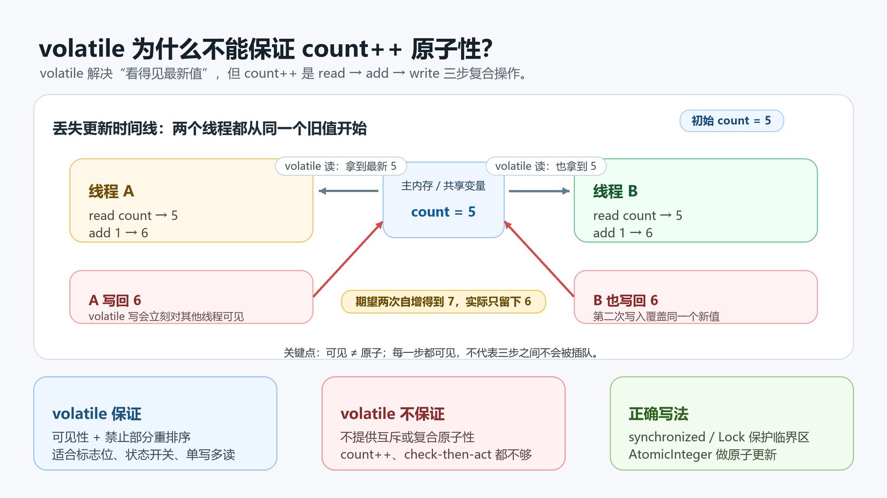

> [!info] 知识摘要
> **总结**
> - `volatile` 主要解决共享变量的可见性，并通过内存屏障限制一部分指令重排序；它不会让复合操作变成不可分割的一步。
> - `count++` 至少包含“读旧值、加一、写回”三步。多个线程可以读到同一个旧值，再写回同一个新值，于是自增次数被丢掉。
> - 计数器、余额扣减、先判断再修改这类共享数据更新，要用 `synchronized`、`Lock` 或 `AtomicInteger` 等能保证原子更新的写法。
>
> **相关知识点**
> - [[021_第二十篇：多线程基础|Java 多线程基础]]、线程安全、可见性、原子性、指令重排序、`volatile`、`synchronized`、`AtomicInteger`

| 问题 | 结论 |
| --- | --- |
| `volatile int count` 后，`count++` 安全吗？ | 不安全 |
| `volatile` 能保证什么？ | 可见性，以及禁止一部分重排序 |
| `volatile` 不能保证什么？ | 互斥执行、复合操作原子性 |
| 计数器应该怎么写？ | `synchronized` / `Lock` / `AtomicInteger` |

---

## 一、先看现象：加了 volatile，结果仍然可能少

很多人第一次接触 `volatile`，会把它理解成“线程安全变量”。于是很容易写出下面这种计数器：

```java
import java.util.concurrent.CountDownLatch;

public class VolatileCountDemo {
    private static volatile int count = 0;

    public static void main(String[] args) throws InterruptedException {
        int threadCount = 10;
        int times = 10_000;
        CountDownLatch latch = new CountDownLatch(threadCount);

        for (int i = 0; i < threadCount; i++) {
            new Thread(() -> {
                for (int j = 0; j < times; j++) {
                    count++;
                }
                latch.countDown();
            }).start();
        }

        latch.await();
        System.out.println(count);
    }
}
```

如果每次自增都没有丢失，理论结果应该是：

```text
10 * 10000 = 100000
```

但实际运行时，结果经常小于 `100000`。不同机器、不同运行次数、不同调度时机下，输出可能不一样。

这正是并发问题最迷惑人的地方：不是每次都错，但一旦错，就说明这段代码本身没有线程安全保证。

---

## 二、一句话结论：可见性不是原子性

`volatile` 能让一个线程写入的值更快被其他线程看到，但它不能阻止多个线程同时执行同一段更新逻辑。

可以先用一句话记住：

```text
volatile 解决“别人能不能看见”，不解决“这三步能不能被插队”。
```

`count++` 看起来像一句代码，但它不是单个不可分割的动作。它大致要做三件事：

1. 读取 `count` 当前值。
2. 在当前值基础上加 `1`。
3. 把新值写回 `count`。

`volatile` 可以让“读”和“写”围绕共享变量建立可见性规则，却不会把这三步锁成一个整体。

---

## 三、count++ 到底怎么丢更新

假设 `count` 现在是 `5`，线程 A 和线程 B 同时执行 `count++`。



一种可能的执行顺序是：

| 时刻 | 线程 A | 线程 B | 共享变量 count |
| --- | --- | --- | --- |
| 1 | 读取 `count`，得到 `5` |  | `5` |
| 2 |  | 读取 `count`，也得到 `5` | `5` |
| 3 | 计算 `5 + 1 = 6` |  | `5` |
| 4 |  | 计算 `5 + 1 = 6` | `5` |
| 5 | 写回 `6` |  | `6` |
| 6 |  | 也写回 `6` | `6` |

这两个线程都完成了一次自增，但最终结果只从 `5` 变成了 `6`，少了一次。

如果把 `count++` 看成字节码层面的动作，也能看到它不是一步：

```text
getstatic   // 读取 count
iconst_1    // 准备常量 1
iadd        // 加法
putstatic   // 写回 count
```

真实字节码会受变量位置和编译结果影响，但核心点不变：读、算、写是多个动作。只要多个线程能在这些动作之间穿插执行，就可能出现丢失更新。

---

## 四、volatile 真正保证了什么

`volatile` 的价值并不小，只是它解决的不是 `count++` 这种问题。

### 1. 保证可见性

一个线程写入 `volatile` 变量后，其他线程后续读取这个变量时，应该能看到这次写入结果。

这适合用来做状态标志：

```java
public class StopFlagDemo {
    private volatile boolean running = true;

    public void stop() {
        running = false;
    }

    public void work() {
        while (running) {
            // do something
        }
    }
}
```

这里的关键是：线程只是读取 `running` 判断要不要继续，没有基于旧值做复合更新。

### 2. 禁止一部分指令重排序

`volatile` 读写会插入内存屏障，用来约束编译器和处理器对相关读写的重排序。

入门阶段不用先记屏障名字，只要抓住这个效果：

```text
volatile 写之前的普通写入，不应该被随意挪到 volatile 写之后；
volatile 读之后的普通读取，不应该被随意挪到 volatile 读之前。
```

所以它常用于“发布状态”“通知另一个线程某个状态已经准备好”这类场景。

### 3. 不提供互斥

`volatile` 不会让线程排队，也不会让某段代码同一时刻只能有一个线程执行。

这也是它和 `synchronized` 的核心差别：

| 能力 | `volatile` | `synchronized` |
| --- | --- | --- |
| 可见性 | 有 | 有 |
| 禁止部分重排序 | 有 | 有 |
| 互斥执行 | 没有 | 有 |
| 复合操作原子性 | 不保证 | 在同步块内可以保证 |
| 是否可能阻塞线程 | 不会因为锁而阻塞 | 竞争锁时可能阻塞 |

---

## 五、为什么 synchronized 可以保证 count++

如果用 `synchronized` 把自增包起来，同一时刻只有拿到同一把锁的线程能进入临界区：

```java
public class SynchronizedCountDemo {
    private static int count = 0;

    private static synchronized void increase() {
        count++;
    }
}
```

这里的 `count++` 本身仍然是读、加、写三步，但这三步被放进了同一个同步方法里。

效果就变成：

```text
线程 A 进入 increase()
线程 A 完成 read -> add -> write
线程 A 退出 increase()
线程 B 才能进入 increase()
```

也就是说，`synchronized` 不是把 `++` 变成了一条机器指令，而是用互斥保证这几步不会被其他线程插进来。

同时，进入和退出同步块也会建立可见性保证：一个线程在锁内修改的结果，对后续拿到同一把锁的线程是可见的。

---

## 六、为什么 AtomicInteger 也可以

如果只是做计数器，更常用的是 `AtomicInteger`：

```java
import java.util.concurrent.atomic.AtomicInteger;

public class AtomicCountDemo {
    private static final AtomicInteger count = new AtomicInteger();

    public static void increase() {
        count.incrementAndGet();
    }
}
```

`AtomicInteger` 的自增方法不是普通的“读出来、加一、写回”。它会通过 CAS 这类原子更新机制尝试修改：

```text
我刚才读到的是 5，如果现在仍然是 5，就把它改成 6；
如果已经被别人改过了，就重新读取并再试一次。
```

所以它不需要像 `synchronized` 那样让线程进入同一把锁，但能保证这次自增不会和其他线程的自增互相覆盖。

入门阶段可以先这样区分：

| 写法 | 适合场景 | 直觉 |
| --- | --- | --- |
| `volatile boolean running` | 停止标志、状态通知 | 让别的线程看见最新状态 |
| `synchronized` / `Lock` | 一段逻辑必须整体执行 | 把临界区锁起来 |
| `AtomicInteger` | 简单计数、原子加减 | 把单个变量更新做成原子操作 |

---

## 七、什么时候可以用 volatile，什么时候不够

适合用 `volatile` 的场景，通常满足一个特点：读写本身很简单，不依赖“先读旧值再算新值”的复合逻辑。

### 适合

| 场景 | 示例 |
| --- | --- |
| 停止标志 | `volatile boolean running` |
| 状态开关 | `volatile boolean initialized` |
| 单写多读的最新配置 | 一个线程更新配置引用，多个线程读取 |
| 简单发布状态 | 某个阶段完成后通知其他线程 |

### 不适合只靠 volatile

| 场景 | 为什么不够 |
| --- | --- |
| `count++` | 读、加、写之间可能被插队 |
| 余额扣减 | 需要先判断余额再修改余额 |
| `if (map.get(k) == null) put(k, v)` | 先检查再操作，不是一个整体 |
| 生成递增 ID | 多线程可能生成重复或跳号结果 |
| 多字段一致性更新 | 只保证单个 volatile 变量语义，不保证一组字段整体一致 |

再补一个常见细节：`volatile` 修饰的是字段，不修饰方法、类、局部变量或方法参数。它是变量可见性语义，不是“给一段代码加线程安全”的语法。

---

## 八、速查表

| 误区 | 正确认知 |
| --- | --- |
| `volatile` 等于线程安全 | 只覆盖可见性和部分有序性，不等于所有操作安全 |
| `count++` 是一句代码，所以是原子的 | 一句代码不代表一个不可分割的动作 |
| 加了 `volatile` 就不会丢自增 | 多线程仍可能读到同一个旧值并写回同一个新值 |
| `synchronized` 只是保证可见性 | 它还提供互斥执行 |
| `AtomicInteger` 只是语法糖 | 它提供原子更新能力，和普通 `int++` 不同 |

---

## 九、总结

`volatile` 的关键词是“可见”，不是“排队”。

它能让线程之间更可靠地看到共享变量的最新状态，也能约束一部分重排序；但 `count++` 这种读、改、写复合操作，需要的是“中间不能被插队”的原子性。

所以：

```text
状态通知：优先考虑 volatile
临界区逻辑：使用 synchronized 或 Lock
简单计数：使用 AtomicInteger / LongAdder
```

把这三类问题分开，`volatile` 就不会再被误用成万能线程安全开关。
