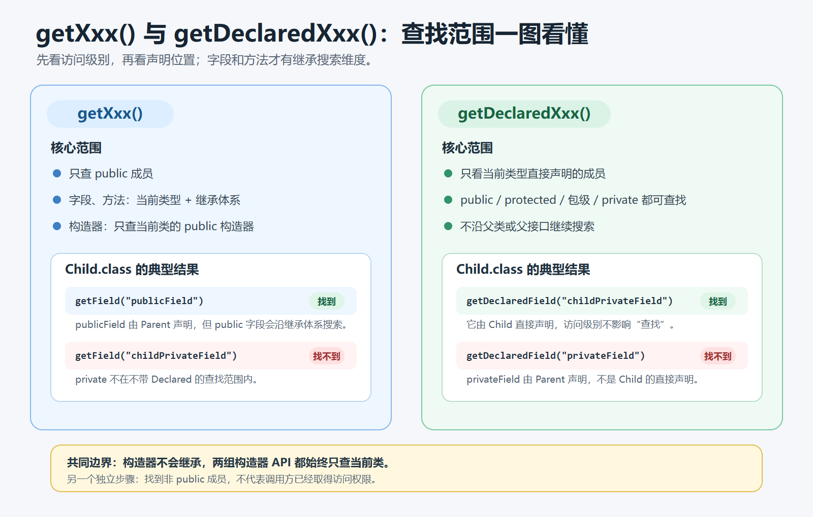
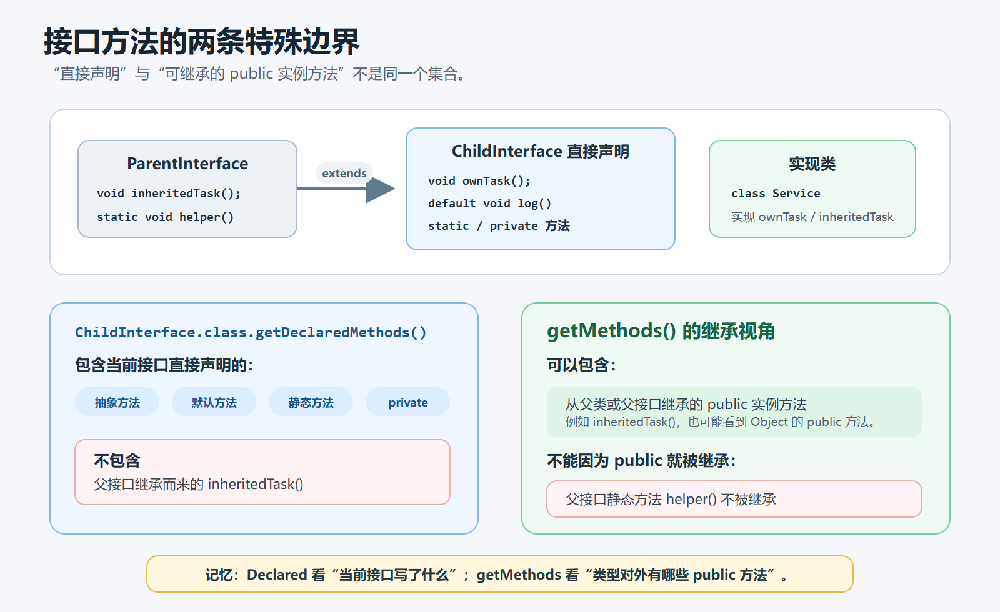
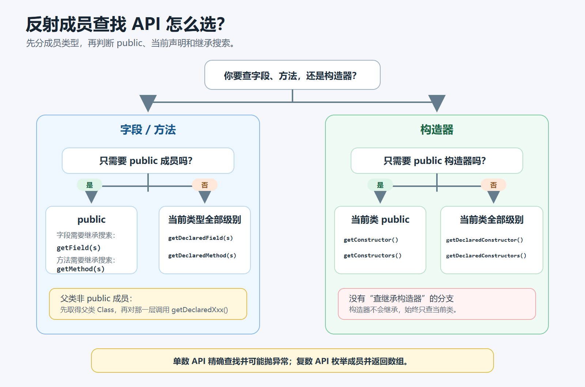

> [!info] 知识摘要
> **总结**
> - 不带 `Declared` 的 `getXxx()` 面向 public 成员，并会搜索可继承的 public 成员；`getDeclaredXxx()` 面向当前类直接声明的全部访问级别成员，但不搜索父类。
> - 构造器不会被继承，因此构造器组的区别主要是“只要 public”还是“当前类声明的全部访问级别”。
>
> **相关知识点**
> - [[022_第二十一篇：反射基础|Java 反射基础]]、`Class`、`Field`、`Method`、`Constructor`、继承、访问权限

---

## 一、先记住两个判断维度

反射查找字段、方法和构造器时，`getXxx()` 与 `getDeclaredXxx()` 的区别可以归纳为两个问题：

1. 要不要限制为 `public`？
2. 要不要沿继承关系查找？

| API 类型                                   | 访问级别           | 是否包含继承成员     |
| ---------------------------------------- | -------------- | ------------ |
| `getXxx()` / `getXxxs()`                 | 只获取 `public`   | 字段和方法会搜索继承成员 |
| `getDeclaredXxx()` / `getDeclaredXxxs()` | 获取当前类声明的全部访问级别 | 不搜索继承成员      |

可以压缩成一句话：

```text
不带 Declared：只查 public；字段和方法会沿继承体系搜索。
带 Declared：只查当前类直接声明的成员，但不限制访问级别。
构造器不会继承，因此构造器 API 始终只查当前类。
```



这里的“全部访问级别”包括：

- `public`
- `protected`
- 包级访问（没有显式修饰符）
- `private`

> [!note] 获取与访问是两回事
> `getDeclaredXxx()` 能取得非 public 成员的反射对象，不代表调用方一定能直接读取、修改或调用它。访问控制属于下一步操作，不能与“能否找到成员”混为一谈。

---

## 二、用一个继承示例观察边界

先准备父类和子类：

```java
class Parent {
    public String publicField;
    protected String protectedField;
    String packageField;
    private String privateField;

    public void publicMethod() {
    }

    protected void protectedMethod() {
    }

    void packageMethod() {
    }

    private void privateMethod() {
    }
}

class Child extends Parent {
    public String childPublicField;
    private String childPrivateField;

    public Child() {
    }

    private Child(String name) {
    }

    public void childPublicMethod() {
    }

    private void childPrivateMethod() {
    }
}
```

对 `Child.class` 执行反射查找时，可以先建立下面这张结果表：

| 成员 | `getXxx()` 能否找到 | `getDeclaredXxx()` 能否找到 |
| --- | --- | --- |
| 子类自己声明的 public 成员 | 能 | 能 |
| 子类自己声明的非 public 成员 | 不能 | 能 |
| 从父类继承的 public 字段或方法 | 能 | 不能 |
| 父类声明的 protected、包级或 private 成员 | 不能 | 不能 |

最后一行尤其容易误解：

```text
getDeclaredXxx() 的“全部”只指当前 Class 对象所表示的类直接声明的全部，
不是整条继承链上所有类的全部成员。
```

如果需要获取父类声明的非 public 成员，必须先拿到父类的 `Class` 对象，再调用父类的 `getDeclaredXxx()`：

```java
Field field = Child.class
        .getSuperclass()
        .getDeclaredField("protectedField");
```

框架需要扫描整条继承链时，通常会循环调用 `getSuperclass()`，并对每一层分别执行 `getDeclaredFields()` 或 `getDeclaredMethods()`。

---

## 三、字段：getField 与 getDeclaredField

### 3.1 查找单个字段

```java
Field inheritedPublic =
        Child.class.getField("publicField");

Field childPrivate =
        Child.class.getDeclaredField("childPrivateField");
```

两组 API 的范围如下：

| API | 查找范围 |
| --- | --- |
| `getField(name)` | 当前类及继承体系中可见的 public 字段 |
| `getDeclaredField(name)` | 当前类直接声明的指定字段，不限制访问级别 |
| `getFields()` | 当前类及继承体系中可见的全部 public 字段 |
| `getDeclaredFields()` | 当前类直接声明的全部字段，不限制访问级别 |

下面两种写法都会失败：

```java
Child.class.getField("childPrivateField");
// 非 public，不在 getField() 的范围内

Child.class.getDeclaredField("privateField");
// privateField 由 Parent 声明，不是 Child 直接声明
```

查找单个字段失败时，会抛出 `NoSuchFieldException`。

### 3.2 字段不会因为继承就改变声明位置

`publicField` 可以通过 `Child.class.getField("publicField")` 找到，但它仍然由 `Parent` 声明：

```java
Field field = Child.class.getField("publicField");

System.out.println(field.getDeclaringClass());
// class Parent
```

`getDeclaringClass()` 可以用来确认一个成员最初声明在哪个类中。

---

## 四、方法：getMethod 与 getDeclaredMethod

### 4.1 查找单个方法必须给出参数类型

方法可能发生重载，所以按名称查找时还要传入形参类型：

```java
Method noArgs =
        Child.class.getMethod("childPublicMethod");

Method method =
        SomeService.class.getDeclaredMethod(
                "save",
                String.class,
                int.class
        );
```

两组 API 的范围如下：

| API | 查找范围 |
| --- | --- |
| `getMethod(name, parameterTypes...)` | 当前类及继承体系中的 public 方法 |
| `getDeclaredMethod(name, parameterTypes...)` | 当前类直接声明的指定方法，不限制访问级别 |
| `getMethods()` | 当前类及继承体系中的全部 public 方法 |
| `getDeclaredMethods()` | 当前类直接声明的全部方法，不限制访问级别 |

例如：

```java
Method inherited =
        Child.class.getMethod("publicMethod");

Method ownPrivate =
        Child.class.getDeclaredMethod("childPrivateMethod");
```

但下面两种写法会失败：

```java
Child.class.getMethod("childPrivateMethod");
// private 方法不是 public

Child.class.getDeclaredMethod("protectedMethod");
// protectedMethod 由 Parent 直接声明
```

查找单个方法失败时，会抛出 `NoSuchMethodException`。

### 4.2 getMethods() 为什么会出现 Object 的方法

执行：

```java
Method[] methods = Child.class.getMethods();
```

结果中通常还能看到：

- `toString()`
- `equals(Object)`
- `hashCode()`
- `getClass()`
- `wait()`
- `notify()`
- `notifyAll()`

原因不是 `Child` 重新声明了这些方法，而是 `getMethods()` 会搜索继承体系中的 public 方法，`Object` 正位于类继承链的顶端。

调用 `method.getDeclaringClass()` 可以区分方法究竟声明在 `Child`、`Parent`，还是 `Object`。

从设计意图看，`getMethods()` 给出的不是“当前类源码里写了哪些方法”，而是这个类型对外可使用的 public 方法集合。因此，当前类直接声明的 public 方法，以及从父类或父接口继承的 public 方法，都属于这组 API 的搜索范围。

### 4.3 接口方法也属于搜索范围

`getMethods()` 不只搜索超类，还会包含从接口继承的 public 实例方法。不过，父接口声明的静态方法不会被继承，因此不会作为子接口或实现类的 public 方法被这组 API 返回。

在接口的 `Class` 对象上调用 `getDeclaredMethods()` 时，结果只包含这个接口直接声明的方法，包括：

- 抽象方法
- 默认方法
- 静态方法
- private 方法

它不包含父接口继承的方法。

对于普通类，`getDeclaredMethods()` 同样只关心当前类直接声明的方法。一个类为了实现接口而写下的方法，属于这个类自己声明的方法，因此会出现在该类的 `getDeclaredMethods()` 结果中。



---

## 五、构造器：没有继承这个维度

构造器与字段、方法最大的区别是：

```text
构造器不会被继承。
```

所以不存在“通过子类的 `Class` 对象获取父类构造器”这种情况。

这是因为构造器负责初始化“当前这个类”的实例，它不是可以被子类继承、重写或隐藏的方法。子类构造器可以通过 `super(...)` 调用父类构造器，但这不等于继承了父类构造器。因此，反射查找构造器时只能从声明它的类上查找。

| API | 查找范围 |
| --- | --- |
| `getConstructor(parameterTypes...)` | 当前类声明的指定 public 构造器 |
| `getDeclaredConstructor(parameterTypes...)` | 当前类声明的指定构造器，不限制访问级别 |
| `getConstructors()` | 当前类声明的全部 public 构造器 |
| `getDeclaredConstructors()` | 当前类声明的全部构造器，不限制访问级别 |

例如：

```java
Constructor<Child> publicConstructor =
        Child.class.getConstructor();

Constructor<Child> privateConstructor =
        Child.class.getDeclaredConstructor(String.class);
```

即使 `Parent` 有一个 public 无参构造器，它也不会出现在 `Child.class.getConstructors()` 中。

查找指定构造器失败时同样会抛出 `NoSuchMethodException`，因为构造器和方法的精确查找都使用这个异常类型。

---

## 六、单数 API 与复数 API

除了有没有 `Declared`，还要注意方法名的单复数。

| 类型 | 示例 | 行为 |
| --- | --- | --- |
| 单数 API | `getField()`、`getMethod()`、`getConstructor()` | 精确查找一个成员，找不到时抛出异常 |
| 复数 API | `getFields()`、`getMethods()`、`getConstructors()` | 枚举范围内的成员并返回数组，没有结果时返回空数组 |

方法和构造器的单数 API 必须提供准确的参数类型：

```java
clazz.getMethod("setAge", int.class);
```

下面这行不能匹配参数为基本类型 `int` 的方法：

```java
clazz.getMethod("setAge", Integer.class);
```

因为 `int.class` 与 `Integer.class` 是不同的 `Class` 对象，反射的精确查找不会替你做自动装箱匹配。

---

## 七、返回数组没有固定顺序

下面这些复数 API 返回的数组都不承诺固定顺序：

- `getFields()` / `getDeclaredFields()`
- `getMethods()` / `getDeclaredMethods()`
- `getConstructors()` / `getDeclaredConstructors()`

因此不要依赖数组下标表达成员含义：

```java
Field[] fields = clazz.getDeclaredFields();
Field first = fields[0]; // 不要假设它永远是源码中的第一个字段
```

如果业务需要稳定顺序，应根据明确规则自行排序，例如按名称排序：

```java
Arrays.sort(
        fields,
        Comparator.comparing(Field::getName)
);
```

---

## 八、API 选择清单

可以按下面的顺序判断：

```text
只需要 public 成员吗？
├─ 是
│  ├─ 需要查找继承的字段或方法：getXxx() / getXxxs()
│  └─ 查找构造器：getConstructor(s)()
└─ 否，需要当前类声明的非 public 成员
   └─ getDeclaredXxx() / getDeclaredXxxs()

需要父类声明的非 public 成员吗？
└─ 需要：先取得父类 Class，再对父类调用 getDeclaredXxx()
```

常见需求可以直接对应到 API：

| 需求 | 选择 |
| --- | --- |
| 获取当前类和父类的 public 方法 | `getMethods()` |
| 获取当前类自己声明的全部方法 | `getDeclaredMethods()` |
| 获取父类声明的 private 字段 | 父类 `Class` 的 `getDeclaredField()` |
| 获取当前类的 public 构造器 | `getConstructors()` |
| 获取当前类的全部构造器 | `getDeclaredConstructors()` |
| 按名称和参数类型找一个 public 方法 | `getMethod()` |
| 按名称和参数类型找当前类的 private 方法 | `getDeclaredMethod()` |



> [!warning] 选对查找 API，不代表已经取得访问权限
> `getDeclaredXxx()` 可以找到当前类声明的非 public 成员，但后续读取字段、调用方法或创建对象时仍会执行访问检查。“能找到”与“能访问”是两个步骤；访问控制的具体处理放在 R02 中讨论。

---

## 九、常见误区

| 误区 | 正确认知 |
| --- | --- |
| `getDeclaredXxx()` 能获取继承链上的全部成员 | 它只获取当前类直接声明的成员 |
| `getXxx()` 会获取当前类的全部成员 | 它只获取 public 成员 |
| 子类可以通过反射取得父类构造器 | 构造器不继承，只能从声明它的类上获取 |
| 找到 private 成员后就能直接操作 | 找到成员与通过访问检查是两个步骤 |
| `getDeclaredMethods()` 的结果顺序等于源码顺序 | 反射 API 不保证返回顺序 |
| `int.class` 与 `Integer.class` 可以互换匹配 | 精确查找时二者是不同的参数类型 |
| `getMethod("run")` 只查当前类 | 它还会查找继承体系中的 public 方法 |

---

## 十、总结

`getXxx()` 与 `getDeclaredXxx()` 的差异，本质上是“可见性范围”和“声明范围”的差异：

| 规则 | `getXxx()` | `getDeclaredXxx()` |
| --- | --- | --- |
| public 成员 | 获取 | 获取当前类直接声明的 |
| 当前类非 public 成员 | 不获取 | 获取 |
| 继承的 public 字段和方法 | 获取 | 不获取 |
| 继承的非 public 成员 | 不获取 | 不获取 |
| 构造器 | 只获取当前类的 public 构造器 | 获取当前类声明的全部构造器 |

最终记忆：

```text
getXxx：public，并沿继承关系搜索字段和方法。
getDeclaredXxx：只看当前类直接声明，但不限制访问级别。
构造器不继承，所以永远只从当前类中查找。
```
